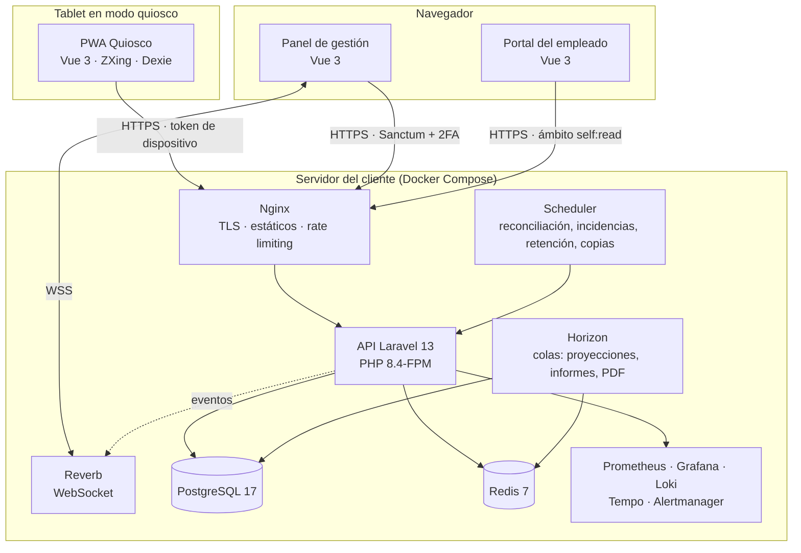

# KronoQR

**Control de presencia y registro horario con valor legal para hoteles, mediante tarjeta QR y tablet‑quiosco.**


---

## Trabajo de Fin de Máster

| | |
| --- | --- |
| **Alumno** | Borja Peón Saiz · <borja.peon.saiz@gmail.com> |
| **Máster** | Máster de Desarrollo con IA · BIG School · Módulo 12, Proyecto Final |
| **Repositorio** | <https://github.com/BorjaPeonSaiz/KronoQR> (público) |
| **Despliegue en funcionamiento** | <https://kronoqr.kodigolab.es> · panel [`/admin/`](https://kronoqr.kodigolab.es/admin/) · quiosco [`/kiosk/`](https://kronoqr.kodigolab.es/kiosk/) · portal [`/portal/`](https://kronoqr.kodigolab.es/portal/) · estado [`/api/v1/health`](https://kronoqr.kodigolab.es/api/v1/health) |
| **Usuario y contraseña de prueba** | Ver [§6](#6-usuario-y-contraseña-de-prueba) |
| **Presentación (slides)** | [`doc_master/presentacion.html`](doc_master/presentacion.html) en el repositorio (se abre en cualquier navegador; flechas o clic para avanzar) |
| **Vídeo** | `[URL DEL VÍDEO — sustituir antes de entregar]` |
| **Documentación del TFM** | En [`doc_master/`](doc_master/): [`memoria.md`](doc_master/memoria.md) (contexto, objetivos, método de trabajo con IA, arquitectura, calidad, seguridad, despliegue, resultados, lo aprendido, límites), [`despliegue.md`](doc_master/despliegue.md) (el despliegue en funcionamiento, credenciales de prueba y un recorrido guiado para evaluar el producto de punta a punta), [`presentacion.html`](doc_master/presentacion.html) (las slides) y [`guion-video.md`](doc_master/guion-video.md) (guion por minutos del vídeo). La documentación técnica completa del producto vive en [`docs/`](docs/) (ver [§8](#8-documentación-de-referencia)) |

> Este README sigue el orden que pide la documentación del proyecto final: descripción general, stack, instalación y ejecución, estructura, funcionalidades y usuario de prueba. Después añade la calidad, la seguridad y el índice de la documentación.

---

## Índice

1. [Descripción general](#1-descripción-general)
2. [Stack tecnológico](#2-stack-tecnológico)
3. [Instalación y ejecución](#3-instalación-y-ejecución)
4. [Estructura del proyecto](#4-estructura-del-proyecto)
5. [Funcionalidades principales](#5-funcionalidades-principales)
6. [Usuario y contraseña de prueba](#6-usuario-y-contraseña-de-prueba)
7. [Calidad, pruebas y seguridad](#7-calidad-pruebas-y-seguridad)
8. [Documentación de referencia](#8-documentación-de-referencia)

---

## 1. Descripción general

KronoQR es una aplicación web de **control de presencia y registro de jornada** pensada para el sector hotelero. Los empleados fichan la entrada, la salida y las pausas escaneando una **tarjeta QR física** en una **tablet‑quiosco compartida**. El sistema calcula el tiempo trabajado, admite varios tramos por jornada y genera el registro horario que la legislación española exige conservar (art. 34.9 del Estatuto de los Trabajadores).

### 1.1 Modelo de producto

KronoQR es un **producto licenciado on‑premise**: el mismo software se vende a hoteles distintos y **cada cliente lo instala en su propio servidor**. No hay SaaS, ni multi‑tenencia, ni componentes alojados por el fabricante, y el sistema funciona **íntegramente sin salida a internet** (la licencia se verifica en local).

### 1.2 Principios de diseño

| Principio | Consecuencia en el producto |
| --- | --- |
| **Es un registro con valor probatorio, no un CRUD** | Nada se borra ni se sobrescribe: las correcciones crean una versión nueva con autor, momento y motivo. Toda acción con relevancia legal queda en un `audit_log` solo‑append encadenado por hash. Retención legal de 4 años. |
| **La amenaza real es el préstamo de credencial** | El QR va firmado con HMAC (`FH1.<key_id>.<token>.<sig>`), sin datos personales ni identificadores secuenciales. Los patrones anómalos de uso generan incidencias para revisión humana. |
| **El quiosco nunca bloquea al empleado** | *Offline‑first*: sin red, con desfase de reloj o con el padrón desactualizado, el quiosco encola, confirma en local y, si algo no cuadra, abre una incidencia. Todo fichaje es idempotente por `scan_id` (UUID v7). |
| **Nada específico de un cliente vive en el código** | Marca, umbrales legales, idiomas y funcionalidades son configuración. Los umbrales de descanso, jornada máxima, pausas y retención se leen de un **perfil de cumplimiento** (se entrega el español de serie). |
| **La licencia jamás bloquea el registro** | Al caducar se degradan funciones accesorias, nunca el fichaje ni el acceso a los registros legales. |
| **Cero biometría y sin dependencia del correo** | La credencial es una tarjeta impresa (con PIN de respaldo). El empleado accede a su portal con código de empleado y PIN; el correo es opcional. |

### 1.3 Usuarios del sistema

| Perfil | Aplicación | Qué hace |
| --- | --- | --- |
| Empleado | Quiosco · Portal | Ficha con su tarjeta (o PIN) y consulta y descarga su propio registro. |
| Responsable de departamento | Panel | Supervisa la presencia de su equipo, corrige fichajes y resuelve incidencias. |
| RRHH / Administración | Panel | Gestiona plantilla, contratos, ausencias, credenciales, quioscos, informes y configuración. |
| Auditor / Inspección | Panel | Consulta y exporta el registro legal. |
| IT del cliente | Scripts de operación | Instala, actualiza, respalda y diagnostica la instalación. |

### 1.4 Arquitectura

**Monolito modular con arquitectura hexagonal** (puertos y adaptadores), DDD táctico en el núcleo, CQRS‑lite para lectura y eventos de dominio internos. Un único artefacto desplegable con Docker Compose.



El backend se organiza en ocho módulos con fronteras verificadas por Deptrac:

| Módulo | Responsabilidad |
| --- | --- |
| `Attendance` | **Núcleo.** Fichajes, tramos (`ShiftEntry`), jornadas (`WorkDay`) y correcciones. |
| `Compliance` | Auditoría encadenada, incidencias, retención y exportación legal. |
| `Workforce` | Empleados, departamentos, centro, contratos y ausencias. |
| `Identity` | Usuarios, roles, permisos, credenciales QR, PIN y tokens de dispositivo. |
| `Reporting` | Proyecciones de lectura, informes y exportaciones. |
| `Kiosk` | Dispositivos, emparejamiento, sincronización por lotes y telemetría de salud. |
| `Product` | Configuración de instalación, perfiles de cumplimiento, marca blanca, licencia, diagnóstico y soporte. |
| `Shared` | Objetos de valor comunes, puertos transversales (`Clock`, proveedores de configuración) y contratos de eventos. |

Cada módulo sigue la misma disposición interna: `Domain/` (puro, sin framework) → `Application/` (casos de uso y puertos) → `Infrastructure/` (Eloquent, adaptadores, proyecciones) + `Http/` (controladores, requests, recursos, policies). Las decisiones que justifican este diseño están en [`docs/adr/`](docs/adr/) (57 ADR).

### 1.5 Cómo se ha construido: desarrollo asistido por IA

El proyecto es el trabajo final de un máster de desarrollo con IA, y la forma de construirlo es parte del resultado. Todo el código se ha escrito con Claude Code a partir de una especificación y un plan de implementación redactados antes de la primera línea, con un andamiaje de tres capas:

- [`CLAUDE.md`](CLAUDE.md): contexto permanente con 21 reglas duras (dominio puro, UTC, nada se borra, idempotencia por `scan_id`, cero biometría…) que se cargan en cada sesión.
- **11 agentes** especializados en [`.claude/agents/`](.claude/agents/) (arquitecto de dominio, backend, tres frontends, QA, DevOps, producto, UI/UX, y dos de solo lectura: revisor de código y seguridad/cumplimiento) y **7 skills** en [`.claude/skills/`](.claude/skills/) con los procedimientos repetibles (caso de uso nuevo, endpoint, regla de negocio, migración segura, informe, revisión de cumplimiento).
- **Plan por tareas** ([`docs/02`](docs/02-stack-tecnologico-y-plan-implementacion.md) §11 y [`plan implementacion/`](plan%20implementacion/)) donde cada tarea indica su agente, su skill y las pruebas exigidas; [`HANDOFF.md`](HANDOFF.md) conserva el estado entre sesiones.

La memoria del TFM ([`doc_master/memoria.md`](doc_master/memoria.md)) explica el método, lo que funcionó y lo que no.

---

## 2. Stack tecnológico

### 2.1 Backend

| Componente | Tecnología |
| --- | --- |
| Lenguaje y framework | **PHP 8.4** · **Laravel 13** |
| Autenticación | Laravel Sanctum (tokens con ámbitos) + `pragmarx/google2fa` (2FA de gestión) |
| Autorización | Policies + `spatie/laravel-permission` (RBAC con ámbito por departamento) |
| Colas | Redis + **Laravel Horizon** |
| Tiempo real | **Laravel Reverb** (WebSocket), con *fallback* a sondeo |
| Tareas programadas | Laravel Scheduler |
| QR y PDF | `endroid/qr-code` · `spatie/laravel-pdf` (Browsershot) para tarjetas e informes sellados |
| Exportaciones | `spatie/simple-excel` en streaming (CSV, XLSX) |
| Licencia | `ext-sodium` (firma ed25519, verificación local) |
| Trazas | OpenTelemetry PHP |

### 2.2 Datos

| Componente | Uso |
| --- | --- |
| **PostgreSQL 17** | Registro legal. Las invariantes críticas se garantizan en la propia base: un único turno abierto por empleado (índice único parcial) y tramos sin solape (`EXCLUDE USING gist` sobre `tstzrange`). Instantes en `TIMESTAMPTZ` (UTC), `audit_log` particionado, archivado WAL. |
| **Redis 7** | Colas, caché, rate limiting y sesiones. |

### 2.3 Frontend

| Componente | Tecnología |
| --- | --- |
| Framework | **Vue 3.5** (Composition API, `<script setup lang="ts">`) |
| Lenguaje | **TypeScript** en modo estricto, sin `any` |
| Build y estilos | Vite · Tailwind CSS 4 |
| Estado y rutas | Pinia · Vue Router |
| Cliente HTTP | Generado desde el contrato OpenAPI |
| Escaneo QR (quiosco) | `@zxing/browser` + `@zxing/library` |
| PWA y cola offline (quiosco) | `vite-plugin-pwa` + Workbox · **Dexie** (IndexedDB) |
| Internacionalización | `vue-i18n` (español e inglés de serie) |
| Panel | TanStack Table + TanStack Query · ECharts |
| Paquete compartido | `packages/web-kit`: tokens visuales `--kq-*`, cálculo de totales, fechas, marca blanca y componentes comunes (npm workspaces, ADR‑036) |

### 2.4 Infraestructura, calidad y observabilidad

| Ámbito | Herramientas |
| --- | --- |
| Contenedores | Docker · Docker Compose v2 (desarrollo y producción) |
| Borde HTTP | Nginx sin privilegios (uid 101) + PHP‑FPM con pool ajustable (`PHP_FPM_MAX_CHILDREN`) |
| Observabilidad | Prometheus · Grafana · Loki · Tempo · Alertmanager · blackbox‑exporter · node‑exporter |
| Pruebas | **Pest** (unitarias, integración, feature, contrato, arquitectura y mutación con `--mutate`) · Spectator (contrato OpenAPI) · Vitest · **Playwright** con cámara simulada y axe · k6 (carga) |
| Calidad estática | Pint (preset `laravel`) · **PHPStan nivel 9** · Deptrac · Rector · ESLint · `vue-tsc` · ShellCheck · shfmt · Redocly |
| Seguridad | Semgrep · gitleaks · Trivy · `composer audit` / `npm audit` · SBOM CycloneDX |
| CI/CD | GitHub Actions (`ci.yml`, `release.yml`, `load-test.yml`, `backup-drill.yml`) · imágenes en GHCR |
| Desarrollo con IA | Claude Code (agentes, skills, `CLAUDE.md`, `HANDOFF.md`) · Engram (memoria local entre sesiones) |

---

## 3. Instalación y ejecución

Hay tres escenarios: el **entorno de desarrollo** (este repositorio), la **instalación en el servidor de un cliente** (el paquete de entrega de cada versión) y el **despliegue de demostración** que ya está en funcionamiento para evaluar el proyecto sin instalar nada.

### 3.1 Despliegue en funcionamiento (demostración)

| | |
| --- | --- |
| Dirección | <https://kronoqr.kodigolab.es> |
| Versión desplegada | 2.1.0 (ver [`/api/v1/health`](https://kronoqr.kodigolab.es/api/v1/health)) |
| Panel de gestión | <https://kronoqr.kodigolab.es/admin/> |
| Quiosco de fichaje | <https://kronoqr.kodigolab.es/kiosk/> (necesita emparejarse desde el panel; ver [`doc_master/despliegue.md`](doc_master/despliegue.md)) |
| Portal del empleado | <https://kronoqr.kodigolab.es/portal/> |

Es una instalación real hecha con el mismo paquete y el mismo `install.sh` que recibe un cliente, en un servidor Linux con Docker. Las credenciales de prueba están en [§6](#6-usuario-y-contraseña-de-prueba) y el detalle del despliegue (qué se puede probar, cómo emparejar un quiosco en el propio navegador, qué está abierto a internet y por qué) en [`doc_master/despliegue.md`](doc_master/despliegue.md).

### 3.2 Entorno de desarrollo

#### Requisitos previos

- **Docker** 24 o superior con **Compose v2** (en Windows, Docker Desktop con backend WSL 2).
- **GNU Make** y un shell POSIX (en Windows, Git Bash).
- **Git**.
- **Node.js 24 o superior** solo si se quieren ejecutar las herramientas de las SPA desde el host; los contenedores `node-*` ya traen su propio Node.

> PHP no hace falta en el host: PHP 8.4 y sus extensiones viven en el contenedor `app`, y todas las herramientas del backend se lanzan a través de `make`.

#### Puesta en marcha

```bash
git clone https://github.com/BorjaPeonSaiz/KronoQR.git kronoqr
cd kronoqr

make up      # Crea .env desde .env.example si no existe, construye y levanta los servicios
make ps      # Comprueba que todos los servicios están sanos
make seed    # Aplica migraciones y carga la semilla de desarrollo
```

La primera ejecución de `make up` construye las imágenes e instala las dependencias del workspace de npm dentro de un volumen de Docker, por lo que tarda varios minutos; las siguientes son inmediatas e idempotentes.

La **semilla de desarrollo** crea un centro, unos 250 empleados y 90 días de fichajes **con casos límite deliberados**: turnos nocturnos, cambios de horario (DST), olvidos de fichaje y correcciones. Incluye las cuentas de gestión y el PIN de empleado de [§6.2](#62-entorno-de-desarrollo-semilla).

#### Servicios y direcciones

| Servicio | URL |
| --- | --- |
| Panel de gestión | <https://localhost/admin/> |
| Quiosco | <https://localhost/kiosk/> |
| Portal del empleado | <https://localhost/portal/> |
| API (salud / preparación) | <https://localhost/api/v1/health> · <https://localhost/api/v1/ready> |
| Mailpit (correo de pruebas) | <http://localhost:8025> |
| Grafana | <http://localhost:3000> |
| Prometheus | <http://localhost:9090> |
| Alertmanager | <http://localhost:9093> |

El certificado TLS de desarrollo es autofirmado: acéptalo en el navegador o usa `curl -k`. PostgreSQL (5432), Redis (6379) y los servidores Vite (5173–5175) se publican solo en `127.0.0.1`.

Servicios de Compose en desarrollo: `app`, `nginx`, `postgres`, `redis`, `horizon`, `reverb`, `scheduler`, `node-kiosk`, `node-admin`, `node-portal`, `mailpit`, `prometheus`, `alertmanager`, `grafana`, `loki`, `tempo`, `blackbox-exporter` y `node-exporter`.

#### Comandos habituales

`make help` lista todos los objetivos. Los más usados:

| Comando | Qué hace |
| --- | --- |
| `make up` / `make down` | Levanta el entorno / lo para conservando los datos |
| `make build` | Reconstruye las imágenes (tras tocar un Dockerfile) |
| `make logs` / `make shell` | Sigue los logs / abre una shell en el contenedor `app` |
| `make migrate` / `make seed` | Aplica migraciones con el rol de migración / carga la semilla |
| `make test` | Toda la suite del backend |
| `make test-unit` | Dominio puro, sin base de datos, con presupuesto de duración |
| `make test-integration` · `make test-contract` · `make test-arch` | Integración contra PostgreSQL real · contrato OpenAPI y feature · arquitectura |
| `make quality` | ShellCheck/shfmt + Redocly + Pint + PHPStan 9 + Deptrac + Rector (informativo) |
| `make coverage` | Cobertura: dominio ≥ 90 %, global ≥ 75 % |
| `make mutate` / `make mutate-changed` | Mutación del dominio (MSI ≥ 80 %) / solo de lo cambiado |
| `make e2e` | Playwright: quiosco con cámara simulada, panel y portal |
| `make traceability-check` | Falla si un requisito implementado no tiene prueba |
| `make sast` · `make secrets-scan` · `make trivy-fs` | Análisis estático, secretos e imágenes/dependencias |
| `make backup` · `make restore-drill` | Copia cifrada verificada · simulacro de restauración |
| `make clean` | Para el entorno y **borra los volúmenes de datos** |

Cada SPA tiene además sus propios scripts (`npm run dev`, `type-check`, `lint`, `test:unit`, `build`, `api:generate`), descritos en su README: [`frontend-kiosk`](frontend-kiosk/README.md), [`frontend-admin`](frontend-admin/README.md), [`frontend-portal`](frontend-portal/README.md) y [`packages/web-kit`](packages/web-kit/README.md).

### 3.3 Instalación en el servidor del cliente

La instalación de producción la realiza el personal de IT del hotel **sin intervención del fabricante**, a partir del paquete `kronoqr-<versión>.tar.gz` que publica cada versión (imágenes en GHCR). La guía completa, con capturas y resolución de problemas, está en [`docs/cliente/instalacion.md`](docs/cliente/instalacion.md) (también [en inglés](docs/cliente/en/)).

#### Requisitos del servidor

| Recurso | Mínimo (≤ 100 empleados) | Recomendado (≤ 500) |
| --- | --- | --- |
| CPU | 2 núcleos | 4 núcleos |
| RAM | 4 GB | 8 GB |
| Disco | 40 GB SSD | 100 GB SSD |
| Sistema | Linux con Docker 24+ y Compose v2 | Ídem |
| Red | Alcanzable desde la red interna; salida a internet **opcional** | Ídem |

No existe instalador de Windows (ADR‑022): en infraestructuras Windows se instala sobre una máquina virtual Linux. Los puntos de fichaje son tablets Android 10+ con cámara trasera con autoenfoque, en modo quiosco gestionado por el cliente.

#### Procedimiento resumido

```bash
tar xzf kronoqr-2.2.0.tar.gz && cd kronoqr-2.2.0

# 1. Certificado TLS, legible por el borde sin privilegios (uid 101)
cp /ruta/certificado.crt certs/tls.crt && cp /ruta/clave.key certs/tls.key
sudo chown 101:101 certs/tls.crt certs/tls.key
sudo chmod 0444 certs/tls.crt && sudo chmod 0400 certs/tls.key

# 2. Configuración: rellenar solo las variables marcadas [CLIENTE]
cp .env.example .env
#    APP_URL, KIOSK_VLAN_CIDR, PORTAL_INTERNAL_CIDR, METRICS_ALLOW_CIDR, BACKUP_PATH, ...

# 3. Comprobación previa (no escribe nada) e instalación
sudo ./install.sh --check-only
sudo ./install.sh

# 4. Verificación
curl -fsS https://fichaje.tuhotel.local/api/v1/health
curl -fsS https://fichaje.tuhotel.local/api/v1/ready
```

El instalador comprueba requisitos, **genera todos los secretos en el servidor del cliente**, levanta los servicios, aplica el esquema y verifica que el sistema responde; si algo falla, deshace lo hecho. No crea usuarios ni siembra datos: el primer acceso al panel abre un **asistente de puesta en marcha** que crea la organización, el centro y su zona horaria, los departamentos, el perfil de cumplimiento, el primer administrador y el emparejamiento del primer quiosco. La licencia puede activarse después: **el sistema ficha con normalidad sin ella**.

#### Operación

| Script | Uso |
| --- | --- |
| `./update.sh` | Actualización a una versión posterior (también no consecutiva) con copia previa verificada, migraciones reversibles, comprobación de salud y vuelta atrás automática. |
| `./doctor.sh` | Diagnóstico en un comando; con la aplicación en marcha delega en `php artisan product:doctor`. |
| `./backup.sh` · `./restore.sh` · `./restore-drill.sh` | Copia diaria cifrada, restauración y simulacro trimestral. |

Los procedimientos de operación (rotación de claves y secretos, alta de quioscos, tarjeta perdida, requerimiento de la Inspección, derechos RGPD, brechas…) están en [`docs/runbooks/`](docs/runbooks/) y en [`docs/cliente/operacion.md`](docs/cliente/operacion.md).

---

## 4. Estructura del proyecto

```text
kronoqr/
├── backend/                      # API Laravel 13 (monolito modular hexagonal)
│   ├── app/Modules/
│   │   ├── Attendance/           # Núcleo: fichajes, tramos, jornadas, correcciones
│   │   │   ├── Domain/           #   Puro: modelos, objetos de valor, eventos, políticas
│   │   │   ├── Application/      #   Casos de uso, comandos, consultas y puertos
│   │   │   ├── Infrastructure/   #   Persistencia Eloquent, adaptadores, proyecciones
│   │   │   └── Http/             #   Controladores, requests, recursos, policies
│   │   ├── Compliance/  Workforce/  Identity/  Reporting/
│   │   ├── Kiosk/  Product/  Shared/
│   ├── database/                 # Migraciones reversibles y seeders con casos límite
│   ├── routes/                   # Rutas versionadas (/api/v1)
│   ├── lang/                     # Textos en español e inglés
│   ├── tests/                    # Unit · Integration · Feature · Contract · Architecture
│   └── deptrac.yaml · phpstan.neon · pint.json · rector.php
│
├── frontend-kiosk/               # PWA de la tablet
│   └── src/features/             #   scan · pin · offline · pairing · diagnostics
├── frontend-admin/               # Panel de gestión
│   └── src/features/             #   live · workdays · incidents · compliance · reports
│                                 #   employees · absences · credentials · devices
│                                 #   onboarding · settings · support · errors · auth
├── frontend-portal/              # Portal del empleado
│   └── src/features/             #   login · my-records · my-export
├── packages/web-kit/             # Código compartido por las tres SPA (tokens, cálculo, UI)
│
├── infra/
│   ├── compose.dev.yaml          # Entorno de desarrollo completo
│   ├── compose.prod.yaml         # Compose que se entrega al cliente
│   ├── docker/                   # Imágenes: php, nginx, postgres, node
│   ├── observability/            # Prometheus, Alertmanager, Grafana, Loki, Tempo, blackbox
│   ├── scripts/                  # install · update · doctor · backup · restore · package
│   └── versions.txt              # Versiones publicadas y rutas de actualización
│
├── docs/
│   ├── 01…07-*.md                # Especificación, stack y plan, agentes, credencial,
│   │                             #   presentación al cliente, guía visual, seguridad
│   ├── adr/                      # 51 registros de decisión de arquitectura
│   ├── api/openapi.yaml          # Contrato de la API (fuente de verdad)
│   ├── cliente/                  # Documentación entregable al cliente (es/en)
│   ├── runbooks/                 # Procedimientos de operación e incidentes
│   ├── seguridad/                # Revisión ASVS y paquete del revisor
│   ├── verificacion/             # Verificación pre-release de la 2.1.0 y plan de la 2.2.0
│   └── trazabilidad-pruebas.md   # Matriz requisito → prueba (generada)
│
├── doc_master/                   # Entrega del TFM: memoria, despliegue, slides, guion del vídeo
├── plan implementacion/          # Detalle tarea a tarea de cada fase
├── load-tests/k6/                # Pruebas de carga
├── tools/license-issuer/         # Emisor de licencias del fabricante (ed25519)
├── .github/workflows/            # CI, publicación, carga y simulacro de copias
├── .claude/                      # Agentes y skills de IA del proyecto
├── CLAUDE.md · HANDOFF.md        # Reglas permanentes · memoria entre sesiones
├── Makefile                      # Interfaz oficial de todas las operaciones
├── CHANGELOG.md                  # Generado desde commits convencionales
└── VERSION
```

---

## 5. Funcionalidades principales

Los identificadores entre paréntesis remiten a los requisitos de [`docs/01-especificaciones-proyecto.md`](docs/01-especificaciones-proyecto.md).

### 5.1 Fichaje (quiosco)

- **Escaneo continuo por cámara**, sin interacción: el primer escaneo abre turno, el siguiente lo cierra y calcula la duración (RF‑AT‑01…03).
- **Jornada partida** con tramos ilimitados y **fichaje de pausa** diferenciado del fin de turno (RF‑AT‑04, RF‑AT‑12).
- **Turnos que cruzan la medianoche** como un único tramo, atribuido a la jornada de su hora de inicio (RF‑AT‑08).
- Confirmación **visual y sonora** con nombre, acción, hora y total del día; **antirrebote** configurable (RF‑AT‑05/06).
- **PIN de 6 dígitos** como respaldo cuando falta la tarjeta, marcado para revisión (RF‑AT‑11).
- **Modo offline**: cola persistente en IndexedDB, padrón cacheado y cifrado, sincronización automática con *backoff* e idempotencia por `scan_id` (RF‑KI‑03/04, RF‑AT‑07).
- **Doble marca de tiempo** (`occurred_at` / `recorded_at`) y aceptación con incidencia ante desfase de reloj (RF‑AT‑09/10).
- PWA a pantalla completa con *wake lock*, multiidioma, accesibilidad AA, emparejamiento por código, pantalla de diagnóstico y ventana de actualización configurable (RF‑KI‑*, RF‑PD‑06).

### 5.2 Credenciales QR

- Payload **opaco y firmado con HMAC**, sin PII; rechazos **genéricos y de tiempo constante** (RF‑QR‑01/02).
- Emisión, revocación y reemisión inmediata; **tarjetas imprimibles en PDF** (formato tarjeta y A4 masivo) con QR de corrección Q (RF‑QR‑03…05).
- Registro de entrega auditado y **panel de estado** de credenciales (RF‑QR‑06/08).
- **Rotación de la clave de firma con solape** para reimprimir de forma progresiva (RF‑QR‑07).

### 5.3 Panel de gestión

- **Presencia en tiempo real** por WebSocket, con filtros por departamento y estado (RF‑PA‑01/02).
- **Detalle de jornada** con tramos, totales, incidencias y correcciones (RF‑PA‑03).
- **Correcciones trazadas** con motivo obligatorio de catálogo: nunca sobrescriben, crean versión nueva y asiento de auditoría (RF‑PA‑04).
- **Bandeja de incidencias** asignada al responsable: turnos abiertos anómalos, desfases de reloj, fichajes por PIN, patrones anómalos de uso de credencial (RF‑PA‑05, RF‑PR‑01, RF‑PR‑06).
- **Vista de cumplimiento**: descanso entre jornadas, jornada máxima, pausas y exceso semanal según el perfil configurado (RF‑PA‑06).
- **Salud de quioscos**: último latido, versión, cola offline y batería (RF‑PA‑07).
- Gestión de **empleados, contratos historizados, ausencias** e importación masiva CSV/XLSX con simulación (RF‑GP‑*).
- **Control de acceso**: RBAC (`admin`, `rrhh`, `responsable_departamento`, `auditor`, `empleado`, `kiosk`), ámbito por departamento y 2FA obligatorio para roles con acceso global (RF‑ID‑01…03).

### 5.4 Informes y exportaciones

- Horas por empleado y por departamento, **trabajadas frente a contratadas** con desviación (RF‑IN‑01…03).
- Exportación **CSV, XLSX y PDF sellado** (sello temporal, emisor y hash del contenido) (RF‑IN‑04).
- **Exportación normalizada para la Inspección de Trabajo**, con correcciones y motivos (RF‑IN‑05).
- Informes voluminosos **en diferido** con enlace de descarga de un solo uso y **exportación configurable para nómina** (RF‑IN‑06/07).
- **Cuadro de impacto y adopción** con doce indicadores y comparación entre periodos (RF‑IN‑08).

### 5.5 Portal del empleado

- Acceso con **código de empleado y PIN**, sin correo; rate limiting y bloqueo por intentos (RF‑ID‑05/06).
- Consulta de jornadas y tramos propios y **descarga del histórico**, con ámbito exclusivo de lectura (`self:read`) (RF‑ID‑07).
- Accesible desde la red interna por defecto; el cliente puede abrirlo a internet (RF‑ID‑08, ADR‑050).

### 5.6 Cumplimiento legal y privacidad

- **Auditoría solo‑append encadenada por hash**, verificable con `compliance:verify-audit-chain`; el usuario de base de datos de la aplicación no tiene `UPDATE` ni `DELETE` sobre ella.
- **Retención** según el perfil (4 años en España) con purga confirmada por un responsable e informe de lo purgado (RF‑PR‑03).
- **Reconciliación nocturna** de los totales diarios contra los eventos origen, con alerta si divergen (RF‑PR‑02).
- Aviso de privacidad (art. 13 RGPD) en el quiosco; ningún nombre de empleado en logs técnicos.

### 5.7 Producto instalable

- **Configuración sin código** con catálogo, cascada y auditoría; **perfiles de cumplimiento** gestionables (RF‑PD‑01, RF‑PD‑07).
- **Instalador autónomo** con comprobación previa y **asistente de puesta en marcha** (RF‑PD‑02/03).
- **Licencia firmada** con verificación local y **degradación honesta** que nunca bloquea el registro (RF‑PD‑04/05).
- **Marca blanca** en las tres aplicaciones, las tarjetas y los PDF (RF‑PD‑08).
- **Paquete de diagnóstico anonimizado**, comprobación de salud `product:doctor` e **histórico de errores** agrupado por huella (RF‑PD‑09, RF‑PD‑13, RF‑PD‑15).
- **Actualización asistida** entre versiones no consecutivas con vuelta atrás automática (RF‑PD‑10).
- **Acceso de soporte** del fabricante solo con concesión expresa, temporal, acotada y auditada (RF‑PD‑11).
- **Exportación íntegra** de los datos del cliente en formato abierto y **telemetría opcional, desactivada por defecto** (RF‑PD‑12/14).
- **Copias de seguridad** diarias cifradas y verificadas, con simulacro de restauración (RF‑PR‑04).

---

## 6. Usuario y contraseña de prueba

### 6.1 Despliegue en funcionamiento

| Aplicación | Dirección | Acceso |
| --- | --- | --- |
| **Panel de gestión** | <https://kronoqr.kodigolab.es/admin/> | Usuario: `bpeonsai@gmail.com` · La contraseña se facilita en el formulario de entrega del TFM, no en este repositorio público. La cuenta tiene segundo factor: el panel pide un código de 6 dígitos que genera el móvil del alumno; su teléfono va también en el formulario de entrega para solicitárselo en el momento de entrar. |
| Portal del empleado | <https://kronoqr.kodigolab.es/portal/> | Con el código de empleado y el PIN de cualquier empleado dado de alta desde el panel (en la ficha del empleado se asigna el PIN). |
| Quiosco | <https://kronoqr.kodigolab.es/kiosk/> | No tiene usuario: al abrirlo muestra un código de 6 dígitos que se teclea en el panel (*Quioscos → «Vincular quiosco»*). Después ficha con una tarjeta impresa desde el panel o con código de empleado y PIN. |

Es una cuenta de demostración sobre datos ficticios. El paso a paso para recorrer el producto de punta a punta (dar de alta un empleado, imprimir su tarjeta, emparejar un quiosco en el navegador, fichar y ver el resultado en el panel y en el portal) está en [`doc_master/despliegue.md`](doc_master/despliegue.md).

### 6.2 Entorno de desarrollo (semilla)

`make seed` carga estas cuentas, que solo existen en desarrollo (el instalador de producción no las crea):

| Rol | Usuario | Contraseña |
| --- | --- | --- |
| Administrador | `admin@kronoqr.test` | `kronoqr-dev-only` |
| RRHH | `rrhh@kronoqr.test` | `kronoqr-dev-only` |
| Auditor | `auditor@kronoqr.test` | `kronoqr-dev-only` |
| Responsable de departamento | uno por departamento, p. ej. `cocina@kronoqr.test` (ver [`UserSeeder.php`](backend/database/seeders/UserSeeder.php)) | `kronoqr-dev-only` |
| Empleado (portal y quiosco) | cualquier código de empleado de la semilla | PIN `246813` |

Los roles con acceso global (`admin`, `rrhh`, `auditor`) tienen 2FA obligatorio: en el primer acceso el panel muestra el QR para la aplicación de autenticación.

---

## 7. Calidad, pruebas y seguridad

- **Pirámide de pruebas completa**: unitarias de dominio (milisegundos, sin base de datos), integración contra PostgreSQL real, feature/API, contrato contra `openapi.yaml`, arquitectura, mutación, E2E con Playwright y cámara simulada, accesibilidad con axe y carga con k6 (50 fichajes/s con p95 < 150 ms en el hardware de referencia). Más de 5 000 pruebas de Pest y más de 300 de Playwright, todas etiquetadas con el requisito que cubren.
- **Autorización negativa por rol en cada endpoint**: cada policy tiene su prueba de que un rol no autorizado recibe 403.
- **Trazabilidad requisito → prueba**: cada prueba se etiqueta con los requisitos que cubre (`->group('RN-05', 'RF-AT-08')`) y `qa:traceability --check` falla en la CI si un requisito implementado no tiene prueba ([`docs/trazabilidad-pruebas.md`](docs/trazabilidad-pruebas.md)).
- **Umbrales**: PHPStan nivel 9, cobertura del dominio ≥ 90 % y global ≥ 75 %, MSI ≥ 80 % sobre el dominio, 0 hallazgos en ShellCheck, Semgrep y gitleaks.
- **Pipeline de CI** en ocho etapas: lint y tipos → arquitectura → unitarias y mutación de lo cambiado → trazabilidad → integración y contrato → seguridad → frontend → E2E → instalación limpia desde el paquete de entrega y actualización desde la versión anterior.
- **Seguridad**: modelo de amenazas STRIDE, revisión interna OWASP ASVS, autoevaluación OWASP SAMM 2.0 con evidencia ([`docs/07-seguridad-madurez-y-amenazas.md`](docs/07-seguridad-madurez-y-amenazas.md)), SBOM CycloneDX por versión y política de divulgación en [`SECURITY.md`](SECURITY.md).
- **Verificación pre-release**: antes de dar la 2.1.0 por entregable se hizo una verificación completa con agentes en modo solo lectura ([`docs/verificacion/`](docs/verificacion/)), que produjo el plan de correcciones de la 2.2.0, en curso.
- **Versionado** SemVer con `CHANGELOG.md` generado desde commits convencionales; la publicación se dispara al etiquetar `vX.Y.Z`.

---

## 8. Documentación de referencia

| Documento | Contenido |
| --- | --- |
| [Entrega del TFM](doc_master/) | Memoria, despliegue, presentación y guion del vídeo |
| [01 · Especificaciones](docs/01-especificaciones-proyecto.md) | Requisitos funcionales (`RF-*`), reglas de negocio (`RN-*`), modelo de dominio, requisitos legales, de seguridad y de calidad, glosario |
| [02 · Stack y plan de implementación](docs/02-stack-tecnologico-y-plan-implementacion.md) | Arquitectura (C4), stack, convenciones, seguridad, observabilidad, pruebas, CI/CD y plan por fases |
| [03 · Agentes y skills de IA](docs/03-agentes-y-skills-ia.md) | Qué agente y qué skill usar en cada tarea |
| [04 · Decisión de credencial](docs/04-decision-credencial.md) | Por qué la credencial es una tarjeta física |
| [05 · Presentación al cliente](docs/05-presentacion-cliente.md) | Lo que se promete al cliente |
| [06 · Guía visual](docs/06-guia-visual.md) | Tokens de diseño, contrastes WCAG y tipografía |
| [07 · Seguridad, madurez y amenazas](docs/07-seguridad-madurez-y-amenazas.md) | OWASP SAMM, Microsoft SDL, ATT&CK y riesgos aceptados |
| [ADR](docs/adr/) | Decisiones arquitectónicas |
| [Contrato OpenAPI](docs/api/openapi.yaml) | Fuente de verdad de la API `/api/v1` |
| [Documentación de cliente](docs/cliente/) | Instalación, configuración, operación, endurecimiento, guías de RRHH y del portal, obligaciones legales |
| [Runbooks](docs/runbooks/) | Procedimientos de operación e incidentes |
| [Verificación](docs/verificacion/) | Verificación pre-release de la 2.1.0 y plan de correcciones de la 2.2.0 |
| [CHANGELOG](CHANGELOG.md) | Historial de versiones |
| [CLAUDE.md](CLAUDE.md) | Reglas duras del proyecto y convenciones para contribuir |
| [SECURITY.md](SECURITY.md) | Cómo reportar una vulnerabilidad |

---

_KronoQR es un producto licenciado. Consulta las condiciones de licencia que acompañan al paquete de entrega (`LICENCIA.txt`)._
