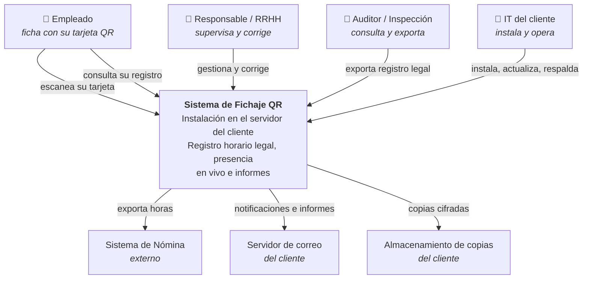
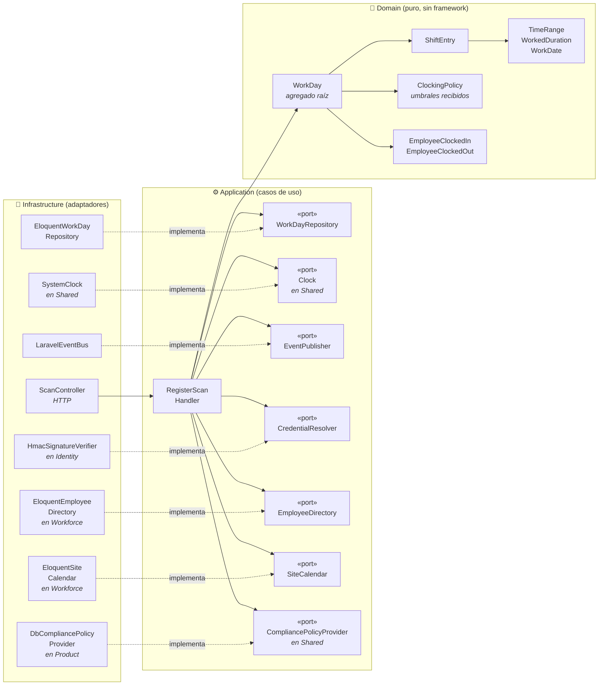
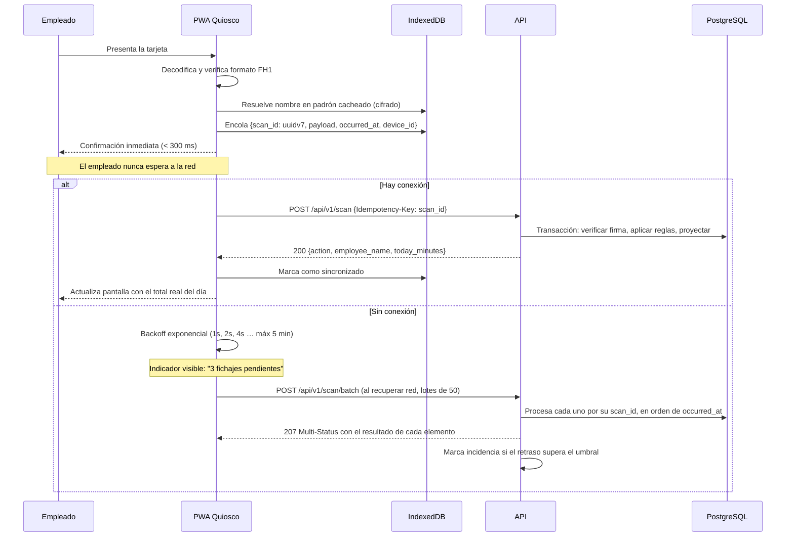

# Stack Tecnológico, Arquitectura y Plan de Implementación
## KronoQR — Sistema de Control de Presencia y Registro Horario por QR · Sector Hotelero

| Campo | Valor |
|---|---|
| **Producto** | **KronoQR** |
| **Modelo de negocio** | Producto licenciado, desplegado en servidores del cliente |
| **Fecha** | 11 de agosto de 2026 |
| **Documentos hermanos** | `01-especificaciones-proyecto.md`, `03-agentes-y-skills-ia.md`, `04-decision-credencial.md`, `05-presentacion-cliente.md` |
| **Audiencia** | Arquitectura, Desarrollo, DevOps, QA |

> Este documento asume leído el documento 01. Las referencias `RF-*`, `RN-*`, `RNF-*`, `RL-*`, `RS-*` y `RQ-*` apuntan a sus requisitos.
>
> **Nomenclatura.** *KronoQR* es el nombre comercial (documento 05). Los identificadores técnicos internos que aparecen en este documento —`fichaje-hotel`, prefijo `FH1` del payload, `BACKUP_PATH`, nombres de base de datos y de servicios— se mantienen deliberadamente: no son visibles para el usuario, y renombrar el prefijo `FH1` invalidaría credenciales ya impresas. El nombre que se muestra en pantalla es configuración de marca (RF-PD-08).

---

## 1. Decisión de arquitectura

### 1.1 Modelo elegido

> **Monolito Modular con Arquitectura Hexagonal (Ports & Adapters), DDD táctico en el núcleo, CQRS-lite para lectura, eventos de dominio internos y quiosco PWA offline-first. Desplegado como instalación independiente en el servidor de cada cliente.**

Es el modelo correcto para este producto. No es el más de moda ni el más simple: es el que mejor equilibra las cinco fuerzas reales del sistema.

| Fuerza del sistema | Consecuencia arquitectónica |
|---|---|
| El dato tiene **valor probatorio legal** y debe ser inalterable | Registro solo-append, auditoría encadenada, correcciones versionadas. Empuja hacia un núcleo de dominio explícito y hacia separar escritura de lectura. |
| Las **invariantes son transaccionales** (un turno abierto, sin solapes, total consistente) | Una única base de datos ACID y una frontera transaccional clara. **Descarta microservicios**: la consistencia eventual aquí produce dobles fichajes y totales erróneos. |
| El **dominio es pequeño pero denso en reglas** (DST, medianoche, descansos, idempotencia) | Dominio rico y puro, aislado del framework, probado en milisegundos sin base de datos. Justifica el hexágono. |
| El **equipo es pequeño** y **cada cliente tiene su despliegue** | Un artefacto, un `docker compose up`. Cualquier topología distribuida convertiría la instalación en un proyecto de ingeniería para el cliente. |
| La **red del hotel es poco fiable** | El quiosco no puede depender del servidor para funcionar. Offline-first con idempotencia, en el MVP y no como mejora. |

**Modularidad sin distribución** es la clave: ocho módulos con fronteras reales verificadas por tests de arquitectura, dentro de un único proceso desplegable. Si algún día un módulo necesita escalar por separado, la frontera ya existe y la extracción es mecánica. Se paga el diseño, no la operación.

### 1.2 Alternativas evaluadas y descartadas

| Alternativa | Por qué se descarta |
|---|---|
| **N-capas clásico** (Controller → Service → Eloquent) | Lo más rápido de escribir y lo más caro de mantener. Las reglas acaban repartidas entre controladores, modelos y observers; probar el cálculo de DST exige levantar base de datos; y el día que cambie una regla legal nadie sabe cuántos sitios tocar. Con un dominio de este calado, la deuda aparece en el mes 3. |
| **Microservicios** | Coste operativo desproporcionado para 500 empleados. Rompe las invariantes transaccionales RN-01 y RN-02, que pasarían a resolverse con sagas. Añade latencia en el camino crítico de 800 ms del quiosco. Y multiplica por diez la dificultad de que un cliente lo instale. |
| **Serverless** | Arranques en frío incompatibles con RNF-P-01, conexiones a base de datos relacional problemáticas, y radicalmente incompatible con el despliegue on-premise. |
| **Event Sourcing completo** | Tentador por el requisito de inmutabilidad, y de hecho `scan_events` es un log de eventos. Pero aplicarlo a todo el sistema multiplica la complejidad sin necesidad. **Se adopta la parte útil**: log inmutable de escaneos y proyecciones reconstruibles, sin la ceremonia completa. Es lo que se llama aquí CQRS-lite. |
| **Arquitectura multi-inquilino** | Innecesaria: cada cliente tiene su despliegue completo, así que el aislamiento es físico y gratuito. Añadirla ahora sería pagar complejidad por una capacidad que el modelo de negocio no requiere. |

### 1.3 Diagrama C4 — Nivel 1: Contexto



### 1.4 Diagrama C4 — Nivel 2: Contenedores


Todo corre en el servidor del cliente. No hay ningún componente alojado por el fabricante, y **el sistema funciona íntegramente sin salida a internet**.

### 1.5 Diagrama C4 — Nivel 3: Componentes del módulo `Attendance`

El corazón del sistema. Ilustra la regla de dependencia: **todas las flechas apuntan hacia dentro**.



**Regla de oro, verificada por test automático:** `Domain/` no puede importar nada de `Illuminate\*`, `App\Models\*` ni de otro módulo. Si alguien lo intenta, la CI falla.

Nótese el puerto `CompliancePolicyProvider`: el dominio **recibe** los umbrales legales ya resueltos. Nunca pregunta a la configuración.

> **Dónde vive cada pieza del diagrama.** El módulo que **necesita** algo declara el puerto; el que **tiene** el dato implementa el adaptador (ADR-025). Por eso las cajas de `Infrastructure` llevan anotado su módulo: `HmacSignatureVerifier` es de `Identity`, que es quien tiene la tabla `credentials`; `EloquentEmployeeDirectory` y `EloquentSiteCalendar` son de `Workforce`, que tiene `employees` y `sites`; `DbCompliancePolicyProvider` es de `Product`, que tiene `compliance_profiles`. La arista va siempre del satélite al núcleo.
>
> **Tres puertos no son de `Attendance`** aunque el diagrama los dibuje aquí porque los consume: **`Clock`** vive en `Shared` (ADR-021), y **`CompliancePolicyProvider`** y **`OperationalSettingsProvider`** también (ADR-025), porque `Compliance`, `Reporting` y `Kiosk` los necesitan igual. `WorkDayRepository`, `EventPublisher`, `CredentialResolver`, `EmployeeDirectory` y `SiteCalendar` sí son de `Attendance`: definen qué necesita saber el núcleo para decidir un fichaje.

### 1.6 Módulos y sus fronteras

| Módulo | Responsabilidad | Puede depender de |
|---|---|---|
| `Attendance` | **Núcleo.** Fichajes, tramos, jornadas, correcciones | `Shared` |
| `Compliance` | Auditoría, incidencias, retención, exportación legal | `Shared`, **eventos de dominio** de `Attendance` e `Identity` |
| `Workforce` | Empleados, departamentos, el centro de la instalación, contratos, ausencias | `Shared`, `Attendance/Application/Port` (implementa `EmployeeDirectory` y `SiteCalendar`) |
| `Identity` | Usuarios, roles, permisos, credenciales QR, tokens de dispositivo | `Shared`, `Attendance/Application/Port` (implementa `CredentialResolver`) |
| `Reporting` | Proyecciones y consultas de lectura, exportaciones | `Shared`, eventos de otros módulos |
| `Kiosk` | Dispositivos, emparejamiento, sincronización de lotes, telemetría | `Shared`, `Attendance` (vía caso de uso) |
| `Product` | Configuración de instalación, perfiles de cumplimiento, marca, licencia, diagnóstico, soporte | `Shared`, `Shared/Application/Port` (implementa `CompliancePolicyProvider` y `BrandingProvider`) |
| `Shared` | Objetos de valor comunes, tipos base, contratos de eventos | — |

**La comunicación entre módulos ocurre solo por tres vías:** casos de uso públicos con interfaz explícita, eventos de dominio, o **implementar un puerto declarado por el módulo consumidor** (ADR-025). Nunca por acceso directo a los modelos Eloquent de otro módulo.

> **La tercera vía es inversión de dependencias, no una excepción.** El módulo que **necesita** algo declara el puerto; el que **tiene** el dato implementa el adaptador, y la arista va del satélite al núcleo. Por eso `Identity` y `Workforce` figuran dependiendo de `Attendance` y no al revés: `Attendance` no nombra a ninguno de los dos, ni sabe quién le sirve la credencial o la zona del centro. Tres restricciones lo mantienen siendo una frontera: solo `Infrastructure` del satélite depende, y solo de `Application/Port` del núcleo —nunca de su `Domain/` ni de sus casos de uso—; los puertos hablan en tipos de `Shared` o escalares, nunca en modelos Eloquent ni entidades del satélite; y el enlace puerto→adaptador se declara en el `ServiceProvider` del satélite. Deptrac verifica las tres como **reglas declaradas, no como excepciones**.
>
> **`Product` es de soporte, pero lo consultan casi todos.** Para que no se convierta en un acoplamiento universal, los demás módulos no leen su configuración directamente: reciben los valores ya resueltos como parámetros, o mediante un puerto tipado (`CompliancePolicyProvider`, `OperationalSettingsProvider`, `BrandingProvider`). Esos puertos se declaran en **`Shared/Application/Port/`** —no en `Product` ni en `Attendance`— porque los consumen varios módulos y no representan una regla de negocio de ninguno, que es el criterio de admisión de ADR-021. Sus adaptadores viven en `Product/Infrastructure/Adapter/`, que es donde están las tablas. El dominio nunca pregunta "¿qué dice la configuración?": recibe el umbral ya decidido.

---

## 2. Estructura del repositorio

```
fichaje-hotel/
├── CLAUDE.md                        # Reglas duras del proyecto para agentes IA
├── docs/
│   ├── 01-especificaciones-proyecto.md
│   ├── 02-stack-tecnologico-y-plan-implementacion.md
│   ├── 03-agentes-y-skills-ia.md
│   ├── 04-decision-credencial.md
│   ├── 05-presentacion-cliente.md   # Documento comercial entregable al cliente
│   ├── adr/                         # ADR-001 … ADR-029
│   ├── api/openapi.yaml             # Contrato, fuente de verdad de la API
│   ├── cliente/                     # Documentación que se entrega al cliente
│   │   ├── instalacion.md
│   │   ├── operacion.md
│   │   ├── configuracion.md
│   │   └── obligaciones-legales.md
│   └── runbooks/                    # Procedimientos de operación interna
├── .claude/
│   ├── agents/                      # 10 agentes especializados
│   └── skills/                      # 6 skills de generación
├── .github/workflows/
│   ├── ci.yml                       # Calidad, pruebas, seguridad
│   ├── e2e.yml                      # Playwright con cámara simulada
│   └── release.yml                  # Publicación de versión e imágenes
│
├── backend/
│   ├── app/
│   │   ├── Modules/
│   │   │   ├── Attendance/
│   │   │   │   ├── Domain/          # ⛔ Sin framework. Nada de Illuminate.
│   │   │   │   │   ├── Model/       #    WorkDay, ShiftEntry
│   │   │   │   │   ├── ValueObject/ #    TimeRange, WorkedDuration, WorkDate
│   │   │   │   │   ├── Event/       #    EmployeeClockedIn, ...
│   │   │   │   │   ├── Policy/      #    ClockingPolicy
│   │   │   │   │   └── Exception/
│   │   │   │   ├── Application/
│   │   │   │   │   ├── UseCase/     #    RegisterScanHandler, CorrectShiftHandler
│   │   │   │   │   ├── Port/        #    Interfaces (repositorios, reloj, bus, policy)
│   │   │   │   │   ├── Command/     #    DTOs de entrada
│   │   │   │   │   └── Query/       #    Lecturas del módulo
│   │   │   │   ├── Infrastructure/
│   │   │   │   │   ├── Persistence/ #    Modelos Eloquent + repositorios
│   │   │   │   │   ├── Adapter/     #    Reloj, bus de eventos, policy provider
│   │   │   │   │   └── Projection/  #    Listeners que mantienen daily_totals
│   │   │   │   ├── Http/            #    Controllers, Requests, Resources, Policies
│   │   │   │   └── AttendanceServiceProvider.php
│   │   │   ├── Compliance/          # (misma estructura interna)
│   │   │   ├── Workforce/
│   │   │   ├── Identity/
│   │   │   ├── Reporting/
│   │   │   ├── Kiosk/
│   │   │   ├── Product/
│   │   │   └── Shared/              # Objetos de valor comunes y contratos transversales
│   │   │       ├── Domain/          #    ValueObject/, contratos de eventos
│   │   │       ├── Application/     #    Port/ — Clock y demás puertos transversales (ADR-021)
│   │   │       └── Infrastructure/  #    Adapter/ — SystemClock
│   │   └── Providers/
│   ├── database/migrations/
│   ├── database/seeders/            # Perfil ES-hosteleria, semilla con casos límite (§10.2)
│   ├── routes/api_v1.php
│   ├── tests/
│   │   ├── Unit/                    # Dominio puro, sin BD. Milisegundos.
│   │   ├── Integration/             # Repositorios contra PostgreSQL real
│   │   ├── Feature/                 # API extremo a extremo
│   │   ├── Contract/                # Validación contra openapi.yaml
│   │   └── Architecture/            # Fronteras entre módulos
│   ├── deptrac.yaml
│   ├── phpstan.neon                 # Nivel 9
│   └── rector.php
│
├── frontend-kiosk/                  # PWA del quiosco
│   ├── src/
│   │   ├── features/scan/           # Cámara, decodificación, feedback
│   │   ├── features/pin/            # Fichaje de respaldo por PIN
│   │   ├── features/offline/        # Cola Dexie, sincronización, reintentos
│   │   ├── features/pairing/        # Emparejamiento por código
│   │   ├── features/diagnostics/
│   │   ├── shared/api/              # Cliente generado desde openapi.yaml
│   │   ├── shared/i18n/
│   │   └── sw/                      # Service worker (Workbox)
│   ├── tests/{unit,e2e}/
│   └── e2e/fixtures/qr-video.y4m    # Vídeo con QR real para cámara simulada
│
├── frontend-admin/                  # SPA del panel de gestión
│   └── src/features/{live,workdays,incidents,reports,employees,credentials,devices,settings}/
│
├── frontend-portal/                 # Portal del empleado (web sencilla, responsive)
│   └── src/features/{login,my-records,my-export}/
│
├── infra/
│   ├── docker/{php,nginx,postgres}/
│   ├── compose.dev.yaml
│   ├── compose.prod.yaml            # El que se entrega al cliente
│   ├── observability/
│   └── scripts/{install.sh,update.sh,backup.sh,restore.sh,doctor.sh}
└── load-tests/k6/scan-peak.js
```

---

## 3. Stack tecnológico

### 3.1 Backend

| Componente | Elección | Versión | Motivo |
|---|---|---|---|
| Lenguaje | PHP | **8.4** (mínimo 8.3) | *Property hooks*, `#[\Override]` y mejor rendimiento. |
| Framework | Laravel | **13.x** | Ecosistema maduro, herramientas integradas de autenticación, colas y programación. Verificar la versión mayor vigente al arrancar y actualizar **[ADR-030](adr/ADR-030-version-mayor-de-laravel.md)** si procede. |
| Autenticación | Laravel Sanctum + `pragmarx/google2fa` | ^4.0 / ^8.0 | Tokens con ámbitos y 2FA obligatorio para roles con acceso global. |
| Colas | Redis + **Laravel Horizon** | ^5.0 | Visibilidad de trabajos. Redis se necesita igualmente para caché y rate limiting. |
| Tiempo real | **Laravel Reverb** | ^1.0 | First-party, autoalojado, sin coste por mensaje. *Fallback* a sondeo cada 15 s si el WebSocket cae. |
| Programación | Laravel Scheduler | — | Consolidaciones, incidencias, retención, copias. |
| Autorización | Policies + `spatie/laravel-permission` | ^6.0 | RBAC con ámbito por departamento. |
| Generación QR | `endroid/qr-code` | ^5.0 | Librería directa y bien mantenida. Control sobre el nivel de corrección de errores, que aquí importa. |
| PDF | `spatie/laravel-pdf` (Browsershot) | ^2.12 | **Tarjetas de credencial** e informes sellados. |
| Exportaciones | `spatie/simple-excel` | ^3.0 | Streaming: no carga en memoria un mes de 500 empleados. |
| Contrato API | `spectator` en pruebas + OpenAPI 3.1 | — | Contrato como fuente de verdad. |
| Firma de licencia | `sodium` de PHP (ed25519) | nativo | Verificación local sin dependencias externas. |
| Trazas | OpenTelemetry PHP | ^1.0 | Instrumentación extremo a extremo. |

### 3.2 Base de datos — PostgreSQL 17

El motivo del cambio respecto a la opción convencional de MySQL no es preferencia: es que **PostgreSQL puede garantizar las dos invariantes críticas del dominio en la propia base de datos**, y MySQL no.

```sql
CREATE EXTENSION IF NOT EXISTS btree_gist;

-- RN-01 · Como máximo un turno abierto por empleado.
CREATE UNIQUE INDEX one_open_shift_per_employee
    ON shift_entries (employee_id)
    WHERE clocked_out_at IS NULL AND status NOT IN ('voided', 'superseded');

-- RN-02 · Los tramos vigentes de un mismo empleado nunca se solapan.
ALTER TABLE shift_entries ADD CONSTRAINT shift_entries_no_overlap
    EXCLUDE USING gist (
        employee_id WITH =,
        tstzrange(clocked_in_at, clocked_out_at) WITH &&
    ) WHERE (status NOT IN ('voided', 'superseded'));
```

**El predicado excluye los dos estados no vigentes (ADR-026):** `voided` (el tramo no ocurrió) y `superseded` (ocurrió y otra versión lo sustituye). Sin el segundo, la corrección de RN-13 —que conserva la fila anterior— haría solapar la versión vieja con la nueva, la restricción rechazaría la corrección y el recálculo de `daily_totals` sumaría las dos. El mismo predicado gobierna esa proyección (RN-06).

Esto importa porque en un sistema con valor probatorio **la integridad no puede depender solo del código de aplicación**: un script de migración, una corrección manual mal hecha o una condición de carrera bajo concurrencia pueden introducir datos imposibles. La base de datos es la última línea de defensa y aquí la sostiene declarativamente.

Ventajas adicionales aprovechadas:

| Capacidad | Uso en el proyecto |
|---|---|
| `TIMESTAMPTZ` con semántica correcta | RN-04 y RN-09: almacenamiento UTC, presentación en zona del centro, inmune a DST |
| `tstzrange` y operadores de rango | Solapes, huecos entre turnos y descanso entre jornadas (RN-10) |
| Índices parciales | Consulta de turnos abiertos en O(log n) sin escanear el histórico |
| `JSONB` con índices GIN | `client_meta`, `payload` de auditoría, `settings` de instalación |
| Funciones de ventana y `generate_series` | Informes con días sin actividad incluidos, sin bucles en PHP |
| Particionado nativo | `scan_events` por mes cuando supere 10 M filas |
| `pgcrypto` | Hash del DNI, cadena de hash de auditoría |
| WAL archiving | RPO ≤ 15 min (RNF-D-02) |

El **Anexo D** recoge la equivalencia para MySQL 8 si la infraestructura de un cliente lo impusiera, con la advertencia de qué garantías se pierden.

### 3.3 Frontend

| Componente | Elección | Nota |
|---|---|---|
| Framework | Vue 3.5+ (Composition API, `<script setup>`) | Curva suave, buen rendimiento en hardware de tablet modesto. |
| Lenguaje | **TypeScript 5.6+ en modo estricto** | En clientes que manipulan horas, colas offline e idempotencia, el tipado no es opcional. |
| Build | Vite 8 | — |
| CSS | Tailwind CSS 4 | — |
| Estado | Pinia 4 | — |
| Rutas | Vue Router 5 | — |
| HTTP | Cliente generado desde OpenAPI | Sin desviaciones entre backend y frontends. |
| **Escaneo QR** | **`@zxing/browser` + `@zxing/library`** | Decodifica más rápido, da control sobre `MediaStream` (enfoque, torch, resolución) y tiene mejor mantenimiento que las alternativas. |
| **PWA (solo quiosco)** | `vite-plugin-pwa` + Workbox | El quiosco necesita instalación y service worker. El panel y el portal son web normal. |
| **Cola offline (solo quiosco)** | **Dexie 4 (IndexedDB)** | Transaccional. `localStorage` es síncrono, con 5 MB y sin transacciones: inadecuado para una cola con garantías. |
| Wake lock | Screen Wake Lock API con *fallback* | Evita que la tablet se suspenda. |
| i18n | `vue-i18n` 11 | Español e inglés de serie, extensible. |
| Tablas y datos (panel) | TanStack Table + TanStack Query | Virtualización para 500 empleados y caché de consultas. |
| Gráficos (panel) | ECharts | Informes y tendencias, con tabla de datos alternativa. |

> **El portal del empleado es una web sencilla, no una PWA.** No hay credencial que mostrar sin conexión, así que no necesita service worker, caché cifrada ni instalación. Es una página responsive de consulta. Esta decisión ahorra trabajo real y elimina toda una categoría de modos de fallo.

### 3.4 Infraestructura

| Componente | Desarrollo | Producción (servidor del cliente) |
|---|---|---|
| Orquestación | Docker Compose | Docker Compose autocontenido |
| Servidor web | Nginx | Nginx + PHP-FPM con pool ajustado |
| TLS | mkcert | Let's Encrypt, o certificado propio del cliente si no hay salida a internet |
| Base de datos | PostgreSQL 17 en contenedor | PostgreSQL 17 con WAL archiving |
| Caché y colas | Redis 7 | Redis 7 con persistencia AOF |
| Correo | Mailpit | SMTP del cliente |
| Objetos | MinIO | Sistema de ficheros local o almacenamiento del cliente |
| Observabilidad | Stack completo en Compose | Prometheus + Grafana + Loki + Alertmanager |

Servicios de desarrollo: `app`, `nginx`, `postgres`, `redis`, `horizon`, `reverb`, `scheduler`, `node-kiosk`, `node-admin`, `node-portal`, `mailpit`, `prometheus`, `grafana`, `loki`, `node-exporter`. Un `make up` debe dejar el entorno completo funcionando con datos de ejemplo.

`node-exporter` se añadió en la tarea 1.18 y tiene un único cometido: publicar a Prometheus el **resultado de la copia de seguridad, de su verificación y del simulacro de restauración** (§8.2), que los scripts escriben como ficheros en `BACKUP_PATH/metrics/`. Está en desarrollo y en producción por la misma razón por la que están las demás piezas de observabilidad: una alerta que solo existe en el servidor del cliente no la prueba nadie.

### 3.5 Convenciones de código (RNF-M-06)

Se adoptan las convenciones **más establecidas de cada stack**, sin inventar un estilo propio. El criterio es deliberado: un producto que instalarán y mantendrán terceros no puede exigir aprender las manías de su autor, y las convenciones mayoritarias son las que cualquier desarrollador de PHP o de Vue ya conoce.

**Regla que gobierna esta sección: una convención que no verifica una herramienta es una sugerencia.** Todo lo que sigue está atado a Pint, PHPStan, Deptrac, Rector, ESLint o `vue-tsc`, y bloquea en la CI. Lo que no se puede automatizar no se escribe aquí: se resuelve en revisión.

#### Backend (PHP y Laravel)

| Ámbito | Convención | Quién la verifica |
|---|---|---|
| Estilo | **PSR-12** y **PER Coding Style 2.0**, preset `laravel` de Pint | Laravel Pint |
| Autoload y estructura | **PSR-4** | Composer, Deptrac |
| Tipado | `declare(strict_types=1)` en todo fichero. Tipos en propiedades, parámetros y retornos. Sin `mixed` sin justificar. Genéricos anotados en PHPDoc | PHPStan nivel 9 |
| Inmutabilidad | Objetos de valor y DTO con `readonly`. Los DTO son `final` | PHPStan, revisión |
| Modernización | Sintaxis de PHP 8.4: promoción de constructor, `enum` en lugar de constantes de clase, `match`, *property hooks* donde aporten | Rector (sets PHP 8.4 + Laravel + code quality + dead code) |
| Nombres de Laravel | Modelos en singular (`ShiftEntry`), tablas en plural `snake_case` (`shift_entries`), claves foráneas `{singular}_id`, controladores `{Recurso}Controller`, migraciones con verbo (`create_..._table`) | Pint, revisión |
| Laravel idiomático | FormRequest para validar, Resource para serializar, Policy para autorizar, comandos de consola con firma explícita. **Sin lógica de negocio en controladores ni en modelos Eloquent** | Deptrac, `revisor-codigo` |
| Facades | Prohibidas en `Domain/` y en `Application/`. En `Infrastructure/` y `Http/`, permitidas | Deptrac |
| Complejidad | Complejidad ciclomática ≤ 10 por método; métodos que quepan en una pantalla | PHPStan (regla de complejidad) |

#### Frontend (TypeScript y Vue 3)

| Ámbito | Convención | Quién la verifica |
|---|---|---|
| Estilo de Vue | **Guía de estilo oficial de Vue 3**, reglas de prioridad A y B: nombres de componente de varias palabras, `PascalCase` en los ficheros, `props` tipadas y detalladas, `v-for` siempre con `key`, `v-if` y `v-for` nunca en el mismo elemento | `eslint-plugin-vue` con `flat/recommended` |
| API de componente | Composition API con `<script setup lang="ts">`. Lógica reutilizable en *composables* `useAlgo()` | ESLint, revisión |
| Tipado | TypeScript **estricto**, `noUncheckedIndexedAccess` incluido. **Sin `any`**; lo desconocido es `unknown` y se estrecha. Los tipos de la API se **generan** del contrato, nunca se escriben a mano | `vue-tsc`, `@typescript-eslint` en modo estricto |
| Formato | Prettier, sin discusión de estilo en revisión | Prettier + ESLint |
| Estado | Pinia con *stores* por dominio funcional, acciones tipadas, sin estado global mutable fuera de ellas | Revisión |
| Estructura | Carpeta por *feature* (`features/scan/`, `features/live/`), no por tipo de fichero | Revisión |

#### Scripts de instalación y operación

`install.sh`, `update.sh`, `backup.sh`, `restore.sh` y `doctor.sh` **son entregables del producto** (§11.6.1): los ejecuta el IT de un hotel, en su servidor, a veces con una incidencia en marcha. Merecen la misma disciplina que el código de la aplicación.

| Ámbito | Convención | Quién la verifica |
|---|---|---|
| Robustez | `set -euo pipefail` e `IFS=$'\n\t'` al principio de todo script | `make sh-lint` (comprobación propia) |
| Estilo | Guía de estilo de Shell de Google; formato con `shfmt -i 2` | ShellCheck + shfmt |
| Idempotencia | Re-ejecutable sin romper nada. Comprueba el estado antes de actuar, en lugar de asumirlo | Revisión |
| Fallo seguro | Requisitos verificados **antes** de tocar nada; si algo falla, el sistema queda como estaba. Nada de trabajo a medias | Revisión |
| Errores | El mensaje dice **qué hacer**, no solo qué falló. Códigos de salida documentados en la cabecera del script | Revisión |
| Secretos | Nunca en el script ni en su salida: se generan en el servidor del cliente (§7.7) | Semgrep |

> **Por qué la fila «Robustez» no la verifica ShellCheck**, aunque esta tabla se lo atribuyera hasta la tarea 0.4. **No lo hace, y se comprobó midiéndolo**: un script sin `set -euo pipefail` ni `IFS` pasa ShellCheck **y** `shfmt -i 2 -d` con cero hallazgos. Es un análisis de patrones peligrosos, no un verificador de preámbulo obligatorio. La convención estuvo un tiempo sin verificar por nadie, que es exactamente lo que la regla de esta sección prohíbe: *una convención que no verifica una herramienta es una sugerencia.* La comprobación vive ahora en `make sh-lint`, junto a ShellCheck y shfmt, y bloquea igual en local y en la etapa ① de la CI.

Es la contrapartida técnica del principio que ya sostiene el agente `producto-licencia`: *un instalador que falla a medias es peor que uno que no arranca.*

#### Código de pruebas

La mitad del repositorio son pruebas y envejecen peor que el código si nadie las cuida.

- **El nombre describe el comportamiento, no el método**: `it('no parte un turno que cruza medianoche')`, nunca `testCalculateDuration`. Quien lee el informe de una prueba fallida debe entender qué se ha roto sin abrir el fichero.
- **Un concepto por prueba** y estructura *arrange / act / assert* visible. Si necesitas dos "cuando", son dos pruebas.
- **Factories legibles** que dejan claro qué caso se está probando: `Employee::factory()->withOpenShiftSince('22:00')`. Un test que necesita comentarios para entenderse está mal escrito.
- **Sin condicionales ni bucles con lógica** dentro de una prueba: un `if` en un test es una rama que nadie prueba. Para varios casos, *datasets*.
- **Sin `sleep()`.** Se espera por condición o se inyecta el reloj.
- **Los valores límite se escriben explícitos.** Si la regla dice "más de 12 h", el test contiene 11:59, 12:00 y 12:01 como números, no como cálculo.
- **Toda prueba lleva su etiqueta de requisito** (`->group('RN-05')`), de la que sale la matriz de trazabilidad del §9.6.

#### Transversal

- **El código se escribe en inglés**; los textos que ve una persona van en `i18n` (ES y EN mínimo). El glosario del documento 01 §13 es el puente entre el lenguaje ubicuo en español y las clases en inglés: *tramo* → `ShiftEntry`, *jornada* → `WorkDay`, *credencial* → `Credential`, *incidencia* → `Incident`. **Nunca `Tramo` ni `getJornada()`**: mezclar idiomas en los identificadores es la vía rápida a tener dos nombres para la misma cosa.
- **Los comentarios explican el porqué, no el qué.** Un comentario que parafrasea el código sobra; uno que explica por qué un turno no se parte a medianoche vale oro.
- **Nombres del dominio, no del patrón.** `WorkDay`, no `WorkDayEntityImpl`. El sufijo solo aparece cuando distingue de verdad (`EloquentWorkDayRepository` frente al puerto `WorkDayRepository`).
- **SOLID donde aporte, no por completitud.** Una interfaz con una sola implementación que nunca tendrá otra es coste sin beneficio, salvo que sea un puerto del hexágono, donde la segunda implementación es la del test.
- **Regla del boy scout con límite:** deja el fichero que tocas algo mejor que como estaba, pero no mezcles refactor y funcionalidad en el mismo cambio. Son dos revisiones distintas.
- **Conventional Commits** y ramas cortas (§10.5).

---

## 4. Registros de Decisión de Arquitectura (ADR)

Formato resumido. Cada uno vive completo en `docs/adr/`.

| # | Decisión | Contexto y motivo | Consecuencias |
|---|---|---|---|
| **001** | **Monolito modular**, no microservicios | Equipo pequeño, invariantes transaccionales, escala modesta, y cada cliente instala el producto | Un despliegue. Las fronteras se mantienen por disciplina y tests de arquitectura, no por la red |
| **002** | **Arquitectura hexagonal** en `Attendance` y `Compliance` | Reglas densas y legalmente sensibles; deben probarse sin infraestructura y sobrevivir a cambios de framework | Más ficheros y algo de mapeo entre dominio y Eloquent. Los módulos de soporte usan una variante ligera para no sobredimensionar |
| **003** | **PostgreSQL 17** | Restricción de exclusión e índices parciales garantizan RN-01 y RN-02 en la base de datos | El equipo debe conocer Postgres. Se documenta la variante MySQL (Anexo D) |
| **004** | **UTC en almacenamiento, zona del centro en presentación** | RN-04, RN-09. `TIMESTAMP` sin zona da resultados erróneos en DST y en turnos nocturnos | Toda conversión pasa por un único servicio. Prohibido usar `now()` local en el dominio: se inyecta el puerto `Clock` |
| **005** | **Payload QR firmado con HMAC-SHA256 y `key_id`** | Impide que nadie fabrique la credencial de un compañero. Un payload legible o secuencial sería falsificable, filtraría PII y permitiría enumeración | Requiere custodia y rotación de la clave. No impide el préstamo físico, que se combate por otras vías |
| **006** | **Los turnos no se parten a medianoche** | Cortar un turno nocturno a las 23:59 fabrica registros que no ocurrieron: falsea el registro legal y rompe el cálculo de descanso entre jornadas | El informe de horas por día natural requiere prorrateo explícito, implementado en `Reporting` |
| **007** | **`daily_totals` es una proyección reconstruible**, no fuente de verdad | Un acumulado incremental deriva ante correcciones, anulaciones y reintentos | Recálculo completo en transacción, comando `attendance:reconcile` y alerta ante divergencia |
| **008** | **Offline-first con idempotencia por `scan_id`** | Red de hotel poco fiable; el acto de fichar no puede depender del servidor | Complejidad en el cliente. Doble marca temporal (`occurred_at` / `recorded_at`) en todo el sistema |
| **009** | **Sin biometría** | Dato de categoría especial; criterio restrictivo de la autoridad de control en control de presencia; existen alternativas menos invasivas | Se acepta un residuo de riesgo de préstamo de credencial, mitigado por supervisión y auditoría de patrones |
| **010** | **Auditoría solo-append encadenada por hash** | RL-04 exige inalterabilidad demostrable; RS-07 exige detectar manipulación | El usuario de base de datos de la aplicación no tiene `UPDATE` ni `DELETE` sobre `audit_log`. Verificación periódica de la cadena |
| **011** | **WebSockets (Reverb) con *fallback* a sondeo** | Sondear cada 5 s con 500 empleados es caro e impreciso | Un proceso más que operar y monitorizar |
| **012** | **API versionada en la ruta (`/api/v1`)** | Los quioscos son clientes que no siempre se actualizan a la vez | Compromiso de mantener v1 mientras haya dispositivos en esa versión |
| **013** | **Contrato OpenAPI como fuente de verdad** | Evita la deriva entre backend y los tres frontends; permite generar clientes tipados y validar en pruebas | El contrato se modifica antes que el código, no después |
| **014** | **La credencial es una tarjeta física impresa**, única modalidad del producto | Es la única opción que cubre al 100 % de la plantilla. En hostelería el móvil excluye a demasiada gente: temporada sin correo corporativo, cocinas y pisos donde está prohibido, uniformes sin bolsillos. Análisis completo en el documento 04 | Logística de impresión y distribución a cargo del cliente. Rotación de clave con reimpresión progresiva. El QR en móvil sería un desarrollo a medida |
| **015** | **El portal del empleado usa código y PIN, y es web sencilla** | El producto no puede exigir correo electrónico a toda la plantilla, y sin credencial que mostrar sin conexión no hace falta una PWA | Exige bloqueo por intentos y acceso restringido a red interna por defecto. Elimina la gestión de invitaciones, la entregabilidad de correo y el service worker del portal |
| **016** | **Producto licenciado on-premise, sin multi-tenencia** | Se vende y se despliega en el servidor de cada cliente | Aislamiento físico gratuito. A cambio, el fabricante no puede intervenir en producción y hay que soportar N instalaciones en M versiones |
| **017** | **Toda diferencia entre clientes es configuración, nunca código** | Vender a un cliente nuevo no puede exigir tocar el repositorio. Una rama por cliente destruye la economía del producto en el tercer cliente | Tabla `installation_settings` (marca, idiomas y umbrales operativos), perfiles de cumplimiento y funcionalidades por licencia. Los umbrales legales dejan de ser constantes. **Enmienda 31-08-2026 (tarea 5.1):** la tabla queda sin ámbito —una fila por clave, cascada de dos escalones `instalación → valor de serie del catálogo`— y las funcionalidades activas las gobierna `features` de la licencia, no una clave editable |
| **018** | **Licencia firmada con verificación local, sin llamada a internet** | El servidor del cliente puede estar en una red aislada. Una verificación en línea convertiría la conectividad del fabricante en punto único de fallo del registro horario de sus clientes | Clave firmada asimétricamente. No se puede revocar a distancia, lo cual es aceptable: es un control comercial, no de seguridad |
| **019** | **La caducidad de la licencia nunca bloquea el registro ni su consulta** | Bloquear el fichaje dejaría al cliente incumpliendo la ley por acción del fabricante, e impediría el acceso a datos que debe conservar 4 años | La palanca comercial son los avisos y las funcionalidades accesorias. Exige separar en el código lo que es "registro legal" de lo que es "producto" |
| **020** | **El soporte se presta con paquete de diagnóstico, no con acceso permanente** | El fabricante no debe tener acceso continuado a los datos personales de la plantilla de sus clientes | Exportación anonimizada por defecto, y acceso puntual solo con concesión expresa, temporal, limitada y auditada. Obliga a que los errores sean autoexplicativos |

Los diez siguientes **no proceden de esta tabla**: nacieron al desarrollar el plan de implementación tarea por tarea, al aparecer decisiones que ningún documento determinaba. Viven completos en [`docs/adr/`](adr/): los ocho primeros desde antes de empezar la Fase 0, y ADR-029 desde la tarea 0.6, que documentó una decisión ya implementada en la 0.2.

| # | Decisión | Contexto y motivo | Consecuencias |
|---|---|---|---|
| **021** | **El puerto `Clock` vive en `Shared`**, no en `Attendance` | El §1.5 lo dibuja como puerto de `Attendance`, pero `Compliance`, `Kiosk`, `Reporting` y el scheduler lo necesitan igual. Declararlo en `Attendance` obligaría a los demás a importarlo —rompiendo la frontera del §1.6— o a duplicar una interfaz de un método | `Shared` gana **`Application/Port/`** e `Infrastructure/Adapter/`, con criterio explícito de admisión para que no se convierta en cajón de sastre. **En `Application`, no en `Domain`**: el dominio recibe instantes, no los pide |
| **022** | **No se entrega instalador de Windows** | El §11.6.1 entregaba `install.ps1` para un sistema operativo que los requisitos publicados no contemplan, sin analizador estático, sin formateador y sin etapa de CI que lo probara | El paquete pierde `install.ps1`. Un cliente con solo Windows instala sobre máquina virtual Linux, y se le dice en la documentación. Soportarlo de verdad sería otro ADR con su propio coste |
| **023** | **Frontera explícita entre registro legal y funcionalidad accesoria** | ADR-019 dice qué **nunca** se degrada al caducar la licencia, pero ningún documento decía qué sí, y sin esa lista la degradación honesta no se puede implementar sin `if`s dispersos | Lista cerrada en el campo `features`, con punto único de decisión. Lo no clasificado es no degradable por defecto: ante la duda, el registro gana. **La lista la aprueba quien responde de la oferta comercial** |
| **024** | **La pausa se modela como dos tramos**, no como intervalo interno | RF-AT-12 no decía cómo, y las dos formas son incompatibles. El modelo ya lo soportaba: RN-12 enuncia la regla sobre tramos y «jornada partida de 4 tramos» ya era escenario de prueba | Cero conceptos nuevos en el dominio. El enum `action` de `/scan` se amplía de forma aditiva. No se toca la restricción de exclusión de PostgreSQL, que es la última línea de defensa |
| **025** | **El núcleo declara sus puertos; los satélites los implementan** | Con el §1.6 tal cual, `Attendance` no podía resolver una credencial (`Identity`), ni conocer la zona del centro ni el estado del empleado (`Workforce`): Deptrac fallaba se pusiera el adaptador donde se pusiera, y la salida bajo presión habría sido leer Eloquent de otro módulo, que es lo que la regla dura 1 prohíbe | Tercera vía de comunicación entre módulos, con tres restricciones que la mantienen siendo frontera. `Attendance` declara cinco puertos; los dos proveedores de umbrales suben a `Shared`. Reglas nuevas en `deptrac.yaml`, **no excepciones** |
| **026** | **La corrección supersede: estado `superseded` en `shift_entries`** | Conservar la versión anterior (regla dura 5) hacía que la fila antigua y la nueva se solaparan, y `shift_entries_no_overlap` **rechazaba la corrección**; el recálculo de `daily_totals` sumaba las dos, duplicando los minutos del día. Colisión frontal entre las reglas duras 5 y 7 en la misma transacción | El enum gana `superseded` y las dos garantías declarativas pasan a `NOT IN ('voided','superseded')`. Se conserva el histórico íntegro sin tocar la restricción de exclusión, que sigue protegiendo el conjunto vigente |
| **027** | **`audit_log` particionado por año, con anclas de cadena** | La retención de RL-02 obligaba a purgar una tabla sobre la que el usuario de aplicación solo tiene `INSERT` y `SELECT` (regla dura 6), y cualquier borrado habría hecho que el verificador denunciara la rotura de la cadena **cada día**, de forma permanente | Purga por `DROP PARTITION` con un rol de mantenimiento distinto. Tabla `audit_chain_anchors` que sella cada partición antes de soltarla y sirve de nueva génesis al verificador, que así distingue una purga legítima de una manipulación |
| **028** | **Los límites del plan nunca bloquean el alta ni el emparejamiento** | Bloquear el alta al superar `max_employees` deja trabajando sin registro horario a quien no se puede dar de alta, y bloquear `max_devices` deja un centro sin punto de fichaje al sustituir un quiosco averiado. Es el resultado que ADR-019 declara inaceptable, alcanzado por un rodeo | El exceso produce aviso persistente, entrada en `audit_log` y cifra en `license:show`, que es la palanca comercial verificable en una auditoría. Ninguna ruta del producto puede devolver un error de licencia al dar de alta a una persona |
| **029** | **La configuración vive en el entorno del contenedor**, no en un `.env` del backend | El `.env` canónico está en la raíz y Compose lo inyecta, pero Laravel espera uno junto a `artisan` y sin él `php artisan test` avisa en cada prueba. Darle configuración real crearía dos fuentes de verdad con una precedencia que casi nadie tiene presente: el entorno gana | `backend/.env` existe **vacío y comentado**, creado de forma idempotente por el entrypoint: no configura nada. `key:generate` se usa con `--show`, y **una variable vacía nunca lleva comentario en su misma línea**, porque Compose se lo asigna como valor |
| **030** | **Se adopta Laravel 13 antes de escribir el dominio** | El §3.1 mandaba verificar la versión mayor vigente al arrancar, pero ninguna fila registraba la elección de framework: la instrucción **no tenía ADR donde aterrizar**. Al comprobarlo, Laravel 12 ya había salido de correcciones de fallos y solo conservaba parches de seguridad hasta febrero de 2027 | Restricción `^13.12`, porque las 13.0–13.11 arrastran tres avisos de seguridad. Sube también Tinker, `laravel-pdf`, Pest y PHPUnit. Se migró con el repositorio en esqueleto y **sin tocar una línea de código de aplicación**: era el momento más barato que iba a haber |
| **031** | **El anti-rebote es un resultado aceptado, no un rechazo** | `RF-AT-06` es Must de la Fase 1 y **no cabía en el contrato**: con `200 ScanAccepted` habría que devolver una `action` que no ocurrió, y con `422 ScanRejected` se confundiría con el rechazo de credencial, que es genérico por diseño (RS-03) | `200` con `action: debounced` y esquema propio `ScanDebounced`, discriminado por `oneOf`. Es `2xx` porque la cola offline reintenta ante fallo: un `4xx` la dejaría reintentando contra una ventana ya pasada. `scan_events.result` conserva `rejected_debounce`: son dos capas y dos vocabularios |
| **032** | **La Fase 1 entrega un sistema legalmente defendible, no un piloto** | La Fase 1 se cerraba como "piloto interno controlado, no vendible" (doc 02 §11.2: sin auditoría inmutable, retención y exportación para Inspección, el registro no satisface el art. 34.9 ET). Tres tareas de la Fase 1 ya afirmaban escribir en `audit_log`, cuya tabla era de la 2.2 | Cinco tareas de la Fase 2 se mueven a la Fase 1 (1.14–1.18): `audit_log` encadenado, correcciones trazadas, detalle de jornada, exportación legal y copias verificadas. El esfuerzo total no cambia; `0+1` pasa de "piloto interno" a "instalable y legalmente defendible" |
| **033** | **Tres roles de base de datos, no dos** | ADR-027 preveía dos roles (aplicación y mantenimiento), pero al implementar la tarea 1.14 `fichaje_app` resultó ser también `POSTGRES_USER`, el superusuario de arranque del clúster: el `REVOKE UPDATE, DELETE` de la regla dura 6 no impedía nada porque un superusuario ignora los permisos, y PostgreSQL 16+ no permite quitarle `SUPERUSER` al rol de arranque | Rol nuevo `fichaje_migrator`: `POSTGRES_USER` de arranque, propietario de las tablas, único con DDL. `fichaje_app` pasa a ser un rol de runtime sin `SUPERUSER` y sin DDL. `fichaje_maintenance` sigue como preveía ADR-027. Laravel usa conexiones distintas (`pgsql_migrator` / `pgsql`) para migrar y para operar |
| **034** | **El token de la credencial nace al imprimir, no al emitir** | La tarea 1.5 acuñaba el token al emitir y lo devolvía una sola vez, irrecuperable después. Eso dejaba sin base los tres pilares de la tarea 1.10 que el §5.5 y RF-QR-08 dan por hechos —`credentials:print` sobre una credencial ya emitida, `print-batch --pending` y el estado «pendiente de imprimir»—: no quedaba nada con lo que dibujar el QR. Guardar el token cifrado habría metido un secreto reversible en la base de datos, que es justo lo que RS-01 elimina | `key_id` y `secret_hash` nacen nulos y los escribe la impresión junto a `printed_at`, en la misma operación que dibuja el PDF. Una credencial pendiente de imprimir **no es escaneable**. Imprimir es irrepetible (`409`, sin `--force`), lo que hace `print-batch --pending` idempotente por construcción; reponer una tarjeta es revocar, reemitir e imprimir. **Ninguna respuesta de la API lleva ya un QR**: el esquema `QrPayload` desaparece del contrato |
| **035** | **La corrección estrena identificador y no cambia de jornada** | ADR-026 dejó sin decidir qué `uuid` tiene la versión corregida —la columna es UNIQUE— y si corregir la entrada puede mover el tramo a otra jornada (RN-05 frente a la regla dura 4) | La versión nueva estrena `uuid` y la anterior apunta a ella; el `PATCH` devuelve los dos. Mover la jornada se rechaza con `422`: se anula en origen y se da de alta en destino, dos acciones auditadas |
| **036** | **Las tres SPA comparten un paquete de cálculo y presentación**, no cada una el suyo | `frontend-portal` copió ~1450 líneas de `frontend-admin` en vez de reutilizarlas —cliente HTTP, formateo de fecha/hora, cinco componentes de UI y, sobre todo, el cálculo de totales de jornada—, y la copia ya había divergido: el portal no leía `performed_at_local` y reconvertía en el navegador, con riesgo de discrepancia en cambio de hora | Paquete interno `@kronoqr/web-kit` vía `npm workspaces`, consumido por `frontend-admin` y `frontend-portal`. Solo cálculo/presentación/utilidades transversales sin lógica de negocio de una sola pantalla; nada específico de un flujo entra en el paquete |
| **037** | **Las lecturas en volumen de datos de terceros dejan asiento; la ficha individual y lo propio, no** | RS-05 no tenía criterio operativo y cada tarea decidía por su cuenta: `/kiosk/roster` y `/employees/{uuid}/workdays` auditaban, `/credentials/status` y `/employees` no, pese a divulgar **más**. RL-15 exige poder acotar una brecha desde el trail, y para el conjunto de datos más completo de la API no se podía | Regla de tres condiciones (terceros · sale del proceso · es un conjunto o el registro horario de una persona). `credential_status` y `employee_directory` empiezan a auditar; `/me/*` queda confirmado sin asiento; la ficha individual tampoco, porque el asiento del índice ya la subsume. Se mantiene **un solo** candado de la cadena de hash: partirlo por dataset bifurcaría la cadena de ADR-010 |
| **038** | **RS-02 se limita por dispositivo y por IP; el eje por sujeto vive en el PIN, no en el escaneo de tarjeta** | RS-02 enumeraba tres ejes y solo existían dos. Al revisarlo, el tercero no protege de lo que la propia frase dice proteger: contra la enumeración no sirve —quien enumera prueba credenciales *distintas*—, la repetición de una misma tarjeta ya la absorbe RF-AT-06 como desenlace aceptado (ADR-031), y un `429` por credencial sería la única forma en que este producto puede dejar a una persona concreta sin fichar (regla dura 19) | Se enmienda el enunciado de RS-02 en el doc 01 §8 y su fila en `docs/requisitos.yaml`. Los dos ejes existentes ganan prueba propia sobre `/scan`, que la matriz daba por cubiertos con pruebas de otros endpoints. El límite por sujeto se mantiene y se refuerza donde el secreto es adivinable: el PIN (RS-12) |
| **039** | **Qué hechos de autenticación dejan asiento en `audit_log`** | `AuditAction` no tenía ningún caso de autenticación (hueco de OWASP A09), y al cerrarlo la decisión «el fallo no se audita» quedó repetida en diez docblocks y en ningún ADR. Auditar cada intento metería el tráfico que un atacante controla dentro del candado global de ADR-010, por el que pasa cada fichaje | Éxito y cierre en `audit_log` **solo** en el panel —el catálogo de actores no tiene tipo para un empleado (ADR-037)—; apertura de bloqueo en los tres canales y **escrita después de responder**, para que ni el flanco cueste distinto ni un fallo de auditoría convierta un rechazo en `500`; el fallo solo en el log técnico y en `kronoqr_auth_attempts_total`. El origen va en la columna `ip` como en los otros cinco escritores; `ip_hash` se queda en el log técnico, y por eso el paquete de diagnóstico no puede incluir `APP_KEY` |
| **040** | **Un centro de trabajo por instalación y por licencia** | El producto se vende como una licencia por hotel y cada licencia es una instalación completa, pero el doc 01 vendía «multi-centro desde el día 1»: `site_id` en cada alta y cada filtro, selectores de centro con una sola opción, `max_sites` en la licencia y pruebas de una frontera entre centros que no existe | El centro sigue siendo una entidad —tiene zona horaria y convenio— pero hay exactamente uno: índice único `sites_single_row_uidx`, `GET/PATCH /api/v1/site` singular, ningún `site_id` en el contrato ni en el panel, `SiteRepository::installationSite()` y el puerto `InstallationSiteProvider` de `Shared`. `site_id` se conserva en las tablas y el registro legal no se toca. Se retiran `max_sites` (ADR-018/028) y el ámbito `site` de `installation_settings` queda sin uso (ADR-017) — **la tarea 5.1 lo retira con una migración de contracción**. Se aplica en `/api/v1` pese a ADR-012 porque no hay instalación desplegada y la superficie del quiosco no cambia |

---

## 5. Diseño de la credencial QR

### 5.1 Formato del payload

```
FH1.<key_id>.<token>.<sig>

FH1      Prefijo y versión del esquema (permite migrar sin ambigüedad)
key_id   Identificador de la clave de firma (2 caracteres). Habilita rotación con solape
token    22 caracteres base64url = 128 bits de aleatoriedad. Opaco, sin PII, no enumerable
sig      Primeros 16 caracteres base64url de HMAC-SHA256(key[key_id], "FH1." + key_id + "." + token)

Ejemplo: FH1.a3.7QK2mXpR9vLdN4tZbYcF1w.k9Xm2pQrT5vN8wLa
```

Unos 50 caracteres: cabe holgadamente en un QR versión 3 con **corrección de errores nivel Q**, legible desde 20 cm con una cámara de tablet modesta y tolerante a un 25 % de degradación. Ese margen es lo que permite que una tarjeta sobreviva una temporada de uso diario en una cocina, con roces, grasa y dobleces.

### 5.2 Verificación en el servidor

1. Comprobar el prefijo `FH1`. Si no coincide → rechazo genérico.
2. Resolver la clave por `key_id`. Clave desconocida o retirada → rechazo genérico.
3. Recalcular el HMAC y comparar en **tiempo constante** (`hash_equals`).
4. Buscar la credencial por hash del `token` (nunca se almacena el token en claro, y por eso se acuña al imprimir: [ADR-034](adr/ADR-034-el-token-nace-al-imprimir-no-al-emitir.md)). Una credencial pendiente de imprimir no tiene hash y aquí no aparece nunca.
5. Verificar que la credencial no está revocada y que el empleado está activo.
6. **Todos los rechazos devuelven la misma respuesta y consumen el mismo tiempo** (RS-03): un atacante no puede distinguir "no existe" de "revocada" de "firma inválida". El detalle solo va al log del servidor y a `scan_events.result`.

### 5.3 Rotación de claves

Dos claves activas simultáneamente (`current` y `previous`) en el gestor de secretos. Al rotar: se emite `key_id` nuevo, las tarjetas se reimprimen progresivamente, y la clave anterior se retira cuando el panel confirma que no queda ninguna credencial activa con ese `key_id`.

**Sin `key_id` habría que reimprimir toda la plantilla en un solo día.** Con él, la operación se reparte en semanas sin dejar a nadie sin poder fichar.

### 5.4 Qué resuelve y qué no

| Amenaza | ¿Resuelta? |
|---|---|
| Generar un QR válido para otro empleado | ✅ Sí. Sin la clave del servidor es computacionalmente inviable |
| Enumerar empleados probando códigos | ✅ Sí. 128 bits de espacio más rate limiting |
| Filtrar PII en el propio QR | ✅ Sí. Payload opaco |
| Reemitir sin invalidar la anterior | ✅ Sí. Revocación por credencial |
| Deterioro por uso diario | ✅ Sí. Corrección de errores nivel Q |
| **Prestar la tarjeta a un compañero** | ❌ **No.** Pero es **autolimitado**: el titular se queda sin la suya, exige entrega y devolución, y solo funciona si el titular no piensa fichar. Se combate con supervisión y con la detección automática de patrones anómalos (RF-PR-06) |

### 5.5 Ciclo de vida de la credencial


> **El QR se acuña al imprimir, no al emitir** ([ADR-034](adr/ADR-034-el-token-nace-al-imprimir-no-al-emitir.md)). El token en claro no se almacena nunca (§5.2), así que si naciera con la emisión no habría forma de dibujar el PDF días después — y «pendiente de imprimir», `print-batch --pending` y el panel de RF-QR-08 se quedarían sin base. Emitir crea el derecho a una tarjeta; el paso **D** es el que escribe `key_id`, `secret_hash` y `printed_at` en la misma operación que genera el documento. **Mientras esté pendiente de imprimir, la credencial no puede fichar**: no tiene hash por el que resolverla. Y como imprimir es irrepetible, ejecutar dos veces el lote no produce dos juegos de tarjetas distintas.

**Detalles que hay que resolver bien:**

| Punto | Decisión |
|---|---|
| **Antelación** | La emisión y la impresión deben hacerse con días de margen respecto al primer día de trabajo. Es un requisito de proceso, no de software, y va en el runbook de alta de empleado. |
| **Panel de estado** | RF-QR-08 existe para que RRHH vea de un vistazo quién no puede fichar todavía. Sin él, el problema se descubre delante del quiosco a las 06:00. |
| **Registro de entrega** | Marcar la entrega no es burocracia: es lo que distingue "la tarjeta se perdió antes de dársela" de "el empleado la perdió", que son incidencias distintas. |
| **Impresión masiva** | La hoja A4 con varias tarjetas por página es lo que hace viable dar de alta a 40 personas de temporada en una tarde. |
| **Material** | PVC plastificado si el cliente tiene impresora de tarjetas; papel plastificado como alternativa económica. El diseño del PDF sirve para ambos. |
| **Reposición** | El proceso debe ser de minutos, no de días. Una tarjeta rota que tarda una semana en reponerse son cinco días de fichajes por PIN. **No es «reimprimir la misma»**: es revocar, reemitir e imprimir la nueva (ADR-034), tres actos auditados que además dejan escrito por qué esa persona tuvo dos tarjetas. |

---

## 6. Protocolo de fichaje offline



**Garantías del protocolo:**

| Garantía | Cómo |
|---|---|
| **Exactamente una vez** | `scan_id` (UUID v7, generado en el cliente) con UNIQUE en `scan_events`. Un reenvío devuelve la respuesta original, no un error |
| **Hora real preservada** | `occurred_at` viaja desde el cliente; el servidor añade `recorded_at`. El registro legal usa `occurred_at`, y ambos quedan visibles en la auditoría |
| **Orden correcto** | El lote se procesa ordenado por `occurred_at`, no por orden de llegada. Crítico: entrada y salida offline deben aplicarse en secuencia |
| **Desfase controlado** | Si el retraso supera el umbral, o si el reloj del dispositivo diverge del servidor, se genera una incidencia para validación humana (RN-15) |
| **No se pierde nada** | La cola persiste en IndexedDB con transacciones. Solo se borra el elemento tras confirmación explícita del servidor |
| **Degradación honesta** | Si el padrón cacheado no reconoce el token, el quiosco **igualmente encola** y avisa "fichaje registrado, pendiente de validar". Nunca se rechaza un fichaje por estar sin red |

**Sobre el UUID v7:** se elige frente a v4 porque es ordenable temporalmente, lo que mantiene la localidad del índice en `scan_events` y evita la fragmentación de páginas que produciría un v4 aleatorio con millones de filas.

---

## 7. Diseño de seguridad

### 7.1 Defensa en profundidad

| Capa | Controles |
|---|---|
| **Red** | TLS 1.3 obligatorio, HSTS, quioscos en VLAN separada, portal del empleado restringido a red interna por defecto, fail2ban |
| **Borde (Nginx)** | Rate limiting por zona: fichaje **600 r/m con ráfaga de 50 desde el CIDR de la VLAN de quioscos**, y **30 r/m con ráfaga de 10 desde cualquier otro origen**; autenticación 5 r/m; portal 10 r/m; resto 120 r/m. Límite de tamaño de cuerpo. Cabeceras de seguridad |
| **Aplicación** | Throttling por `device_id` y por IP en el camino de fichaje, y por empleado en el PIN (ADR-038: **no** por credencial en el escaneo de tarjeta); zonas propias por **cuenta** además de por IP para el segundo factor (`2fa`, 5 r/m, clave = dueño del reto) y para las rutas de gestión que leen o corrigen datos de terceros (`management`, 120 r/m), porque el borde no puede acotar por cuenta; autorización por policy en **cada** endpoint; validación estricta; respuestas de tiempo constante en el camino de fichaje y en el rechazo del código TOTP; bloqueo escalonado por intentos en el PIN y por cuenta (nunca por IP) en el código TOTP; denegaciones por ámbito repetidas agrupadas por ventana antes de escribir en `audit_log` (ADR-037) |
| **Datos** | Usuario de base de datos con permisos mínimos (sin DDL, sin `UPDATE` ni `DELETE` en `audit_log`), DNI hasheado, copias cifradas con clave separada |
| **Cliente** | CSP estricta sin `unsafe-inline`, `Permissions-Policy: camera=(self)`, SRI en assets, padrón cacheado cifrado con clave derivada del token del dispositivo |

> **Por qué la zona de fichaje distingue el origen.** Los 30 r/m por IP son un control pensado para internet, y **todos los quioscos de un hotel salen por la misma IP**. Aplicado sin distinción, el propio Nginx frenaría el sistema tres órdenes de magnitud por debajo de lo que exige RNF-P-06 —50 fichajes por segundo—, y el síntoma en producción sería «el quiosco va lento a las 06:00» en el cambio de turno, que es justo el pico que el producto existe para absorber.
>
> **El límite no se elimina para la red interna: se eleva.** RS-02 exige limitar «por dispositivo **y por IP**», y dejar el tráfico interno sin techo por origen permitiría a un equipo comprometido enchufado a esa VLAN barrer tokens al ritmo que dé la aplicación. Los 600 r/m con ráfaga de 50 sostienen RNF-P-06 con margen y mantienen RS-02 literalmente satisfecho. **El eje por credencial no existe y no es un olvido**: ADR-036 explica por qué un `429` por tarjeta sería la única forma de dejar a una persona concreta sin fichar.
>
> **El CIDR de la VLAN es un parámetro de instalación**, no una constante: va en `.env.example` y en la documentación de instalación. Si el cliente coloca los quioscos fuera de ese rango, quedan bajo el límite de 30 r/m — y eso hay que decírselo, porque el fallo es silencioso y se manifiesta como lentitud, no como error.

### 7.2 Cabeceras HTTP

```nginx
add_header Strict-Transport-Security "max-age=63072000; includeSubDomains" always;
add_header Content-Security-Policy "default-src 'self'; script-src 'self'; style-src 'self'; img-src 'self' data: blob:; media-src 'self' blob:; connect-src 'self' wss:; frame-ancestors 'none'; base-uri 'self'; form-action 'self'; object-src 'none'" always;
add_header X-Content-Type-Options "nosniff" always;
add_header Referrer-Policy "strict-origin-when-cross-origin" always;
add_header Permissions-Policy "camera=(self), microphone=(), geolocation=(), payment=()" always;
add_header Cross-Origin-Opener-Policy "same-origin" always;
```

`img-src` y `media-src` incluyen `blob:` porque el escaneo por cámara los necesita. `camera=(self)` es imprescindible: sin ello, la PWA del quiosco no puede acceder al dispositivo de vídeo. Es un fallo de configuración que se diagnostica mal y cuesta horas.

### 7.3 Ámbitos de token

| Cliente | Ámbitos (*abilities*) | Caducidad | Rotación |
|---|---|---|---|
| Quiosco | `scan:write`, `roster:read`, `heartbeat:write` | 90 días | Automática al 80 % de vida |
| Empleado (portal) | `self:read` | Sesión corta | — |
| Responsable | `attendance:read`, `attendance:correct`, `incidents:*`, `employees:read` (ámbito departamento) | Sesión | — |
| RRHH | + `employees:*`, `reports:*`, `credentials:*` | Sesión + 2FA | — |
| Auditor | `attendance:read`, `audit:read`, `reports:legal` (solo lectura, ámbito completo) | Sesión + 2FA | — |
| Administrador de instalación | + `settings:*`, `license:*`, `support:*`, `diagnostics:*` | Sesión + 2FA | — |

Un token de quiosco comprometido **no da acceso a la plantilla completa**: `roster:read` devuelve solo el mínimo necesario (hash del token, nombre de pila e inicial del apellido) de la plantilla de la instalación.

> **Tres precisiones que introdujo la tarea 2.1, y por qué esta tabla las necesitaba.**
>
> **1. La fila del responsable ya no dice «+ 2FA», y no es un descuido.** RS-06 obliga a segundo factor a `admin`, `rrhh` y `auditor` —los tres roles que alcanzan datos de **toda** la plantilla— y no al responsable de departamento, cuyo alcance está acotado por RF-ID-03. Cuando este documento y el 01 discrepan manda el 01 (orden de autoridad de `CLAUDE.md`). La lectura anterior sigue siendo alcanzable sin tocar el repositorio: la lista de roles obligados es configuración (`IDENTITY_2FA_REQUIRED_ROLES`, regla dura 13), y un cliente con una política más dura añade ahí a sus responsables. Y quien active su TOTP por su cuenta lo presentará siempre, esté o no su rol en la lista.
>
> **2. La familia `employees:*` se parte en dos.** El Anexo B del documento 01 sitúa `GET /employees` en «manager+», que incluye al responsable; esta tabla no le daba ningún ámbito de plantilla, así que RF-ID-03 —«un responsable solo accede a los empleados de su departamento»— era inaplicable: no accedía a **ninguno**. Se resuelve con un ámbito de lectura propio, `employees:read`, que llevan también `rrhh` y `admin`, en lugar de concederle la familia entera: con un solo ámbito, dejarle leer era dejarle escribir y la única defensa quedaba en la policy, cuando este mismo apartado exige que sean dos controles.
>
> **3. Hay un ámbito que no es de ningún rol: `2fa:pending`.** Lo emite el propio acceso —el `202` de `POST /api/v1/auth/login`— y solo abre los tres endpoints de `/auth/2fa/*`. No cuelga de ningún rol y no debe colgar: si lo tuviera, cualquier sesión de ese rol podría canjear un reto que nadie ha abierto.
>
> **4. `settings:*` cubre tambien el perfil de cumplimiento** (tarea 5.2). `GET`/`PATCH /api/v1/compliance-profile` viajan bajo ese mismo ambito y bajo una policy propia de solo `admin`. No se crea un ambito nuevo porque ningun rol lo usaria por separado: quien puede ver los umbrales legales del centro es exactamente quien puede cambiarlos, y `rrhh` no es ninguno de los dos. Los dos recursos siguen siendo distintos —un umbral **legal** lo fija la jurisdiccion y uno **operativo** lo fija el hotel— y cada uno tiene su policy y su prueba de autorizacion negativa.

### 7.4 Cadena de hash de la auditoría

```
hash_n = SHA256( prev_hash || occurred_at || actor || action || subject || canonical_json(payload) )
```

La entrada génesis usa `prev_hash = SHA256("FICHAJE-HOTEL-GENESIS")`. Un comando `compliance:verify-audit-chain` recorre la cadena a diario; cualquier rotura dispara alerta crítica de seguridad. Es lo que permite afirmar ante una inspección que el registro **es detectablemente inalterable** (RL-04, RS-07), no solo que "confiamos en que nadie lo tocó".

Refuerzo opcional: publicar semanalmente el último hash en un medio externo (correo firmado a la asesoría, servicio de sellado de tiempo). Ancla la cadena y evita que alguien con acceso total la reescriba entera.

### 7.5 Protección del PIN

El PIN de 6 dígitos sirve para dos cosas: respaldo de fichaje en el quiosco (RF-AT-11) y acceso al portal personal (RF-ID-06). Un espacio de 10⁶ es pequeño, así que la protección es de proceso:

- Bloqueo temporal creciente tras 3, 5 y 10 intentos fallidos, por empleado y por origen.
- Rate limiting independiente por IP.
- Portal restringido a red interna por defecto; exponerlo exige decisión explícita del cliente.
- El ámbito de una sesión de portal alcanza **solo los datos del propio empleado**, así que un compromiso no escala.
- En el quiosco, el fichaje por PIN queda **marcado para revisión del responsable**, lo que hace visible cualquier uso anómalo.

### 7.6 Checklist OWASP ASVS

Nivel objetivo: **ASVS 2 (estándar)**, con controles de nivel 3 en el registro de auditoría. Verificación en cada versión publicada: V1 (arquitectura), V2 (autenticación), V3 (sesión), V4 (control de acceso), V5 (validación), V7 (logs y errores), V8 (protección de datos), V9 (comunicaciones), V12 (ficheros), V13 (API), V14 (configuración).

### 7.7 Gestión de secretos

Nada de secretos en el repositorio. En desarrollo, `.env` local a partir de `.env.example`. En producción, el instalador **genera los secretos en el servidor del cliente** y nunca los transmite. Rotación documentada en `docs/runbooks/rotacion-secretos.md` para: `APP_KEY`, claves HMAC de QR, credenciales de base de datos, tokens de dispositivo y claves de copia.

---

## 8. Observabilidad

### 8.1 Instrumentación

| Señal | Herramienta | Detalle |
|---|---|---|
| **Métricas** | Prometheus + `promphp/prometheus_client_php`, expuesto en `/metrics` restringido a red interna | Técnicas (RED) y de negocio |
| **Trazas** | OpenTelemetry, exportador OTLP | Desde el `fetch` del navegador del quiosco hasta la consulta SQL. `trace_id` propagado en cabecera |
| **Logs** | Monolog en JSON → Loki | Con `trace_id`, `scan_id`, `device_id`, `employee_uuid`. **Nunca nombres en claro** |
| **Errores** | Tabla `error_events` en PostgreSQL, 90 días (RF-PD-15) | Agrupados por huella y consultables desde el panel. En on-premise no se envían al fabricante: viajan en el paquete de diagnóstico si el cliente lo genera |
| **Uptime** | Sonda interna sobre `/api/v1/health` | — |
| **Auditoría** | Tabla `audit_log` propia | **Separada de los logs técnicos**: distinta retención, distinto propósito, valor probatorio |

### 8.2 Métricas expuestas

```
# Técnicas
http_request_duration_seconds{route,method,status}       histogram
http_requests_total{route,method,status}                 counter
queue_jobs_pending{queue}                                gauge
queue_job_duration_seconds{job}                          histogram
queue_jobs_failed_total{job}                             counter
db_query_duration_seconds{operation}                     histogram
websocket_connections_active                             gauge

# De negocio — las que de verdad importan aquí
scans_total{device,result}                               counter
scan_processing_duration_seconds                         histogram
open_shifts_current{site,site_name,department}           gauge
kiosk_last_seen_seconds{device}                          gauge
kiosk_offline_queue_size{device}                         gauge
sync_delay_seconds{device}                               histogram
incidents_open{type,severity}                            gauge
incidents_metrics_timestamp_seconds                      gauge
manual_corrections_total{reason_code}                    counter
anomalous_patterns_detected_total{pattern}               counter

# Impacto y adopción — alimentan RF-IN-08
scans_by_origin_total{origin}                            counter
workdays_complete_ratio{site}                            gauge
incident_resolution_seconds{type}                        histogram
application_errors_total{source,level}                   counter
projection_divergence_total                              counter
projection_reconciliation_last_run_timestamp_seconds     gauge
audit_chain_verification_failures_total                  counter
audit_chain_last_verification_timestamp_seconds          gauge
audit_chain_last_verification_result                     gauge
audit_chain_rows_verified                                gauge
audit_log_partition_ready{horizon}                       gauge
audit_log_partition_check_timestamp_seconds              gauge
worked_minutes_total{site,department}                    counter
report_exports_total{format}                             counter
installation_setting_changes_total{affects_worked_hours} counter
compliance_profile_changes_total{effect}                 counter
license_limit_exceeded_total{limit}                      counter

# Autenticación — OWASP A09
kronoqr_auth_attempts_total{channel,outcome}             counter

# Credenciales y respaldo
employees_without_delivered_credential{site,site_name}   gauge
credentials_pending_print{site,site_name}                gauge
credentials_pending_reprint{site,site_name,key_id}       gauge
credentials_active_unknown_key{site,site_name,key_id}    gauge
pin_fallback_scans_total{site}                           counter
kronoqr_backup_last_result{type}                         gauge
kronoqr_backup_last_success_timestamp_seconds{type}      gauge
kronoqr_backup_last_duration_seconds{type}               gauge
kronoqr_backup_last_size_bytes{type}                     gauge
kronoqr_backup_copies_total{type}                        gauge
kronoqr_backup_last_verify_result                        gauge
kronoqr_backup_last_verified_timestamp_seconds           gauge
kronoqr_backup_verified_copy_age_seconds                 gauge
kronoqr_backup_wal_last_archived_age_seconds             gauge
kronoqr_backup_wal_archive_failures_total                counter
kronoqr_backup_volume_free_ratio                         gauge
kronoqr_backup_restore_drill_last_result                 gauge
kronoqr_backup_restore_drill_last_success_timestamp_seconds  gauge
kronoqr_backup_restore_drill_duration_seconds            gauge
```

**Las métricas de respaldo no las expone la aplicación.** Las escriben
`infra/scripts/backup.sh` y `restore-drill.sh` como ficheros en
`BACKUP_PATH/metrics/`, y las sirve el colector *textfile* de `node-exporter`.
El motivo es que tienen que seguir publicándose **cuando la aplicación no
arranca**, que es justo el día en que interesa saber si hay copia: una métrica
de respaldo servida por el proceso que hay que restaurar no vale nada.

`kronoqr_backup_last_verify_result` es la métrica que da sentido a las demás:
*una copia no verificada no es una copia.* Y
`kronoqr_backup_restore_drill_duration_seconds` es la única medida real del
**RTO**: si crece, el objetivo de 4 h se está estrechando.

`projection_divergence_total` y `audit_chain_verification_failures_total` deben permanecer **siempre en cero**. Cualquier incremento es un incidente de integridad, no una métrica de tendencia.

`employees_without_delivered_credential` es la métrica operativa de la entrega: cuenta a quienes están de alta pero **todavía no pueden fichar**. Debe llegar a cero antes del primer día de cada incorporación.

Una subida de `pin_fallback_scans_total` indica un problema con la emisión, el estado de las tarjetas o la disciplina de la plantilla. Es un termómetro barato.

`kronoqr_auth_attempts_total{channel,outcome}` es la única señal barata que distingue «hoy la gente se equivoca más» de «alguien está probando credenciales». `channel` es `management`, `portal` o `kiosk_pin`; `outcome` es `success`, `failure` o `lockout`. Los tres canales la alimentan y **ninguna etiqueta identifica a nadie** (regla dura 21): una serie por persona sería un registro paralelo de quién se equivoca al entrar. `outcome="lockout"` cuenta los intentos que **ABREN** un bloqueo —uno por bloqueo abierto, no uno por intento rechazado— y deja además su asiento `auth.lockout_started` en `audit_log`; **todo lo demás que no acaba en sesión cuenta como `failure`**, incluido el intento que llega con un bloqueo ya activo (`App\Modules\Shared\Domain\ValueObject\AuthOutcome`). Contado así, `lockout` casa uno a uno con `auth.lockout_started`, y `KronoqrAuthLockouts` (`infra/observability/prometheus/rules/auth.yml`) puede leer «tres o más en quince minutos» como tres cuentas distintas alcanzando su límite, no como una sola persona insistiendo contra la suya.

**El fallo suelto no entra en `audit_log`, y es una decisión, no un olvido.** Cada asiento toma el candado global de la cadena de [ADR-010](adr/ADR-010-auditoria-solo-append-encadenada.md) —el mismo por el que pasa cada fichaje—, y un ataque de fuerza bruta es justo el tráfico que más fallos produce: auditar cada intento convertiría una intrusión en curso en una degradación del registro horario. Los fallos viven en esta métrica y en el apunte estructurado `auth.login_failed` del log técnico, que lleva canal, motivo técnico y un `ip_hash` con clave de la instalación —nunca la dirección en claro, porque ese log viaja al fabricante dentro del paquete de diagnóstico ([ADR-020](adr/ADR-020-soporte-con-paquete-de-diagnostico.md))—.

### 8.2.1 Los tres registros del sistema, y por qué son tres

Se confunden con facilidad y tienen propósitos incompatibles. Mezclarlos es un error que se paga tarde.

| Registro | Dónde | Retención | Para qué | Quién lo lee |
|---|---|---|---|---|
| **Log técnico** | Monolog JSON → Loki | 90 días | Depurar con detalle y contexto de una petición concreta | Desarrollo, con el stack de observabilidad delante |
| **`error_events`** | PostgreSQL (RF-PD-15) | 90 días | Que el cliente vea **qué está fallando** y desde cuándo, sin conocer el sistema | IT del cliente, desde el panel |
| **`audit_log`** | PostgreSQL, solo-append encadenado | **4 años** | Valor probatorio ante una inspección | Auditor, Inspección, RRHH |

**Por qué `error_events` no es redundante con Loki.** Loki es opcional en la instalación de un cliente: puede desactivarlo, puede no tener quien lo mire, y puede perderlo al reinstalar. El fabricante no puede entrar a consultarlo (ADR-020). Si el único rastro de un error vive en un stack que el cliente quizá no conserve, la primera pregunta de cada incidencia será *"¿puedes mirar los logs?"* — y la respuesta será que no. La tabla vive en la misma base de datos que se respalda a diario y viaja en el paquete de diagnóstico.

**Por qué se agrupa por huella.** Un fallo en el endpoint de fichaje durante un cambio de turno genera cientos de errores idénticos. Sin agrupación, la tabla se llena de ruido y el error importante queda enterrado. La huella es el hash de clase de excepción, punto de fallo y mensaje normalizado —sin identificadores variables—, y cada repetición incrementa `occurrences` y actualiza `last_seen_at`.

**Qué no puede contener.** Nombres, correos, DNI, ni horas de fichaje de nadie. El contexto se limita a `trace_id`, `employee_uuid`, `device_id` y datos técnicos. Es la misma regla dura 21 del log técnico, y aquí importa más porque esta tabla **se envía al fabricante** dentro del paquete de diagnóstico.

### 8.3 Cuadros de mando

| Dashboard | Audiencia | Contenido |
|---|---|---|
| **Operación de quioscos** | Soporte / IT del cliente | Estado por dispositivo, último latido, cola pendiente, versión, escaneos por hora |
| **Salud de la API** | Desarrollo | RED por endpoint, colas, base de datos, errores |
| **Integridad del dato** | Desarrollo y cumplimiento | Divergencias, verificación de cadena, correcciones manuales, incidencias por antigüedad |
| **Negocio** | RRHH y dirección | Horas por departamento, trabajadas frente a contratadas, absentismo, impuntualidad, alertas de cumplimiento |
| **Impacto y adopción** | Dirección y el propio fabricante en la venta | Jornadas con registro completo, reparto de fichajes por origen, ratio de correcciones, tiempo hasta resolver incidencias, credenciales pendientes. Es el cuadro que responde a *"¿esto está sirviendo para algo?"* y el que sostiene la renovación de la licencia (RF-IN-08) |

### 8.4 Alertas

Se implementa el catálogo del documento 01, §9.3. Norma de diseño: **cada alerta lleva destinatario, umbral y enlace a su runbook**. Una alerta sin procedimiento asociado es ruido y se elimina.

Reglas anti-fatiga: agrupación por dispositivo, silenciamiento durante ventanas de mantenimiento declaradas, y escalado solo tras confirmar persistencia (`for: 5m`). Un único quiosco reiniciándose no debe despertar a nadie.

---

## 9. Estrategia de pruebas

### 9.1 La pirámide

```
                    ╱╲
                   ╱E2E╲              ~25 escenarios · Playwright · minutos
                  ╱──────╲            Flujo de quiosco con cámara simulada,
                 ╱ Feature╲           panel, portal, offline→sync
                ╱  + API   ╲          ~120 pruebas · Pest + BD real · ~2 min
               ╱────────────╲         Endpoints, autorización, contrato OpenAPI
              ╱ Integración  ╲        ~80 pruebas · repositorios, proyecciones,
             ╱────────────────╲       restricciones de BD reales
            ╱     Unitarias    ╲      ~400 pruebas · dominio puro, sin BD
           ╱────────────────────╲     presupuesto de duración con gate (§9.2)
          ╱  Arquitectura + SAST ╲    Fronteras, tipos, dependencias
         ╱────────────────────────╲
```

### 9.2 Herramientas y umbrales

| Nivel | Herramienta | Umbral bloqueante |
|---|---|---|
| Estilo | Laravel Pint, ESLint + Prettier | Sin desviaciones |
| **Scripts de shell** | ShellCheck + `shfmt -i 2 -d` | 0 hallazgos. Se aplica a `infra/scripts/` y a los scripts entregados al cliente |
| Tipos backend | PHPStan/Larastan **nivel 9** | 0 errores; cada `@phpstan-ignore` requiere justificación en el propio comentario |
| Tipos frontend | `vue-tsc` en modo estricto | 0 errores |
| Modernización | Rector (dry-run en CI) | Informativo |
| **Arquitectura** | Pest Arch + **Deptrac** | 0 violaciones de frontera |
| Unitarias | Pest | Cobertura de dominio ≥ 90 % · duración dentro del presupuesto que verifica `make test-unit` (`UNIT_SUITE_MAX_SECONDS`, 4 s en el contenedor de desarrollo; el objetivo aspiracional de 2 s aplica al runner Linux de la CI) |
| **Mutación** | Pest `--mutate` (o Infection) sobre `Modules/*/Domain` | **MSI ≥ 80 %** |
| Propiedades | Generación dirigida | Duraciones, DST, medianoche |
| Integración | Pest + PostgreSQL real en contenedor | — |
| Contrato | Spectator contra `openapi.yaml` | Toda respuesta valida el esquema |
| Frontend unit | Vitest + Vue Test Utils | ≥ 70 % |
| E2E | Playwright | Todos los escenarios críticos en verde |
| Accesibilidad | `@axe-core/playwright` | 0 violaciones críticas o graves |
| Carga | k6 | RNF-P-06: 50 fichajes/s con p95 < 150 ms |
| Dependencias | `composer audit`, `npm audit`, **Dependabot** (`.github/dependabot.yml`: composer, npm, github-actions, docker — semanal, agrupando menores/parches) | 0 vulnerabilidades críticas o altas. Dependabot es proactivo: no bloquea la CI, abre la PR antes de que un `audit` tenga algo que reportar |
| SAST — reglas propias | Semgrep con `.semgrep/` (regla dura 2, justificación de `@phpstan-ignore`) | **Bloqueante.** 0 hallazgos de severidad alta (`make sast`) |
| SAST — reglas comunitarias | Semgrep con `p/php`, `p/owasp-top-ten`, `p/javascript`, `p/typescript` (`make sast-community`). `p/secrets` queda fuera a propósito: solapa con gitleaks, que además cubre el histórico y ese es el único de los dos con autoridad sobre secretos | **Bloqueante desde 2026-08-29**, tras triar los 9 hallazgos con los que se introdujo (4 corregidos, 5 justificados con `# nosemgrep` y motivo). La CI interpreta el código de salida de Semgrep — 1 son hallazgos; 2+ significa que la herramienta no pudo terminar — e imprime el recuento por severidad en el resumen de la ejecución (procedimiento de triaje en `docs/runbooks/triaje-hallazgos-seguridad.md`) |
| Secretos | gitleaks sobre el **historial completo** (`.gitleaks.toml`, `make secrets-scan`) | **Bloqueante desde el primer día**: pasó limpio (0 hallazgos) con una *allowlist* mínima y justificada uno a uno, por el VALOR exacto de cada falso positivo y nunca por una ruta entera |
| Contenedores — repositorio | `trivy fs` (dependencias de los lockfiles, *misconfig* de Dockerfiles, secretos residuales; `make trivy-fs`) | **Bloqueante desde 2026-08-29.** 0 hallazgos HIGH/CRITICAL: el único que hubo (`DS-0002`, `infra/docker/postgres/Dockerfile` sin `USER`) se corrigió en la imagen, no con una excepción |
| Contenedores — imagen final | `trivy image` sobre `kronoqr/postgres:ci` y `kronoqr/app:ci`, construidas en el job `security` con `make build-ci-images IMAGES="postgres app" BUILDX_CACHE=gha` (`make trivy-image`) | 0 CVE críticos en la imagen final. **Bloqueante desde 2026-08-29**: las dos imágenes pasan con 0 HIGH/CRITICAL. Los 21 HIGH que `postgres:ci` heredaba de `gosu` desaparecieron al eliminar ese binario de la imagen (arranca como `postgres`, no tiene privilegios que bajar); `infra/docker/.trivyignore.yaml` queda sin excepciones vigentes. La capa de paquetes de las tres imágenes se refresca una vez por semana (`APK_INDEX_STAMP`, semana ISO) para que la caché de Actions no la congele con CVE cuyo parche Alpine ya sirve (caso `libexpat`, 2026-09) |
| SBOM | CycloneDX vía `trivy fs --format cyclonedx` (`make sbom`), `sbom/kronoqr-<versión>.cdx.json` | No es una puerta de calidad: es un artefacto que se sube en cada ejecución del job `security` y, cuando exista la etapa ⑧, se adjunta a la *release* (marcador preparado en `release.yml`) |
| **Trazabilidad** | `qa:traceability --check` (§9.6) | 0 requisitos implementados sin prueba que los referencie (RQ-13) |
| **Instalación** | Script en CI: instalación limpia + actualización desde versión anterior | Verde antes de publicar (RQ-11) |

### 9.3 Por qué pruebas de mutación en el dominio

Una cobertura del 90 % dice qué líneas se ejecutan, no si las aserciones detectarían un error. En un cálculo de duraciones donde un `>` en lugar de `>=` produce minutos incorrectos en la nómina de alguien, esa distinción importa. Las pruebas de mutación cambian operadores y valores a propósito y comprueban que alguna prueba falle. Se aplican **solo al dominio**, donde son rápidas y donde el coste de un error es real.

### 9.4 Pruebas específicas ineludibles

| Escenario | Cómo se prueba |
|---|---|
| **Cambio de hora (DST)** | Casos fijos para el último domingo de marzo y de octubre en `Europe/Madrid`, en ambos sentidos, con turnos que atraviesan el salto. La duración se compara contra el intervalo UTC real |
| **Turno que cruza medianoche** | Verificación de duración, atribución a `work_date` y ausencia de tramos artificiales |
| **Idempotencia bajo concurrencia** | 10 peticiones paralelas con el mismo `scan_id` → exactamente un tramo, diez respuestas idénticas |
| **Cambio de turno real** | 30 empleados distintos fichando simultáneamente en el mismo quiosco → un tramo por persona, sin duplicados y con `daily_totals` cuadrando con los eventos origen. Es el pico que ocurre a diario, no un caso de laboratorio |
| **Desfase de reloj** | Dispositivo con el reloj adelantado por encima del umbral → el fichaje **se acepta**, se registra la incidencia `clock_skew` y no se pierde ninguna jornada (RF-AT-10) |
| **Patrones anómalos** | Serie de fichajes consecutivos en el mismo quiosco separados por segundos y coincidencias repetidas entre dos empleados → incidencia `anomalous_pattern`, sin anular ni marcar como fraude ningún fichaje (RF-PR-06) |
| **Invariantes de base de datos** | Intento directo por SQL de crear un solape o un segundo turno abierto → la base de datos debe rechazarlo. Prueba de que la última línea de defensa funciona |
| **Ciclo offline completo** | Playwright con red desconectada: fichar, verificar cola en IndexedDB, reconectar, verificar consolidación con el `occurred_at` original |
| **Cámara simulada** | Chromium con `--use-fake-device-for-media-stream --use-file-for-fake-video-capture=e2e/fixtures/qr-video.y4m`, alimentando un vídeo generado a partir de un QR real de prueba |
| **QR degradado** | Vídeo con el QR parcialmente ocluido, para verificar que el nivel de corrección de errores Q cumple lo prometido |
| **Autorización negativa** | Para cada endpoint y cada rol que **no** debe acceder, una prueba que verifica 403 y su registro en auditoría. Obligatorio: los fallos de autorización son silenciosos |
| **Bloqueo del PIN** | Intentos fallidos consecutivos activan el bloqueo creciente, por empleado y por IP |
| **Reconciliación** | Corromper deliberadamente `daily_totals`, ejecutar `attendance:reconcile`, verificar corrección y alerta |
| **Cadena de auditoría** | Modificar una fila por SQL directo, verificar que `verify-audit-chain` la detecta |
| **Restauración de copia** | Script automatizado que restaura la última copia en un contenedor limpio y valida integridad referencial y conteos |
| **Instalación y actualización** | Instalación limpia desde cero, y actualización desde cada versión soportada, con verificación posterior |

### 9.5 Qué pruebas exige cada funcionalidad (RQ-14)

El nivel de prueba **no lo decide quien implementa**. Se deriva de la naturaleza de lo que se ha construido, y esta tabla es la que se aplica:

| Si la funcionalidad… | Unitaria | Integración | Feature + Contrato | Autorización negativa | E2E |
|---|:---:|:---:|:---:|:---:|:---:|
| Introduce o modifica una **regla de negocio** (`RN-*`) | ✅ obligatoria | — | — | — | — |
| Toca el **esquema o una restricción** de base de datos | — | ✅ | — | — | — |
| Expone o modifica un **endpoint** | — | — | ✅ | ✅ **por cada rol no autorizado** | — |
| Tiene **recorrido de usuario** en quiosco, panel o portal | — | — | — | — | ✅ |
| Es una **escritura del quiosco** | ✅ | ✅ | ✅ | ✅ | ✅ + idempotencia concurrente |
| Genera un **informe o exportación** | ✅ del cálculo | ✅ con volumen | ✅ | ✅ | — |
| Cambia **configuración con efecto en el cálculo de horas** | ✅ | ✅ auditoría del cambio | ✅ | ✅ | — |

Las casillas vacías no son opcionales por omisión: significan que ese nivel **no aplica**. Si aplica y falta, la funcionalidad no está terminada.

### 9.6 Trazabilidad requisito ↔ prueba (RQ-13)

Que exista la tabla anterior no garantiza que se cumpla. Lo que lo garantiza es que la CI lo compruebe.

**Cada prueba declara qué requisitos cubre.** En Pest, por grupo; en PHPUnit, por atributo:

```php
it('no parte un turno que cruza medianoche', function () { /* … */ })
    ->group('RN-05', 'RF-AT-08');
```

```ts
// Playwright
test('ficha sin red y sincroniza al reconectar', { tag: ['@RF-KI-03', '@RF-KI-04'] }, async ({ page }) => { /* … */ });
```

Un comando recorre la suite, extrae las etiquetas y genera `docs/trazabilidad-pruebas.md`:

```bash
php artisan qa:traceability            # Genera la matriz requisito → pruebas
php artisan qa:traceability --check    # Falla si un requisito implementado no tiene prueba
```

**La etapa 3 de la CI ejecuta `--check` y bloquea.** El alcance de la comprobación son los requisitos de las fases ya ejecutadas, tomados del Anexo A del documento 01: un requisito de la Fase 3 no bloquea mientras se trabaja en la Fase 1.

Esto resuelve tres cosas que ninguna métrica de cobertura resuelve:

- **"¿Está probado RF-AT-11?"** deja de responderse de memoria y pasa a responderse con un comando.
- Un requisito implementado sin prueba **no puede llegar a una versión publicada**, que es distinto de tener un 90 % de líneas cubiertas: se puede tener un 90 % y no haber probado nunca el fichaje por PIN.
- Ante una inspección o una auditoría del cliente, la matriz es **evidencia documental** de que cada obligación legal (`RL-*`) tiene una prueba automática que la verifica en cada cambio.

---

## 10. CI/CD, entornos y calidad

### 10.1 Pipeline

```mermaid
graph LR
    PR["Pull Request"] --> L["① Lint + Tipos<br/>Pint · PHPStan 9 · ESLint · vue-tsc · ShellCheck<br/>~1 min"]
    L --> A["② Arquitectura<br/>Deptrac · Pest Arch<br/>~30 s"]
    A --> U["③ Unitarias + Mutación<br/>Pest · MSI ≥ 80%<br/>~2 min"]
    U --> T["③b Trazabilidad<br/>qa:traceability --check<br/>~10 s"]
    T --> I["④ Integración + Feature<br/>PostgreSQL real · Contrato OpenAPI<br/>~3 min"]
    I --> S["⑤ Seguridad<br/>composer/npm audit · Semgrep propio + comunitario · gitleaks · Trivy fs/image · SBOM<br/>~2 min"]
    S --> F["⑥ Frontend<br/>Vitest · build · presupuesto de bundle<br/>~2 min"]
    F --> E["⑦ E2E<br/>Playwright + cámara simulada · axe<br/>~5 min"]
    E --> INST["⑧ Instalación limpia<br/>+ actualización desde versión anterior<br/>~4 min"]
    INST --> REL["🚀 Publicación de versión<br/>imágenes etiquetadas + paquete de entrega"]
```



Etapas 1–3 en cada *push* (retroalimentación en menos de 4 minutos). Etapas 4–7 en cada PR. Etapa 8 antes de publicar una versión.

### 10.2 Entornos

| Entorno | Propósito | Datos |
|---|---|---|
| Local | Desarrollo | Semilla sintética: un centro (ADR-040), 250 empleados, 90 días de fichajes **con casos límite incluidos** (turnos nocturnos, DST, olvidos, correcciones) |
| CI | Verificación | Efímero, por ejecución |
| Instalación de referencia | Validación previa a publicar y demostraciones comerciales | Datos de demostración |

La semilla de desarrollo debe incluir los casos límite desde el principio. Un dataset de datos "bonitos" oculta exactamente los errores que este dominio produce.

### 10.3 Definición de Preparado y de Terminado

**Preparado (para entrar en una iteración):**
- Requisito identificado con su código (`RF-*`) y criterios de aceptación en Gherkin.
- Impacto en el contrato OpenAPI evaluado y, si aplica, contrato actualizado.
- Impacto legal y de privacidad evaluado.
- Sin dependencias bloqueantes abiertas.

**Terminado:**
- [ ] Código conforme a la arquitectura (Deptrac en verde).
- [ ] Pruebas en **todos los niveles que la tabla del §9.5 marque como aplicables**; cobertura y MSI dentro de umbral.
- [ ] Pruebas etiquetadas con los requisitos que cubren, y `qa:traceability --check` en verde (§9.6).
- [ ] Convenciones de código del §3.5 respetadas, verificadas por Pint, PHPStan, ESLint y `vue-tsc`.
- [ ] PHPStan nivel 9 sin errores nuevos.
- [ ] Contrato OpenAPI actualizado y validado en las pruebas.
- [ ] Autorización probada, incluido el caso negativo por rol.
- [ ] Instrumentación añadida: métrica, traza y log donde corresponda.
- [ ] Eventos con relevancia legal escriben en `audit_log`.
- [ ] Migración reversible y verificada con datos de volumen realista.
- [ ] Textos externalizados en español e inglés.
- [ ] Accesibilidad verificada en las pantallas nuevas.
- [ ] Nada específico de un cliente ha entrado en el código.
- [ ] ADR escrito si la decisión es estructural.
- [ ] Runbook o documentación de cliente actualizada si añade un modo de fallo o un parámetro.
- [ ] Revisado por otra persona, o por el agente `revisor-codigo` y validado por una persona.

### 10.4 Migraciones sin parada (expand / contract)

Norma absoluta: **ninguna migración renombra o elimina una columna en el mismo despliegue en que se deja de usar.**

1. **Expand** — añadir la estructura nueva, nullable, con valor por defecto. Desplegar.
2. **Migrate** — código que escribe en ambas y lee de la nueva; relleno por lotes en cola. Desplegar.
3. **Contract** — eliminar la estructura antigua, en un despliegue posterior y solo tras verificar que nadie la usa.

En PostgreSQL, además: `CREATE INDEX CONCURRENTLY`, `lock_timeout` bajo, y prohibición de `ALTER TABLE ... SET NOT NULL` sobre tablas grandes sin restricción `NOT VALID` previa.

### 10.5 Ramas y versionado

Trunk-based con ramas cortas. Conventional Commits. SemVer con `CHANGELOG` generado. La versión desplegada es visible en `/api/v1/health` y en la pantalla de diagnóstico del quiosco, para poder correlacionar un incidente con una versión concreta.

**Nunca una rama por cliente** (ADR-017). Toda diferencia es configuración.

---

## 11. Plan de implementación

Orden de ejecución: **0 → 1 → 2 → 5 → 3 → 4**. La Fase 5 se numeró después pero se ejecuta antes que la 3, porque un producto instalable con registro legalmente defendible ya es vendible aunque la observabilidad avanzada llegue después.

La columna **Agente / Skill** indica quién ejecuta cada tarea. Los agentes están en `.claude/agents/` y las skills se invocan con `/nombre`. Ver documento 03.

### 11.0 Qué son estas horas

**Son horas de una persona desarrollando con el andamiaje de agentes del documento 03, no de desarrollo manual.** Decirlo importa: la misma cifra interpretada como horas manuales convierte la planificación en ficción.

**Incluyen** el diseño, la implementación, las pruebas de los niveles que exige el §9.5, la documentación y —sobre todo— **la revisión humana de lo que produce el agente**, que es tiempo real y es la parte que no se puede recortar. En este dominio, aceptar sin leer un cálculo de duraciones es exactamente el fallo que el proyecto entero existe para evitar.

**No incluyen** aprender el dominio, esperar decisiones del cliente, ni las tres validaciones de la nota final (asesoría laboral, prueba de campo del hardware, contraste de costes de impresión).

Dos advertencias sobre la extrapolación:

- **La asistencia no acelera todo por igual.** El andamiaje rinde mucho en trabajo mecánico y repetitivo —adaptadores, endpoints, pruebas de contrato, migraciones, marca blanca— y bastante menos donde manda el criterio: el diseño del dominio (1.1), la documentación de cliente (5.11) y todo lo que exige decidir qué es correcto para un negocio concreto. En esas tareas la estimación es prácticamente la manual.
- **La revisión no escala.** Si se acelera la producción de código sin acelerar la capacidad de revisarlo, el cuello de botella se desplaza a la persona, y el resultado es código que nadie ha leído en un sistema con valor probatorio. Las horas de arriba asumen que se revisa todo.

Si se necesita una cifra de desarrollo **manual sin asistencia** para comparar con un presupuesto externo, el orden de magnitud es de **2,5 a 3 veces** estas horas. Es un juicio de orden de magnitud, no una medición: conviene recalibrarlo con los datos reales de la Fase 1, que es la primera oportunidad de contrastar estimación contra realidad (R16 del documento 01).

### Fase 0 — Cimientos · 31–42 h

| # | Tarea | h | Agente / Skill |
|---|---|---|---|
| 0.1 | Repositorio, Docker Compose completo, `make` de arranque | 6–8 | `devops-observabilidad` |
| 0.2 | Esqueleto Laravel 13 con los 8 módulos y sus service providers | 4–5 | `arquitecto-dominio` |
| 0.3 | Cadena de calidad: Pint, PHPStan 9, Deptrac, Pest, Rector | 4–5 | `devops-observabilidad` + `qa-testing` |
| 0.4 | Pipeline de CI con las etapas 1–3 | 3–4 | `devops-observabilidad` |
| 0.5 | Esqueleto de los tres frontends con TS estricto, Tailwind y Vitest | 4–6 | `frontend-quiosco` |
| 0.6 | ADR-001 a ADR-028 escritos y `openapi.yaml` inicial | 3–4 | `arquitecto-dominio` |
| 0.7 | Convenciones del §3.5 configuradas (Pint, PHPStan, Rector, ESLint con `eslint-plugin-vue`, Prettier, `vue-tsc`, **ShellCheck y shfmt**), `docs/requisitos.yaml` como fuente legible por máquina del Anexo A, y los comandos `qa:traceability` y **`docs:consistency`** con su etapa de CI — RNF-M-06, RQ-12, RQ-13..14 | 7–10 | `devops-observabilidad` + `qa-testing` |

**Entregable:** `make up` levanta el entorno completo; la CI está en verde; las fronteras arquitectónicas se verifican solas. **Verificación:** añadir a propósito un `use Illuminate\...` dentro de `Domain/` debe hacer fallar la CI.

### Fase 1 — MVP de fichaje · 135–172 h

> **[ADR-032](adr/ADR-032-la-fase-1-entrega-un-sistema-legalmente-defendible.md).** Cinco tareas que eran de la Fase 2 se adelantan a esta fase (1.14–1.18): sin ellas, el registro no satisfacía el art. 34.9 ET hasta la Fase 2, y el estado de venta al cerrar `0+1` era «piloto interno controlado». El esfuerzo total del proyecto no cambia; cambia de fase.

| # | Tarea | h | Requisitos | Agente / Skill |
|---|---|---|---|---|
| 1.1 | Dominio `Attendance`: `WorkDay`, `ShiftEntry`, objetos de valor, `ClockingPolicy`, eventos | 14–18 | RN-01..09 | `arquitecto-dominio` |
| 1.2 | Pruebas unitarias del dominio, incluidas DST y medianoche, con mutación | 10–12 | RQ-01, RQ-02 | `qa-testing` |
| 1.3 | Esquema y migraciones con **todas** las restricciones declarativas | 6–8 | RN-01..03 | `backend-laravel` + `/migracion-segura` |
| 1.14 | `audit_log` encadenado, comando de verificación y permisos | 8–10 | RS-07 | `backend-laravel` + `/revision-cumplimiento` |
| 1.4 | Caso de uso `RegisterScan` con idempotencia y proyección transaccional | 8–10 | RF-AT-01..09 | `backend-laravel` + `/crear-caso-de-uso` |
| 1.5 | Módulo `Identity`: credenciales HMAC, `key_id`, revocación, tokens de dispositivo | 8–10 | RF-QR-01..03, RF-ID-04 | `backend-laravel`, revisión de `seguridad-cumplimiento` |
| 1.6 | `Workforce` básico: empleados, departamentos, centros, alta y baja, más autenticación de gestión mínima (login y roles, **sin 2FA**) | 8–10 | RF-GP-01, RF-GP-03, RF-ID-01..02 básicos, RS-13 | `backend-laravel` |
| 1.7 | Endpoints de fichaje, lote, padrón y latido, con rate limiting | 6–8 | RS-02..04 | `backend-laravel` + `/endpoint-api` |
| 1.15 | Correcciones trazadas: versionado, catálogo de motivos, anulación | 10–12 | RN-13, RL-04, RF-PA-04 | `arquitecto-dominio` → `backend-laravel` |
| 1.16 | Panel: detalle de jornada | 6–8 | RF-PA-03 | `frontend-panel` |
| 1.17 | Exportación legal para Inspección | 5–6 | RL-03, RL-06, RF-IN-05 | `backend-laravel` + `/informe-nuevo` |
| 1.8 | PWA quiosco: escaneo ZXing, feedback visual y sonoro, i18n, accesibilidad | 12–16 | RF-KI-01..02, RF-KI-05..06, RF-KI-09, RL-09 | `frontend-quiosco` |
| 1.9 | Cola offline Dexie con sincronización, reintentos e indicador | 10–12 | RF-KI-03..04, RN-15, RL-12 | `frontend-quiosco` |
| 1.10 | Generación de tarjetas en PDF, impresión masiva, registro de entrega y panel de estado | 6–8 | RF-QR-04..06, RF-QR-08 | `backend-laravel` + `frontend-panel` |
| 1.11 | Portal del empleado: acceso con código y PIN, mi registro, mi exportación | 6–8 | RF-ID-05..08, RL-05, RS-13 | `frontend-portal-empleado` + `backend-laravel` |
| 1.12 | PIN de respaldo de 6 dígitos en el quiosco, con bloqueo por intentos | 4–5 | RF-AT-11, RS-12, RS-13 | `backend-laravel` + `frontend-quiosco` |
| 1.13 | Provisión, entrega y restablecimiento del PIN: generación en el alta, visualización de una sola vez, `pin_hash`, restablecimiento por RRHH y auditoría de las tres acciones | 4–5 | **RF-ID-09** | `backend-laravel` + `frontend-panel` |
| 1.18 | Copias cifradas, verificadas, con prueba de restauración | 4–6 | RF-PR-04, RNF-D-02, RNF-D-05, RQ-09 | `devops-observabilidad` |

**Entregable:** un empleado recibe su tarjeta y ficha en la tablet, con o sin red, con credencial infalsificable y registro correcto, **corregible con trazabilidad completa, respaldado con copia verificada y exportable a Inspección de Trabajo**. **Instalable y legalmente defendible** (ADR-032) — no es aún «producto vendible a escala», que sigue siendo la Fase 5.

> **Dependencia implícita que conviene hacer explícita:** la tarea 1.10 necesita que alguien pueda entrar al panel, así que la Fase 1 incluye una **autenticación de gestión mínima** (login, roles `admin`/`rrhh`, sin 2FA) dentro de 1.6. El 2FA obligatorio y el ámbito por departamento son de la tarea 2.1 y no se adelantan. Anotarlo evita el descubrimiento tardío de que el panel de estado de credenciales no tiene puerta de entrada.

> **Camino crítico:** 1.1 y 1.2 bloquean todo lo demás y son las más fáciles de subestimar. **No empezar la interfaz del quiosco hasta que el dominio esté cerrado y sus pruebas en verde.** Un cambio en las reglas de cálculo con el frontend construido cuesta el triple.

> **La tarea 1.13 se añadió porque `RF-ID-09` no lo construía nadie.** La 1.6 crea la columna `pin_hash`, la 1.11 hace login con ella y la 1.12 ficha con ella, y ninguna la rellenaba: el E2E del portal no era ejecutable. Va después de la 1.6 y **bloquea a la 1.11 y a la 1.12**.

> **1.14–1.18 se añadieron por [ADR-032](adr/ADR-032-la-fase-1-entrega-un-sistema-legalmente-defendible.md).** `1.14` va entre 1.3 y 1.4 porque `RegisterScan` ya escribe en `audit_log`. `1.15` va tras 1.4, porque corrige lo que esa tarea crea. `1.16` va tras 1.7, que es quien expone los primeros endpoints de lectura. `1.17` va tras 1.15, porque la exportación legal debe incluir las correcciones con su autor y motivo. `1.18` no depende de nada de la fase salvo el entorno de 0.1 y avanza en paralelo desde el principio.

### Fase 2 — Gestión y cumplimiento · 53–68 h

| # | Tarea | h | Requisitos | Agente / Skill |
|---|---|---|---|---|
| 2.1 | Autenticación de gestión **completa**: 2FA obligatorio y RBAC con ámbito por departamento sobre la base mínima de 1.6 | 8–10 | RF-ID-01..03 | `backend-laravel`, revisión de `seguridad-cumplimiento` |
| 2.4 | Panel: presencia en vivo con Reverb y *fallback* | 10–12 | RF-PA-01..02 | `frontend-panel` + `backend-laravel` |
| 2.5 | Panel: bandeja de incidencias y resolución | 4–5 | RF-PA-05 | `frontend-panel` |
| 2.6 | Detección automática de incidencias (scheduler) | 6–8 | RF-PR-01 | `backend-laravel` + `/nueva-regla-de-negocio` |
| 2.7 | Reconciliación nocturna con alerta de divergencia | 4–6 | RF-PR-02 | `backend-laravel` |
| 2.8 | Informes por periodo, contratos, trabajadas frente a contratadas | 10–12 | RF-IN-01..03, RF-GP-02 | `backend-laravel` + `/informe-nuevo` |
| 2.9 | Exportaciones CSV/XLSX/PDF de conveniencia | 3–4 | RF-IN-04 | `backend-laravel` + `/informe-nuevo` |
| 2.10 | Retención con confirmación y purga documentada | 4–6 | RL-02, RL-11, RF-PR-03 | `backend-laravel` + `/revision-cumplimiento` |
| 2.12 | Rotación de clave de firma con solape y reimpresión progresiva | 4–5 | RF-QR-07 | `backend-laravel`, revisión de `seguridad-cumplimiento` |

**Entregable:** sistema operable con comodidad por RRHH y por cada responsable de departamento — presencia en vivo, detección automática de incidencias, 2FA obligatorio. La validez legal del registro (ADR-032) ya la entregó la Fase 1; esta fase la hace agradable de operar a diario.

> **Por qué la tabla ya no suma 86–109 h.** Cinco tareas —2.2, 2.3, 2.11 enteras, y las partes de 2.5 y 2.9 con relevancia legal— se movieron a la Fase 1 por ADR-032. El esfuerzo no desapareció: está en la tabla de la Fase 1.

### Fase 5 — Productización · 117–161 h

Convierte el sistema en un producto que un tercero puede comprar, instalar y operar. **Es el hito que convierte el proyecto en negocio.**

| # | Tarea | h | Requisitos | Agente / Skill |
|---|---|---|---|---|
| 5.1 | Módulo `Product`: configuración con ámbito, resolución en cascada, auditoría de cambios | 8–10 | RF-PD-01 | `arquitecto-dominio` → `producto-licencia` |
| 5.2 | Perfiles de cumplimiento; extraer RN-10/11/12 a parámetros; perfil `ES-hosteleria` | 10–12 | RF-PD-07 | `producto-licencia` + `/nueva-regla-de-negocio` |
| 5.3 | Licencia: emisión firmada, verificación local, límites y degradación honesta | 15–20 | RF-PD-04..05 | `producto-licencia`, revisión de `seguridad-cumplimiento` |
| 5.4 | Instalador, Compose de producción, comprobación de requisitos, generación de secretos | 12–16 | RF-PD-02 | `producto-licencia` + `devops-observabilidad` |
| 5.5 | Asistente de puesta en marcha, **incluida la importación masiva de plantilla** con validación previa y modo simulación | 11–16 | RF-PD-03, **RF-GP-05** | `producto-licencia` + `frontend-panel` |
| 5.6 | Vinculación de quiosco por código de emparejamiento | 5–7 | RF-PD-06 | `frontend-quiosco` + `backend-laravel` |
| 5.7 | Actualizador: copia previa, migraciones encadenadas, verificación, vuelta atrás | 15–20 | RF-PD-10 | `producto-licencia` + `/migracion-segura` |
| 5.8 | Marca blanca en las tres aplicaciones y en los PDF | 12–18 | RF-PD-08 | `producto-licencia` + los tres agentes de frontend |
| 5.9 | Paquete de diagnóstico anonimizado, comando `doctor`, accesos de soporte auditados | 12–16 | RF-PD-09, RF-PD-11, RF-PD-13 | `producto-licencia`, revisión de `seguridad-cumplimiento` |
| 5.10 | Exportación íntegra de datos y telemetría opcional desactivada por defecto | 5–8 | RF-PD-12, RF-PD-14 | `producto-licencia` |
| 5.11 | Documentación de instalación, operación, configuración y obligaciones legales | 10–15 | RL-21 | `producto-licencia` |
| 5.11b | **Documentación de usuario**: guía del panel para RRHH, guía del portal del empleado y hoja de instrucciones que se entrega con la tarjeta | 6–8 | RL-05, RF-PA-*, RF-IN-* | `producto-licencia` + `frontend-panel` |
| 5.12 | Histórico de errores en base de datos: captación desde API, colas, scheduler y los tres clientes, agrupación por huella, pantalla de consulta en el panel, purga a 90 días y volcado al paquete de diagnóstico | 6–8 | RF-PD-15 | `producto-licencia` + `backend-laravel` + `frontend-panel` |

*(Suma bruta 127–174 h; se aplica solapamiento realista entre 5.4, 5.5 y 5.7, que comparten andamiaje de despliegue.)*

> **La 5.11b existe porque los cuatro manuales de la 5.11 son todos para el IT del cliente.** Ninguna tarea producía guía del panel para RRHH ni guía del portal, y **es RRHH quien opera la bandeja de incidencias, las correcciones trazadas y la exportación para Inspección**. Un portal cuyo acceso nadie explica cumple RL-05 de forma solo formal. No contradice el documento 05: su §10.8 promete esos cuatro manuales y no promete formación — es hueco de producto, no promesa incumplida.

> **La tarea 5.5 absorbió RF-GP-05** —importación masiva de plantilla— que estaba en la tarea 3.10 de la Fase 3. Motivo en el Anexo A del documento 01: la Fase 3 se ejecuta **después** de la 5, y un asistente de puesta en marcha que obliga a teclear a mano la plantilla de un hotel no es un producto instalable, que es el criterio con el que se juzga esta fase. Son **3–4 h que cambian de fase, no que se suman**: el esfuerzo total del proyecto no varía.

> **La tarea más subestimada es la 5.11.** Una documentación de instalación mediocre se paga en horas de soporte con cada cliente, indefinidamente. Con veinte instalaciones, es la diferencia entre un producto rentable y una consultora encubierta.

### Fase 3 — Operación y refuerzo · 84–112 h

| # | Tarea | h | Requisitos | Agente / Skill |
|---|---|---|---|---|
| 3.1 | OpenTelemetry extremo a extremo, Prometheus, Grafana, Loki | 12–16 | §8 | `devops-observabilidad` |
| 3.2 | Los 4 cuadros de mando y el catálogo de alertas con runbooks | 8–10 | §8.3, §8.4 | `devops-observabilidad` |
| 3.3 | Panel de salud de quioscos y pantalla de diagnóstico | 6–8 | RF-PA-07, RF-KI-08 | `frontend-panel` + `frontend-quiosco` |
| 3.4 | Vista de cumplimiento: descansos, jornada máxima, exceso semanal | 8–10 | RF-PA-06, RN-10..12 | `backend-laravel` + `frontend-panel` |
| 3.5 | Fichaje de pausa y validación de desfase de reloj | 8–10 | RF-AT-10, RF-AT-12 | `arquitecto-dominio` → `backend-laravel` |
| 3.6 | Pruebas de carga k6 y ajuste de rendimiento | 4–6 | RNF-P-06 | `qa-testing` + `devops-observabilidad` |
| 3.7 | E2E con cámara simulada y suite de accesibilidad | 6–8 | RQ-04 | `qa-testing` |
| 3.8 | Revisión de seguridad externa y corrección de hallazgos | 8–12 | RS-11 | `seguridad-cumplimiento` (preparación y corrección) |
| 3.9 | Informes asíncronos con enlace de descarga caducable y exportación configurable para nómina | 6–8 | RF-IN-06..07 | `backend-laravel` + `/informe-nuevo` |
| 3.10 | Registro de ausencias | 3–4 | RF-GP-04 | `backend-laravel` + `frontend-panel` |
| 3.11 | Detección de patrones anómalos de uso de credencial, con incidencia y bandeja | 5–7 | RF-PR-06 | `backend-laravel`, revisión de `seguridad-cumplimiento` |
| 3.12 | Resumen semanal por correo y ventana controlada de actualización del quiosco | 4–5 | RF-PR-05, RF-KI-07 | `backend-laravel` + `frontend-quiosco` |
| 3.13 | Cuadro de impacto y adopción: proyección de los indicadores del §1.3, comparación entre periodos, pantalla y exportación | 6–8 | RF-IN-08 | `backend-laravel` + `frontend-panel` + `/informe-nuevo` |

> **Las tareas 3.9 a 3.12 estaban comprometidas en el documento 05 y no tenían tarea asignada.** Son funcionalidades que el documento comercial presenta como parte del producto —informes en segundo plano, salida a nómina, registro de ausencias, resumen semanal y detección de patrones anómalos—, así que o tienen fase o no se pueden vender. La 3.11 es además la contrapartida explícita de haber descartado la biometría (ADR-009).
>
> **La importación de plantilla ya no está aquí:** pasó a la tarea 5.5 porque el documento 05 §10.2 la promete como paso de la **puesta en marcha**, y esta fase se ejecuta después de la 5. Era el único de estos compromisos que estaba además en la fase equivocada.

### Fase 4 — Evolución · 60–90 h (a decidir con datos de uso reales)

Cuadrantes y comparación entre planificado y realmente trabajado, vacaciones y permisos con flujo de aprobación, integración directa con sistemas de nómina concretos, informes avanzados y consolidación multi-centro para cadenas. Coincide con lo anunciado al cliente en el documento 05, §11.

### 11.1 Resumen de esfuerzo

| Alcance | Fases | Horas | ¿Vendible? |
|---|---|---|---|
| **MVP funcional** | 0 + 1 | 166–214 | ✅ **Instalable y legalmente defendible** ([ADR-032](adr/ADR-032-la-fase-1-entrega-un-sistema-legalmente-defendible.md)) |
| **Primera instalación a medida** | 0 + 1 + 2 | 219–282 | ⚠️ Sí, pero instalada y operada por el equipo de desarrollo |
| **✅ Producto vendible** | 0 + 1 + 2 + 5 | **336–442** | ✅ **Sí: el cliente lo instala, configura y opera** |
| **Producto vendible y operable** | 0 + 1 + 2 + 5 + 3 | **420–554** | ✅ Con observabilidad completa |
| **Con evolución** | Todas | 480–644 | ✅ |

> **`0 + 1` cambió el 15 de agosto de 2026 (ADR-032).** Antes eran 133–172 h y el estado era «piloto interno controlado»: sin auditoría inmutable, correcciones trazadas ni exportación para Inspección, el registro no satisfacía el art. 34.9 ET. Cinco tareas de la Fase 2 se adelantaron a la Fase 1 (1.14–1.18); el total del proyecto no cambió, cambió de fase. `0 + 1 + 2` sigue siendo prácticamente la misma cifra (219–282 frente a 219–281): lo que antes estaba en la Fase 2 sigue estándolo en algún lado, solo que ahora la mitad de ello ya se hizo antes.

> **La Fase 5 es lo que separa "un sistema" de "un producto".** Sin ella se puede entregar una instalación, pero cada cliente nuevo consume tiempo del equipo de desarrollo: instalar, configurar, actualizar y diagnosticar. Con veinte clientes eso no escala, y el negocio deja de ser vender software para pasar a ser consultoría. Las ~110 h de la Fase 5 son la inversión que hace que el cliente número veintiuno cueste lo mismo que el segundo.

### 11.2 Qué se sacrifica al recortar

| Si se recorta… | Riesgo que se asume |
|---|---|
| **Fase 2 completa** (tal como queda tras ADR-032) | Se pierde comodidad de operación, no validez legal: la auditoría inmutable, las correcciones trazadas y la exportación para Inspección ya las entrega la Fase 1. Lo que se pierde es 2FA obligatorio, presencia en vivo, detección automática de incidencias y purga por retención automatizada — molesto para RRHH, no un incumplimiento |
| **Fase 1 sin 1.14–1.18** (revertir ADR-032) | **Incumplimiento legal.** Sin auditoría inmutable, correcciones trazadas y exportación para Inspección desde el primer fichaje, el registro no satisface el art. 34.9 ET. Es el recorte que no se debe hacer |
| Solo la firma HMAC del QR (tarea 1.5) | Cualquiera puede fabricar la credencial de otro con un generador online. Se pierde la fiabilidad del registro completo, que es la razón de ser del sistema |
| Solo el modo offline (tarea 1.9) | Un corte de red en el cambio de turno deja a la plantilla sin poder fichar. En un hotel esto ocurre, y el registro en papel resultante contamina el sistema |
| Solo el PIN de respaldo (tarea 1.12) | Un empleado sin su tarjeta no puede fichar y su jornada acaba registrada a mano. Recorte de 4 h que genera correcciones manuales a diario |
| Solo el panel de estado de credenciales (parte de 1.10) | Nadie sabe quién no puede fichar todavía. El problema se descubre delante del quiosco a las 06:00 del primer día |
| **Fase 5 entera** | **No hay producto.** Cada cliente nuevo consume al equipo de desarrollo. Es el recorte que decide si esto es un negocio de software o una consultora |
| Solo la documentación de cliente (tarea 5.11) | Falso ahorro. Cada instalación se paga en horas de soporte para siempre |
| Solo el actualizador (tarea 5.7) | Actualizar veinte clientes a mano, cada uno en una versión distinta, con datos de nómina de por medio. Es el recorte con más probabilidad de acabar en pérdida de datos de un cliente |
| Fase 3 completa | Aceptable a corto plazo **si** se implementan como mínimo: sonda de salud, alerta de quiosco sin latido y alerta de copia fallida. Sin eso, los fallos los descubre RRHH a fin de mes. **Aviso:** las tareas 3.9 a 3.12 están comprometidas en el documento de presentación al cliente; recortarlas obliga a corregir antes ese documento, no a callarlo |

### 11.3 Camino crítico

```
0.1→0.2→0.3 ──► 1.1→1.2 (dominio; bloquea todo lo demás)
                  ├─► 1.3→1.14 (audit_log) ──► 1.4 ──► 1.7 ──► 1.8→1.9 (quiosco)
                  │                             │                └─► 1.12 (fichaje por PIN)
                  │                             └─► 1.15 (correcciones) ──► 1.16 (detalle de jornada)
                  │                                                    └─► 1.17 (exportación legal)
                  ├─► 1.5 (credenciales) ──► 1.10 (tarjetas y entrega)
                  ├─► 1.6 ──► 1.13 (provisión del PIN) ──► 1.11 (portal)
                  │                                   └─► 1.12
                  ├─► 1.18 (copias verificadas) — solo necesita 0.1, avanza en paralelo
                  └─► 2.1──► 2.4
                        ├─► 2.6──► 2.5 (bandeja de incidencias) ──► 2.7
                        └─► 2.8──► 2.9 (exportaciones de conveniencia)
                                     └─► 5.1→5.2 ──► 5.3
                                           └─► 5.4→5.5→5.7
```

**ADR-032 mueve `audit_log` (2.2→1.14), correcciones trazadas (2.3→1.15) y parte de 2.5 y 2.9 a la Fase 1** (1.16, 1.17). `1.14` no necesita el RBAC completo de 2.1 —eso llega después—: el actor que encadena en la Fase 1 es el dispositivo (tokens de 1.5) o la autenticación de gestión mínima de 1.6, suficiente para identificar quién actúa aunque el ámbito por departamento aún no exista.

**Dos ramas que deben avanzar en paralelo desde el principio:** el quiosco (1.8, 1.9) y la emisión de credenciales (1.5, 1.10). Un quiosco perfecto sin tarjetas que escanear no sirve de nada, y es un error de planificación fácil de cometer porque el quiosco es la parte visible.

---

## 11.6 Empaquetado, despliegue en cliente y soporte

### 11.6.1 Qué se entrega al cliente

```
fichaje-hotel-v1.4.2/
├── docker-compose.yml          # Producción, autocontenido, sin dependencias externas
├── .env.example                # Comentado, con los valores que el cliente debe rellenar
├── install.sh                  # Comprueba requisitos, genera secretos, arranca, verifica
├── update.sh                   # Copia previa, migra, verifica, vuelve atrás si falla
├── backup.sh / restore.sh      # Copia local cifrada y restauración
├── doctor.sh                   # Comprobación de salud (RF-PD-13)
├── LICENCIA.txt
└── docs/
    ├── instalacion.md          # Para el IT del cliente
    ├── operacion.md            # Copias, actualizaciones, incidencias comunes
    ├── configuracion.md        # Todos los parámetros y qué hace cada uno
    └── obligaciones-legales.md # Qué le corresponde al cliente (RL-21)
```

Las imágenes se distribuyen desde un registro privado del fabricante, con etiquetas de versión inmutables. **Nada de `latest` en producción.**

> **No se entrega instalador de PowerShell** (ADR-022). Los requisitos publicados del §11.6.2 exigen Linux con Docker, el §3.5 no define convenciones para `.ps1` y ni ShellCheck ni `shfmt` lo analizan, así que el umbral bloqueante del §9.2 no podría aplicársele. Un entregable que ninguna herramienta revisa y ninguna etapa de CI prueba, en manos de un IT que no conoce el producto, es peor que no tenerlo. Un cliente con solo infraestructura Windows instala sobre una máquina virtual Linux, y eso se dice en la documentación en lugar de descubrirse a mitad de la instalación.

### 11.6.2 Requisitos de servidor publicados

| Recurso | Mínimo (≤ 100 empleados) | Recomendado (≤ 500) |
|---|---|---|
| CPU | 2 núcleos | 4 núcleos |
| RAM | 4 GB | 8 GB |
| Disco | 40 GB SSD | 100 GB SSD |
| SO | Linux con Docker 24+ y Compose v2 | Íd. |
| Red | Acceso desde la red interna; salida a internet **opcional** | Íd. |

**Sin salida a internet el sistema funciona íntegramente.** Solo se pierden: certificados automáticos de Let's Encrypt (se usa uno propio), envío de correo si el SMTP es externo, y la telemetría opcional. La verificación de licencia es local por diseño (ADR-018).

**Por cada punto de fichaje:** una tablet Android 10 o superior con cámara trasera con autoenfoque, soporte de pared o mesa, cobertura wifi en esa zona y el dispositivo **gestionado en modo quiosco**.

> **Modo quiosco.** El dispositivo queda fijado a una sola aplicación mediante *device owner* de Android Enterprise, un MDM o el modo de aplicación fijada del fabricante: sin escritorio, sin acceso a ajustes ni a otras apps, con arranque automático de la PWA tras un reinicio o un corte de luz, brillo y suspensión fijados, y actualizaciones del sistema en ventana controlada. **No es una funcionalidad del producto**: es configuración del dispositivo, la ejecuta el IT del cliente y su procedimiento vive en el runbook `alta-nuevo-quiosco.md`. Sin ella, basta un deslizamiento accidental para dejar la tablet fuera de la aplicación, y el siguiente empleado no encuentra dónde fichar. Lo que sí aporta el producto es lo que se ejecuta dentro de esa ventana fijada (RF-KI-01): PWA instalable, a pantalla completa y con *wake lock*.

### 11.6.3 Reparto de responsabilidades

| Tarea | Cliente | Fabricante |
|---|---|---|
| Servidor, red y certificados | ✅ | Guía y requisitos |
| Instalación y actualización | ✅ | Scripts y documentación |
| Copias de seguridad y su verificación | ✅ | Herramientas y alerta si fallan |
| Configuración y perfiles de cumplimiento | ✅ | Perfil español de serie |
| Gestión de empleados, impresión y entrega de tarjetas | ✅ | Generador de PDF |
| Responsable del tratamiento | ✅ | — |
| Corrección de defectos del producto | — | ✅ |
| Diagnóstico de incidencias | Genera el paquete | Lo analiza |
| Acceso a datos | — | Solo con concesión expresa |

Este reparto va en el contrato y en la documentación entregada. La mayoría de los conflictos de soporte en productos on-premise nacen de que nunca se escribió.

### 11.6.4 Actualización a versiones no consecutivas

Un cliente puede estar en la 1.2.0 cuando ya va la 1.6.0. El actualizador debe encadenar las migraciones intermedias, no asumir el salto directo.

```
1. Verificar precondiciones: espacio, versión de origen soportada, servicios sanos
2. Copia de seguridad completa y verificada  ← bloqueante, sin esto no continúa
3. Modo mantenimiento (el quiosco sigue encolando offline)
4. Aplicar migraciones en orden de versión, con punto de control entre cada una
5. Arrancar y ejecutar la comprobación de salud
6. Si algo falla → vuelta atrás automática a la copia previa
7. Informe del resultado, guardado en el servidor del cliente
```

**El quiosco sigue funcionando durante la actualización** gracias a la cola offline. Es la ventaja inesperada de haber hecho el modo offline obligatorio: convierte una parada de mantenimiento en algo invisible para la plantilla.

### 11.6.5 Matriz de versiones soportadas

Se publica y se cumple: la versión menor vigente y las dos anteriores reciben correcciones de seguridad; el salto de versión mayor tiene ventana de migración anunciada con antelación. Sin esta disciplina, con veinte clientes se acaba manteniendo veinte productos.

### 11.6.6 Paquete de diagnóstico

Generado por el administrador del cliente con un clic o un comando. Contiene versión, configuración **sin secretos**, estado de los servicios, el **histórico de `error_events` del periodo** con su agrupación por huella y su `trace_id` (RF-PD-15), salud de quioscos, tamaño de las colas, resultado de `doctor` y métricas agregadas.

**No contiene datos personales.** Los identificadores de empleado se sustituyen por sus UUID, y no se incluyen nombres, correos ni registros de jornada. Si un incidente concreto exige incluirlos, es una acción distinta, explícita, avisada en la interfaz y auditada.

---

## 12. Runbooks a redactar

| Runbook | Cuándo se usa |
|---|---|
| `quiosco-no-responde.md` | Alerta de latido perdido |
| `cola-offline-atascada.md` | Cola de dispositivo por encima del umbral |
| `divergencia-proyeccion.md` | La reconciliación detecta discrepancia |
| `turno-abierto-prolongado.md` | Alerta de turno abierto más de 12 h. Destinatario RRHH: **no es una avería, es trabajo de gestión sobre el registro** |
| `renovacion-certificado-tls.md` | Certificado a menos de 21 días de expirar |
| `espacio-en-disco.md` | Espacio libre por debajo del 20 % |
| `rotura-cadena-auditoria.md` | **Incidente de seguridad.** Incluye preservación de evidencia |
| [`restaurar-backup.md`](runbooks/restaurar-backup.md) | Recuperación y simulacro trimestral. **Escrito** en la tarea 1.18, junto con las alertas de copia que responde |
| `rotacion-secretos.md` | Rotación programada o compromiso |
| `alta-nuevo-quiosco.md` | Emparejamiento por código y vinculación |
| `alta-nuevo-empleado.md` | Alta, emisión, impresión y entrega **con la antelación necesaria** |
| `tarjeta-perdida-o-rota.md` | Revocación, reemisión y reimpresión en el día |
| `rotacion-clave-qr.md` | Reimpresión progresiva sin dejar a nadie sin fichar |
| [`requerimiento-inspeccion.md`](runbooks/requerimiento-inspeccion.md) | **Cómo generar la exportación legal en menos de 1 hora.** El más importante y el que nadie escribe hasta que hace falta. **Escrito** en la tarea 1.17, junto con el comando `compliance:legal-export` en el que se apoya |
| `patron-anomalo-credencial.md` | Cómo revisar una incidencia `anomalous_pattern` sin convertir un indicio en una acusación |
| `solicitud-derechos-rgpd.md` | Acceso, rectificación, portabilidad |
| `brecha-de-seguridad.md` | Procedimiento de 72 h |
| `actualizacion-cliente.md` | Procedimiento y vuelta atrás |
| `incidencia-sin-acceso.md` | Cómo diagnosticar con el paquete que envía el cliente |
| `errores-en-el-panel.md` | Cómo lee el IT del cliente el histórico de `error_events` y qué hacer con cada severidad |

---

## Anexo A — Presupuesto de rendimiento del quiosco

| Recurso | Presupuesto |
|---|---|
| JS crítico (gzip) | ≤ 250 KB |
| CSS (gzip) | ≤ 40 KB |
| LCP en tablet de gama media | ≤ 2,0 s |
| Interacción a confirmación de escaneo | ≤ 800 ms (p95) |
| Memoria en marcha 12 h | ≤ 250 MB, sin crecimiento sostenido |
| Consumo de batería con pantalla activa | Documentar y validar en la prueba de campo |

El escaneo continuo por cámara durante turnos de 8 h es un caso de uso poco habitual: **se exige una prueba de resistencia de 12 h en el dispositivo real** antes de dar por buena la Fase 1. Las fugas de memoria en el bucle de decodificación son un fallo típico y no aparecen en pruebas cortas.

## Anexo B — Variables de entorno principales

```bash
APP_ENV=production
APP_DEBUG=false
APP_TIMEZONE=UTC                      # Siempre UTC. La zona de presentación va por centro.
APP_URL=https://fichaje.hotel.example

DB_CONNECTION=pgsql
DB_HOST=postgres
DB_DATABASE=fichaje
DB_USERNAME=fichaje_app               # Sin DDL. Sin UPDATE/DELETE sobre audit_log.
DB_MIGRATION_USERNAME=fichaje_migrator  # POSTGRES_USER. Propietario. Solo migraciones.
DB_MIGRATION_PASSWORD=                  # La genera install.sh
DB_MAINTENANCE_USERNAME=fichaje_maintenance  # Retención (ADR-027). Su contraseña NO va aquí.

REDIS_HOST=redis
QUEUE_CONNECTION=redis
CACHE_STORE=redis

BROADCAST_CONNECTION=reverb
REVERB_APP_ID= / REVERB_APP_KEY= / REVERB_APP_SECRET=

QR_SIGNING_KEY_CURRENT_ID=a3           # Clave activa
QR_SIGNING_KEY_CURRENT=                # 32 bytes, base64
QR_SIGNING_KEY_PREVIOUS_ID=            # Solape durante la rotación: las dos
QR_SIGNING_KEY_PREVIOUS=               # vacías salvo mientras dura una (§5.3)
QR_ERROR_CORRECTION=Q                  # Tolerancia al desgaste de la tarjeta

ATTENDANCE_DEBOUNCE_SECONDS=60         # RF-AT-06
ATTENDANCE_MAX_SHIFT_HOURS=12          # RN-08
ATTENDANCE_MAX_CLOCK_SKEW_MINUTES=15   # RF-AT-10 · genera incidencia, nunca rechaza el fichaje
ATTENDANCE_PATTERN_WINDOW_SECONDS=10   # RF-PR-06 · fichajes consecutivos en el mismo quiosco
ATTENDANCE_PATTERN_MIN_REPEATS=3       # RF-PR-06 · coincidencias antes de generar incidencia
ATTENDANCE_MIN_TRANSIT_SECONDS=120     # RN-16 · tránsito mínimo entre dos quioscos distintos
IDENTITY_PIN_MAX_ATTEMPTS=3            # RS-12 · primer escalón de bloqueo
IDENTITY_PIN_LOCKOUT_SECONDS=300       # RS-12 · 5 min tras IDENTITY_PIN_MAX_ATTEMPTS fallos
IDENTITY_PIN_LOCKOUT_TIER2_ATTEMPTS=5  # RS-12 · §7.5 exige bloqueo creciente
IDENTITY_PIN_LOCKOUT_TIER2_SECONDS=900 # 15 min
IDENTITY_PIN_LOCKOUT_TIER3_ATTEMPTS=10
IDENTITY_PIN_LOCKOUT_TIER3_SECONDS=3600  # 60 min
IDENTITY_PIN_LOCKOUT_RESET_HOURS=24    # Ventana deslizante: sin fallos en 24 h vuelve a cero
IDENTITY_PIN_SEALING_SECRET_KEY=       # RF-AT-11 · X25519 en base64, generada en el servidor
                                       # del cliente. La pública se deriva y se sirve en
                                       # GET /kiosk/roster. Vacía = sin fichaje por PIN
KIOSK_PIN_SCAN_RATE_PER_DEVICE=10      # RS-12 · POST /scan/pin, por tablet
KIOSK_PIN_SCAN_RATE_PER_IP=60          # RS-12 · §7.5 exige límite por IP independiente
PORTAL_INTERNAL_CIDR=172.28.0.0/16     # RF-ID-08 · lo aplica Nginx (geo + 403), no la
                                       # aplicación. 0.0.0.0/0 expone el portal a internet
                                       # como decisión explícita del cliente
KIOSK_VLAN_CIDR=10.0.20.0/24           # §7.1 · zona de fichaje elevada para este rango.
                                       # Fuera de él, los quioscos caen al límite de 30 r/m

# COMPLIANCE_PROFILE es el NOMBRE del perfil de cumplimiento con el que el
# instalador (tarea 5.4) marcara el perfil por defecto de la instalacion. NO se
# lee en ejecucion y no puede leerse: los umbrales legales salen de la fila de
# `compliance_profiles` que resuelve el centro —el asignado, o el de
# `is_default`— y un `.env` que ganara a esa fila dejaria sin efecto lo que el
# cliente guarda en el panel (regla dura 14, decision de la tarea 5.1: manda la
# base de datos). Hoy la migracion siembra `ES-hosteleria` con `is_default`, asi
# que cambiar esto sin cambiar la fila no hace nada.
COMPLIANCE_PROFILE=ES-hosteleria       # RF-PD-07
COMPLIANCE_INCIDENT_LOOKBACK_DAYS=7    # RF-PR-01 · días que revisa la detección. NO reprocesa el
                                       # histórico; los tramos abiertos se revisan siempre
LICENSE_KEY=                           # Clave firmada, verificación local (ADR-018). SOLO la lee el
                                       # instalador al llamar a `license:activate` sin argumento; en
                                       # ejecución manda la fila de `license` (decisión de la 5.1)
LICENSE_PUBLIC_KEY=                    # RF-PD-04 · clave PÚBLICA ed25519 del fabricante, 64 hex. Va
                                       # compilada en el producto (`config/license.php`) y NO la toca un
                                       # cliente: esta variable existe para la suite —que genera su par en
                                       # cada ejecución— y para una rotación de urgencia. Vacía = esta
                                       # compilación no puede verificar ninguna clave, y `license:show` lo
                                       # dice; el registro horario funciona igual (regla dura 15)
LICENSE_EXPIRY_WARNING_DAYS=30         # RF-PD-05 · días de antelación del aviso de caducidad. Durante
                                       # ellos NO se degrada nada: la licencia sigue vigente
LICENSE_HEALTH_PROBE_TTL_SECONDS=600   # §10.5 · vida de la copia del estado que lee `GET /health`. NO es
                                       # una caché de la licencia: el estado se recalcula siempre desde la
                                       # clave firmada. Si expira, la sonda responde `unknown`
TELEMETRY_ENABLED=false                # Desactivada por defecto (RF-PD-12)
ERROR_HISTORY_RETENTION_DAYS=90        # RF-PD-15 · igual que el log técnico (RL-11)
BRANDING_NAME=                         # RF-PD-08 · nombre impreso en la tarjeta. Vacío = el del centro
BRANDING_LOGO_PATH=                    # RF-PD-08 · ruta ABSOLUTA en el servidor a un PNG o SVG
BRANDING_ACCENT_COLOR=#111827          # RF-PD-08 · color de acento en notación CSS #rrggbb
                                       # Estas TRES son las que el código lee hoy
                                       # (config/branding.php). La marca editable desde
                                       # el panel vive desde la tarea 5.1 en
                                       # installation_settings (BRANDING_APP_NAME,
                                       # BRANDING_LOGO_PATH, BRANDING_ACCENT_COLOR) y
                                       # todavía no la pinta nadie: la 5.8 migra los dos
                                       # consumidores y decide si se renombran
PRODUCT_SETTINGS_ANOMALY_WINDOW_SECONDS=300  # RF-PD-01 · cada cuánto se repite el aviso de
                                       # que hay configuración guardada que no se puede
                                       # aplicar. Se lee en cada fichaje: sin agrupar
                                       # serían 50 avisos/s. 0 = un aviso por lectura

MAIL_MAILER=smtp                       # Lo configura el cliente
OTEL_EXPORTER_OTLP_ENDPOINT=
BACKUP_PATH=/var/backups/fichaje
BACKUP_ENCRYPTION_KEY=
```

## Anexo C — Comandos de consola

```bash
# Dominio y cumplimiento
php artisan attendance:detect-incidents         # Turnos abiertos, duraciones anómalas, descansos
php artisan attendance:detect-patterns          # Patrones anómalos de uso de credencial (RF-PR-06)
php artisan attendance:reconcile --from= --to=  # Recalcula proyecciones y alerta si divergen
php artisan compliance:verify-audit-chain       # Verifica la cadena de hash
php artisan compliance:apply-retention --dry-run   # PROPONE la purga por retención. No borra nada
php artisan compliance:apply-retention --confirm=PURGAR-… --responsible=<id>   # La ejecuta. Exige la frase del informe y el rol de mantenimiento
php artisan reporting:presence-metrics          # Recalcula open_shifts_current y websocket_connections_active (§8.2)

# Calidad y trazabilidad
php artisan qa:traceability                     # Matriz requisito → pruebas (RQ-13)
php artisan qa:traceability --check             # Falla si un requisito implementado no tiene prueba
php artisan compliance:legal-export --from= --to= --employee=

# Credenciales
php artisan credentials:issue {employee}         # Emite y deja pendiente de imprimir
php artisan credentials:print {employee}         # PDF en formato tarjeta
php artisan credentials:print-batch --site= --pending   # Impresión masiva en A4
php artisan credentials:deliver {credential}     # Registra la entrega
php artisan credentials:revoke {credential} --reason=
php artisan credentials:rotate-key               # Rotación con solape (--dry-run para informar sin escribir)
php artisan credentials:retire-key {key_id}      # Cierra el solape. Se niega si queda alguna tarjeta viva
php artisan credentials:status --pending         # Quién no puede fichar todavía
php artisan credentials:status --key-id=         # Quién sigue fichando con la clave saliente

# Quioscos
php artisan kiosk:pairing-code                   # Genera código de emparejamiento (el centro es el de la instalación)
php artisan kiosk:health                         # Estado de todos los quioscos

# Producto y licencia
php artisan product:doctor                       # Comprobación de salud (RF-PD-13)
php artisan product:errors --since=24h --level=  # Histórico de errores agrupado (RF-PD-15)
php artisan product:errors:prune                 # Purga a 90 días, en el scheduler
php artisan product:diagnostics --anonymized     # Paquete de diagnóstico (RF-PD-09)
php artisan product:export-all                   # Exportación íntegra del cliente (RF-PD-14)
php artisan license:show / license:activate {key}
php artisan support:grant --hours=24 --reason=   # Acceso de soporte auditado (RF-PD-11)
php artisan support:revoke

# Copias
php artisan backup:run && php artisan backup:verify
```

## Anexo D — Variante MySQL 8 (si la infraestructura de un cliente lo impone)

| Garantía | PostgreSQL 17 | MySQL 8 |
|---|---|---|
| Un solo turno abierto (RN-01) | Índice único parcial | Columna generada `open_shift_key` más UNIQUE. Funciona, pero es un truco que hay que documentar |
| Sin solapes (RN-02) | `EXCLUDE USING gist` | **No hay equivalente declarativo.** Queda en la aplicación con `SELECT ... FOR UPDATE`. La base de datos deja de ser la última línea de defensa |
| Zona horaria | `TIMESTAMPTZ` nativo | `TIMESTAMP` en UTC por convención más disciplina de la aplicación |
| Rangos temporales | `tstzrange` y sus operadores | Comparaciones manuales con más SQL |
| JSON indexado | JSONB más GIN | JSON más columnas generadas indexadas |
| Coste del cambio | — | ~10 h de trabajo adicional y una garantía de integridad perdida |

Si se adopta esta variante, hay que **añadir una prueba de integración que verifique el anti-solape bajo concurrencia real**, porque el bloqueo pesimista es el único control que queda y su corrección ya no es declarativa sino demostrable solo por pruebas.

---

## Nota final

Dos verificaciones quedan fuera de lo que este documento puede resolver y deben cerrarse antes de la primera venta:

1. **Validación jurídica.** La sección legal del documento 01 recoge requisitos de producto derivados del marco normativo, no asesoramiento jurídico. Debe validarla una asesoría laboral, junto con el contrato de licencia y el contrato de encargo acotado a soporte.
2. **Vigilancia normativa.** Existe una corriente regulatoria hacia el registro digital, interoperable y con acceso remoto para la Inspección. La arquitectura lo cubre por diseño, pero debe designarse un responsable de seguimiento antes de cada versión mayor.
