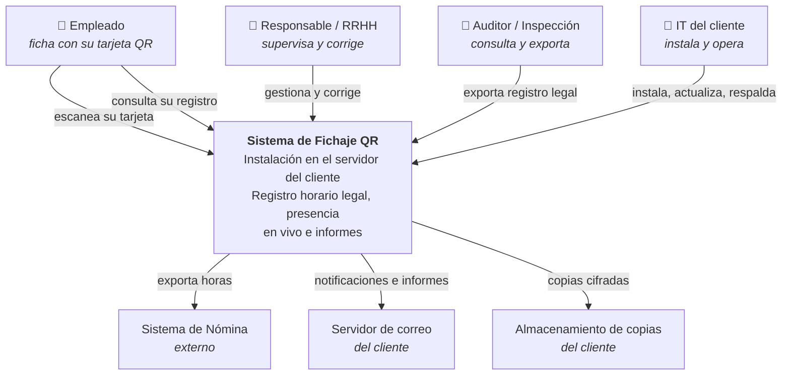
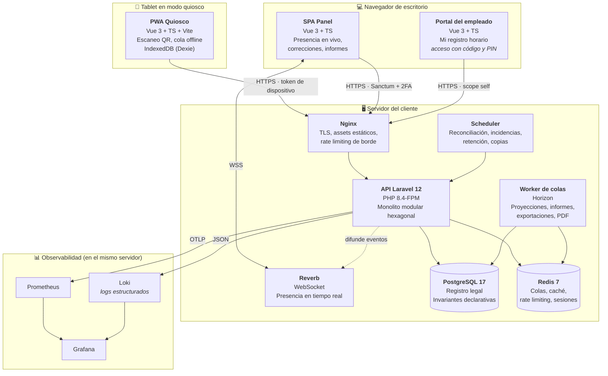
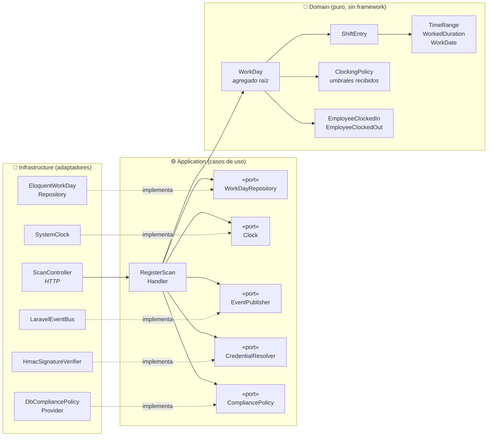
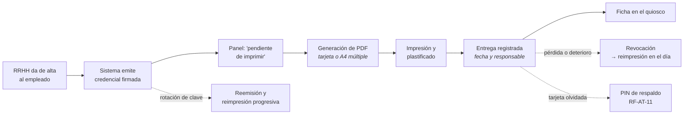
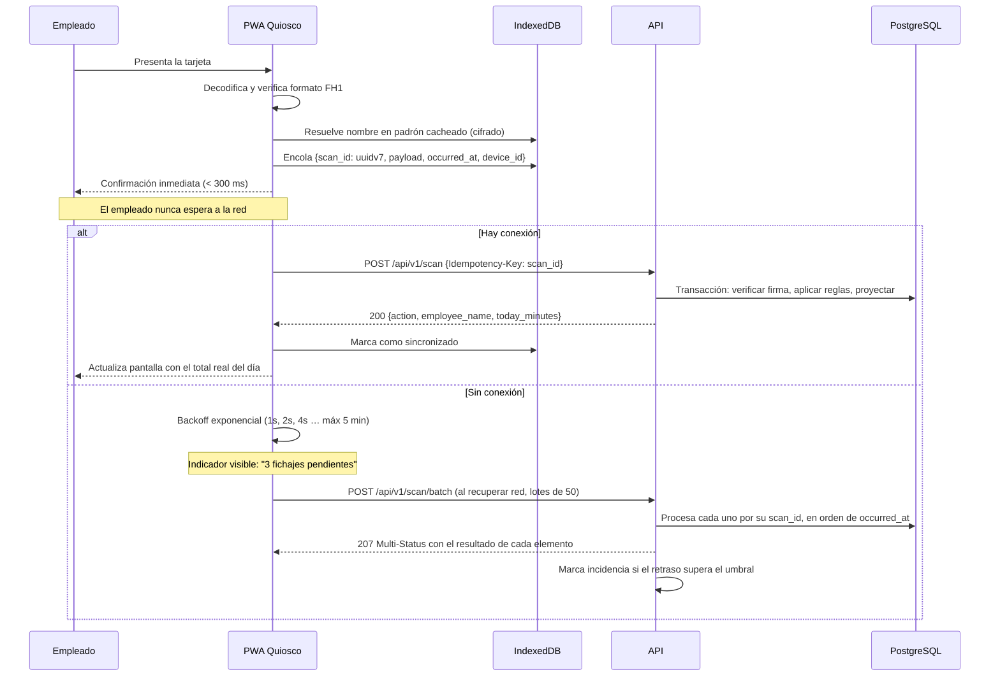

# Stack Tecnológico, Arquitectura y Plan de Implementación
## Sistema de Control de Presencia y Registro Horario por QR — Sector Hotelero

| Campo | Valor |
|---|---|
| **Modelo de negocio** | Producto licenciado, desplegado en servidores del cliente |
| **Fecha** | 11 de agosto de 2026 |
| **Documentos hermanos** | `01-especificaciones-proyecto.md`, `03-agentes-y-skills-ia.md`, `04-decision-credencial.md` |
| **Audiencia** | Arquitectura, Desarrollo, DevOps, QA |

> Este documento asume leído el documento 01. Las referencias `RF-*`, `RN-*`, `RNF-*`, `RL-*`, `RS-*` y `RQ-*` apuntan a sus requisitos.

---

## 1. Decisión de arquitectura

### 1.1 Modelo elegido

> **Monolito Modular con Arquitectura Hexagonal (Ports & Adapters), DDD táctico en el núcleo, CQRS-lite para lectura, eventos de dominio internos y quiosco PWA offline-first. Desplegado como instalación independiente en el servidor de cada cliente.**

Es el modelo correcto para este producto. No es el más de moda ni el más simple: es el que mejor equilibra las cinco fuerzas reales del sistema.

| Fuerza del sistema | Consecuencia arquitectónica |
|---|---|
| El dato tiene **valor probatorio legal** y debe ser inalterable | Registro solo-append, auditoría encadenada, correcciones versionadas. Empuja hacia un núcleo de dominio explícito y hacia separar escritura de lectura. |
| Las **invariantes son transaccionales** (un turno abierto, sin solapes, total consistente) | Una única base de datos ACID y una frontera transaccional clara. **Descarta microservicios**: la consistencia eventual aquí produce dobles fichajes y totales erróneos. |
| El **dominio es pequeño pero denso en reglas** (DST, medianoche, descansos, idempotencia) | Dominio rico y puro, aislado del framework, probado en milisegundos sin base de datos. Justifica el hexágono. |
| El **equipo es pequeño** y **cada cliente tiene su despliegue** | Un artefacto, un `docker compose up`. Cualquier topología distribuida convertiría la instalación en un proyecto de ingeniería para el cliente. |
| La **red del hotel es poco fiable** | El quiosco no puede depender del servidor para funcionar. Offline-first con idempotencia, en el MVP y no como mejora. |

**Modularidad sin distribución** es la clave: ocho módulos con fronteras reales verificadas por tests de arquitectura, dentro de un único proceso desplegable. Si algún día un módulo necesita escalar por separado, la frontera ya existe y la extracción es mecánica. Se paga el diseño, no la operación.

### 1.2 Alternativas evaluadas y descartadas

| Alternativa | Por qué se descarta |
|---|---|
| **N-capas clásico** (Controller → Service → Eloquent) | Lo más rápido de escribir y lo más caro de mantener. Las reglas acaban repartidas entre controladores, modelos y observers; probar el cálculo de DST exige levantar base de datos; y el día que cambie una regla legal nadie sabe cuántos sitios tocar. Con un dominio de este calado, la deuda aparece en el mes 3. |
| **Microservicios** | Coste operativo desproporcionado para 500 empleados. Rompe las invariantes transaccionales RN-01 y RN-02, que pasarían a resolverse con sagas. Añade latencia en el camino crítico de 800 ms del quiosco. Y multiplica por diez la dificultad de que un cliente lo instale. |
| **Serverless** | Arranques en frío incompatibles con RNF-P-01, conexiones a base de datos relacional problemáticas, y radicalmente incompatible con el despliegue on-premise. |
| **Event Sourcing completo** | Tentador por el requisito de inmutabilidad, y de hecho `scan_events` es un log de eventos. Pero aplicarlo a todo el sistema multiplica la complejidad sin necesidad. **Se adopta la parte útil**: log inmutable de escaneos y proyecciones reconstruibles, sin la ceremonia completa. Es lo que se llama aquí CQRS-lite. |
| **Arquitectura multi-inquilino** | Innecesaria: cada cliente tiene su despliegue completo, así que el aislamiento es físico y gratuito. Añadirla ahora sería pagar complejidad por una capacidad que el modelo de negocio no requiere. |

### 1.3 Diagrama C4 — Nivel 1: Contexto



### 1.4 Diagrama C4 — Nivel 2: Contenedores



Todo corre en el servidor del cliente. No hay ningún componente alojado por el fabricante, y **el sistema funciona íntegramente sin salida a internet**.

### 1.5 Diagrama C4 — Nivel 3: Componentes del módulo `Attendance`

El corazón del sistema. Ilustra la regla de dependencia: **todas las flechas apuntan hacia dentro**.



**Regla de oro, verificada por test automático:** `Domain/` no puede importar nada de `Illuminate\*`, `App\Models\*` ni de otro módulo. Si alguien lo intenta, la CI falla.

Nótese el puerto `CompliancePolicy`: el dominio **recibe** los umbrales legales ya resueltos. Nunca pregunta a la configuración.

### 1.6 Módulos y sus fronteras

| Módulo | Responsabilidad | Puede depender de |
|---|---|---|
| `Attendance` | **Núcleo.** Fichajes, tramos, jornadas, correcciones | `Shared` |
| `Compliance` | Auditoría, incidencias, retención, exportación legal | `Shared`, eventos de `Attendance` |
| `Workforce` | Empleados, departamentos, centros, contratos, ausencias | `Shared` |
| `Identity` | Usuarios, roles, permisos, credenciales QR, tokens de dispositivo | `Shared` |
| `Reporting` | Proyecciones y consultas de lectura, exportaciones | `Shared`, eventos de otros módulos |
| `Kiosk` | Dispositivos, emparejamiento, sincronización de lotes, telemetría | `Shared`, `Attendance` (vía caso de uso) |
| `Product` | Configuración de instalación, perfiles de cumplimiento, marca, licencia, diagnóstico, soporte | `Shared` |
| `Shared` | Objetos de valor comunes, tipos base, contratos de eventos | — |

**La comunicación entre módulos ocurre solo por dos vías:** casos de uso públicos con interfaz explícita, o eventos de dominio. Nunca por acceso directo a los modelos Eloquent de otro módulo.

> **`Product` es de soporte, pero lo consultan casi todos.** Para que no se convierta en un acoplamiento universal, los demás módulos no leen su configuración directamente: reciben los valores ya resueltos como parámetros, o mediante un puerto tipado (`CompliancePolicyProvider`, `BrandingProvider`). El dominio nunca pregunta "¿qué dice la configuración?": recibe el umbral ya decidido.

---

## 2. Estructura del repositorio

```
fichaje-hotel/
├── CLAUDE.md                        # Reglas duras del proyecto para agentes IA
├── docs/
│   ├── 01-especificaciones-proyecto.md
│   ├── 02-stack-tecnologico-y-plan-implementacion.md
│   ├── 03-agentes-y-skills-ia.md
│   ├── 04-decision-credencial.md
│   ├── adr/                         # ADR-001 … ADR-020
│   ├── api/openapi.yaml             # Contrato, fuente de verdad de la API
│   ├── cliente/                     # Documentación que se entrega al cliente
│   │   ├── instalacion.md
│   │   ├── operacion.md
│   │   ├── configuracion.md
│   │   └── obligaciones-legales.md
│   └── runbooks/                    # Procedimientos de operación interna
├── .claude/
│   ├── agents/                      # 10 agentes especializados
│   └── skills/                      # 6 skills de generación
├── .github/workflows/
│   ├── ci.yml                       # Calidad, pruebas, seguridad
│   ├── e2e.yml                      # Playwright con cámara simulada
│   └── release.yml                  # Publicación de versión e imágenes
│
├── backend/
│   ├── app/
│   │   ├── Modules/
│   │   │   ├── Attendance/
│   │   │   │   ├── Domain/          # ⛔ Sin framework. Nada de Illuminate.
│   │   │   │   │   ├── Model/       #    WorkDay, ShiftEntry
│   │   │   │   │   ├── ValueObject/ #    TimeRange, WorkedDuration, WorkDate
│   │   │   │   │   ├── Event/       #    EmployeeClockedIn, ...
│   │   │   │   │   ├── Policy/      #    ClockingPolicy
│   │   │   │   │   └── Exception/
│   │   │   │   ├── Application/
│   │   │   │   │   ├── UseCase/     #    RegisterScanHandler, CorrectShiftHandler
│   │   │   │   │   ├── Port/        #    Interfaces (repositorios, reloj, bus, policy)
│   │   │   │   │   ├── Command/     #    DTOs de entrada
│   │   │   │   │   └── Query/       #    Lecturas del módulo
│   │   │   │   ├── Infrastructure/
│   │   │   │   │   ├── Persistence/ #    Modelos Eloquent + repositorios
│   │   │   │   │   ├── Adapter/     #    Reloj, bus de eventos, policy provider
│   │   │   │   │   └── Projection/  #    Listeners que mantienen daily_totals
│   │   │   │   ├── Http/            #    Controllers, Requests, Resources, Policies
│   │   │   │   └── AttendanceServiceProvider.php
│   │   │   ├── Compliance/          # (misma estructura interna)
│   │   │   ├── Workforce/
│   │   │   ├── Identity/
│   │   │   ├── Reporting/
│   │   │   ├── Kiosk/
│   │   │   ├── Product/
│   │   │   └── Shared/
│   │   └── Providers/
│   ├── database/migrations/
│   ├── routes/api_v1.php
│   ├── tests/
│   │   ├── Unit/                    # Dominio puro, sin BD. Milisegundos.
│   │   ├── Integration/             # Repositorios contra PostgreSQL real
│   │   ├── Feature/                 # API extremo a extremo
│   │   ├── Contract/                # Validación contra openapi.yaml
│   │   └── Architecture/            # Fronteras entre módulos
│   ├── deptrac.yaml
│   ├── phpstan.neon                 # Nivel 9
│   └── rector.php
│
├── frontend-kiosk/                  # PWA del quiosco
│   ├── src/
│   │   ├── features/scan/           # Cámara, decodificación, feedback
│   │   ├── features/pin/            # Fichaje de respaldo por PIN
│   │   ├── features/offline/        # Cola Dexie, sincronización, reintentos
│   │   ├── features/pairing/        # Emparejamiento por código
│   │   ├── features/diagnostics/
│   │   ├── shared/api/              # Cliente generado desde openapi.yaml
│   │   ├── shared/i18n/
│   │   └── sw/                      # Service worker (Workbox)
│   ├── tests/{unit,e2e}/
│   └── e2e/fixtures/qr-video.y4m    # Vídeo con QR real para cámara simulada
│
├── frontend-admin/                  # SPA del panel de gestión
│   └── src/features/{live,workdays,incidents,reports,employees,credentials,devices,settings}/
│
├── frontend-portal/                 # Portal del empleado (web sencilla, responsive)
│   └── src/features/{login,my-records,my-export}/
│
├── infra/
│   ├── docker/{php,nginx,postgres}/
│   ├── compose.dev.yaml
│   ├── compose.prod.yaml            # El que se entrega al cliente
│   ├── observability/
│   └── scripts/{install.sh,update.sh,backup.sh,restore.sh,doctor.sh}
└── load-tests/k6/scan-peak.js
```

---

## 3. Stack tecnológico

### 3.1 Backend

| Componente | Elección | Versión | Motivo |
|---|---|---|---|
| Lenguaje | PHP | **8.4** (mínimo 8.3) | *Property hooks*, `#[\Override]` y mejor rendimiento. |
| Framework | Laravel | **12.x** | Ecosistema maduro, herramientas integradas de autenticación, colas y programación. Verificar la versión mayor vigente al arrancar y actualizar el ADR si procede. |
| Autenticación | Laravel Sanctum + `pragmarx/google2fa` | ^4.0 / ^8.0 | Tokens con ámbitos y 2FA obligatorio para roles con acceso global. |
| Colas | Redis + **Laravel Horizon** | ^5.0 | Visibilidad de trabajos. Redis se necesita igualmente para caché y rate limiting. |
| Tiempo real | **Laravel Reverb** | ^1.0 | First-party, autoalojado, sin coste por mensaje. *Fallback* a sondeo cada 15 s si el WebSocket cae. |
| Programación | Laravel Scheduler | — | Consolidaciones, incidencias, retención, copias. |
| Autorización | Policies + `spatie/laravel-permission` | ^6.0 | RBAC con ámbito por departamento. |
| Generación QR | `endroid/qr-code` | ^5.0 | Librería directa y bien mantenida. Control sobre el nivel de corrección de errores, que aquí importa. |
| PDF | `spatie/laravel-pdf` (Browsershot) | ^1.0 | **Tarjetas de credencial** e informes sellados. |
| Exportaciones | `spatie/simple-excel` | ^3.0 | Streaming: no carga en memoria un mes de 500 empleados. |
| Contrato API | `spectator` en pruebas + OpenAPI 3.1 | — | Contrato como fuente de verdad. |
| Firma de licencia | `sodium` de PHP (ed25519) | nativo | Verificación local sin dependencias externas. |
| Trazas | OpenTelemetry PHP | ^1.0 | Instrumentación extremo a extremo. |

### 3.2 Base de datos — PostgreSQL 17

El motivo del cambio respecto a la opción convencional de MySQL no es preferencia: es que **PostgreSQL puede garantizar las dos invariantes críticas del dominio en la propia base de datos**, y MySQL no.

```sql
CREATE EXTENSION IF NOT EXISTS btree_gist;

-- RN-01 · Como máximo un turno abierto por empleado.
CREATE UNIQUE INDEX one_open_shift_per_employee
    ON shift_entries (employee_id)
    WHERE clocked_out_at IS NULL AND status <> 'voided';

-- RN-02 · Los tramos de un mismo empleado nunca se solapan.
ALTER TABLE shift_entries ADD CONSTRAINT shift_entries_no_overlap
    EXCLUDE USING gist (
        employee_id WITH =,
        tstzrange(clocked_in_at, clocked_out_at) WITH &&
    ) WHERE (status <> 'voided');
```

Esto importa porque en un sistema con valor probatorio **la integridad no puede depender solo del código de aplicación**: un script de migración, una corrección manual mal hecha o una condición de carrera bajo concurrencia pueden introducir datos imposibles. La base de datos es la última línea de defensa y aquí la sostiene declarativamente.

Ventajas adicionales aprovechadas:

| Capacidad | Uso en el proyecto |
|---|---|
| `TIMESTAMPTZ` con semántica correcta | RN-04 y RN-09: almacenamiento UTC, presentación en zona del centro, inmune a DST |
| `tstzrange` y operadores de rango | Solapes, huecos entre turnos y descanso entre jornadas (RN-10) |
| Índices parciales | Consulta de turnos abiertos en O(log n) sin escanear el histórico |
| `JSONB` con índices GIN | `client_meta`, `payload` de auditoría, `settings` de instalación |
| Funciones de ventana y `generate_series` | Informes con días sin actividad incluidos, sin bucles en PHP |
| Particionado nativo | `scan_events` por mes cuando supere 10 M filas |
| `pgcrypto` | Hash del DNI, cadena de hash de auditoría |
| WAL archiving | RPO ≤ 15 min (RNF-D-02) |

El **Anexo E** recoge la equivalencia para MySQL 8 si la infraestructura de un cliente lo impusiera, con la advertencia de qué garantías se pierden.

### 3.3 Frontend

| Componente | Elección | Nota |
|---|---|---|
| Framework | Vue 3.5+ (Composition API, `<script setup>`) | Curva suave, buen rendimiento en hardware de tablet modesto. |
| Lenguaje | **TypeScript 5.6+ en modo estricto** | En clientes que manipulan horas, colas offline e idempotencia, el tipado no es opcional. |
| Build | Vite 6 | — |
| CSS | Tailwind CSS 4 | — |
| Estado | Pinia 2 | — |
| Rutas | Vue Router 4 | — |
| HTTP | Cliente generado desde OpenAPI | Sin desviaciones entre backend y frontends. |
| **Escaneo QR** | **`@zxing/browser` + `@zxing/library`** | Decodifica más rápido, da control sobre `MediaStream` (enfoque, torch, resolución) y tiene mejor mantenimiento que las alternativas. |
| **PWA (solo quiosco)** | `vite-plugin-pwa` + Workbox | El quiosco necesita instalación y service worker. El panel y el portal son web normal. |
| **Cola offline (solo quiosco)** | **Dexie 4 (IndexedDB)** | Transaccional. `localStorage` es síncrono, con 5 MB y sin transacciones: inadecuado para una cola con garantías. |
| Wake lock | Screen Wake Lock API con *fallback* | Evita que la tablet se suspenda. |
| i18n | `vue-i18n` 10 | Español e inglés de serie, extensible. |
| Tablas y datos (panel) | TanStack Table + TanStack Query | Virtualización para 500 empleados y caché de consultas. |
| Gráficos (panel) | ECharts | Informes y tendencias, con tabla de datos alternativa. |

> **El portal del empleado es una web sencilla, no una PWA.** No hay credencial que mostrar sin conexión, así que no necesita service worker, caché cifrada ni instalación. Es una página responsive de consulta. Esta decisión ahorra trabajo real y elimina toda una categoría de modos de fallo.

### 3.4 Infraestructura

| Componente | Desarrollo | Producción (servidor del cliente) |
|---|---|---|
| Orquestación | Docker Compose | Docker Compose autocontenido |
| Servidor web | Nginx | Nginx + PHP-FPM con pool ajustado |
| TLS | mkcert | Let's Encrypt, o certificado propio del cliente si no hay salida a internet |
| Base de datos | PostgreSQL 17 en contenedor | PostgreSQL 17 con WAL archiving |
| Caché y colas | Redis 7 | Redis 7 con persistencia AOF |
| Correo | Mailpit | SMTP del cliente |
| Objetos | MinIO | Sistema de ficheros local o almacenamiento del cliente |
| Observabilidad | Stack completo en Compose | Prometheus + Grafana + Loki + Alertmanager |

Servicios de desarrollo: `app`, `nginx`, `postgres`, `redis`, `horizon`, `reverb`, `scheduler`, `node-kiosk`, `node-admin`, `node-portal`, `mailpit`, `prometheus`, `grafana`, `loki`. Un `make up` debe dejar el entorno completo funcionando con datos de ejemplo.

---

## 4. Registros de Decisión de Arquitectura (ADR)

Formato resumido. Cada uno vive completo en `docs/adr/`.

| # | Decisión | Contexto y motivo | Consecuencias |
|---|---|---|---|
| **001** | **Monolito modular**, no microservicios | Equipo pequeño, invariantes transaccionales, escala modesta, y cada cliente instala el producto | Un despliegue. Las fronteras se mantienen por disciplina y tests de arquitectura, no por la red |
| **002** | **Arquitectura hexagonal** en `Attendance` y `Compliance` | Reglas densas y legalmente sensibles; deben probarse sin infraestructura y sobrevivir a cambios de framework | Más ficheros y algo de mapeo entre dominio y Eloquent. Los módulos de soporte usan una variante ligera para no sobredimensionar |
| **003** | **PostgreSQL 17** | Restricción de exclusión e índices parciales garantizan RN-01 y RN-02 en la base de datos | El equipo debe conocer Postgres. Se documenta la variante MySQL (Anexo E) |
| **004** | **UTC en almacenamiento, zona del centro en presentación** | RN-04, RN-09. `TIMESTAMP` sin zona da resultados erróneos en DST y en turnos nocturnos | Toda conversión pasa por un único servicio. Prohibido usar `now()` local en el dominio: se inyecta el puerto `Clock` |
| **005** | **Payload QR firmado con HMAC-SHA256 y `key_id`** | Impide que nadie fabrique la credencial de un compañero. Un payload legible o secuencial sería falsificable, filtraría PII y permitiría enumeración | Requiere custodia y rotación de la clave. No impide el préstamo físico, que se combate por otras vías |
| **006** | **Los turnos no se parten a medianoche** | Cortar un turno nocturno a las 23:59 fabrica registros que no ocurrieron: falsea el registro legal y rompe el cálculo de descanso entre jornadas | El informe de horas por día natural requiere prorrateo explícito, implementado en `Reporting` |
| **007** | **`daily_totals` es una proyección reconstruible**, no fuente de verdad | Un acumulado incremental deriva ante correcciones, anulaciones y reintentos | Recálculo completo en transacción, comando `attendance:reconcile` y alerta ante divergencia |
| **008** | **Offline-first con idempotencia por `scan_id`** | Red de hotel poco fiable; el acto de fichar no puede depender del servidor | Complejidad en el cliente. Doble marca temporal (`occurred_at` / `recorded_at`) en todo el sistema |
| **009** | **Sin biometría** | Dato de categoría especial; criterio restrictivo de la autoridad de control en control de presencia; existen alternativas menos invasivas | Se acepta un residuo de riesgo de préstamo de credencial, mitigado por supervisión y auditoría de patrones |
| **010** | **Auditoría solo-append encadenada por hash** | RL-04 exige inalterabilidad demostrable; RS-07 exige detectar manipulación | El usuario de base de datos de la aplicación no tiene `UPDATE` ni `DELETE` sobre `audit_log`. Verificación periódica de la cadena |
| **011** | **WebSockets (Reverb) con *fallback* a sondeo** | Sondear cada 5 s con 500 empleados es caro e impreciso | Un proceso más que operar y monitorizar |
| **012** | **API versionada en la ruta (`/api/v1`)** | Los quioscos son clientes que no siempre se actualizan a la vez | Compromiso de mantener v1 mientras haya dispositivos en esa versión |
| **013** | **Contrato OpenAPI como fuente de verdad** | Evita la deriva entre backend y los tres frontends; permite generar clientes tipados y validar en pruebas | El contrato se modifica antes que el código, no después |
| **014** | **La credencial es una tarjeta física impresa**, única modalidad del producto | Es la única opción que cubre al 100 % de la plantilla. En hostelería el móvil excluye a demasiada gente: temporada sin correo corporativo, cocinas y pisos donde está prohibido, uniformes sin bolsillos. Análisis completo en el documento 04 | Logística de impresión y distribución a cargo del cliente. Rotación de clave con reimpresión progresiva. El QR en móvil sería un desarrollo a medida |
| **015** | **El portal del empleado usa código y PIN, y es web sencilla** | El producto no puede exigir correo electrónico a toda la plantilla, y sin credencial que mostrar sin conexión no hace falta una PWA | Exige bloqueo por intentos y acceso restringido a red interna por defecto. Elimina la gestión de invitaciones, la entregabilidad de correo y el service worker del portal |
| **016** | **Producto licenciado on-premise, sin multi-tenencia** | Se vende y se despliega en el servidor de cada cliente | Aislamiento físico gratuito. A cambio, el fabricante no puede intervenir en producción y hay que soportar N instalaciones en M versiones |
| **017** | **Toda diferencia entre clientes es configuración, nunca código** | Vender a un cliente nuevo no puede exigir tocar el repositorio. Una rama por cliente destruye la economía del producto en el tercer cliente | Tabla `installation_settings` con ámbito, perfiles de cumplimiento, marca y funcionalidades por licencia. Los umbrales legales dejan de ser constantes |
| **018** | **Licencia firmada con verificación local, sin llamada a internet** | El servidor del cliente puede estar en una red aislada. Una verificación en línea convertiría la conectividad del fabricante en punto único de fallo del registro horario de sus clientes | Clave firmada asimétricamente. No se puede revocar a distancia, lo cual es aceptable: es un control comercial, no de seguridad |
| **019** | **La caducidad de la licencia nunca bloquea el registro ni su consulta** | Bloquear el fichaje dejaría al cliente incumpliendo la ley por acción del fabricante, e impediría el acceso a datos que debe conservar 4 años | La palanca comercial son los avisos y las funcionalidades accesorias. Exige separar en el código lo que es "registro legal" de lo que es "producto" |
| **020** | **El soporte se presta con paquete de diagnóstico, no con acceso permanente** | El fabricante no debe tener acceso continuado a los datos personales de la plantilla de sus clientes | Exportación anonimizada por defecto, y acceso puntual solo con concesión expresa, temporal, limitada y auditada. Obliga a que los errores sean autoexplicativos |

---

## 5. Diseño de la credencial QR

### 5.1 Formato del payload

```
FH1.<key_id>.<token>.<sig>

FH1      Prefijo y versión del esquema (permite migrar sin ambigüedad)
key_id   Identificador de la clave de firma (2 caracteres). Habilita rotación con solape
token    22 caracteres base64url = 128 bits de aleatoriedad. Opaco, sin PII, no enumerable
sig      Primeros 16 caracteres base64url de HMAC-SHA256(key[key_id], "FH1." + key_id + "." + token)

Ejemplo: FH1.a3.7QK2mXpR9vLdN4tZbYcF1w.k9Xm2pQrT5vN8wLa
```

Unos 50 caracteres: cabe holgadamente en un QR versión 3 con **corrección de errores nivel Q**, legible desde 20 cm con una cámara de tablet modesta y tolerante a un 25 % de degradación. Ese margen es lo que permite que una tarjeta sobreviva una temporada de uso diario en una cocina, con roces, grasa y dobleces.

### 5.2 Verificación en el servidor

1. Comprobar el prefijo `FH1`. Si no coincide → rechazo genérico.
2. Resolver la clave por `key_id`. Clave desconocida o retirada → rechazo genérico.
3. Recalcular el HMAC y comparar en **tiempo constante** (`hash_equals`).
4. Buscar la credencial por hash del `token` (nunca se almacena el token en claro).
5. Verificar que la credencial no está revocada y que el empleado está activo.
6. **Todos los rechazos devuelven la misma respuesta y consumen el mismo tiempo** (RS-03): un atacante no puede distinguir "no existe" de "revocada" de "firma inválida". El detalle solo va al log del servidor y a `scan_events.result`.

### 5.3 Rotación de claves

Dos claves activas simultáneamente (`current` y `previous`) en el gestor de secretos. Al rotar: se emite `key_id` nuevo, las tarjetas se reimprimen progresivamente, y la clave anterior se retira cuando el panel confirma que no queda ninguna credencial activa con ese `key_id`.

**Sin `key_id` habría que reimprimir toda la plantilla en un solo día.** Con él, la operación se reparte en semanas sin dejar a nadie sin poder fichar.

### 5.4 Qué resuelve y qué no

| Amenaza | ¿Resuelta? |
|---|---|
| Generar un QR válido para otro empleado | ✅ Sí. Sin la clave del servidor es computacionalmente inviable |
| Enumerar empleados probando códigos | ✅ Sí. 128 bits de espacio más rate limiting |
| Filtrar PII en el propio QR | ✅ Sí. Payload opaco |
| Reemitir sin invalidar la anterior | ✅ Sí. Revocación por credencial |
| Deterioro por uso diario | ✅ Sí. Corrección de errores nivel Q |
| **Prestar la tarjeta a un compañero** | ❌ **No.** Pero es **autolimitado**: el titular se queda sin la suya, exige entrega y devolución, y solo funciona si el titular no piensa fichar. Se combate con supervisión y auditoría de patrones anómalos |

### 5.5 Ciclo de vida de la credencial



**Detalles que hay que resolver bien:**

| Punto | Decisión |
|---|---|
| **Antelación** | La emisión y la impresión deben hacerse con días de margen respecto al primer día de trabajo. Es un requisito de proceso, no de software, y va en el runbook de alta de empleado. |
| **Panel de estado** | RF-QR-08 existe para que RRHH vea de un vistazo quién no puede fichar todavía. Sin él, el problema se descubre delante del quiosco a las 06:00. |
| **Registro de entrega** | Marcar la entrega no es burocracia: es lo que distingue "la tarjeta se perdió antes de dársela" de "el empleado la perdió", que son incidencias distintas. |
| **Impresión masiva** | La hoja A4 con varias tarjetas por página es lo que hace viable dar de alta a 40 personas de temporada en una tarde. |
| **Material** | PVC plastificado si el cliente tiene impresora de tarjetas; papel plastificado como alternativa económica. El diseño del PDF sirve para ambos. |
| **Reposición** | El proceso de reimpresión debe ser de minutos, no de días. Una tarjeta rota que tarda una semana en reponerse son cinco días de fichajes por PIN. |

---

## 6. Protocolo de fichaje offline



**Garantías del protocolo:**

| Garantía | Cómo |
|---|---|
| **Exactamente una vez** | `scan_id` (UUID v7, generado en el cliente) con UNIQUE en `scan_events`. Un reenvío devuelve la respuesta original, no un error |
| **Hora real preservada** | `occurred_at` viaja desde el cliente; el servidor añade `recorded_at`. El registro legal usa `occurred_at`, y ambos quedan visibles en la auditoría |
| **Orden correcto** | El lote se procesa ordenado por `occurred_at`, no por orden de llegada. Crítico: entrada y salida offline deben aplicarse en secuencia |
| **Desfase controlado** | Si el retraso supera el umbral, o si el reloj del dispositivo diverge del servidor, se genera una incidencia para validación humana (RN-15) |
| **No se pierde nada** | La cola persiste en IndexedDB con transacciones. Solo se borra el elemento tras confirmación explícita del servidor |
| **Degradación honesta** | Si el padrón cacheado no reconoce el token, el quiosco **igualmente encola** y avisa "fichaje registrado, pendiente de validar". Nunca se rechaza un fichaje por estar sin red |

**Sobre el UUID v7:** se elige frente a v4 porque es ordenable temporalmente, lo que mantiene la localidad del índice en `scan_events` y evita la fragmentación de páginas que produciría un v4 aleatorio con millones de filas.

---

## 7. Diseño de seguridad

### 7.1 Defensa en profundidad

| Capa | Controles |
|---|---|
| **Red** | TLS 1.3 obligatorio, HSTS, quioscos en VLAN separada, portal del empleado restringido a red interna por defecto, fail2ban |
| **Borde (Nginx)** | Rate limiting por zona: fichaje 30 r/m por IP con ráfaga de 10; autenticación 5 r/m; portal 10 r/m; resto 120 r/m. Límite de tamaño de cuerpo. Cabeceras de seguridad |
| **Aplicación** | Throttling por `device_id`, por credencial y por empleado; autorización por policy en **cada** endpoint; validación estricta; respuestas de tiempo constante en el camino de fichaje; bloqueo por intentos en el PIN |
| **Datos** | Usuario de base de datos con permisos mínimos (sin DDL, sin `UPDATE` ni `DELETE` en `audit_log`), DNI hasheado, copias cifradas con clave separada |
| **Cliente** | CSP estricta sin `unsafe-inline`, `Permissions-Policy: camera=(self)`, SRI en assets, padrón cacheado cifrado con clave derivada del token del dispositivo |

### 7.2 Cabeceras HTTP

```nginx
add_header Strict-Transport-Security "max-age=63072000; includeSubDomains" always;
add_header Content-Security-Policy "default-src 'self'; script-src 'self'; style-src 'self'; img-src 'self' data: blob:; media-src 'self' blob:; connect-src 'self' wss:; frame-ancestors 'none'; base-uri 'self'; form-action 'self'; object-src 'none'" always;
add_header X-Content-Type-Options "nosniff" always;
add_header Referrer-Policy "strict-origin-when-cross-origin" always;
add_header Permissions-Policy "camera=(self), microphone=(), geolocation=(), payment=()" always;
add_header Cross-Origin-Opener-Policy "same-origin" always;
```

`img-src` y `media-src` incluyen `blob:` porque el escaneo por cámara los necesita. `camera=(self)` es imprescindible: sin ello, la PWA del quiosco no puede acceder al dispositivo de vídeo. Es un fallo de configuración que se diagnostica mal y cuesta horas.

### 7.3 Ámbitos de token

| Cliente | Ámbitos (*abilities*) | Caducidad | Rotación |
|---|---|---|---|
| Quiosco | `scan:write`, `roster:read`, `heartbeat:write` | 90 días | Automática al 80 % de vida |
| Empleado (portal) | `self:read` | Sesión corta | — |
| Responsable | `attendance:read`, `attendance:correct`, `incidents:*` (ámbito departamento) | Sesión + 2FA | — |
| RRHH | + `employees:*`, `reports:*`, `credentials:*` | Sesión + 2FA | — |
| Auditor | `attendance:read`, `audit:read`, `reports:legal` (solo lectura, ámbito completo) | Sesión + 2FA | — |
| Administrador de instalación | + `settings:*`, `license:*`, `support:*`, `diagnostics:*` | Sesión + 2FA | — |

Un token de quiosco comprometido **no da acceso a la plantilla completa**: `roster:read` devuelve solo el mínimo necesario (hash del token, nombre de pila e inicial del apellido) del centro al que está vinculado el dispositivo.

### 7.4 Cadena de hash de la auditoría

```
hash_n = SHA256( prev_hash || occurred_at || actor || action || subject || canonical_json(payload) )
```

La entrada génesis usa `prev_hash = SHA256("FICHAJE-HOTEL-GENESIS")`. Un comando `compliance:verify-audit-chain` recorre la cadena a diario; cualquier rotura dispara alerta crítica de seguridad. Es lo que permite afirmar ante una inspección que el registro **es detectablemente inalterable** (RL-04, RS-07), no solo que "confiamos en que nadie lo tocó".

Refuerzo opcional: publicar semanalmente el último hash en un medio externo (correo firmado a la asesoría, servicio de sellado de tiempo). Ancla la cadena y evita que alguien con acceso total la reescriba entera.

### 7.5 Protección del PIN

El PIN de 6 dígitos sirve para dos cosas: respaldo de fichaje en el quiosco (RF-AT-11) y acceso al portal personal (RF-ID-06). Un espacio de 10⁶ es pequeño, así que la protección es de proceso:

- Bloqueo temporal creciente tras 3, 5 y 10 intentos fallidos, por empleado y por origen.
- Rate limiting independiente por IP.
- Portal restringido a red interna por defecto; exponerlo exige decisión explícita del cliente.
- El ámbito de una sesión de portal alcanza **solo los datos del propio empleado**, así que un compromiso no escala.
- En el quiosco, el fichaje por PIN queda **marcado para revisión del responsable**, lo que hace visible cualquier uso anómalo.

### 7.6 Checklist OWASP ASVS

Nivel objetivo: **ASVS 2 (estándar)**, con controles de nivel 3 en el registro de auditoría. Verificación en cada versión publicada: V1 (arquitectura), V2 (autenticación), V3 (sesión), V4 (control de acceso), V5 (validación), V7 (logs y errores), V8 (protección de datos), V9 (comunicaciones), V12 (ficheros), V13 (API), V14 (configuración).

### 7.7 Gestión de secretos

Nada de secretos en el repositorio. En desarrollo, `.env` local a partir de `.env.example`. En producción, el instalador **genera los secretos en el servidor del cliente** y nunca los transmite. Rotación documentada en `docs/runbooks/rotacion-secretos.md` para: `APP_KEY`, claves HMAC de QR, credenciales de base de datos, tokens de dispositivo y claves de copia.

---

## 8. Observabilidad

### 8.1 Instrumentación

| Señal | Herramienta | Detalle |
|---|---|---|
| **Métricas** | Prometheus + `promphp/prometheus_client_php`, expuesto en `/metrics` restringido a red interna | Técnicas (RED) y de negocio |
| **Trazas** | OpenTelemetry, exportador OTLP | Desde el `fetch` del navegador del quiosco hasta la consulta SQL. `trace_id` propagado en cabecera |
| **Logs** | Monolog en JSON → Loki | Con `trace_id`, `scan_id`, `device_id`, `employee_uuid`. **Nunca nombres en claro** |
| **Errores** | Registro local con retención de 90 días | En on-premise no se envían errores al fabricante; se incluyen en el paquete de diagnóstico si el cliente lo genera |
| **Uptime** | Sonda interna sobre `/api/v1/health` | — |
| **Auditoría** | Tabla `audit_log` propia | **Separada de los logs técnicos**: distinta retención, distinto propósito, valor probatorio |

### 8.2 Métricas expuestas

```
# Técnicas
http_request_duration_seconds{route,method,status}       histogram
http_requests_total{route,method,status}                 counter
queue_jobs_pending{queue}                                gauge
queue_job_duration_seconds{job}                          histogram
queue_jobs_failed_total{job}                             counter
db_query_duration_seconds{operation}                     histogram
websocket_connections_active                             gauge

# De negocio — las que de verdad importan aquí
scans_total{device,result}                               counter
scan_processing_duration_seconds                         histogram
open_shifts_current{site,department}                     gauge
kiosk_last_seen_seconds{device}                          gauge
kiosk_offline_queue_size{device}                         gauge
sync_delay_seconds{device}                               histogram
incidents_open{type,severity}                            gauge
manual_corrections_total{reason_code}                    counter
projection_divergence_total                              counter
audit_chain_verification_failures_total                  counter
worked_minutes_total{site,department}                    counter

# Credenciales y respaldo
employees_without_delivered_credential{site}             gauge
credentials_pending_print{site}                          gauge
pin_fallback_scans_total{site}                           counter
```

`projection_divergence_total` y `audit_chain_verification_failures_total` deben permanecer **siempre en cero**. Cualquier incremento es un incidente de integridad, no una métrica de tendencia.

`employees_without_delivered_credential` es la métrica operativa de la entrega: cuenta a quienes están de alta pero **todavía no pueden fichar**. Debe llegar a cero antes del primer día de cada incorporación.

Una subida de `pin_fallback_scans_total` indica un problema con la emisión, el estado de las tarjetas o la disciplina de la plantilla. Es un termómetro barato.

### 8.3 Cuadros de mando

| Dashboard | Audiencia | Contenido |
|---|---|---|
| **Operación de quioscos** | Soporte / IT del cliente | Estado por dispositivo, último latido, cola pendiente, versión, escaneos por hora |
| **Salud de la API** | Desarrollo | RED por endpoint, colas, base de datos, errores |
| **Integridad del dato** | Desarrollo y cumplimiento | Divergencias, verificación de cadena, correcciones manuales, incidencias por antigüedad |
| **Negocio** | RRHH y dirección | Horas por departamento, trabajadas frente a contratadas, absentismo, impuntualidad, alertas de cumplimiento |

### 8.4 Alertas

Se implementa el catálogo del documento 01, §9.3. Norma de diseño: **cada alerta lleva destinatario, umbral y enlace a su runbook**. Una alerta sin procedimiento asociado es ruido y se elimina.

Reglas anti-fatiga: agrupación por dispositivo, silenciamiento durante ventanas de mantenimiento declaradas, y escalado solo tras confirmar persistencia (`for: 5m`). Un único quiosco reiniciándose no debe despertar a nadie.

---

## 9. Estrategia de pruebas

### 9.1 La pirámide

```
                    ╱╲
                   ╱E2E╲              ~25 escenarios · Playwright · minutos
                  ╱──────╲            Flujo de quiosco con cámara simulada,
                 ╱ Feature╲           panel, portal, offline→sync
                ╱  + API   ╲          ~120 pruebas · Pest + BD real · ~2 min
               ╱────────────╲         Endpoints, autorización, contrato OpenAPI
              ╱ Integración  ╲        ~80 pruebas · repositorios, proyecciones,
             ╱────────────────╲       restricciones de BD reales
            ╱     Unitarias    ╲      ~400 pruebas · dominio puro, sin BD
           ╱────────────────────╲     < 2 segundos en total
          ╱  Arquitectura + SAST ╲    Fronteras, tipos, dependencias
         ╱────────────────────────╲
```

### 9.2 Herramientas y umbrales

| Nivel | Herramienta | Umbral bloqueante |
|---|---|---|
| Estilo | Laravel Pint, ESLint + Prettier | Sin desviaciones |
| Tipos backend | PHPStan/Larastan **nivel 9** | 0 errores; cada `@phpstan-ignore` requiere justificación en el propio comentario |
| Tipos frontend | `vue-tsc` en modo estricto | 0 errores |
| Modernización | Rector (dry-run en CI) | Informativo |
| **Arquitectura** | Pest Arch + **Deptrac** | 0 violaciones de frontera |
| Unitarias | Pest | Cobertura de dominio ≥ 90 % |
| **Mutación** | Pest `--mutate` (o Infection) sobre `Modules/*/Domain` | **MSI ≥ 80 %** |
| Propiedades | Generación dirigida | Duraciones, DST, medianoche |
| Integración | Pest + PostgreSQL real en contenedor | — |
| Contrato | Spectator contra `openapi.yaml` | Toda respuesta valida el esquema |
| Frontend unit | Vitest + Vue Test Utils | ≥ 70 % |
| E2E | Playwright | Todos los escenarios críticos en verde |
| Accesibilidad | `@axe-core/playwright` | 0 violaciones críticas o graves |
| Carga | k6 | RNF-P-06: 50 fichajes/s con p95 < 150 ms |
| Dependencias | `composer audit`, `npm audit`, Dependabot | 0 vulnerabilidades críticas o altas |
| SAST | Semgrep con reglas PHP/Laravel | 0 hallazgos de severidad alta |
| Contenedores | Trivy | 0 CVE críticos en la imagen final |
| **Instalación** | Script en CI: instalación limpia + actualización desde versión anterior | Verde antes de publicar (RQ-11) |

### 9.3 Por qué pruebas de mutación en el dominio

Una cobertura del 90 % dice qué líneas se ejecutan, no si las aserciones detectarían un error. En un cálculo de duraciones donde un `>` en lugar de `>=` produce minutos incorrectos en la nómina de alguien, esa distinción importa. Las pruebas de mutación cambian operadores y valores a propósito y comprueban que alguna prueba falle. Se aplican **solo al dominio**, donde son rápidas y donde el coste de un error es real.

### 9.4 Pruebas específicas ineludibles

| Escenario | Cómo se prueba |
|---|---|
| **Cambio de hora (DST)** | Casos fijos para el último domingo de marzo y de octubre en `Europe/Madrid`, en ambos sentidos, con turnos que atraviesan el salto. La duración se compara contra el intervalo UTC real |
| **Turno que cruza medianoche** | Verificación de duración, atribución a `work_date` y ausencia de tramos artificiales |
| **Idempotencia bajo concurrencia** | 10 peticiones paralelas con el mismo `scan_id` → exactamente un tramo, diez respuestas idénticas |
| **Invariantes de base de datos** | Intento directo por SQL de crear un solape o un segundo turno abierto → la base de datos debe rechazarlo. Prueba de que la última línea de defensa funciona |
| **Ciclo offline completo** | Playwright con red desconectada: fichar, verificar cola en IndexedDB, reconectar, verificar consolidación con el `occurred_at` original |
| **Cámara simulada** | Chromium con `--use-fake-device-for-media-stream --use-file-for-fake-video-capture=e2e/fixtures/qr-video.y4m`, alimentando un vídeo generado a partir de un QR real de prueba |
| **QR degradado** | Vídeo con el QR parcialmente ocluido, para verificar que el nivel de corrección de errores Q cumple lo prometido |
| **Autorización negativa** | Para cada endpoint y cada rol que **no** debe acceder, una prueba que verifica 403 y su registro en auditoría. Obligatorio: los fallos de autorización son silenciosos |
| **Bloqueo del PIN** | Intentos fallidos consecutivos activan el bloqueo creciente, por empleado y por IP |
| **Reconciliación** | Corromper deliberadamente `daily_totals`, ejecutar `attendance:reconcile`, verificar corrección y alerta |
| **Cadena de auditoría** | Modificar una fila por SQL directo, verificar que `verify-audit-chain` la detecta |
| **Restauración de copia** | Script automatizado que restaura la última copia en un contenedor limpio y valida integridad referencial y conteos |
| **Instalación y actualización** | Instalación limpia desde cero, y actualización desde cada versión soportada, con verificación posterior |

---

## 10. CI/CD, entornos y calidad

### 10.1 Pipeline

```mermaid
graph LR
    PR["Pull Request"] --> L["① Lint + Tipos<br/>Pint · PHPStan 9 · ESLint · vue-tsc<br/>~1 min"]
    L --> A["② Arquitectura<br/>Deptrac · Pest Arch<br/>~30 s"]
    A --> U["③ Unitarias + Mutación<br/>Pest · MSI ≥ 80%<br/>~2 min"]
    U --> I["④ Integración + Feature<br/>PostgreSQL real · Contrato OpenAPI<br/>~3 min"]
    I --> S["⑤ Seguridad<br/>composer/npm audit · Semgrep · Trivy<br/>~2 min"]
    S --> F["⑥ Frontend<br/>Vitest · build · presupuesto de bundle<br/>~2 min"]
    F --> E["⑦ E2E<br/>Playwright + cámara simulada · axe<br/>~5 min"]
    E --> INST["⑧ Instalación limpia<br/>+ actualización desde versión anterior<br/>~4 min"]
    INST --> REL["🚀 Publicación de versión<br/>imágenes etiquetadas + paquete de entrega"]
```



Etapas 1–3 en cada *push* (retroalimentación en menos de 4 minutos). Etapas 4–7 en cada PR. Etapa 8 antes de publicar una versión.

### 10.2 Entornos

| Entorno | Propósito | Datos |
|---|---|---|
| Local | Desarrollo | Semilla sintética: 3 centros, 60 empleados, 90 días de fichajes **con casos límite incluidos** (turnos nocturnos, DST, olvidos, correcciones) |
| CI | Verificación | Efímero, por ejecución |
| Instalación de referencia | Validación previa a publicar y demostraciones comerciales | Datos de demostración |

La semilla de desarrollo debe incluir los casos límite desde el principio. Un dataset de datos "bonitos" oculta exactamente los errores que este dominio produce.

### 10.3 Definición de Preparado y de Terminado

**Preparado (para entrar en una iteración):**
- Requisito identificado con su código (`RF-*`) y criterios de aceptación en Gherkin.
- Impacto en el contrato OpenAPI evaluado y, si aplica, contrato actualizado.
- Impacto legal y de privacidad evaluado.
- Sin dependencias bloqueantes abiertas.

**Terminado:**
- [ ] Código conforme a la arquitectura (Deptrac en verde).
- [ ] Pruebas en todos los niveles que apliquen; cobertura y MSI dentro de umbral.
- [ ] PHPStan nivel 9 sin errores nuevos.
- [ ] Contrato OpenAPI actualizado y validado en las pruebas.
- [ ] Autorización probada, incluido el caso negativo por rol.
- [ ] Instrumentación añadida: métrica, traza y log donde corresponda.
- [ ] Eventos con relevancia legal escriben en `audit_log`.
- [ ] Migración reversible y verificada con datos de volumen realista.
- [ ] Textos externalizados en español e inglés.
- [ ] Accesibilidad verificada en las pantallas nuevas.
- [ ] Nada específico de un cliente ha entrado en el código.
- [ ] ADR escrito si la decisión es estructural.
- [ ] Runbook o documentación de cliente actualizada si añade un modo de fallo o un parámetro.
- [ ] Revisado por otra persona, o por el agente `revisor-codigo` y validado por una persona.

### 10.4 Migraciones sin parada (expand / contract)

Norma absoluta: **ninguna migración renombra o elimina una columna en el mismo despliegue en que se deja de usar.**

1. **Expand** — añadir la estructura nueva, nullable, con valor por defecto. Desplegar.
2. **Migrate** — código que escribe en ambas y lee de la nueva; relleno por lotes en cola. Desplegar.
3. **Contract** — eliminar la estructura antigua, en un despliegue posterior y solo tras verificar que nadie la usa.

En PostgreSQL, además: `CREATE INDEX CONCURRENTLY`, `lock_timeout` bajo, y prohibición de `ALTER TABLE ... SET NOT NULL` sobre tablas grandes sin restricción `NOT VALID` previa.

### 10.5 Ramas y versionado

Trunk-based con ramas cortas. Conventional Commits. SemVer con `CHANGELOG` generado. La versión desplegada es visible en `/api/v1/health` y en la pantalla de diagnóstico del quiosco, para poder correlacionar un incidente con una versión concreta.

**Nunca una rama por cliente** (ADR-017). Toda diferencia es configuración.

---

## 11. Plan de implementación

Orden de ejecución: **0 → 1 → 2 → 5 → 3 → 4**. La Fase 5 se numeró después pero se ejecuta antes que la 3, porque un producto instalable con registro legalmente defendible ya es vendible aunque la observabilidad avanzada llegue después.

La columna **Agente / Skill** indica quién ejecuta cada tarea. Los agentes están en `.claude/agents/` y las skills se invocan con `/nombre`. Ver documento 03.

### Fase 0 — Cimientos · 24–32 h

| # | Tarea | h | Agente / Skill |
|---|---|---|---|
| 0.1 | Repositorio, Docker Compose completo, `make` de arranque | 6–8 | `devops-observabilidad` |
| 0.2 | Esqueleto Laravel 12 con los 8 módulos y sus service providers | 4–5 | `arquitecto-dominio` |
| 0.3 | Cadena de calidad: Pint, PHPStan 9, Deptrac, Pest, Rector | 4–5 | `devops-observabilidad` + `qa-testing` |
| 0.4 | Pipeline de CI con las etapas 1–3 | 3–4 | `devops-observabilidad` |
| 0.5 | Esqueleto de los tres frontends con TS estricto, Tailwind y Vitest | 4–6 | `frontend-quiosco` |
| 0.6 | ADR-001 a ADR-020 escritos y `openapi.yaml` inicial | 3–4 | `arquitecto-dominio` |

**Entregable:** `make up` levanta el entorno completo; la CI está en verde; las fronteras arquitectónicas se verifican solas. **Verificación:** añadir a propósito un `use Illuminate\...` dentro de `Domain/` debe hacer fallar la CI.

### Fase 1 — MVP de fichaje · 96–123 h

| # | Tarea | h | Requisitos | Agente / Skill |
|---|---|---|---|---|
| 1.1 | Dominio `Attendance`: `WorkDay`, `ShiftEntry`, objetos de valor, `ClockingPolicy`, eventos | 14–18 | RN-01..09 | `arquitecto-dominio` |
| 1.2 | Pruebas unitarias del dominio, incluidas DST y medianoche, con mutación | 10–12 | RQ-01, RQ-02 | `qa-testing` |
| 1.3 | Esquema y migraciones con **todas** las restricciones declarativas | 6–8 | RN-01..03 | `backend-laravel` + `/migracion-segura` |
| 1.4 | Caso de uso `RegisterScan` con idempotencia y proyección transaccional | 8–10 | RF-AT-01..09 | `backend-laravel` + `/crear-caso-de-uso` |
| 1.5 | Módulo `Identity`: credenciales HMAC, `key_id`, revocación, tokens de dispositivo | 8–10 | RF-QR-01..03, RF-ID-04 | `backend-laravel`, revisión de `seguridad-cumplimiento` |
| 1.6 | `Workforce` básico: empleados, departamentos, centros, alta y baja | 6–8 | RF-GP-01, RF-GP-03 | `backend-laravel` |
| 1.7 | Endpoints de fichaje, lote, padrón y latido, con rate limiting | 6–8 | RS-02..04 | `backend-laravel` + `/endpoint-api` |
| 1.8 | PWA quiosco: escaneo ZXing, feedback visual y sonoro, i18n, accesibilidad | 12–16 | RF-KI-01..02, RF-KI-05..06, RF-KI-09 | `frontend-quiosco` |
| 1.9 | Cola offline Dexie con sincronización, reintentos e indicador | 10–12 | RF-KI-03..04 | `frontend-quiosco` |
| 1.10 | Generación de tarjetas en PDF, impresión masiva, registro de entrega y panel de estado | 6–8 | RF-QR-04..06, RF-QR-08 | `backend-laravel` + `frontend-panel` |
| 1.11 | Portal del empleado: acceso con código y PIN, mi registro, mi exportación | 6–8 | RF-ID-05..08, RL-05 | `frontend-portal-empleado` + `backend-laravel` |
| 1.12 | PIN de respaldo de 6 dígitos en el quiosco, con bloqueo por intentos | 4–5 | RF-AT-11, RS-12 | `backend-laravel` + `frontend-quiosco` |

**Entregable:** un empleado recibe su tarjeta y ficha en la tablet, con o sin red, con credencial infalsificable y registro correcto. **Corte MVP mínimo defendible.**

> **Camino crítico:** 1.1 y 1.2 bloquean todo lo demás y son las más fáciles de subestimar. **No empezar la interfaz del quiosco hasta que el dominio esté cerrado y sus pruebas en verde.** Un cambio en las reglas de cálculo con el frontend construido cuesta el triple.

### Fase 2 — Gestión y cumplimiento · 86–109 h

| # | Tarea | h | Requisitos | Agente / Skill |
|---|---|---|---|---|
| 2.1 | Autenticación de gestión con 2FA, RBAC con ámbito por departamento | 8–10 | RF-ID-01..03 | `backend-laravel`, revisión de `seguridad-cumplimiento` |
| 2.2 | `audit_log` encadenado, comando de verificación y alerta | 8–10 | RL-04, RS-07 | `backend-laravel` + `/revision-cumplimiento` |
| 2.3 | Correcciones trazadas: versionado, catálogo de motivos, anulación | 10–12 | RF-PA-04, RN-13 | `arquitecto-dominio` → `backend-laravel` |
| 2.4 | Panel: presencia en vivo con Reverb y *fallback* | 10–12 | RF-PA-01..02 | `frontend-panel` + `backend-laravel` |
| 2.5 | Panel: detalle de jornada, bandeja de incidencias, resolución | 10–12 | RF-PA-03, RF-PA-05 | `frontend-panel` |
| 2.6 | Detección automática de incidencias (scheduler) | 6–8 | RF-PR-01 | `backend-laravel` + `/nueva-regla-de-negocio` |
| 2.7 | Reconciliación nocturna con alerta de divergencia | 4–6 | RF-PR-02 | `backend-laravel` |
| 2.8 | Informes por periodo, contratos, trabajadas frente a contratadas | 10–12 | RF-IN-01..03, RF-GP-02 | `backend-laravel` + `/informe-nuevo` |
| 2.9 | Exportaciones CSV/XLSX/PDF y **exportación legal para Inspección** | 8–10 | RF-IN-04..05, RL-06 | `backend-laravel` + `/informe-nuevo` |
| 2.10 | Retención con confirmación y purga documentada | 4–6 | RL-02, RL-11, RF-PR-03 | `backend-laravel` + `/revision-cumplimiento` |
| 2.11 | Copias cifradas, verificadas, con prueba de restauración | 4–6 | RF-PR-04, RNF-D-05 | `devops-observabilidad` |
| 2.12 | Rotación de clave de firma con solape y reimpresión progresiva | 4–5 | RF-QR-07 | `backend-laravel`, revisión de `seguridad-cumplimiento` |

**Entregable:** sistema **legalmente defendible** y operable por RRHH. Es aquí, y no antes, donde se puede poner en producción con tranquilidad.

### Fase 5 — Productización · 102–141 h

Convierte el sistema en un producto que un tercero puede comprar, instalar y operar. **Es el hito que convierte el proyecto en negocio.**

| # | Tarea | h | Requisitos | Agente / Skill |
|---|---|---|---|---|
| 5.1 | Módulo `Product`: configuración con ámbito, resolución en cascada, auditoría de cambios | 8–10 | RF-PD-01 | `arquitecto-dominio` → `producto-licencia` |
| 5.2 | Perfiles de cumplimiento; extraer RN-10/11/12 a parámetros; perfil `ES-hosteleria` | 10–12 | RF-PD-07 | `producto-licencia` + `/nueva-regla-de-negocio` |
| 5.3 | Licencia: emisión firmada, verificación local, límites y degradación honesta | 15–20 | RF-PD-04..05 | `producto-licencia`, revisión de `seguridad-cumplimiento` |
| 5.4 | Instalador, Compose de producción, comprobación de requisitos, generación de secretos | 12–16 | RF-PD-02 | `producto-licencia` + `devops-observabilidad` |
| 5.5 | Asistente de puesta en marcha | 8–12 | RF-PD-03 | `producto-licencia` + `frontend-panel` |
| 5.6 | Vinculación de quiosco por código de emparejamiento | 5–7 | RF-PD-06 | `frontend-quiosco` + `backend-laravel` |
| 5.7 | Actualizador: copia previa, migraciones encadenadas, verificación, vuelta atrás | 15–20 | RF-PD-10 | `producto-licencia` + `/migracion-segura` |
| 5.8 | Marca blanca en las tres aplicaciones y en los PDF | 12–18 | RF-PD-08 | `producto-licencia` + los tres agentes de frontend |
| 5.9 | Paquete de diagnóstico anonimizado, comando `doctor`, accesos de soporte auditados | 12–16 | RF-PD-09, RF-PD-11, RF-PD-13 | `producto-licencia`, revisión de `seguridad-cumplimiento` |
| 5.10 | Exportación íntegra de datos y telemetría opcional desactivada por defecto | 5–8 | RF-PD-12, RF-PD-14 | `producto-licencia` |
| 5.11 | Documentación de instalación, operación, configuración y obligaciones legales | 10–15 | RL-21 | `producto-licencia` |

*(Suma bruta 112–154 h; se aplica solapamiento realista entre 5.4, 5.5 y 5.7, que comparten andamiaje de despliegue.)*

> **La tarea más subestimada es la 5.11.** Una documentación de instalación mediocre se paga en horas de soporte con cada cliente, indefinidamente. Con veinte instalaciones, es la diferencia entre un producto rentable y una consultora encubierta.

### Fase 3 — Operación y refuerzo · 56–75 h

| # | Tarea | h | Requisitos | Agente / Skill |
|---|---|---|---|---|
| 3.1 | OpenTelemetry extremo a extremo, Prometheus, Grafana, Loki | 12–16 | §8 | `devops-observabilidad` |
| 3.2 | Los 4 cuadros de mando y el catálogo de alertas con runbooks | 8–10 | §8.3, §8.4 | `devops-observabilidad` |
| 3.3 | Panel de salud de quioscos y pantalla de diagnóstico | 6–8 | RF-PA-07, RF-KI-08 | `frontend-panel` + `frontend-quiosco` |
| 3.4 | Vista de cumplimiento: descansos, jornada máxima, exceso semanal | 8–10 | RF-PA-06, RN-10..12 | `backend-laravel` + `frontend-panel` |
| 3.5 | Fichaje de pausa y validación de desfase de reloj | 4–5 | RF-AT-10, RF-AT-12 | `arquitecto-dominio` → `backend-laravel` |
| 3.6 | Pruebas de carga k6 y ajuste de rendimiento | 4–6 | RNF-P-06 | `qa-testing` + `devops-observabilidad` |
| 3.7 | E2E con cámara simulada y suite de accesibilidad | 6–8 | RQ-04 | `qa-testing` |
| 3.8 | Revisión de seguridad externa y corrección de hallazgos | 8–12 | RS-11 | `seguridad-cumplimiento` (preparación y corrección) |

### Fase 4 — Evolución · 60–90 h (a decidir con datos de uso reales)

Importación masiva de plantilla, ausencias con flujo de aprobación, cuadrantes y comparación planificado frente a real, integración con nómina, informes avanzados, consolidación multi-centro.

### 11.1 Resumen de esfuerzo

| Alcance | Fases | Horas | ¿Vendible? |
|---|---|---|---|
| **MVP funcional** | 0 + 1 | 120–155 | ⚠️ Piloto interno controlado |
| **Primera instalación a medida** | 0 + 1 + 2 | 206–264 | ⚠️ Sí, pero instalada y operada por el equipo de desarrollo |
| **✅ Producto vendible** | 0 + 1 + 2 + 5 | **308–405** | ✅ **Sí: el cliente lo instala, configura y opera** |
| **Producto vendible y operable** | 0 + 1 + 2 + 5 + 3 | **364–480** | ✅ Con observabilidad completa |
| **Con evolución** | Todas | 424–570 | ✅ |

> **La Fase 5 es lo que separa "un sistema" de "un producto".** Sin ella se puede entregar una instalación, pero cada cliente nuevo consume tiempo del equipo de desarrollo: instalar, configurar, actualizar y diagnosticar. Con veinte clientes eso no escala, y el negocio deja de ser vender software para pasar a ser consultoría. Las ~110 h de la Fase 5 son la inversión que hace que el cliente número veintiuno cueste lo mismo que el segundo.

### 11.2 Qué se sacrifica al recortar

| Si se recorta… | Riesgo que se asume |
|---|---|
| **Fase 2 completa** | **Incumplimiento legal.** Sin auditoría inmutable, retención y exportación para Inspección, el registro no satisface el art. 34.9 ET. Es el recorte que no se debe hacer |
| Solo la firma HMAC del QR (tarea 1.5) | Cualquiera puede fabricar la credencial de otro con un generador online. Se pierde la fiabilidad del registro completo, que es la razón de ser del sistema |
| Solo el modo offline (tarea 1.9) | Un corte de red en el cambio de turno deja a la plantilla sin poder fichar. En un hotel esto ocurre, y el registro en papel resultante contamina el sistema |
| Solo el PIN de respaldo (tarea 1.12) | Un empleado sin su tarjeta no puede fichar y su jornada acaba registrada a mano. Recorte de 4 h que genera correcciones manuales a diario |
| Solo el panel de estado de credenciales (parte de 1.10) | Nadie sabe quién no puede fichar todavía. El problema se descubre delante del quiosco a las 06:00 del primer día |
| **Fase 5 entera** | **No hay producto.** Cada cliente nuevo consume al equipo de desarrollo. Es el recorte que decide si esto es un negocio de software o una consultora |
| Solo la documentación de cliente (tarea 5.11) | Falso ahorro. Cada instalación se paga en horas de soporte para siempre |
| Solo el actualizador (tarea 5.7) | Actualizar veinte clientes a mano, cada uno en una versión distinta, con datos de nómina de por medio. Es el recorte con más probabilidad de acabar en pérdida de datos de un cliente |
| Fase 3 completa | Aceptable a corto plazo **si** se implementan como mínimo: sonda de salud, alerta de quiosco sin latido y alerta de copia fallida. Sin eso, los fallos los descubre RRHH a fin de mes |

### 11.3 Camino crítico

```
0.1→0.2→0.3 ──► 1.1→1.2 (dominio; bloquea todo lo demás)
                  ├─► 1.3→1.4 ──► 1.7 ──► 1.8→1.9 (quiosco)
                  │                        └─► 1.12 (PIN)
                  ├─► 1.5 (credenciales) ──► 1.10 (tarjetas y entrega)
                  ├─► 1.6 ──► 1.11 (portal)
                  └─► 2.1→2.2 ──► 2.3 ──► 2.5
                                    └─► 2.8→2.9
                                          └─► 5.1→5.2 ──► 5.3
                                                └─► 5.4→5.5→5.7
```

**Dos ramas que deben avanzar en paralelo desde el principio:** el quiosco (1.8, 1.9) y la emisión de credenciales (1.5, 1.10). Un quiosco perfecto sin tarjetas que escanear no sirve de nada, y es un error de planificación fácil de cometer porque el quiosco es la parte visible.

---

## 11.6 Empaquetado, despliegue en cliente y soporte

### 11.6.1 Qué se entrega al cliente

```
fichaje-hotel-v1.4.2/
├── docker-compose.yml          # Producción, autocontenido, sin dependencias externas
├── .env.example                # Comentado, con los valores que el cliente debe rellenar
├── install.sh / install.ps1    # Comprueba requisitos, genera secretos, arranca, verifica
├── update.sh                   # Copia previa, migra, verifica, vuelve atrás si falla
├── backup.sh / restore.sh      # Copia local cifrada y restauración
├── doctor.sh                   # Comprobación de salud (RF-PD-13)
├── LICENCIA.txt
└── docs/
    ├── instalacion.md          # Para el IT del cliente
    ├── operacion.md            # Copias, actualizaciones, incidencias comunes
    ├── configuracion.md        # Todos los parámetros y qué hace cada uno
    └── obligaciones-legales.md # Qué le corresponde al cliente (RL-21)
```

Las imágenes se distribuyen desde un registro privado del fabricante, con etiquetas de versión inmutables. **Nada de `latest` en producción.**

### 11.6.2 Requisitos de servidor publicados

| Recurso | Mínimo (≤ 100 empleados) | Recomendado (≤ 500) |
|---|---|---|
| CPU | 2 núcleos | 4 núcleos |
| RAM | 4 GB | 8 GB |
| Disco | 40 GB SSD | 100 GB SSD |
| SO | Linux con Docker 24+ y Compose v2 | Íd. |
| Red | Acceso desde la red interna; salida a internet **opcional** | Íd. |

**Sin salida a internet el sistema funciona íntegramente.** Solo se pierden: certificados automáticos de Let's Encrypt (se usa uno propio), envío de correo si el SMTP es externo, y la telemetría opcional. La verificación de licencia es local por diseño (ADR-018).

### 11.6.3 Reparto de responsabilidades

| Tarea | Cliente | Fabricante |
|---|---|---|
| Servidor, red y certificados | ✅ | Guía y requisitos |
| Instalación y actualización | ✅ | Scripts y documentación |
| Copias de seguridad y su verificación | ✅ | Herramientas y alerta si fallan |
| Configuración y perfiles de cumplimiento | ✅ | Perfil español de serie |
| Gestión de empleados, impresión y entrega de tarjetas | ✅ | Generador de PDF |
| Responsable del tratamiento | ✅ | — |
| Corrección de defectos del producto | — | ✅ |
| Diagnóstico de incidencias | Genera el paquete | Lo analiza |
| Acceso a datos | — | Solo con concesión expresa |

Este reparto va en el contrato y en la documentación entregada. La mayoría de los conflictos de soporte en productos on-premise nacen de que nunca se escribió.

### 11.6.4 Actualización a versiones no consecutivas

Un cliente puede estar en la 1.2.0 cuando ya va la 1.6.0. El actualizador debe encadenar las migraciones intermedias, no asumir el salto directo.

```
1. Verificar precondiciones: espacio, versión de origen soportada, servicios sanos
2. Copia de seguridad completa y verificada  ← bloqueante, sin esto no continúa
3. Modo mantenimiento (el quiosco sigue encolando offline)
4. Aplicar migraciones en orden de versión, con punto de control entre cada una
5. Arrancar y ejecutar la comprobación de salud
6. Si algo falla → vuelta atrás automática a la copia previa
7. Informe del resultado, guardado en el servidor del cliente
```

**El quiosco sigue funcionando durante la actualización** gracias a la cola offline. Es la ventaja inesperada de haber hecho el modo offline obligatorio: convierte una parada de mantenimiento en algo invisible para la plantilla.

### 11.6.5 Matriz de versiones soportadas

Se publica y se cumple: la versión menor vigente y las dos anteriores reciben correcciones de seguridad; el salto de versión mayor tiene ventana de migración anunciada con antelación. Sin esta disciplina, con veinte clientes se acaba manteniendo veinte productos.

### 11.6.6 Paquete de diagnóstico

Generado por el administrador del cliente con un clic o un comando. Contiene versión, configuración **sin secretos**, estado de los servicios, últimos errores con `trace_id`, salud de quioscos, tamaño de las colas, resultado de `doctor` y métricas agregadas.

**No contiene datos personales.** Los identificadores de empleado se sustituyen por sus UUID, y no se incluyen nombres, correos ni registros de jornada. Si un incidente concreto exige incluirlos, es una acción distinta, explícita, avisada en la interfaz y auditada.

---

## 12. Runbooks a redactar

| Runbook | Cuándo se usa |
|---|---|
| `quiosco-no-responde.md` | Alerta de latido perdido |
| `cola-offline-atascada.md` | Cola de dispositivo por encima del umbral |
| `divergencia-proyeccion.md` | La reconciliación detecta discrepancia |
| `rotura-cadena-auditoria.md` | **Incidente de seguridad.** Incluye preservación de evidencia |
| `restaurar-backup.md` | Recuperación y simulacro trimestral |
| `rotacion-secretos.md` | Rotación programada o compromiso |
| `alta-nuevo-quiosco.md` | Emparejamiento por código y vinculación |
| `alta-nuevo-empleado.md` | Alta, emisión, impresión y entrega **con la antelación necesaria** |
| `tarjeta-perdida-o-rota.md` | Revocación, reemisión y reimpresión en el día |
| `rotacion-clave-qr.md` | Reimpresión progresiva sin dejar a nadie sin fichar |
| `requerimiento-inspeccion.md` | **Cómo generar la exportación legal en menos de 1 hora.** El más importante y el que nadie escribe hasta que hace falta |
| `solicitud-derechos-rgpd.md` | Acceso, rectificación, portabilidad |
| `brecha-de-seguridad.md` | Procedimiento de 72 h |
| `actualizacion-cliente.md` | Procedimiento y vuelta atrás |
| `incidencia-sin-acceso.md` | Cómo diagnosticar con el paquete que envía el cliente |

---

## Anexo A — Presupuesto de rendimiento del quiosco

| Recurso | Presupuesto |
|---|---|
| JS crítico (gzip) | ≤ 250 KB |
| CSS (gzip) | ≤ 40 KB |
| LCP en tablet de gama media | ≤ 2,0 s |
| Interacción a confirmación de escaneo | ≤ 800 ms (p95) |
| Memoria en marcha 12 h | ≤ 250 MB, sin crecimiento sostenido |
| Consumo de batería con pantalla activa | Documentar y validar en la prueba de campo |

El escaneo continuo por cámara durante turnos de 8 h es un caso de uso poco habitual: **se exige una prueba de resistencia de 12 h en el dispositivo real** antes de dar por buena la Fase 1. Las fugas de memoria en el bucle de decodificación son un fallo típico y no aparecen en pruebas cortas.

## Anexo B — Variables de entorno principales

```bash
APP_ENV=production
APP_DEBUG=false
APP_TIMEZONE=UTC                      # Siempre UTC. La zona de presentación va por centro.
APP_URL=https://fichaje.hotel.example

DB_CONNECTION=pgsql
DB_HOST=postgres
DB_DATABASE=fichaje
DB_USERNAME=fichaje_app               # Sin DDL. Sin UPDATE/DELETE sobre audit_log.

REDIS_HOST=redis
QUEUE_CONNECTION=redis
CACHE_STORE=redis

BROADCAST_CONNECTION=reverb
REVERB_APP_ID= / REVERB_APP_KEY= / REVERB_APP_SECRET=

QR_SIGNING_KEY_CURRENT_ID=a3           # Clave activa
QR_SIGNING_KEY_CURRENT=                # 32 bytes, base64
QR_SIGNING_KEY_PREVIOUS_ID=a2          # Solape durante la rotación
QR_SIGNING_KEY_PREVIOUS=
QR_ERROR_CORRECTION=Q                  # Tolerancia al desgaste de la tarjeta

ATTENDANCE_DEBOUNCE_SECONDS=60         # RF-AT-06
ATTENDANCE_MAX_SHIFT_HOURS=12          # RN-08
ATTENDANCE_MAX_CLOCK_SKEW_MINUTES=15   # RF-AT-10
PIN_MAX_ATTEMPTS=3                     # RS-12
PIN_LOCKOUT_SECONDS=300
PORTAL_INTERNAL_ONLY=true              # RF-ID-08

COMPLIANCE_PROFILE=ES-hosteleria       # RF-PD-07
LICENSE_KEY=                           # Clave firmada, verificación local (ADR-018)
TELEMETRY_ENABLED=false                # Desactivada por defecto (RF-PD-12)
BRANDING_APP_NAME=
BRANDING_LOGO_PATH=

MAIL_MAILER=smtp                       # Lo configura el cliente
OTEL_EXPORTER_OTLP_ENDPOINT=
BACKUP_PATH=/var/backups/fichaje
BACKUP_ENCRYPTION_KEY=
```

## Anexo C — Comandos de consola

```bash
# Dominio y cumplimiento
php artisan attendance:detect-incidents         # Turnos abiertos, duraciones anómalas, descansos
php artisan attendance:reconcile --from= --to=  # Recalcula proyecciones y alerta si divergen
php artisan compliance:verify-audit-chain       # Verifica la cadena de hash
php artisan compliance:apply-retention --dry-run
php artisan compliance:legal-export --from= --to= --employee=

# Credenciales
php artisan credentials:issue {employee}         # Emite y deja pendiente de imprimir
php artisan credentials:print {employee}         # PDF en formato tarjeta
php artisan credentials:print-batch --site= --pending   # Impresión masiva en A4
php artisan credentials:deliver {credential}     # Registra la entrega
php artisan credentials:revoke {credential} --reason=
php artisan credentials:rotate-key               # Rotación con solape
php artisan credentials:status --pending         # Quién no puede fichar todavía

# Quioscos
php artisan kiosk:pairing-code {site}            # Genera código de emparejamiento
php artisan kiosk:health                         # Estado de todos los quioscos

# Producto y licencia
php artisan product:doctor                       # Comprobación de salud (RF-PD-13)
php artisan product:diagnostics --anonymized     # Paquete de diagnóstico (RF-PD-09)
php artisan product:export-all                   # Exportación íntegra del cliente (RF-PD-14)
php artisan license:show / license:activate {key}
php artisan support:grant --hours=24 --reason=   # Acceso de soporte auditado (RF-PD-11)
php artisan support:revoke

# Copias
php artisan backup:run && php artisan backup:verify
```

## Anexo D — Variante MySQL 8 (si la infraestructura de un cliente lo impone)

| Garantía | PostgreSQL 17 | MySQL 8 |
|---|---|---|
| Un solo turno abierto (RN-01) | Índice único parcial | Columna generada `open_shift_key` más UNIQUE. Funciona, pero es un truco que hay que documentar |
| Sin solapes (RN-02) | `EXCLUDE USING gist` | **No hay equivalente declarativo.** Queda en la aplicación con `SELECT ... FOR UPDATE`. La base de datos deja de ser la última línea de defensa |
| Zona horaria | `TIMESTAMPTZ` nativo | `TIMESTAMP` en UTC por convención más disciplina de la aplicación |
| Rangos temporales | `tstzrange` y sus operadores | Comparaciones manuales con más SQL |
| JSON indexado | JSONB más GIN | JSON más columnas generadas indexadas |
| Coste del cambio | — | ~10 h de trabajo adicional y una garantía de integridad perdida |

Si se adopta esta variante, hay que **añadir una prueba de integración que verifique el anti-solape bajo concurrencia real**, porque el bloqueo pesimista es el único control que queda y su corrección ya no es declarativa sino demostrable solo por pruebas.

---

## Nota final

Dos verificaciones quedan fuera de lo que este documento puede resolver y deben cerrarse antes de la primera venta:

1. **Validación jurídica.** La sección legal del documento 01 recoge requisitos de producto derivados del marco normativo, no asesoramiento jurídico. Debe validarla una asesoría laboral, junto con el contrato de licencia y el contrato de encargo acotado a soporte.
2. **Vigilancia normativa.** Existe una corriente regulatoria hacia el registro digital, interoperable y con acceso remoto para la Inspección. La arquitectura lo cubre por diseño, pero debe designarse un responsable de seguimiento antes de cada versión mayor.
