# Agentes y Skills de IA para la Construcción del Producto
## KronoQR — Sistema de Control de Presencia y Registro Horario por QR

| Campo | Valor |
|---|---|
| **Fecha** | 11 de agosto de 2026 |
| **Documentos hermanos** | `01-especificaciones-proyecto.md`, `02-stack-tecnologico-y-plan-implementacion.md`, `04-decision-credencial.md`, `05-presentacion-cliente.md` |
| **Estado** | Los agentes y skills descritos **están creados** en `.claude/` y son operativos |

---

## 1. Cómo está montado el andamiaje

Construir un producto con asistencia de IA no consiste en pedir "hazme la aplicación". Consiste en montar un sistema donde cada pieza tiene un especialista con contexto acotado, criterios explícitos y una forma verificable de saber si ha terminado.

Tres capas:

```
┌──────────────────────────────────────────────────────────────┐
│  CLAUDE.md — contexto permanente                              │
│  21 reglas duras. Se cargan solas en cada sesión.             │
│  Nadie puede "olvidarse" de que el dominio es puro.           │
└───────────────────────────┬──────────────────────────────────┘
                            │
        ┌───────────────────┴───────────────────┐
        │                                       │
┌───────▼──────────────────┐        ┌───────────▼──────────────┐
│  11 AGENTES              │        │  6 SKILLS                │
│  Especialistas con rol   │        │  Procedimientos repetibles│
│  "quién hace esto"       │        │  "cómo se hace esto aquí" │
└──────────────────────────┘        └──────────────────────────┘
                            │
        ┌───────────────────┴───────────────────┐
        │  PLAN DE IMPLEMENTACIÓN (doc 02, §11) │
        │  Cada una de las ~50 tareas indica    │
        │  su agente y su skill.                │
        └───────────────────────────────────────┘
```

**La diferencia entre agente y skill:** un agente es un rol con criterio propio (*"eres el arquitecto de dominio y defiendes estas seis cosas"*). Una skill es un procedimiento que siempre se ejecuta igual (*"para añadir un caso de uso, este es el orden y esta la lista de comprobación"*). Los agentes deciden; las skills evitan que se olvide un paso.

### 1.1 Por qué el plan indica el agente de cada tarea

El campo `description` de cada agente basta para el enrutado ad-hoc: una petición del tipo *"añade el endpoint de resolución de incidencias"* encuentra sola a `backend-laravel`. Pero para ejecutar un plan de ~50 tareas a lo largo de meses no basta, por tres motivos:

1. **Los ámbitos se solapan.** `arquitecto-dominio` y `backend-laravel` tocan los dos `backend/`. Una descripción no desempata de forma fiable en cada caso.
2. **La descripción no puede expresar orden.** La secuencia "diseñar → probar → implementar" es una regla de proceso, no una condición de activación. Es precisamente la disciplina que se erosiona cuando llevas tres meses ejecutando.
3. **El trabajo se reparte en muchas sesiones.** Una tarea autocontenida —qué hacer, quién, con qué skill, contra qué requisito— sobrevive a empezar de cero un lunes por la mañana.

Por eso **las tablas de fase del documento 02, §11, llevan una columna `Agente / Skill`**. Si estás ejecutando una tarea del plan, usa lo que ahí se indica.

### 1.2 Por qué esta división de agentes

Las fronteras entre agentes replican las de la arquitectura. `arquitecto-dominio` defiende el hexágono, `backend-laravel` vive en las capas de fuera, `seguridad-cumplimiento` cruza todo en solo lectura, `producto-licencia` se ocupa de lo que hace vendible el sistema. Cuando el ámbito de un agente coincide con un módulo o una capa, su contexto es pequeño y su criterio nítido. Un agente "full-stack" que lo hace todo acaba tomando decisiones mediocres en las diez áreas.

Dos agentes son **de solo lectura** a propósito: `seguridad-cumplimiento` y `revisor-codigo`. Quien encuentra un problema no debería ser quien lo arregla en el mismo paso: separar el hallazgo de la corrección obliga a que el problema se enuncie con claridad y quede visible para una persona.

---

## 2. Flujos de trabajo

### 2.1 Para una funcionalidad nueva fuera del plan

```mermaid
graph LR
    A["① arquitecto-dominio<br/>Diseña el modelo,<br/>define puertos"] --> B["② skill:<br/>nueva-regla-de-negocio<br/><i>si hay reglas nuevas</i>"]
    B --> C["③ qa-testing<br/>Escribe las pruebas<br/>que fallan"]
    C --> D["④ skill: crear-caso-de-uso<br/>+ backend-laravel<br/>Implementa"]
    D --> E["⑤ frontend-quiosco,<br/>frontend-panel o<br/>frontend-portal-empleado"]
    E --> F["⑥ skill:<br/>revision-cumplimiento"]
    F --> G["⑦ seguridad-cumplimiento<br/><i>si toca datos o auth</i>"]
    G --> H["⑧ revisor-codigo<br/>Última pasada"]
```



El orden importa. **Diseñar antes de implementar y probar antes de codificar** no es purismo: en un dominio donde una regla mal entendida produce horas erróneas en una nómina, descubrirlo con el frontend ya construido cuesta el triple.

### 2.2 Para ejecutar el plan

**Consulta la columna `Agente / Skill` de las tablas del documento 02, §11.** Cada tarea, de la 0.1 a la 5.11, indica quién la ejecuta (el orden de ejecución es 0 → 1 → 2 → 5 → 3 → 4, así que la Fase 3 y sus tareas 3.1 a 3.12 van al final). Resumen por fase:

| Fase | Agentes protagonistas |
|---|---|
| **Fase 0 — Cimientos** | `devops-observabilidad` (entorno y CI), `arquitecto-dominio` (estructura de módulos y ADRs) |
| **Fase 1 — MVP de fichaje** | `arquitecto-dominio` → `qa-testing` → `backend-laravel`, con `frontend-quiosco` y `frontend-portal-empleado` en paralelo |
| **Fase 2 — Gestión y cumplimiento** | `backend-laravel` y `frontend-panel`, con revisión obligatoria de `seguridad-cumplimiento` en auditoría y rotación de claves |
| **Fase 5 — Productización** | `producto-licencia` como protagonista, con apoyo de `devops-observabilidad` y de los tres agentes de frontend para la marca blanca |
| **Fase 3 — Operación y refuerzo** | `devops-observabilidad` y `qa-testing` en la instrumentación y las pruebas; `backend-laravel` y `frontend-panel` en las tareas 3.9 a 3.12 (informes asíncronos, ausencias e importación, patrones anómalos, resumen semanal) |
| **Cierre de cada fase** | `revisor-codigo` y `seguridad-cumplimiento` |

### 2.3 Qué invocar en trabajo ad-hoc

| Situación | Invoca |
|---|---|
| "Hay que añadir la detección de descanso insuficiente" | skill `nueva-regla-de-negocio` |
| "Falta el endpoint de resolución de incidencias" | skill `endpoint-api` + `backend-laravel` |
| "Necesito el informe mensual por departamento" | skill `informe-nuevo` |
| "Hay que añadir una columna a `shift_entries`" | skill `migracion-segura` |
| "¿Dónde debería vivir esta lógica?" | `arquitecto-dominio` |
| "El fichaje offline duplica registros a veces" | `qa-testing` (reproducir) → `backend-laravel` (corregir) |
| "Un cliente pide cambiar el umbral de descanso" | `producto-licencia` — debe salir por configuración, no por código |
| "Vamos a publicar una versión" | `producto-licencia` + `devops-observabilidad` |
| "Esto ya está, ¿lo integro?" | `revisor-codigo` |

---

## 3. Contexto permanente — `CLAUDE.md`

Se carga automáticamente en cada sesión. Contiene las 21 reglas duras del proyecto, la referencia a los cinco documentos —incluido el 05, que es lo que se le ha prometido al cliente— y los comandos del `make`.

Su razón de ser: **las reglas que se pueden olvidar son las que se olvidan.** Que el dominio sea puro, que el reloj se inyecte, que nada se borre, que todo fichaje sea idempotente, que la credencial sea una tarjeta y que nada específico de un cliente entre en el código — son invariantes del sistema, no recordatorios. Estar en el contexto permanente las convierte en el punto de partida de cada tarea en lugar de en un hallazgo de revisión.

Fichero: [`CLAUDE.md`](../CLAUDE.md)

---

## 4. Los once agentes

Todos están creados en `.claude/agents/`.

### 4.1 Tabla resumen

| Agente | Rol | Escribe | Cuándo |
|---|---|---|---|
| `arquitecto-dominio` | Guardián del modelo y las fronteras | Sí | **Antes** de escribir lógica de negocio |
| `backend-laravel` | Implementación del backend | Sí | Casos de uso, adaptadores, endpoints, migraciones |
| `frontend-quiosco` | PWA de la tablet | Sí | Escaneo, offline, sincronización, PIN, accesibilidad |
| `frontend-panel` | SPA de gestión | Sí | Presencia en vivo, correcciones, credenciales, informes |
| `frontend-portal-empleado` | Portal web del empleado | Sí | Acceso con código y PIN, mi registro, mi exportación |
| `ui-ux` | Diseño de interfaz y experiencia de usuario | Sí | Sistema visual compartido, contraste WCAG, disposición y coherencia entre las tres SPA |
| `qa-testing` | Pirámide de pruebas | Sí | Cobertura, casos límite, fallos intermitentes |
| `seguridad-cumplimiento` | STRIDE, RGPD y art. 34.9 ET | **No** | Antes de cerrar algo que toque datos o autenticación |
| `devops-observabilidad` | Infra, CI/CD, métricas, alertas | Sí | Entorno, empaquetado, instrumentación |
| `producto-licencia` | Productización: configuración, licencia, instalador, soporte | Sí | Todo el módulo `Product` y la Fase 5 |
| `revisor-codigo` | Revisión final | **No** | Último paso antes de integrar |

### 4.2 Anatomía de los prompts

Todos siguen la misma estructura, y no por simetría: cada bloque resuelve un modo de fallo concreto de los agentes de IA.

| Bloque | Qué previene |
|---|---|
| **Rol en una frase** | Que el agente se salga de su ámbito y tome decisiones que no le corresponden |
| **Contexto obligatorio** | Que invente requisitos en lugar de leer los que existen. Se le dice qué secciones leer |
| **Principios con su porqué** | Que aplique una regla mecánicamente donde no procede. Un agente que entiende el motivo generaliza bien |
| **Restricciones técnicas concretas** | Ambigüedad. "Usa buenas prácticas" no significa nada; "libera el `MediaStream` en `onUnmounted`" sí |
| **Convenciones del stack** (documento 02 §3.5) | Que cada agente invente su estilo y que la revisión humana se gaste en discutir formato en lugar de corrección. Cada agente lleva además la parte que le toca: el lenguaje ubicuo al arquitecto, los scripts de shell a `producto-licencia` y `devops-observabilidad`, el código de pruebas a `qa-testing`, y a `revisor-codigo` solo lo que ninguna herramienta puede comprobar |
| **Comandos de verificación** | Que dé por terminado algo que no compila o no pasa las pruebas |
| **Reglas de conducta** | El fallo más caro: inventar reglas de negocio en lugar de preguntar. Todos tienen instrucción explícita de parar y preguntar |
| **Formato de entrega** | Informes largos e inútiles. Se pide qué se hizo, qué requisito cubre, qué falta y quién sigue |

Tres decisiones de diseño que merecen mención:

**Los agentes de revisión tienen instrucción explícita de no rellenar.** «Si el código está bien, dilo y termina.» Sin esto, un revisor automático siempre encuentra diez observaciones menores, y el equipo aprende a ignorarlo — con lo que el día que encuentre algo grave, también se ignora.

**Todos los agentes que implementan tienen prohibido inventar reglas de negocio.** Elegir por cuenta propia cómo se calculan las horas de alguien es el peor fallo posible en este dominio, porque es silencioso.

**Varios agentes tienen instrucción de detectar contradicciones con un ADR y parar.** Es lo que impide que una petición razonable en apariencia —"manda también el QR por correo", "convierte el portal en PWA"— deshaga una decisión tomada con criterio.

### 4.3 Los agentes, uno a uno

<details>
<summary><b><code>arquitecto-dominio</code></b> — guardián del modelo y las fronteras</summary>

Fichero: [`.claude/agents/arquitecto-dominio.md`](../.claude/agents/arquitecto-dominio.md)

Defiende seis cosas: pureza del dominio, inyección del reloj, invariantes en el agregado, objetos de valor con significado, estados imposibles no construibles, y eventos de dominio para lo que cruza módulos.

Su método al diseñar: módulo → capa → invariantes con su `RN-*` → objetos de valor → puertos → firmas y casos de prueba → implementación. En ese orden.

Regla de conducta distintiva: si una petición contradice un ADR, no la implementa; explica el conflicto y qué haría falta para cambiar la decisión. Y si aparece una regla de negocio no documentada, se detiene y pide que se documente primero.

</details>

<details>
<summary><b><code>backend-laravel</code></b> — implementación del backend</summary>

Fichero: [`.claude/agents/backend-laravel.md`](../.claude/agents/backend-laravel.md)

Reglas de implementación: contrato OpenAPI primero, dirección de dependencias, una transacción por caso de uso con la proyección dentro, mapeo explícito entre dominio y Eloquent, aprovechar PostgreSQL de verdad, migraciones expand/contract, idempotencia por UNIQUE, autorización siempre, auditoría de todo lo relevante e instrumentación.

Detalle que evita un fallo real: la deduplicación de fichajes se resuelve con la restricción UNIQUE, **no** con una consulta previa. Un `SELECT` antes del `INSERT` tiene condición de carrera y bajo concurrencia crea duplicados.

</details>

<details>
<summary><b><code>frontend-quiosco</code></b> — la PWA de la tablet</summary>

Fichero: [`.claude/agents/frontend-quiosco.md`](../.claude/agents/frontend-quiosco.md)

Seis principios: el empleado nunca espera a la red, la cola es sagrada, idempotencia generada en cliente, orden por `occurred_at`, feedback doble visual y sonoro, y estado de conexión siempre visible.

Incluye una advertencia específica sobre liberar los recursos de cámara: el bucle de decodificación corre 8 horas seguidas y una fuga ahí tumba la tablet a media tarde sin aparecer en ninguna prueba corta. Es el tipo de detalle que solo se conoce por haberlo sufrido, y por eso está escrito.

Cierra pidiendo pensar en el peor escenario concreto: *tablet con 40 fichajes encolados, batería al 8 %, red intermitente y cola de gente esperando*.

</details>

<details>
<summary><b><code>frontend-panel</code></b> — la SPA de gestión</summary>

Fichero: [`.claude/agents/frontend-panel.md`](../.claude/agents/frontend-panel.md)

Seis principios: el dato tiene consecuencias (nunca redondear de forma que las partes no sumen el total), las correcciones son actos serios (mostrar de qué valor a cuál antes de confirmar), las zonas horarias se muestran y no se adivinan, el tiempo real degrada bien y lo anuncia, volumen real con virtualización, y la autorización se refleja en la interfaz pero no se confía en ella.

</details>

<details>
<summary><b><code>frontend-portal-empleado</code></b> — el portal del trabajador</summary>

Fichero: [`.claude/agents/frontend-portal-empleado.md`](../.claude/agents/frontend-portal-empleado.md)

Su premisa: **esta aplicación existe por obligación legal.** El art. 34.9 ET exige que la persona trabajadora acceda a su propio registro (RL-05). Si no funciona, el cliente incumple.

Es deliberadamente sencillo: una web responsive de tres pantallas, sin PWA, sin service worker y sin caché offline, porque no hay ninguna credencial que mostrar. El acceso es con **código de empleado y PIN**, sin correo electrónico, porque el producto no puede exigirle una dirección corporativa a toda la plantilla de un hotel.

Tiene instrucción explícita de parar y preguntar si alguien le pide añadir un QR, convertirlo en PWA o exigir correo: las tres cosas contradicen un ADR.

</details>

<details>
<summary><b><code>ui-ux</code></b> — diseño de interfaz y experiencia de usuario</summary>

Fichero: [`.claude/agents/ui-ux.md`](../.claude/agents/ui-ux.md)

Añadido el 28 de agosto de 2026, cuando hizo falta aplicar un mismo sistema visual a las tres SPA y ninguno de los tres agentes de frontend tenía criterio transversal para decidirlo. Decide **cómo se ve y cómo se usa**, no qué hace el producto ni cómo se construye el backend.

Sus principios: el sistema visual vive en un solo sitio (`packages/web-kit`, como tokens CSS que las tres aplicaciones consumen por el `@theme` de Tailwind); la marca por defecto es del fabricante y nunca de un cliente (regla dura 13, y lo que la tarea 5.8 hará configurable); **el contraste se mide, no se estima**, y esa medición queda como prueba automatizada; las fuentes se sirven desde la instalación, nunca desde un CDN; y cada aplicación conserva su contexto de uso —el quiosco oscuro y grande, el panel denso, el portal legible de un vistazo desde el móvil.

Se usa para definir o aplicar tokens, revisar contraste y accesibilidad, reorganizar una pantalla o unificar el aspecto entre aplicaciones. Va **después** del agente de frontend que implementa el comportamiento, sobre ficheros distintos o en una oleada posterior, para no pisarse.

</details>

<details>
<summary><b><code>qa-testing</code></b> — la pirámide de pruebas</summary>

Fichero: [`.claude/agents/qa-testing.md`](../.claude/agents/qa-testing.md)

Su criterio de partida: *una prueba que no podría fallar no vale nada*. Incluye una tabla de selección de nivel y el catálogo de escenarios ineludibles: DST en ambos sentidos, medianoche, idempotencia con 10 peticiones paralelas, **intento directo por SQL de violar las invariantes** (la prueba de que la última línea de defensa existe), ciclo offline completo, respuestas de tiempo constante, autorización negativa por rol, bloqueo del PIN, reconciliación y cadena de auditoría.

Instrucción distintiva: si escribes la prueba después de la implementación y pasa a la primera, rompe la implementación a propósito para verificar que la prueba realmente puede fallar.

Desde la incorporación de RQ-13 y RQ-14 no elige el nivel de prueba por intuición —lo determina la tabla del documento 02 §9.5— y **etiqueta cada prueba con los requisitos que cubre**, de donde sale la matriz de trazabilidad que la CI verifica. Cuando se le pregunte si algo está probado, responde ejecutando `qa:traceability`, no de memoria.

</details>

<details>
<summary><b><code>seguridad-cumplimiento</code></b> — STRIDE, RGPD y art. 34.9 ET</summary>

Fichero: [`.claude/agents/seguridad-cumplimiento.md`](../.claude/agents/seguridad-cumplimiento.md)

**Solo lectura.** Revisa por las seis categorías STRIDE con preguntas concretas, por privacidad (minimización, base jurídica, retención, derechos, biometría), por registro horario (inalterabilidad, conservación, accesibilidad, fiabilidad) y por configuración.

Formato de hallazgo con severidad, ubicación, escenario de explotación y agente responsable de corregir. Criterio de severidad explícito para que "crítico" signifique lo mismo siempre.

Cierra con dos límites: no inventar hallazgos, y no dar asesoramiento jurídico — señala requisitos y riesgos, y remite la validación a la asesoría.

</details>

<details>
<summary><b><code>devops-observabilidad</code></b> — infra, CI/CD y operación</summary>

Fichero: [`.claude/agents/devops-observabilidad.md`](../.claude/agents/devops-observabilidad.md)

Seis principios: una alerta sin runbook es ruido, las métricas de negocio importan más que las técnicas, cero es cero (las métricas de integridad nunca pueden subir), una copia no verificada no es una copia, despliegue sin parada, y anti-fatiga de alertas.

Incluye el recordatorio de `Permissions-Policy: camera=(self)`, sin el cual la PWA del quiosco no puede escanear — un fallo de configuración que se diagnostica mal y cuesta horas.

</details>

<details>
<summary><b><code>producto-licencia</code></b> — lo que convierte el sistema en producto</summary>

Fichero: [`.claude/agents/producto-licencia.md`](../.claude/agents/producto-licencia.md)

Su criterio de éxito está escrito como una sola frase concreta, y todo lo demás se juzga contra ella: *una persona de IT de un hotel, a la que no conoces y que no sabe Laravel, instala el sistema siguiendo la guía, lo configura, lo actualiza seis meses después y resuelve una incidencia sin llamarte.*

Seis principios: nada específico de un cliente en el código y jamás una rama por cliente; **el registro legal nunca es rehén del negocio** (una licencia caducada no bloquea el fichaje); no puedes entrar a arreglarlo, lo que cambia cómo se escriben errores y registros; verificación de licencia local sin internet; un instalador que falla a medias es peor que uno que no arranca; y una actualización sin vuelta atrás no es una actualización.

Incluye una advertencia sobre la documentación del cliente, que es su entregable más importante y el que más se subestima: con veinte instalaciones, una guía mediocre es la diferencia entre un producto rentable y una consultora encubierta.

</details>

<details>
<summary><b><code>revisor-codigo</code></b> — revisión final</summary>

Fichero: [`.claude/agents/revisor-codigo.md`](../.claude/agents/revisor-codigo.md)

**Solo lectura.** Busca en orden: corrección con casos límite concretos, cumplimiento de las reglas duras, **duplicación con código existente** (el hallazgo más valioso: dos implementaciones de la misma regla acaban divergiendo), complejidad innecesaria, Definición de Terminado, y deuda que se introduce.

Instrucción explícita de no repetir lo que ya reportan Pint, PHPStan, Deptrac o `qa-testing`. Su valor está en lo que las herramientas no ven.

</details>

---

## 5. Las seis skills

Creadas en `.claude/skills/`. Se invocan con `/<nombre>`.

| Skill | Qué automatiza | Pasos |
|---|---|---|
| `crear-caso-de-uso` | Andamiaje hexagonal completo de una operación de negocio | 8 |
| `nueva-regla-de-negocio` | Regla documentada, probada e implementada, con trazabilidad | 6 |
| `endpoint-api` | Endpoint desde el contrato hasta las pruebas de autorización | 8 |
| `migracion-segura` | Cambio de esquema sin bloqueos ni parada | 3 despliegues |
| `revision-cumplimiento` | Checklist legal, de privacidad y de producto | 6 bloques |
| `informe-nuevo` | Informe o exportación con rendimiento verificado | 8 |

### 5.1 Qué resuelve cada una

**`crear-caso-de-uso`** — El fallo que evita es el más común al trabajar con arquitectura hexagonal: empezar por el controlador. Impone el orden de dentro hacia fuera (dominio → puertos → comando → handler → adaptadores → contrato → HTTP → instrumentación → pruebas) y recuerda que el handler orquesta pero no decide: *si estás escribiendo un `if` con una regla de negocio dentro del handler, esa regla pertenece al dominio*.

**`nueva-regla-de-negocio`** — Impone documentar → probar → implementar, en ese orden. El enunciado debe ser comprensible para alguien de RRHH: *si necesitas nombrar una clase para explicarla, aún no la has entendido*. Exige cubrir el límite exacto (si la regla dice "más de 12 h", probar 11:59, 12:00 y 12:01), medianoche y DST. Y obliga a tomar y documentar una decisión sobre retroactividad, que en un registro legal no es inocua: recalcular el pasado puede alterar registros ya entregados.

**`endpoint-api`** — Contrato antes que código, porque de él se generan los clientes de los tres frontends. Distingue las dos comprobaciones de autorización que se confunden: ámbito de token (*qué puede hacer este cliente*) y policy (*sobre qué datos*). Y añade las reglas especiales del camino de fichaje: tiempo constante, mensaje genérico, idempotencia por UNIQUE.

**`migracion-segura`** — El patrón en tres despliegues con las especificidades reales de PostgreSQL: `CREATE INDEX CONCURRENTLY` fuera de transacción, `NOT NULL` en dos pasos con `NOT VALID` más `VALIDATE`, `lock_timeout`. Incluye las restricciones de exclusión del dominio y exige que, si una migración las desactiva, el plan diga cómo se restauran y verifican. Cierra con algo que suele fallar: *una migración cuyo `down()` no se ha probado no tiene `down()`*.

**`revision-cumplimiento`** — Seis bloques (registro horario, privacidad, seguridad, producto licenciado, auditoría y cambios retroactivos) con la lista de qué acciones **deben** escribir en `audit_log`. Su regla ante la duda: *el coste de auditar de más es despreciable; el de auditar de menos, no*.

**`informe-nuevo`** — Empieza por definir la pregunta exacta antes de escribir SQL, incluidos los criterios de inclusión (¿turnos abiertos? ¿anulados? ¿incidencias sin resolver?), que deben quedar **visibles en el propio informe**. Advierte del error de agrupar por `date_trunc('day', clocked_in_at)` en UTC, que rompe los turnos nocturnos, y de exportar horas como decimal (*nadie interpreta bien 7,75*). Y especifica que la exportación para Inspección debe incluir las correcciones con su autor y motivo: un informe que las oculte no cumple.

---

## 6. Prompts de arranque

Cada uno corresponde a un hito del plan del documento 02, §11.

### 6.1 Arranque del proyecto (Fase 0)

```
Arranca el proyecto siguiendo la Fase 0 del plan (docs/02, §11).

Usa el agente indicado en la columna "Agente / Skill" de cada tarea.

Entregable esperado:
- `make up` levanta el entorno completo: PHP 8.4, Laravel 13, PostgreSQL 17,
  Redis, Horizon, Reverb, Nginx, los tres frontends con Vite, Mailpit
  y el stack de observabilidad
- Los 8 módulos creados con su estructura hexagonal y sus service providers
- Cadena de calidad: Pint, PHPStan nivel 9, Deptrac con las reglas de
  dependencia del documento 02 §1.6 y las tres aristas de ADR-025, Pest, Rector
- Pipeline de CI con las etapas 1 a 3 en verde y por debajo de 4 minutos
- Los tres frontends con TypeScript estricto, Tailwind 4 y Vitest
- ADR-001 a ADR-020 escritos en docs/adr/ a partir de la tabla del documento
  02 §4; ADR-021 a ADR-028 ya existen y solo se revisan. Al terminar,
  docs/adr/ tiene 28 ficheros
- openapi.yaml inicial con /health y /scan
- docs/requisitos.yaml y los comandos qa:traceability y docs:consistency

Criterio de terminado: `make quality` y `make test` en verde con un módulo
de ejemplo, y Deptrac fallando si añado a propósito un import de Illuminate
dentro de Domain/. Verifícalo.
```

### 6.2 El dominio de fichaje (tareas 1.1 y 1.2 — camino crítico)

```
Diseña e implementa el dominio del módulo Attendance.

Usa arquitecto-dominio para el diseño y qa-testing para las pruebas.
NO implementes todavía persistencia, endpoints ni interfaz.

Alcance: agregado WorkDay, entidad ShiftEntry, objetos de valor
(TimeRange, WorkedDuration, WorkDate, ScanOrigin), ClockingPolicy,
eventos de dominio y excepciones.

Reglas a cubrir: RN-01 a RN-09 del documento 01 §4.

Requisitos innegociables:
- Cero imports de Illuminate en Domain/
- El reloj se inyecta mediante el puerto Clock
- Los umbrales legales llegan por el puerto CompliancePolicy, no son constantes
- WorkDay protege las invariantes; nadie toca ShiftEntry por fuera
- El total se recalcula, nunca se incrementa (RN-06)
- Un turno que cruza medianoche NO se parte (RN-05, ADR-006)

Pruebas obligatorias: los dos cambios de hora de Europe/Madrid en ambos
sentidos, turno 22:00→06:00, límites exactos de duración mínima y máxima,
jornada partida de 4 tramos.

Criterio de terminado: `make test-unit` en verde en menos de 2 segundos,
cobertura del dominio ≥ 90 %, y `make mutate` con MSI ≥ 80 %.

Esta es la tarea del camino crítico. No pases a otra cosa hasta cerrarla.
```

### 6.3 Credenciales y tarjetas (tareas 1.5 y 1.10)

```
Implementa la emisión de credenciales y la generación de tarjetas.

Usa backend-laravel, con revisión obligatoria de seguridad-cumplimiento
antes de dar nada por terminado.

Alcance:
- Formato FH1.<key_id>.<token>.<sig> según docs/02 §5.1
- Emisión, revocación y reemisión de credenciales
- Verificación con hash_equals (tiempo constante) y rechazo genérico
- Rotación de clave con solape mediante key_id
- Generación de tarjetas PDF con endroid/qr-code: formato tarjeta de
  crédito (85,6 × 54 mm) y hoja A4 con varias por página
- Corrección de errores nivel Q, para que la tarjeta aguante una temporada
- Registro de entrega: fecha y responsable, auditado
- Panel de estado: emitida, pendiente de imprimir, pendiente de entregar
- Comandos: credentials:issue, print, print-batch, deliver, revoke,
  rotate-key, status

Requisitos innegociables:
- El token nunca se almacena en claro, solo su hash
- Todos los rechazos devuelven la misma respuesta y consumen el mismo tiempo
- El QR no contiene PII ni identificadores secuenciales
- Emisión, entrega y revocación quedan en audit_log
- NO hay credencial en móvil, ni invitaciones por correo, ni TOTP (ADR-014)

Criterio de terminado: prueba que demuestre que un payload con firma
manipulada se rechaza; prueba que demuestre que "código inexistente",
"credencial revocada" y "firma inválida" son indistinguibles desde fuera;
y una tarjeta impresa de prueba que el quiosco escanea correctamente.
```

### 6.4 El quiosco offline-first (tareas 1.8, 1.9 y 1.12)

```
Implementa la PWA del quiosco con el protocolo offline completo.

Usa frontend-quiosco. El protocolo está en docs/02 §6: síguelo al detalle.

Alcance:
- Escaneo continuo con @zxing/browser, control explícito del MediaStream
- Cola offline en IndexedDB con Dexie, transaccional
- scan_id (UUID v7) generado al encolar, no al enviar
- Sincronización por lotes ordenados por occurred_at, con backoff exponencial
- Confirmación local en menos de 300 ms, sin esperar a la red
- Feedback visual y sonoro diferenciado para entrada, salida y error
- Indicador permanente de conexión y pendientes
- Fichaje de respaldo por PIN de 6 dígitos, con bloqueo por intentos
- i18n español e inglés, accesibilidad AA, wake lock, aviso de privacidad

Requisitos innegociables:
- El empleado NUNCA queda bloqueado por falta de red
- La cámara se libera correctamente: esto corre 8 horas seguidas
- El padrón cacheado va cifrado y contiene el mínimo imprescindible
- Bundle crítico ≤ 250 KB gzip

Criterio de terminado: E2E de Playwright con cámara simulada que cubra
el ciclo completo — fichar sin red, verificar la cola en IndexedDB,
reconectar, y comprobar que se consolida con el occurred_at original
y no con la hora de llegada.
```

### 6.5 Productización (Fase 5)

```
Ejecuta la Fase 5 del plan (docs/02, §11), que convierte el sistema
en un producto instalable por terceros.

Usa producto-licencia como agente principal, con el apoyo indicado
en la columna "Agente / Skill" de cada tarea.

Criterio de éxito, y todo se juzga contra esto: una persona de IT de un
hotel, a la que no conocemos y que no sabe Laravel, instala el sistema
siguiendo la guía, lo configura, lo actualiza seis meses después y
resuelve una incidencia sin llamarnos.

Requisitos innegociables:
- Nada específico de un cliente en el código. Jamás una rama por cliente
- La caducidad de la licencia NO bloquea el fichaje ni el acceso al
  registro legal (ADR-019)
- Verificación de licencia local, sin llamada a internet (ADR-018)
- Los umbrales de RN-10/11/12 salen del perfil de cumplimiento
- El paquete de diagnóstico va anonimizado por defecto
- El actualizador soporta saltos entre versiones NO consecutivas y
  tiene vuelta atrás verificada

Criterio de terminado: instalación limpia en una máquina virgen siguiendo
solo la guía escrita, y actualización desde la versión anterior con
vuelta atrás probada. Ambas en CI.
```

### 6.6 Cierre de fase

```
Cierra la Fase <N> del plan.

1. seguridad-cumplimiento: revisa todo lo implementado contra STRIDE,
   RGPD y art. 34.9 ET. Informe por severidad.
2. revisor-codigo: revisión final buscando duplicación, complejidad
   innecesaria e incumplimientos de la Definición de Terminado.
3. qa-testing: verifica cobertura, MSI y que cada requisito de la fase
   (Anexo A del documento 01) tiene prueba que lo cubre.
4. devops-observabilidad: comprueba que lo nuevo está instrumentado y
   que cada alerta añadida tiene su runbook.

Entrégame: los hallazgos bloqueantes, los requisitos de la fase sin
cobertura de prueba, y qué queda pendiente para pasar a la siguiente.
```

---

## 7. Límites de este enfoque

Conviene decirlo con claridad, porque un andamiaje bien montado invita a confiar de más.

| Lo que el andamiaje sí resuelve | Lo que sigue necesitando una persona |
|---|---|
| Consistencia arquitectónica entre sesiones y entre desarrolladores | Decidir si una regla de negocio refleja lo que el cliente realmente necesita |
| Que no se olviden pasos: auditoría, contrato, prueba negativa, instrumentación | **Validar la interpretación legal.** Los documentos lo dicen: esto no es asesoramiento jurídico |
| Detectar clases enteras de fallo antes de que lleguen a revisión humana | Confirmar el convenio colectivo aplicable a cada cliente |
| Velocidad en el trabajo mecánico y repetitivo | Probar la PWA en el dispositivo real durante 12 horas seguidas |
| Documentación que no se desactualiza porque los agentes la leen | Verificar que una tarjeta plastificada aguanta una temporada en una cocina |
| Que las decisiones queden escritas en ADRs en lugar de en la cabeza de alguien | Juzgar cuándo un ADR ha dejado de tener sentido |
| Que cada tarea del plan sepa quién la ejecuta | Instalar el producto en casa del primer cliente y ver qué falla |

Y una advertencia concreta: los agentes que implementan tienen instrucción de **parar y preguntar** ante una regla de negocio no documentada o una contradicción con un ADR. Esa instrucción solo funciona si al otro lado hay alguien dispuesto a responder en lugar de contestar "haz lo que te parezca". El andamiaje reduce el trabajo mecánico; no sustituye el criterio sobre el negocio.

---

## Anexo — Inventario de ficheros

```
CLAUDE.md                                          Contexto permanente, 21 reglas duras

.claude/agents/
├── arquitecto-dominio.md                          Modelo de dominio y fronteras
├── backend-laravel.md                             Implementación del backend
├── frontend-quiosco.md                            PWA de la tablet
├── frontend-panel.md                              SPA de gestión
├── frontend-portal-empleado.md                    Portal web del empleado
├── ui-ux.md                                       Diseño de interfaz y UX de las tres SPA
├── qa-testing.md                                  Pirámide de pruebas
├── seguridad-cumplimiento.md                      STRIDE + RGPD + art. 34.9 ET (solo lectura)
├── devops-observabilidad.md                       Infra, CI/CD, métricas
├── producto-licencia.md                           Productización, licencia, soporte
└── revisor-codigo.md                              Revisión final (solo lectura)

.claude/skills/
├── crear-caso-de-uso/SKILL.md                     Andamiaje hexagonal, 8 pasos
├── nueva-regla-de-negocio/SKILL.md                Documentar → probar → implementar
├── endpoint-api/SKILL.md                          Contrato primero, 8 pasos
├── migracion-segura/SKILL.md                      Expand / migrate / contract
├── revision-cumplimiento/SKILL.md                 Checklist legal y de producto, 6 bloques
└── informe-nuevo/SKILL.md                         Informes y exportaciones, 8 pasos
```
