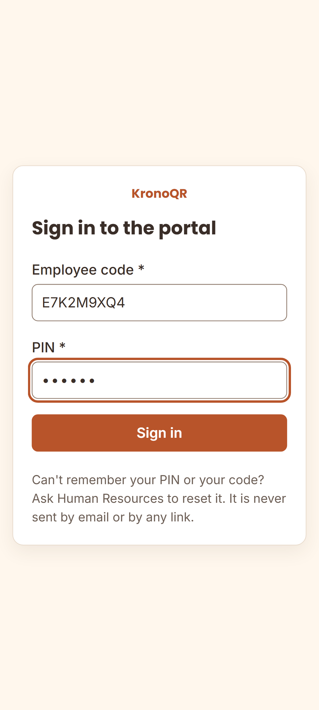
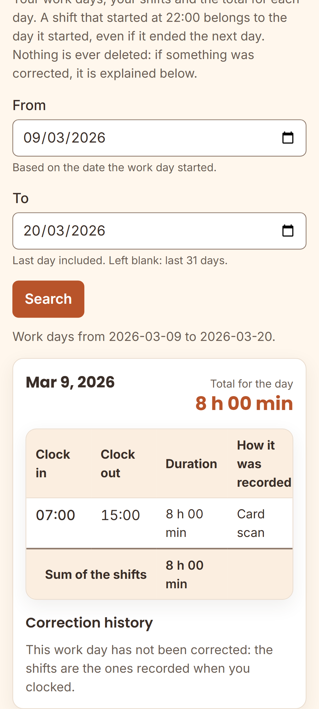
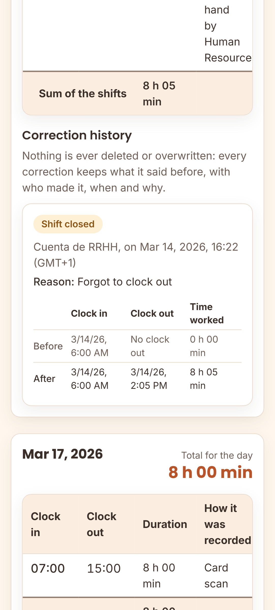
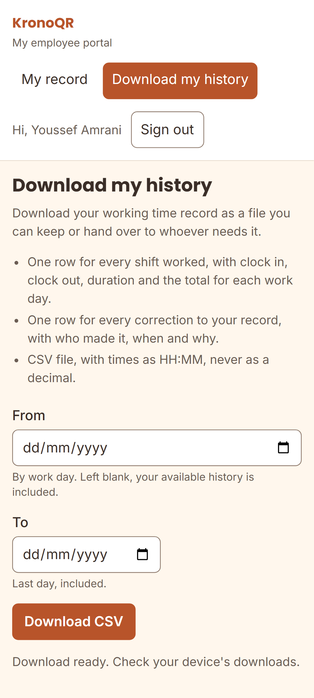

# The employee portal — check and download your working-time record

This guide is **meant to be handed out or published internally**: it explains to
everyone on the staff how to see their working days and how to download their
own working-time record, without having to ask anyone for it.

> **For Human Resources:** the portal is the ordinary way of meeting the
> worker's right to access their own record. Publish it where it will be read
> —noticeboard, intranet— or hand it out printed together with the instruction
> sheet that goes with the card. The management walkthroughs are in
> [`hr-guide.md`](hr-guide.md).

---

## 1. How to sign in

### The address

The portal is at the address of your system, followed by `/portal/`. For
example: `https://fichaje.tuhotel.local/portal/`. **Human Resources give you the
exact address**, and it is the same one printed on the sheet that is handed over
with the card.

It opens with any browser, from a computer or from a phone, and there is nothing
to install. What does matter is which network you connect from, and that is what
the next section explains.

### From where

**From the hotel network.** The portal only answers computers on the internal
network (or on the VPN, if your company has one): from a home connection or from
mobile data, the page does not load.

It is not a fault, it is a security decision: the staff's working-time record is
not published on the internet. Whoever administers the system decides that range
with the `PORTAL_INTERNAL_CIDR` setting, explained in
[`configuration.md`](configuration.md) §6.15. If your hotel needs access from
outside, that is a decision taken there, knowing what it entails.

### Your code and your PIN

You sign in with **your employee code and the six-digit PIN** that were handed to
you in person together with your card. They are the same ones that let you clock
in on the tablet when you do not have your card with you.

**There is no username and no password, and you do not need an email address.**
The product does not depend on anyone's email: that is why signing in is a code
and a PIN, and that is why the PIN is handed over in person.

### If the PIN does not work or access has been blocked

- **If the employee code or the PIN are not correct**, the screen says so and
  nothing more. Check them and try again.
- **After several failed attempts access is blocked for a few minutes**, and it
  stays blocked even if you then type the correct PIN. Wait and try again; every
  failed attempt makes the wait longer.
- **If you have forgotten your PIN, ask Human Resources to reset it.** They will
  give you a new one **in person**, and the previous one stops working there and
  then. Resetting it also clears the block.

**There is no automatic recovery, and that is deliberate.** A PIN recovered
through a message or a link is a PIN that anyone with access to that inbox can
use —and with it, clock in under your name and read your working-time record. The
credential of this system is physical and is handed over in person: replacing it
is too.

> **Being blocked out of the portal does not stop you clocking in.** The portal
> counters and the tablet counters are different on purpose, so that trying out a
> PIN at one door never leaves anyone unable to clock in at the other.

---

## 2. What you see

The portal has **two screens and nothing else**: your record and the download of
your history.

Under "My record" you see your working days for the period you choose —the last
31 days if you choose nothing—, and inside each one:

| What you see | What it means |
| --- | --- |
| **Working day** | A day of work. **A shift that started at 22:00 belongs to the day it started**, even if it ended the next day: it is not split in two |
| **Entry** | Each clock-in–clock-out pair of that day, with its duration |
| **"Total for the day"** | The sum of the entries of that day |
| **"How it was recorded"** | "Card scan", "PIN at the kiosk", or "Entered by hand by Human Resources" |
| **"Shift still open"** | You have not clocked out of that shift yet: the total is going to go up |
| **"Pending review"** | That day was flagged for someone to review. **It is not your mistake** |
| **"Recorded X after clocking"** | The tablet had no network and the clocking reached the server later. **What counts is the time you actually clocked** |

### If your record has been corrected

Below the working day you see the **correction history**: what it said before,
what it says now, who changed it, when and why.

**Nothing is ever deleted or overwritten.** If Human Resources corrected a missed
clocking, you see the correction and you also see what the record said before.
That transparency is the reason the system works this way.

---

## 3. Downloading your record

Under "Download my history" you choose the period and press **"Download CSV"**.

The file contains:

- one row for every **entry** worked, with clock in, clock out, duration and the
  total for each working day;
- one row for every **correction** to your record, with who made it, when and
  why;
- times as HH:MM, **never as a decimal**.

It opens with any spreadsheet.

**What it is for.** Access to your own working-time record is a **right**, not a
favour: the company is obliged to let you consult it and to keep it for four
years. That file is your copy, and you can keep it or hand it over to whoever
needs it —your legal representatives, an adviser, a court— without asking anyone
for permission and without any trace of what you wanted it for.

---

## 4. If something does not add up

**Tell Human Resources.** Give them the exact day and what is missing or left
over: "my clock out for Thursday the 12th is not there", "there are two clock-ins
in a row on Tuesday".

**You do not edit your own record, and that works in your favour.** A
working-time record that the person concerned can change proves nothing to
anybody: not before an inspection, not in a claim for hours. Precisely because you
cannot touch it, what it says carries weight.

What does happen when you report it:

1. Human Resources review the day and correct it **with their name, the date and
   a reason**.
2. **Your previous data is kept**: the correction deletes nothing.
3. You see it in the portal, with the before and the after (§2).

If you think the correction is not right either, say so again: it is corrected
once more and both versions remain. The history never runs out.

### Other situations

| Situation | What to do |
| --- | --- |
| **You have lost your card** | Tell your manager **that same day**. It is revoked and you are given another one. In the meantime, you clock in with your employee code and your PIN on the tablet |
| **The tablet says "Pending validation"** | Your clocking **is recorded**. The tablet had no network and will send it on its own. **Do not repeat it** |
| **The tablet says "Invalid code"** | Clock in with your employee code and your PIN, and tell your manager |
| **You cannot remember your employee code** | It is printed on your card. If you do not have it, ask Human Resources |
| **The page does not load** | Check that you are on the hotel network (§1). If you are, tell Human Resources |
