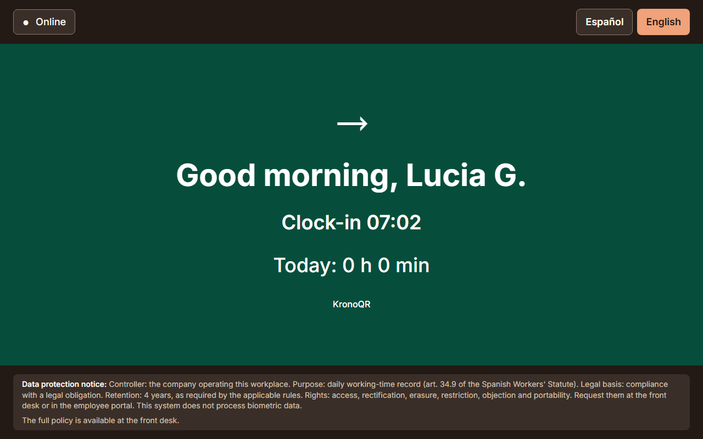
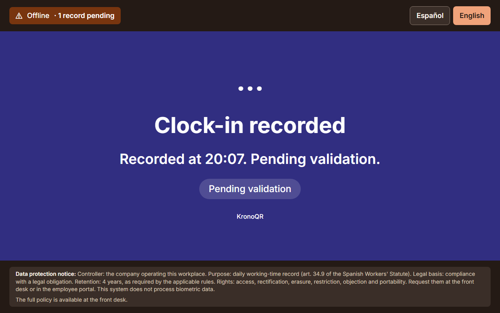
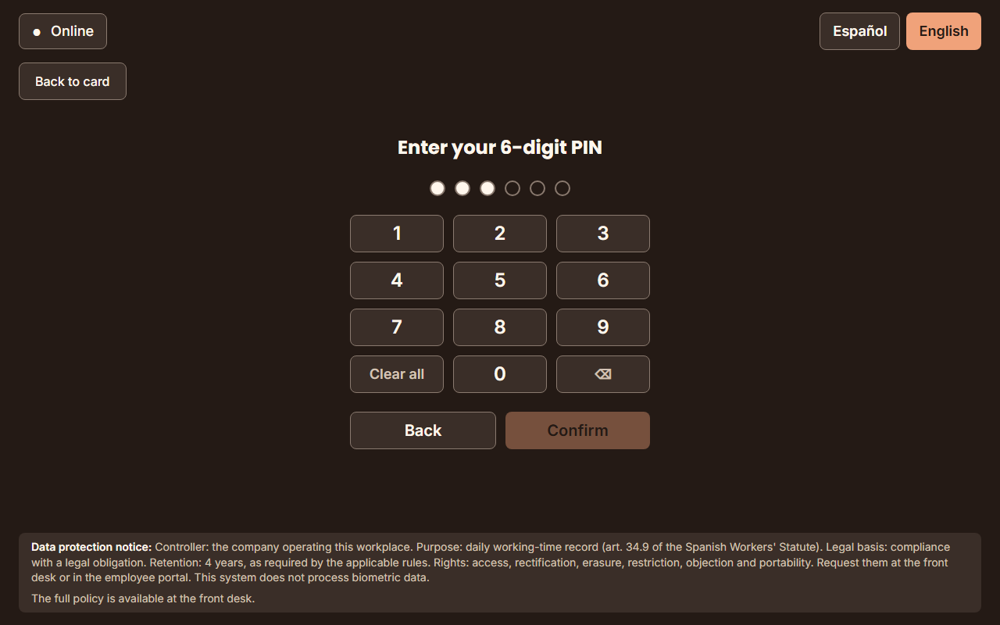

# The instruction sheet handed over with the card

This guide is **for HR**. It explains what the employee sheet is, when it is
handed over, how it is printed and **what it says exactly**, so that you know
what you are handing out without having to open the PDF.

> The sheet is not a document of this package: **the system produces it**, with
> the hotel's brand and the address of your portal, and in any of the active
> languages of the installation. That is why there is no PDF to copy here.

---

## 1. What it is

A **single-sided A4 PDF**, the same one for the whole workforce, meant to be
read standing up and in under a minute. It contains:

- how you clock in with the card;
- what each on-screen confirmation means, **including the "pending validation"
  one** when the tablet has no network;
- what to do without the card: the employee code and the PIN;
- the **portal address of your installation**, to check and download one's own
  record;
- a blank **"Contact person"** line, to write by hand who the manager is or the
  HR phone number before handing it out;
- the hotel's brand: the name and the logo you have configured.

**It carries no personal data at all.** No name, no code, no PIN: it is the same
sheet for everybody, so it can be photocopied, left on a counter and restocked
with no special care. What is personal —the card and the PIN— goes separately.

---

## 2. When it is handed over

**In the same act as the card and the PIN.** A single face-to-face moment, with
the three things on the table: the printed card, the PIN written down and this
sheet. The handover dialogue of the console reminds you of it on screen.

The full onboarding journey —record, PIN, issuing, printing and handover— is in
[`hr-guide.md`](hr-guide.md) §2. Two things worth repeating here:

- **The PIN is shown only once**, at the moment of onboarding. Have somewhere to
  write it down before you start.
- **The handover is recorded** in the console, with the date and you as the
  person responsible. Mark it only once the handover has really happened.

When a lost or broken card is replaced, **a new sheet is handed over too**: it
is what puts the portal address and the contact phone number back within the
person's reach.
See [`../../runbooks/tarjeta-perdida-o-rota.md`](../../runbooks/tarjeta-perdida-o-rota.md)
(in Spanish).

---

## 3. How it is printed

In the console: **Credentials → "Instructions sheet" → "Download in …"**.

There is **one button for each active language** of the installation. Choose the
one of the person you are going to hand it to: the sheet comes out entirely in
that language, with the same portal address and the same brand.

Practical advice:

- **Print a small batch in advance** for each language and keep the sheets next
  to the cards waiting to be handed over. The sheet does not expire and is not
  personal: there is no risk in having them printed.
- **Fill in the "Contact person" line before handing it out**, with the name of
  the manager on duty or the HR extension. A sheet with that line blank ends up
  as a phone call.
- **Reprint them if the portal address or the brand changes.** The sheet carries
  the ones in force at the moment it is generated.

---

## 4. What the person sees on the tablet

The three screens the sheet describes, so that you can explain them without the
tablet in front of you. (These screenshots **are not on the sheet**: on a single
printed side they would not be legible, and they would go out of date with every
version.)

**Clock-in recorded.** "Clock-in" or "Clock-out" with the time —in the
screenshot, "Clock-in 07:02". There is nothing else to do.

**Clock-in pending validation.** The tablet had no network. **The entry is
saved** and is sent on its own when the connection comes back; the legal record
uses the real time of the entry, not the time it reached the server. It is the
message that raises the most questions, and the answer is always the same:
**it does not have to be done again**.

**Without the card: code and PIN.** The person taps "Clock in with your code and
PIN". It is the same PIN as the portal, and the entry counts exactly the same as
one made with the card.

---

## 5. The text of the sheet

What follows is **the literal text** of the sheet in English, in the same order
in which it comes out printed. Where you read `[installation name]` or
`[portal address]` here, the sheet prints the ones of your installation.

> If the text of the product changes and this guide does not, the manufacturer's
> continuous integration detects it and fails: the two versions cannot diverge.

### Title

How to clock in with your card

This sheet comes with your card and your PIN. Keep it: it explains what you need to clock in and to check your working-time record.

### 1. Clocking in and out

Hold the card up to the tablet camera, code facing the screen, and wait for the confirmation. The same gesture works for clocking in and for clocking out.

### 2. What the screen means

"Clock-in" or "Clock-out" with the time: your entry has been recorded. Nothing else to do.

"Pending validation": the tablet has no network right now, but your entry is already saved and will be sent on its own. Do not repeat it.

"You clocked in a few seconds ago": nothing new was recorded. If you meant to clock out, wait a moment and try again.

"Invalid code": the tablet could not read your card. Clock in with your code and PIN and tell your manager.

### 3. If you do not have the card

Tap "Clock in with your code and PIN" on the tablet, type your employee code and your 6-digit PIN. Your entry counts just the same. If you lost the card, tell your manager that same day: it is cancelled and you get a new one.

### 4. Checking your record

You can see your working days and download your record whenever you want, from a device on the hotel network or wherever your company tells you, at this address:

`[portal address]`

Sign in with your employee code and your PIN. The PIN is the same one you use on the tablet.

If you forget the PIN, ask your manager for a new one: it is handed over in person and never by email.

### 5. If something does not add up

If you forgot to clock in or you see a wrong entry in your record, tell your manager. They correct it and the correction is noted with who made it, when and why; your previous entry is kept.

### Contact person

Your manager or HR:

*(blank line, to fill in by hand)*

### Footer

[installation name] · Working-time record. This sheet contains no personal data.

---

## 6. What to do if…

### …the sheet comes out with the wrong name or logo

The sheet carries the brand configured **at the moment it is generated**. If you
have just changed it, download it again. If it still comes out with the
product's brand instead of yours, look at the notice on the **Brand** screen:
your own brand depends on the plan you have contracted, and with the licence
expired or absent the applications and the documents fall back to the product's
brand. Whatever you have saved is kept and is applied as soon as the licence
covers it. The detail is in [`configuration.md`](configuration.md) §2.2.

### …a language is missing

The buttons are the **active languages of the installation**. Adding one is done
in the configuration and is a matter for whoever administers the system:
[`configuration.md`](configuration.md) §2.3.

### …the portal address it prints is not the right one

The sheet prints the address the system is configured with. If it is not the one
the workforce uses —because the name of the server was changed, for instance—,
tell whoever administers it: it is adjusted in the configuration, not on the
sheet.

### …somebody asks for the sheet and no longer has theirs

Give it to them with no further formality: **it is not a personal document and
it contains no secret**. What is not replaced so easily is the card
([`../../runbooks/tarjeta-perdida-o-rota.md`](../../runbooks/tarjeta-perdida-o-rota.md),
in Spanish) and the PIN, which has to be reset and handed over in person.
