# HR guide — the working-time record, day by day

This guide is for whoever **operates the product day to day**: adding a person,
handing them their card, watching the incident inbox, correcting a missed
clocking and answering a requirement from the Labour Inspectorate. **You do not
need to know anything about systems.**

> **What is NOT here, on purpose.** Installing, backups, updates and
> diagnostics belong to the IT staff and live in
> [`operation.md`](operation.md). The parameters and their consequences, in
> [`configuration.md`](configuration.md). What the law requires of the hotel, in
> [`legal-obligations.md`](legal-obligations.md). Each thing is explained in one
> single place; here it is linked.

The eight sections of this guide, in case you are looking for one in
particular:

1. [Vocabulary first](#1-vocabulary-first)
2. [Adding a person, from start to finish](#2-adding-a-person-from-start-to-finish)
3. [Live presence and the time record](#3-live-presence-and-the-time-record)
4. [The incident inbox](#4-the-incident-inbox)
5. [Corrections: changing an hour without breaking the record](#5-corrections-changing-an-hour-without-breaking-the-record)
6. [Reports, exports and the Labour Inspectorate hand-over](#6-reports-exports-and-the-labour-inspectorate-hand-over)
7. [The compliance profile](#7-the-compliance-profile)
8. [What to do if…](#8-what-to-do-if)

---

## 1. Vocabulary first

Nine words. Without them, the rest of the guide has to be read twice.

| Word | What it is | Where you see it |
| --- | --- | --- |
| **Clocking** | The act of holding the card up to the tablet. It is always recorded, whether it is accepted or not | Kiosk |
| **Shift entry** | A clock-in/clock-out pair. It is the smallest unit of the record: what gets corrected, voided or added is an entry | Time record |
| **Working day** | The set of entries for one day. **A night shift that clocks in at 22:00 and clocks out at 06:00 is a single entry and belongs to the day it started on**, it is not split in two | Time record |
| **Day total** | The sum of the entries of a working day. It recalculates itself; you never have to touch it | Time record |
| **Incident** | Something in the record that **a person has to look at**. It is not a system error | Incident inbox |
| **Correction** | The change to an entry made by an authorised person, with a reason and a signature. It never deletes what was there before | Time record |
| **Credential (card)** | The link between a person and their physical card with its QR code. It is issued, printed, handed over and can be revoked | Credentials |
| **Kiosk** | The tablet fixed to the wall where people clock | — |
| **Employee portal** | The website where each person consults and downloads **their own** record. It is a legal obligation, not a courtesy | [`employee-portal-guide.md`](employee-portal-guide.md) |

**Two ideas that explain almost everything the product does:**

- **Nothing is deleted and nothing is overwritten.** Correcting creates a new
  version and keeps the previous one, with who, when and why. That is what
  makes the record hold up in an inspection.
- **The system never decides on behalf of a person.** It does not close shifts,
  it does not invent clock-out times and it does not resolve incidents by
  itself. When something does not add up, it puts it on the table and waits.

---

## 2. Adding a person, from start to finish

The whole journey, in the order in which it is done. At the end of it, the
person can clock and consult their record.

> **Start with a few days to spare.** Between issuing the card and having it
> printed and in hand, real time goes by: it has to be printed and laminated.
> Somebody who starts working without a card clocks all the same —with their
> code and their PIN— but those are entries that somebody will have to review
> afterwards.

### 2.1 The record

**Workforce → "Add employee".**

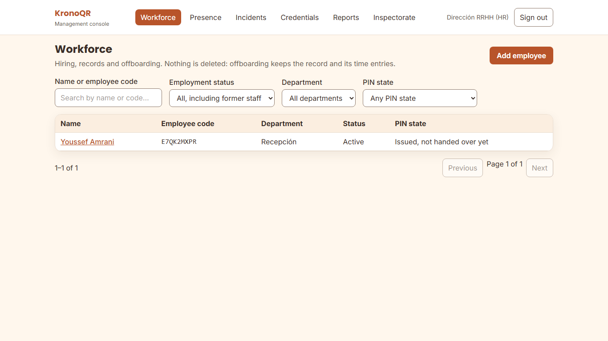

You fill in first name, last name and hire date. Everything else is optional
and it is worth knowing why:

| Field | Required | What is worth knowing |
| --- | --- | --- |
| First name and last name | Yes | — |
| Hire date | Yes | Legal retention of their record counts from it. Changing it later is done deliberately, not in passing |
| Department | No | It is used to filter the inbox and the reports, and for the scope of department managers |
| Email address | **No** | **No feature of the product needs it.** The card, the PIN and portal access are never sent by email |
| National identity document | No | **It is not stored as such**: the server keeps only a digest calculated from it, which serves to avoid adding the same person twice and not to read it back |
| Language | No | The language in which they will see the portal and in which their instructions sheet is printed |

**The employee code is generated by the system**, and it is opaque on purpose:
it is printed on the card, so it cannot be the payroll number or anything else
with a meaning. It cannot be chosen.

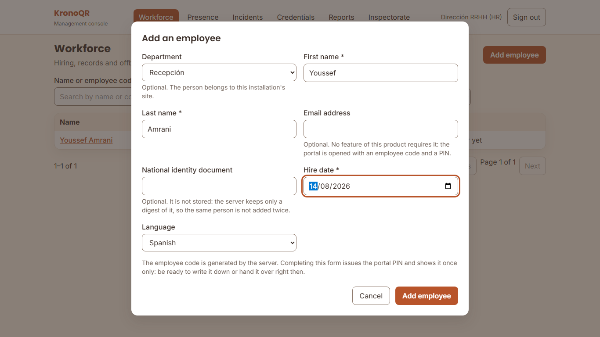

### 2.2 The PIN: shown once only

When the person is added, the system issues the **six-digit PIN** for the
portal and **shows it once only, at that moment**. It cannot be looked up
afterwards: if it is lost, the only way out is to reset it, which generates a
different one and voids the previous one on the spot.

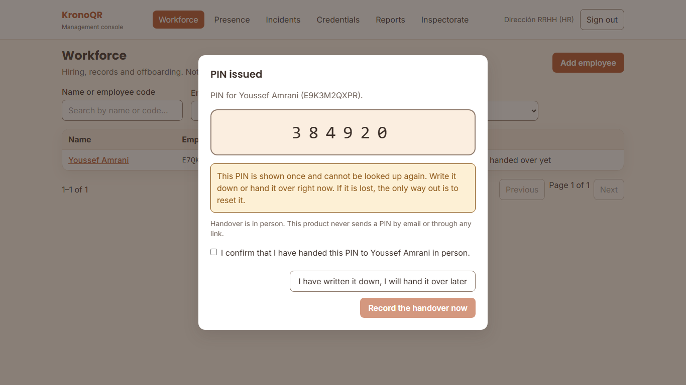

Have somewhere to write it down **before** pressing "Add employee". The PIN
serves two purposes: signing in to the portal, and clocking at the tablet when
the card is not to hand.

**The PIN is handed over in person, face to face.** There is no electronic
delivery at all: no message, no recovery link. It is not an oversight: a key
that travels through a mailbox ends up clocking for its owner without anyone
noticing.

### 2.3 Contracted hours

The hours-per-period report compares what was worked against **what was agreed
for that day**, and for that it needs the person's contract. Today the **panel
has no contracts screen**: whoever administers the system can record them, but
it is not done from the panel. As long as there is no contract on record, the
period report says so clearly —"there are X person-days with no contract on
record"— and those rows come out with the deviation incomplete. The hours
worked and the legal record **are not affected**.

### 2.4 Issuing, printing and handing over the card

**Credentials.** This is the board where you see who can clock and who cannot
yet.

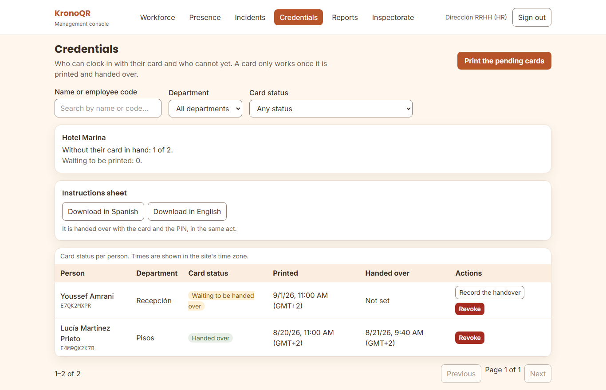

There are three acts, in this order, and each one changes the status:

| Act | Button | Status when finished | Can they clock? |
| --- | --- | --- | --- |
| **Issue** | "Issue credential" | Waiting to be printed | **No** |
| **Print** | "Print the card" | Waiting to be handed over | **Yes, as soon as they receive it** |
| **Hand over** | "Record the handover" | Handed over | Yes |

> **Printing is what activates the card, and there is no reprint.** The QR code
> does not exist until "Generate the PDF" is pressed: it is minted at that
> moment, inside the PDF, and **it is not stored anywhere it could be taken
> from again**. That is why the button warns you first: *"Printing mints the QR
> and there is no way back: reprinting does not exist."* If the PDF is lost
> —the window is closed, the printer fails, it is downloaded to a computer that
> is not yours—, the only way out is to **revoke that credential and issue
> another one**:
> [`../../runbooks/tarjeta-perdida-o-rota.md`](../../runbooks/tarjeta-perdida-o-rota.md)
> (in Spanish). **Print only with the printer ready.**

**The card PDF is a bearer document**: whoever has it can manufacture somebody
else's card. It is not stored on the server, it is never sent by email, and it
is worth deleting it from the computer as soon as it has been printed.

For a seasonal intake, the **"Print the pending cards"** button produces every
card waiting to be printed on a single A4 sheet. The same warning applies,
multiplied by the number of cards.

### 2.5 The instructions sheet

On the same credentials board there is **"Instructions sheet"**, with a
**"Download in …" button for each language active** in the installation. It is
a one-side PDF, the same for the whole workforce, with the hotel's branding and
the address of **this** portal. It is printed and handed over with the card.

What it says exactly, and why it is worth reading once before handing it out:
[`employee-sheet.md`](employee-sheet.md).

### 2.6 The handover: a single act

**The card, the PIN and the sheet are handed over together, in person, at the
same moment.** The handover dialog says so on screen. Afterwards the two
handovers are recorded —"Record the handover" for the card and "Record the PIN
handover"—, and they are logged with the date and with you as the person
responsible.

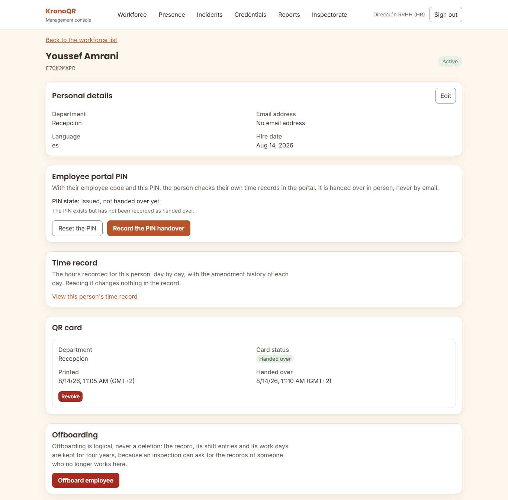

**This is not bureaucracy.** That log entry is what tells "the card was lost
before we gave it to them" apart from "the employee lost it", and it is what
answers, months later, why a person could not clock on a Tuesday. It cannot be
repeated or undone: mark it only once the handover has actually happened.

### 2.7 What that person will see when clocking

It is worth having seen it once so that you can explain it without the tablet
in front of you.

A correct clocking: the screen says "Clock-in" or "Clock-out" with the time.

The tablet had no network: it says "Pending validation". **The clocking is
saved and it will be sent by itself.** It does not have to be repeated, and the
legal record uses the real time of the clocking, not the time it reached the
server.

Without the card to hand: "Clock in with your code and PIN" on the tablet
itself.

---

## 3. Live presence and the time record

### 3.1 Presence: who is in right now

**Presence** shows who has an open shift at this moment, since what time and
through which kiosk they clocked. It updates by itself.

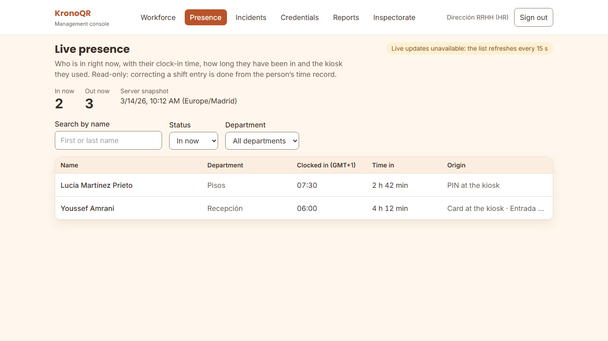

**What "In now" means:** that this person clocked in and has not clocked out
yet.

**What it does NOT mean:**

- It does not mean they are physically in the hotel. It means their last
  clocking was a clock-in. Someone who left without clocking out keeps showing
  as in until somebody corrects it.
- It does not mean the hours already count. An open shift keeps growing: its
  total **cannot be used for payroll** until it is closed.
- **It is not the screen for fixing anything.** Presence is read-only.
  Correcting an entry is done from the person's time record.

### 3.2 A person's time record

From their record, **"View this person's time record"**. This is the screen
where the truth of each day is seen —and corrected.

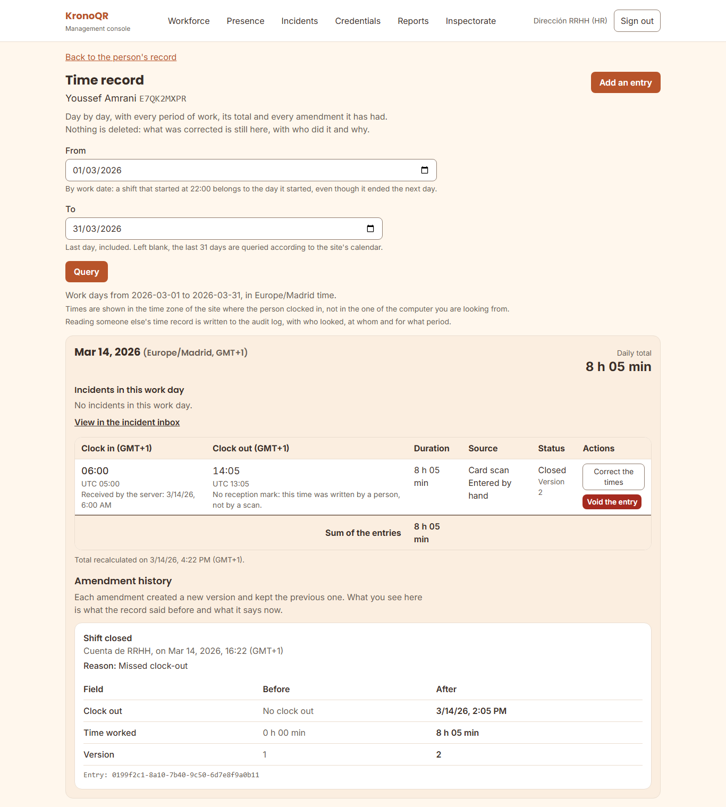

What to look at:

- **The times are in the site's time zone**, not in the one of the computer you
  are looking from.
- Each entry carries its **source**: "Card scan", "PIN at the kiosk" or
  "Entered by hand". An entry written by hand is worth exactly as much as a
  scanned one; the difference is that it has a correction behind it explaining
  it.
- **"Open shift"**: the clock-out is missing. The day total is going to go up.
- **"Incident"**: some entry was flagged for review. It is not a system error:
  it means someone has to look at it.
- **Consulting somebody else's record is logged** in the audit log, with who
  looked, at whom and at which period. That is normal and it is intentional.

---

## 4. The incident inbox

**Incidents** is the list of what the system has found and cannot resolve on
its own. It fills itself every night, when the record is reviewed.

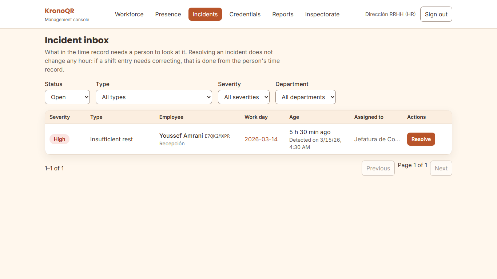

### 4.1 What generates each type, and which one is urgent

| Type | Severity | What generates it | What it usually means |
| --- | --- | --- | --- |
| **Insufficient rest** | **High** | Between the end of one shift and the start of the next there are fewer hours than the profile's minimum (12 h out of the box) | A closing and an opening back to back, or a missed clocking that joins two working days. **It carries a penalty risk: look at it the same day** |
| **Open shift not closed** | Medium | A shift has been open for longer than the maximum (12 h out of the box) | Almost always, a forgotten clock-out |
| **Shift too long** | Medium | The day's sum, or a single entry, exceeds the profile's maximum working day | Real extra hours, or two entries that were really one |
| **Shift too short** | Low | An entry below the minimum countable duration | A double scan, or a clock-in and a clock-out one after the other by mistake |
| **Clock skew** | Low | The tablet's clock was off when the clocking happened | **The clocking was recorded all the same.** It is a warning for IT about that tablet, not a problem for the person |
| **Missing clock-out** | Medium | It describes a forgotten clock-out **already closed by hand** | **Nobody opens it automatically.** While the shift is still open, what you have is "Open shift not closed" |
| **No break registered** | Medium | A continuous entry above the collective agreement's threshold | **None is opened today**: until the kiosk records the break as such, the system cannot tell "they did not rest" from "they rested and did not clock it" |
| **Anomalous credential usage pattern** | High | — | **None is opened today.** The detector arrives in a later version |

> **The "Type" filter shows all eight, and today only five open by
> themselves**: insufficient rest, open shift, shift too long, shift too short
> and clock skew. The other three are in the list because the system has to be
> able to record them without changing anything when their time comes. It is
> not a fault in the installation.

### 4.2 The system never closes a shift on its own

It is the question that always comes up: *"if it has been open for 14 hours,
why does the system not close it?"*.

**Because closing it would mean inventing a clock-out time.** If the system
closed the shift at 12 h, the record would say that this person worked 12 hours
when they probably worked 8 and forgot to clock. A working-time record that
invents hours is not defensible before the Labour Inspectorate, and on top of
that it overpays or underpays the payroll.

What the system does is open the incident and wait for **a person to sign** the
correct time. It is a guarantee, not a shortcoming: every hour in the record
was either clocked by somebody or written by somebody with their name next to
it.

In the meantime, **nobody is left unable to clock**: whoever has the open shift
carries on using their card as normal, and their next scan will close that
shift.

### 4.3 How one is resolved

An incident is closed in two steps, and the order matters:

1. **First the record is fixed**, if there is something to fix: the entry is
   corrected from the person's time record (§5).
2. **Then the incident is closed**: "Resolve" button, and you choose what
   happened.

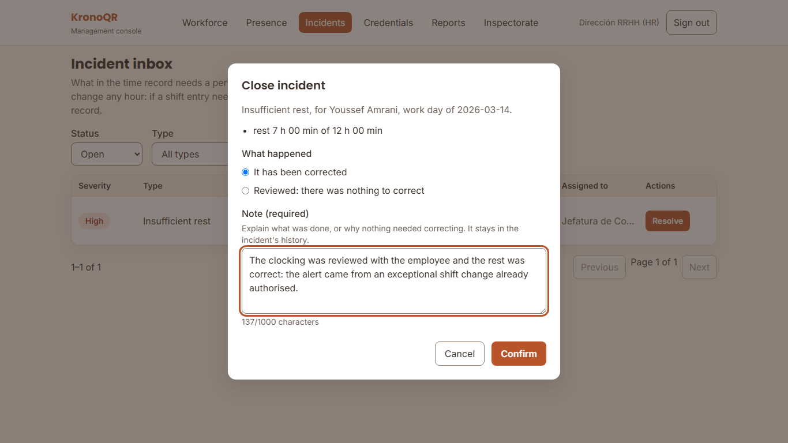

There are two outcomes and they are different:

- **"It has been corrected"** — something was wrong and it has been put right.
- **"Reviewed: there was nothing to correct"** — the data was odd but true. An
  11-hour shift can be true.

**The note is required** and it stays in the incident's history. Write what was
done, or why nothing needed doing: six months from now, "reviewed" explains
nothing and "swapped shifts with the afternoon colleague, confirmed with the
head waiter" does.

> **Resolving an incident does not change any hour.** They are two separate
> actions on purpose: closing the inbox without correcting the record leaves
> the inbox clean and the record wrong.

If two people resolve it at the same time, the system tells you who closed it
first and with which outcome, instead of overwriting anybody's work.

---

## 5. Corrections: changing an hour without breaking the record

### 5.1 When to correct

You correct when the record **does not say what happened**: a missed clocking,
a double scan, a day worked before having the card. You do not correct to "make
a total add up" or to adjust a payslip: that has another name and another
consequence.

From the person's time record there are three actions:

| Action | When |
| --- | --- |
| **"Add an entry"** | The person worked and there is no clocking at all: they did not clock in, they had no card, or the working day is earlier than the go-live |
| **"Correct the times"** | The entry exists but the clock-in or the clock-out are not the real ones |
| **"Void the entry"** | The entry should not exist: a double scan, somebody else's clocking |

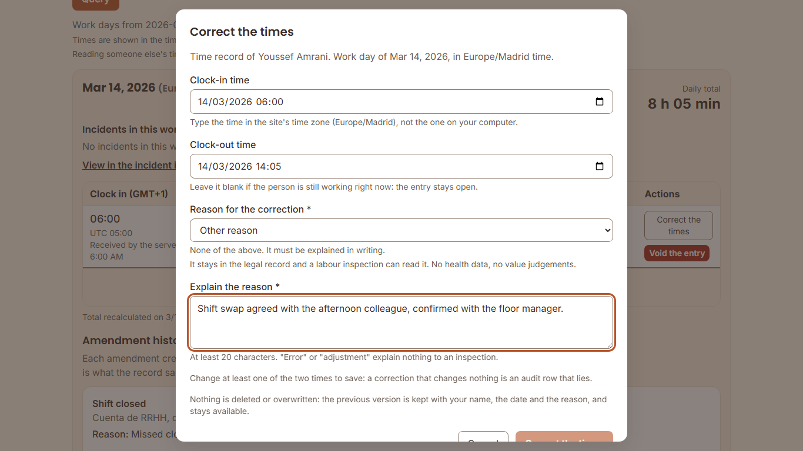

### 5.2 The nine reasons, with an example of each

The reason is required, **it stays in the legal record and a labour inspection
can read it**. No health data and no value judgements about the person.

| Reason (exactly as it appears in the panel) | A real example |
| --- | --- |
| **Missed clock-in** | They started at 07:00 in the kitchen, did not use the card, and their first clocking is the 15:00 clock-out |
| **Missed clock-out** | They finished at 22:00 and left without clocking; the shift shows as open the next morning |
| **Kiosk technical failure** | The tablet at the staff entrance had no power all morning and that shift is entered by hand |
| **Card not available** | They left the card in the locker and could not clock in |
| **Card not handed over yet** | First day at work: the card was printed but it was handed over at the end of the shift |
| **Duplicate scan** | They used the card twice in a row and two entries came out where there was only one; the surplus one is voided |
| **Adjustment agreed with HR** | Correction agreed with the person after reviewing the roster: it is not a system error |
| **Retroactive entry** | Working days from the week before the system went live, loaded by hand |
| **Other reason** | None of the above. **It requires at least 20 characters**: "error" and "adjustment" explain nothing to an inspection |

### 5.3 What happens underneath, and what you need to be able to explain

**The previous value is always kept.** The correction does not rewrite the
entry: it creates a new version and leaves the previous one visible, with who
made it, when and why. In the working day's "Amendment history" you see the
**before** and the **after**, side by side.

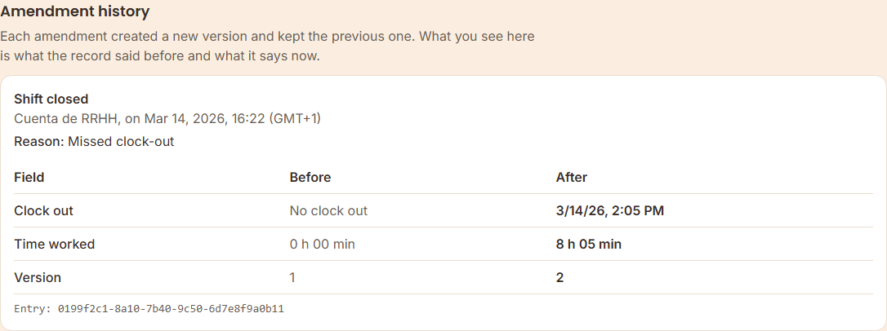

Before an inspection, the sentence is this one: *"the record keeps every
version; this hour was corrected on such a date, by this person, for this
reason, and here is what it said before"*. A record without that history is a
record that could have been changed the day before the visit, and that is how
whoever reviews it will read it.

Two warnings you will see and what they mean:

- **"This entry is no longer the current version"** — somebody else corrected
  or voided it while you had the screen open. Reload the working day and check
  how it stands now.
- **"That clock-in time would move the working day to another date"** — moving
  hours from one day to another is **two actions**: void the entry on the day
  where it is and create it on the day it belongs to, each one with its own
  reason. The system does not do it in a single step because moving a working
  day to another date changes what gets paid in which month.

**The employee does not correct their own record**, and that is why the portal
is read-only. A record that the interested party can edit proves nothing. What
they can do is raise it, and HR corrects it with their signature.

---

## 6. Reports, exports and the Labour Inspectorate hand-over

They are two different things and they are easily confused:

| | **Hours-per-period report** | **Labour Inspectorate export** |
| --- | --- | --- |
| What for | Management: how much has been worked, by whom, with what deviation | Meeting a requirement under art. 34.9 of the Spanish Workers' Statute |
| Where | Reports | Inspectorate |
| What it carries | Totals aggregated by person, department or site | **Every entry, one by one, and every correction with its author and its reason** |
| Format | CSV, Excel or PDF | Normalised CSV, with its criteria and its legal basis declared inside |

### 6.1 The hours-per-period report

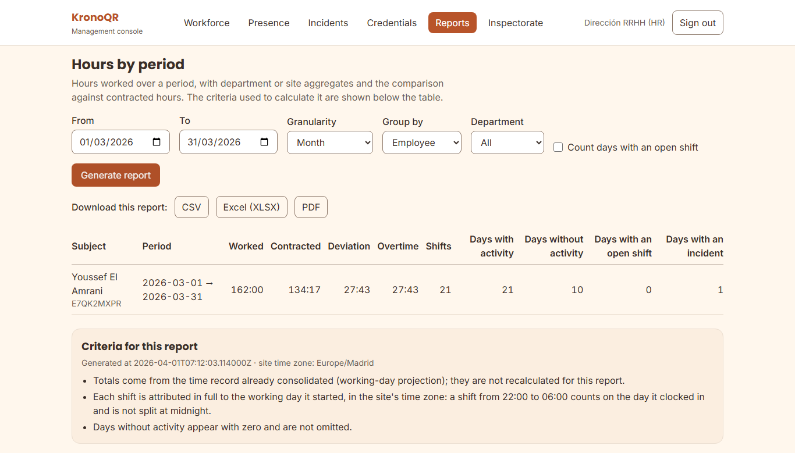

You choose the period, the granularity (day, week, month or the whole period)
and the grouping (employee, department or site). Below the table, the report
itself declares **which criteria it was calculated with**: that is what lets
you defend a number six months later.

Two warnings worth reading:

- **"Count days with an open shift"**: if you turn it on, days whose total is
  still going to change are included. For payroll, close them first.
- **"Person-days with no contract on record"**: those rows have the hours
  worked right and the deviation incomplete (§2.3).

### 6.2 The export for the Labour Inspectorate

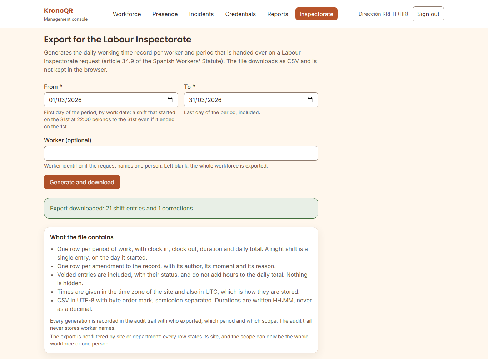

You choose the dates and, if the requirement names a person, that person. Left
blank, the whole workforce comes out. What the file contains:

- One row per **entry**, with clock-in, clock-out, duration and the working
  day's total. A night shift is a single entry, on the working day it started
  on.
- One row per **correction**, with its author, its moment and its reason.
- **Voided entries are included**, marked as such, and they add no hours.
  Nothing is hidden: hiding them would be exactly what the Labour Inspectorate
  is looking for.
- The times go in the site's time zone **and also** in UTC, which is how they
  are stored.
- Durations are written HH:MM, never in decimal.

**Every generation is logged** with who exported, which period and which scope.

> **The full procedure, with the deadlines and what to do with the file after
> handing it over, is in
> [`../../runbooks/requerimiento-inspeccion.md`](../../runbooks/requerimiento-inspeccion.md)
> (in Spanish).** Read it **before** the requirement arrives, not when it
> arrives: it is five minutes that save the hour.

---

## 7. The compliance profile

**Compliance** holds the legal thresholds the record is reviewed against:
minimum rest between working days, ordinary daily and weekly working hours,
maximum continuous stretch without a break, first day of the week, public
holidays and years records are kept.

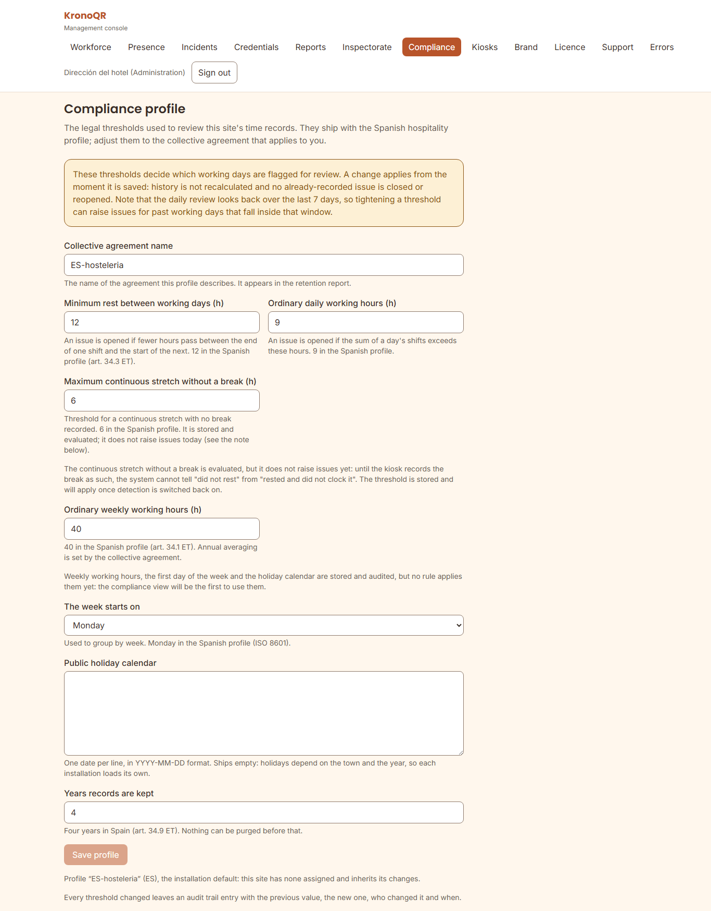

**Changing a threshold changes what counts as an incident.** Lowering the
minimum rest from 12 h to 10 h does not change a single hour of the record: it
changes **which working days get flagged for review**. It is a change with
legal effect, and that is why:

- It applies **from the moment it is saved**. History is not recalculated and
  no incident already recorded is closed or reopened.
- The nightly review looks again at the last few days, so **tightening** a
  threshold may open incidents for recent working days that have already
  passed.
- It is logged in the audit log with the previous value, the new one, who
  changed it and when. Without that, there is no way to explain why a working
  day three months ago raised no alert.

The product ships with the Spanish hospitality profile. **Adjusting it to the
collective agreement that applies to you is the hotel's responsibility**, not
the vendor's: it is explained in
[`legal-obligations.md`](legal-obligations.md) §7. The detail of each
threshold, value by value, is in [`configuration.md`](configuration.md) §2.4.

> **The years records are kept is the only threshold that can destroy data.**
> Lowering it widens what the purge considers expired, over data there is a
> legal obligation to keep for four years. No purge ever runs on its own —it is
> proposed first and it has to be confirmed—, but do not touch that number
> without reading [`legal-obligations.md`](legal-obligations.md) §4.

---

## 8. What to do if…

### …a person says their record is wrong

1. Open **their time record** and look at the specific day. Check the **source**
   of the entries first: an entry marked "Entered by hand" already has a
   correction behind it explaining where it came from.
2. If something is missing or left over, correct it with the reason that fits
   (§5) and explain to them that their previous version is kept.
3. Tell them they can check it themselves in the portal: they will see the
   change and the correction's history, with the reason.

**Never correct "just in case".** If it is not clear what happened, ask the
shift manager before signing an hour.

### …somebody forgot to clock out

It will show up as an **"Open shift not closed"** incident. The system does not
close it by itself (§4.2).

1. Find out the real clock-out time: ask the shift manager; do not deduce it
   from the roster.
2. In that person's time record, **"Correct the times"** and write the
   clock-out, with the reason **"Missed clock-out"**.
3. Close the incident as **"It has been corrected"**, with a note on who
   confirmed the time.

If the forgotten clocking is weeks old, the procedure is the same: open shifts
are always reviewed, with no age limit, and they do not disappear by
themselves.

### …a card is lost or broken

It is the same procedure in both cases, and also when the print PDF is lost
before it is printed:
**[`../../runbooks/tarjeta-perdida-o-rota.md`](../../runbooks/tarjeta-perdida-o-rota.md)**
(in Spanish).

In short: **revoke with a reason → issue another → print → hand over with its
sheet**. And tell the person that **in the meantime they can clock with their
code and their PIN** on the tablet itself: nobody is left unable to clock
because they lost a card.

### …a person asks for their time record

The ordinary route is **the portal**: they sign in with their code and their
PIN and download their history whenever they want, without asking anybody. It
is what the law requires and what stops every request from becoming an errand.
Give them [`employee-portal-guide.md`](employee-portal-guide.md).

If the request arrives **in writing as the exercise of a right** —access,
rectification, portability, erasure—, it has deadlines and a form:
[`../../runbooks/solicitud-derechos-rgpd.md`](../../runbooks/solicitud-derechos-rgpd.md)
(in Spanish). Watch out for one in particular: **erasure does not apply** while
the four-year duty to keep the record lasts, and the runbook explains how that
is answered without denying the right.

### …a requirement from the Labour Inspectorate arrives

Do not improvise: there is a written and tested procedure, designed to be
completed in less than an hour:
**[`../../runbooks/requerimiento-inspeccion.md`](../../runbooks/requerimiento-inspeccion.md)**
(in Spanish).

The essentials: the export is generated from **Inspectorate** (§6.2), it
includes entries, corrections and voided entries, and it declares its own
criteria. Before handing the file over, the runbook says what to check and what
to do with it afterwards.

### …a person leaves

From their record, the **"Offboarding"** section (it is not done by changing
the employment status field: it has its own section because it carries a
termination date and consequences). You choose the termination date and the
reason, which goes into the audit log —no health data and no value judgements.

What happens when you confirm it:

- **Their card is revoked** and stops working at the kiosk.
- **From the termination date on, they cannot clock.**
- **Nothing is deleted.** Their record, their entries and their working days
  are kept for four years, because an inspection can ask for the records of
  someone who no longer works here, and they will keep appearing in the reports
  for the period they worked.

Collect the physical card if you can; if it does not turn up, revoke it anyway
—it already is, because of the offboarding— and note it down.

### …somebody cannot clock

Before moving anything, look at their row in **Credentials**:

| Card status | What it means | What to do |
| --- | --- | --- |
| No credential | None has been issued to them | Issue, print and hand over (§2.4) |
| Waiting to be printed | The entitlement exists, the card does not | Print it |
| Waiting to be handed over | It is printed and they do not have it in hand | Give it to them and record the handover |
| Handed over | They should be able to clock | See below |
| Revoked | It was revoked, through loss or offboarding | Issue another (§2.4) or check whether the offboarding is correct |

If it shows as **Handed over** and they still cannot clock, **they can clock
with their code and their PIN at the tablet** while what is going on is worked
out: that does not wait. If it happens to several people at once, or the board
warns that there are cards signed with a key the server no longer recognises,
**it is a matter for IT**: [`operation.md`](operation.md).

### …the inbox fills up with identical incidents

It is usually one of two things, and neither is fixed by resolving them one by
one:

- **A threshold that does not fit your collective agreement.** If the whole
  workforce generates "Shift too long", the threshold is badly adjusted, not
  the workforce (§7).
- **A tablet with the wrong time** generates "Clock skew" one after another.
  The clockings are recorded; what has to be fixed is the tablet, and that
  belongs to IT ([`operation.md`](operation.md)).

### …there is a licence notice in the panel

**Everything keeps clocking and you keep having access to the whole record.** An
expired licence never stops clocking, nor consulting, nor correcting, nor the
export for the Labour Inspectorate: what gets degraded are accessory features
—for example, your own branding goes back to the product's. Leaving you without
a working-time record over a commercial matter would leave you in breach of the
law, and this product does not do that. Tell whoever handles the relationship
with the provider; the detail is in
[`configuration.md`](configuration.md) §3 bis.3.
