# Installing KronoQR

A guide for the hotel's IT staff. **You do not need to know Laravel, PHP or
Vue.** You need a Linux server with Docker and thirty minutes.

> **Status.** The procedure in this guide is the real one and is tested on every
> release (the clean-install stage of the vendor's continuous integration).
> The screenshots are from version 2.1 and are regenerated on every minor
> version. Once the system is installed, carry on with
> [`hardening.md`](hardening.md): the server, the network and the tablets.
> Esta guía también está disponible en español: [`../instalacion.md`](../instalacion.md).

---

## 0. Before you start: the five minutes that save the afternoon

### The server

| Resource | Minimum (≤ 100 employees) | Recommended (≤ 500) |
| --- | --- | --- |
| CPU | 2 cores | 4 cores |
| RAM | 4 GB | 8 GB |
| Disk | 40 GB SSD | 100 GB SSD |
| System | **Linux** with **Docker 24 or newer** and **Compose v2** | Same |
| Network | Reachable from the internal network. Internet access **optional** | Same |

**Linux with Docker, no ambiguity.** There is no Windows installer and none is
planned. If your infrastructure is Windows only, the installation goes on a
**Linux virtual machine** (Hyper-V, VMware, Proxmox: any of them). We are
telling you now and not halfway through the process.

**Without internet access the whole system works.** Licence verification is
local by design: the product never calls any vendor server, ever. Without
internet you only lose the automatic Let's Encrypt certificates (you use your
own) and email if your SMTP is external. To install without internet, see §7.

> **About memory.** The installer requires **3700 MiB** and not 4096, and it is
> not a discount: a 4 GB virtual machine reports between 3800 and 3950 MiB
> because the kernel itself reserves a share. Requiring 4096 would fail every
> machine that meets the published minimum.

### The clocking point

A clocking point is **a tablet fixed to a wall or a counter**: Android 10 or
newer, a rear camera with autofocus, permanent mains power, stable Wi-Fi inside
the kiosk VLAN (§6) and kiosk mode. The full table of what to buy — worth
reading before buying twenty — is in the runbook
[`../../runbooks/alta-nuevo-quiosco.md`](../../runbooks/alta-nuevo-quiosco.md)
(in Spanish) §1, which is where it is bought and mounted; it is not repeated
here so that there are never two versions.

**Kiosk mode is something you configure and not a feature of the product.** No
web application can stop someone from swiping out to the home screen: pinning
the tablet to a single application is device configuration — Android
Enterprise *device owner*, your MDM or the manufacturer's app-pinning mode.
Without it, an accidental brush leaves the tablet outside the application and
the next employee cannot find where to clock in.

The full procedure — kiosk mode, automatic start after a power cut,
brightness, the Android update window and the network — is in the runbook
[`../../runbooks/alta-nuevo-quiosco.md`](../../runbooks/alta-nuevo-quiosco.md)
(in Spanish) §2, which also covers pairing the first tablet.

### What you need to have decided

1. **The URL** through which the kiosks and the panel will reach the server
   (`https://fichaje.tuhotel.local`, for example).
2. **The TLS certificate** for that name, with its private key.
3. **The tablets' network range** (`KIOSK_VLAN_CIDR`) and the range of the
   network from which the employee portal can be opened
   (`PORTAL_INTERNAL_CIDR`). Both are explained in §6.
4. **Where backups are stored** (`BACKUP_PATH`), and if that destination is a
   network share, **mounted before installing**.
5. **The licence key**, if you already have it. If not, install anyway: it is
   activated afterwards and the system **clocks in and out normally without
   it**.

### What the installer does for you, and what it does not

| Does | Does not |
| --- | --- |
| Checks the requirements before touching anything | **Does not create users**: you create the first account in the wizard |
| Generates every secret **on your server** | **Does not seed demonstration data**: not one employee, not one clock-in |
| Brings the services up and applies the schema | **Does not ask for a licence** to complete |
| Verifies that the system responds | **Does not touch a previous installation**: if it finds one, it steps aside |
| Undoes what it has done if something fails | Does not configure your tablets (that is the `alta-nuevo-quiosco.md` runbook) |

---

## 1. The procedure, from start to finish

### 1.1 Unpack the package

```bash
tar xzf kronoqr-2.1.0.tar.gz
cd kronoqr-2.1.0
ls
```

You should see exactly this:

```
docker-compose.yml       Service definitions. Do not touch.
.env.example             Configuration template. You copy it in step 1.2.
install.sh               The installer.
update.sh                The updater: to a later version, with rollback.
doctor.sh                Diagnosis in one command, without entering the container.
backup.sh restore.sh     Backups and restore.
restore-drill.sh         Quarterly restore drill.
lib/                     Script libraries. Do not touch.
observability/           Alerting configuration. Do not touch.
certs/                   Where you put your certificate (step 1.2).
VERSION                  The version about to be installed.
versions.txt             Published versions and which ones can update from. Do not touch.
LICENCIA.txt
docs/                    This guide and the other three.
docs/runbooks/           Procedures: restore, rotate secrets, new kiosk,
                         Labour Inspectorate request, GDPR…
```

> **`./doctor.sh`, for when something is not right.** It locates the
> installation on its own (like `update.sh`; `--current PATH` pins it by hand
> if needed) and:
>
> - **If the application is running**, it delegates to the product's real
>   diagnosis (`php artisan product:doctor`) and shows its full report:
>   database, queues, email, certificate, permissions, disk and licence, each
>   check with what to do if it is red.
> - **If the application is stopped** — the case this script exists for:
>   without it, `docker compose exec` is of no use — it checks from the outside
>   what it can: that Docker responds, the state of each service, that the
>   `.env` is there with `0600` permissions, free space, the certificate and
>   its expiry, and whether something listens on the configured ports. And it
>   tells you how to start it.
>
> It never prints a secret: from the `.env` it only reads paths, ports and
> file names. Its exit codes are in section 2, below.

### 1.2 Put the certificate in place and fill in the configuration

```bash
cp /ruta/de/tu/certificado.crt certs/tls.crt
cp /ruta/de/tu/clave.key       certs/tls.key

# ESSENTIAL: the web server runs UNPRIVILEGED, as uid 101,
# and cannot open a root-owned file.
sudo chown 101:101 certs/tls.crt certs/tls.key
sudo chmod 0444 certs/tls.crt
sudo chmod 0400 certs/tls.key

cp .env.example .env
```

> **Why those three commands, and what happens if you skip them.** `cp` keeps
> the original's permissions, and private keys are written `0600` for the user
> who created them — usually `root`. KronoQR's HTTP edge runs inside its
> container **unprivileged**, as uid `101`, so it cannot open that key: nginx
> goes into a **restart loop** with
> `cannot load certificate key ... Permission denied` and nothing is served.
>
> **The installer checks this in phase 1 and does not install if it cannot
> read them**, so you will not discover it with the system half done.
>
> **If `TLS_CERT_DIR` points to a directory shared with another service** —
> Let's Encrypt's, for example — **do not change its owner**: you would break
> that other service. Copy the certificate to a directory of its own, point
> `TLS_CERT_DIR` there and apply those commands there.
>
> If `tls.key` is left readable by the whole server (`0444`, `0644`), the
> system **works** and the installer only warns: it is your private key and
> the decision is yours, but anyone with a session on that machine can copy it.

Open `.env` with your editor. **Every variable carries a tag. You only have to
touch the ones tagged `[CLIENTE]`:**

| Tag | What it means |
| --- | --- |
| `[CLIENTE]` | You fill it in. The installer checks they are all there and does not install if one is missing. |
| `[INSTALADOR]` | **Leave it empty.** The installer generates it on your server. If you write something, it is replaced. |
| `[FIJO]` | Do not touch. Changing it breaks something that does not look like this file. |
| No tag | Has a sensible default. If in doubt, leave it as it is. |

The minimum you have to fill in:

```dotenv
APP_ENV=production
APP_URL=https://fichaje.tuhotel.local
KIOSK_VLAN_CIDR=10.0.20.0/24
PORTAL_INTERNAL_CIDR=10.0.10.0/24
METRICS_ALLOW_CIDR=172.29.0.20/32
TLS_ALLOW_SELF_SIGNED=false
BACKUP_PATH=/var/backups/fichaje
IMAGE_REGISTRY=ghcr.io/kronoqr
```

**The four network values and `APP_URL` cannot be left as they come.** The
installer **compares against the template** and refuses to install if
`APP_URL`, `KIOSK_VLAN_CIDR`, `PORTAL_INTERNAL_CIDR` or `METRICS_ALLOW_CIDR`
still hold the example value. The reason is concrete: with
`APP_URL=https://localhost` the system starts, every check passes — the final
verification probes `127.0.0.1` — and **no kiosk can reach it**. Nothing
afterwards detects that.

**`TLS_ALLOW_SELF_SIGNED=false` in production, and the installer requires
it.** With `true`, the web server generates itself a self-signed certificate:
the tablets would warn about an unsafe site every morning and someone would end
up turning the certificate check off on them. From that day on, nobody protects
the channel the clock-ins travel through.

**`APP_TIMEZONE=UTC` is never touched.** Times are always stored in UTC and
shown in each site's time zone, which is configured afterwards, in the panel.
Changing this variable invalidates the working-day calculation.

**`APP_DEBUG=false` is never touched.** With `true`, any error shows the
installation's passwords to whoever triggers it. The application **refuses to
start** with `APP_ENV=production` and `APP_DEBUG=true`, and says how to fix it.

### 1.3 Check the requirements without touching anything

```bash
sudo ./install.sh --check-only
```

This **writes absolutely nothing**. It lets you book the maintenance window
knowing it is going to go well.

> **With `sudo`, and it is not a detail.** The installer has to set the owner
> of the directory where PostgreSQL archives its write-ahead log
> (`BACKUP_PATH/wal`), and that requires root. **Being in the `docker` group is
> not enough**: it lets you talk to Docker, not set owners. Phase 1 checks it
> and tells you before writing anything.

Expected output:

```
Phase 1 of 5 — checking requirements. Nothing is written yet.
  [ok]    Compose file /opt/kronoqr-2.1.0/docker-compose.yml
  [ok]    Version being installed: 2.1.0
  [ok]    Configuration template /opt/kronoqr-2.1.0/.env
  [ok]    Permission to talk to Docker
  [ok]    Docker 27.3.1 (24 or newer required)
  [ok]    Docker Compose v2 (2.29.7)
  [ok]    openssl available to generate the secrets
  [ok]    curl available to verify the installation
  [ok]    CPU: 4 cores (published minimum: 2)
  [ok]    Memory: 7936 MiB (published minimum: 3700 MiB)
  [ok]    Free disk on /var/lib/docker: 92 GiB (published minimum: 40 GiB)
  [ok]    APP_URL filled in the template
  [ok]    KIOSK_VLAN_CIDR filled in the template
  [ok]    PORTAL_INTERNAL_CIDR filled in the template
  [ok]    METRICS_ALLOW_CIDR filled in the template
  [ok]    BACKUP_PATH filled in the template
  [ok]    TLS_CERT_DIR filled in the template
  [ok]    APP_ENV=production
  [ok]    APP_DEBUG=false
  [ok]    APP_URL: https://fichaje.tuhotel.local
  [ok]    Name fichaje.tuhotel.local resolves from this server
  [ok]    TLS certificate in /opt/kronoqr-2.1.0/certs
  [ok]    The edge (uid 101) can read tls.crt
  [ok]    The edge (uid 101) can read tls.key
  [ok]    Port 80 free
  [ok]    Port 443 free
  [ok]    Writable: /var/backups/fichaje
  [ok]    Writable: /opt/kronoqr-2.1.0
  [ok]    Privileges to set the owner of the WAL archive

Requirements met: 29 checks, 0 warnings.

Check only (--check-only): nothing was touched. Run again without the flag to install.
```

If something comes out as `[FAIL]`, underneath you have a **"What to do"** line
with the exact command. Warnings (`[warn]`) do not stop the installation.

**In English**, with `--lang en` or with the server's locale. Every installer
message exists in both languages.

### 1.4 Install

```bash
sudo ./install.sh
```

It takes between three and fifteen minutes, depending on how long the images
take to download. You will see the five phases. At the end:

```
KronoQR 2.1.0 installed and verified.

  Admin panel:       https://fichaje.tuhotel.local/admin/
  Kiosk (tablet):    https://fichaje.tuhotel.local/kiosk/
  Employee portal:   https://fichaje.tuhotel.local/portal/  (only from PORTAL_INTERNAL_CIDR)

NEXT STEP: open the admin panel. The first time, a wizard walks you through
the organisation, the site, the first administrator and the first kiosk.
Until you finish it there is no account at all: the installer creates no
users.

DOCUMENTATION, in /opt/kronoqr-2.1.0/docs
  ...

BEFORE YOU LOG OUT: keep BACKUP_ENCRYPTION_KEY outside this server
(docs/cliente/operacion.md, «Custodia de secretos»).
```

### 1.5 Check for yourself that it responds

```bash
curl -fsS https://fichaje.tuhotel.local/api/v1/health
curl -fsS https://fichaje.tuhotel.local/api/v1/ready
```

Both have to return `200`. **Do it from a kiosk, not only from the server**:
it is the only way to check that the certificate name resolves where it has
to resolve.

### 1.6 Keep the backup key safe

**Now, before you log out.** Procedure in [`operation.md`](operation.md),
section "Custody of secrets". If you lose that key and lose the server, you
have lost the working-time record, and the working-time record has to be kept
for four years by law.

### 1.7 Open the panel and finish the wizard

`https://fichaje.tuhotel.local/admin/`.

If the installation is fresh, the panel takes you straight to the **setup
wizard**. There is nothing to look for in any menu.

> **There is no user and that is correct.** The installer **creates no
> accounts**: a password generated by a script ends up in the shell history or
> in a deployment file, and stays there. You create the first account, here,
> and it is the only time the system lets one be created without being signed
> in.
>
> ---
>
> ⚠️ **Do step 1 now, before anything else, and do not publish the panel until
> you have done it.**
>
> The "First administrator" screen is the **only page in the whole product
> that writes without asking for credentials**, and it has to be: at that
> moment there is no account to authenticate with. It closes **on its own and
> for good** as soon as a management account exists — but **whoever arrives
> first creates it**, not whoever is entitled to.
>
> In practice that means two things:
>
> 1. **Do not open the port to the outside or give it a DNS name** until step
>    1 is finished. Come in from the hotel's internal network or through an
>    SSH tunnel. If the installation has to be reachable from outside, do that
>    **afterwards**.
> 2. **Finish step 1 in the same session** in which you install. It is not a
>    step to leave for tomorrow: between today and tomorrow the door stays
>    open.
>
> **If, on opening the panel, you find a 409 error saying a management account
> already exists and you have not created one, stop.** It is not an
> installation failure: someone got there before you. Treat it as a security
> incident, notify whoever is responsible and reinstall with the panel closed
> to the outside; the "what to do if…" section of this guide explains it step
> by step.

**Have at hand before you start**, because the wizard is going to ask for it:

- The **hotel's name** and its **time zone**.
- The **departments** you want to use (front desk, housekeeping, kitchen,
  restaurant…).
- A **phone with an authenticator app** (Google Authenticator, Microsoft
  Authenticator, Aegis, 1Password… any that reads TOTP codes).
- The **licence key**, if you already have it. If not, it is skipped: **it is
  not needed to clock in**.
- The **staff file**, if you are going to import the staff list from CSV or
  Excel.

#### The eight steps

| # | Step | Mandatory? | What it does |
| --- | --- | --- | --- |
| 1 | **First administrator** | Yes | Creates your account and enables its second factor. |
| 2 | **Organisation** | Yes | The system's visible name and languages. |
| 3 | **Site** and time zone | Yes | The hotel. **The time zone decides which day each shift goes to.** |
| 4 | **Departments** | Can be skipped | The ones you use. They can be created later. |
| 5 | **Compliance profile** | Yes | The legal thresholds, in plain sight, for you to check them. |
| 6 | **Staff** | Can be skipped | From CSV or Excel, with prior validation. |
| 7 | **Licence** | Can be skipped | Activates the key if you have it. |
| 8 | **First kiosk** | Can be skipped | Links the first tablet with a code. |

**You can leave and come back.** What is done stays saved: if you are missing a
piece of information or the tablet arrives tomorrow, close the browser and
come back when you can. No step leaves the system in a state you can only get
out of with a console.

#### Step 1 — your account, with second factor

It is the first step and not the last on purpose: **everything you configure
afterwards is recorded under your name**, and without an account behind them
those records would say "the system", which answers to nobody.

1. Type your name, your email and a password. The password needs **at least
   12 characters, with uppercase, lowercase, digits and symbols**.

   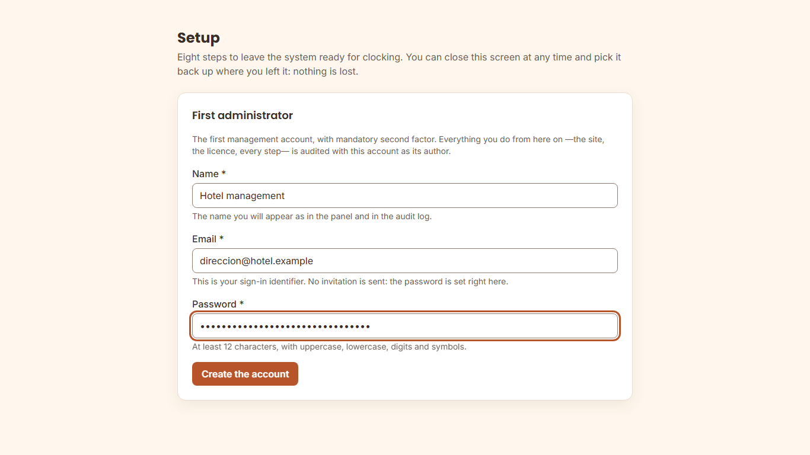

2. The next screen shows a **QR code and a text**. Scan it with your
   authenticator app.
3. Type the six-digit code your phone shows.

   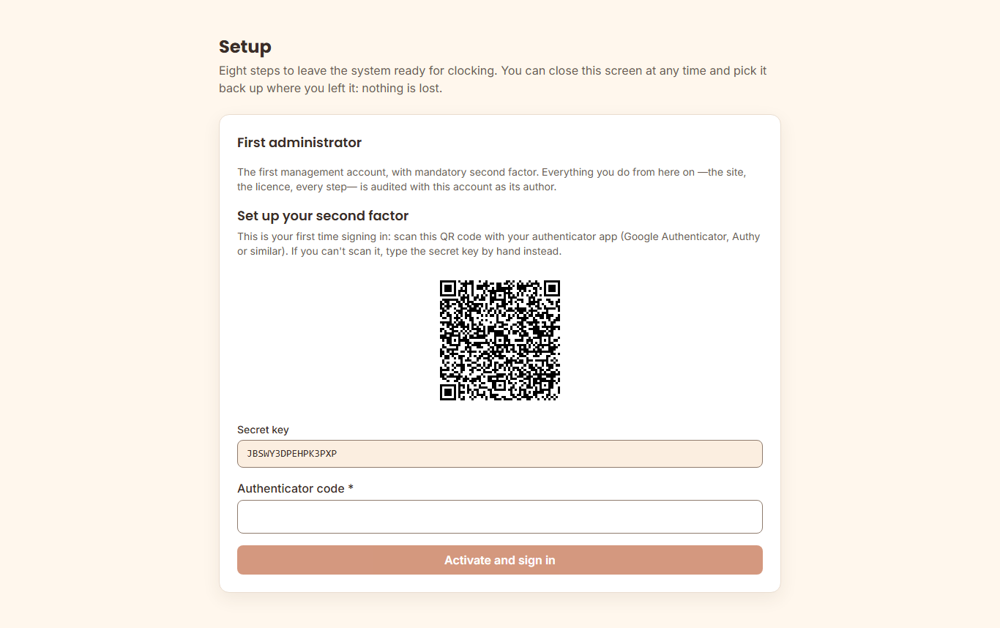

> **The QR code is shown only once.** There is no way to see it again, and it
> is on purpose. If you close the screen before scanning it, **you have not
> lost the account**: sign in through the normal sign-in screen with your
> email and your password and it will offer it to you again. If you also lose
> the password, there is a way out through the console — it is in "what to do
> if…".
>
> **The second factor is mandatory and cannot be disabled** for accounts with
> access to the whole staff. It is the only credential protecting the
> working-time record of the whole hotel.

#### Step 2 — the name everyone will see

The establishment's name appears in the panel, in the employee portal and on
the tablet. It is changed later from Settings › Brand, together with the logo
and the colour (see [`configuration.md`](configuration.md) §2.2).

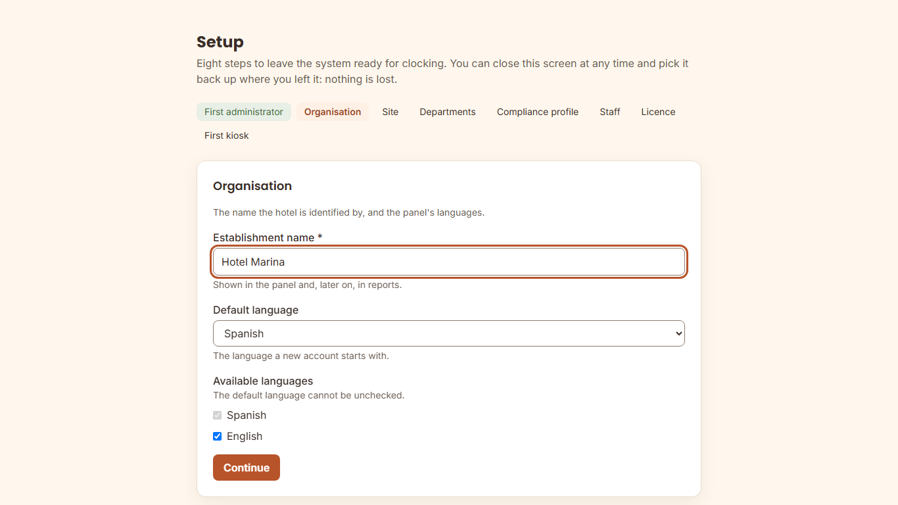

#### Step 3 — the time zone is not a presentation detail

It is the piece of information the system uses to decide **which day each
shift belongs to**. A shift from 22:00 to 06:00 counts entirely in the day it
started, and "the day" is measured in the site's zone.

Get it right the first time. It can be changed later — it is recorded — but
**changing it does not rewrite the working days already calculated**: from
that moment on they are calculated with the new one and before that they were
calculated with the old one.

If the hotel is in the Canary Islands, it is `Atlantic/Canary`, not
`Europe/Madrid`.

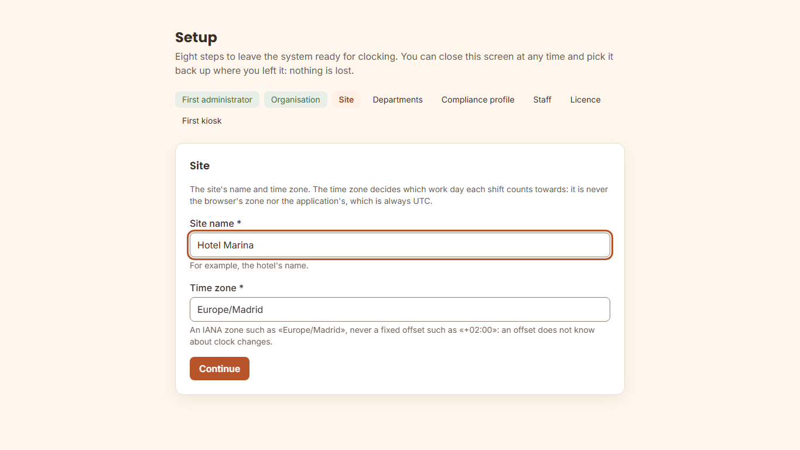

#### Step 4 — departments, the ones you use

They let a manager see only their own people. Add the ones you are sure about
and skip the rest: they are created later from the panel, at no cost.

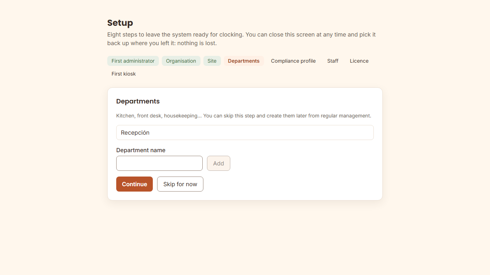

#### Step 5 — the compliance profile: read it, do not skip past it

The wizard proposes the **`ES-hosteleria`** profile with these values, taken
from the Workers' Statute (Estatuto de los Trabajadores):

| Threshold | Default |
| --- | --- |
| Minimum rest between working days | 12 h |
| Maximum ordinary daily working day | 9 h |
| Maximum weekly working time | 40 h |
| Continuous shift entry before a break is required | 6 h |
| Years the record is kept | 4 |

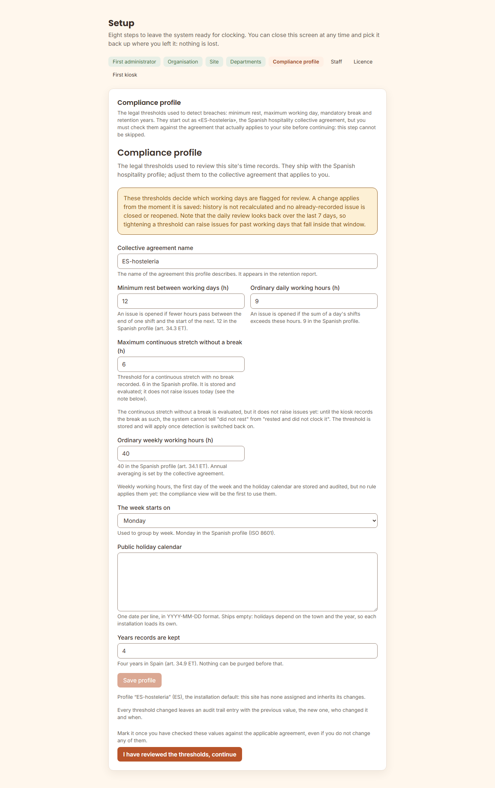

**This step cannot be skipped**, and it is the only mandatory one that creates
nothing. The reason: **your collective agreement may be stricter than the
law**, and these are the numbers the system is going to use to warn about
breaches. Check them against the agreement that applies to you and confirm
them, even if you leave them as they are.

They are changed later in Settings › Compliance, and every change is recorded.

#### Step 6 — the staff, if you bring it in a file

Two buttons and an order: **Validate** first, which writes nothing and shows
you line by line what it would do; **Apply** afterwards, only if the report
adds up. If you are going to add the staff by hand, skip the step. The file
format and the columns are in [`configuration.md`](configuration.md) §3 ter.

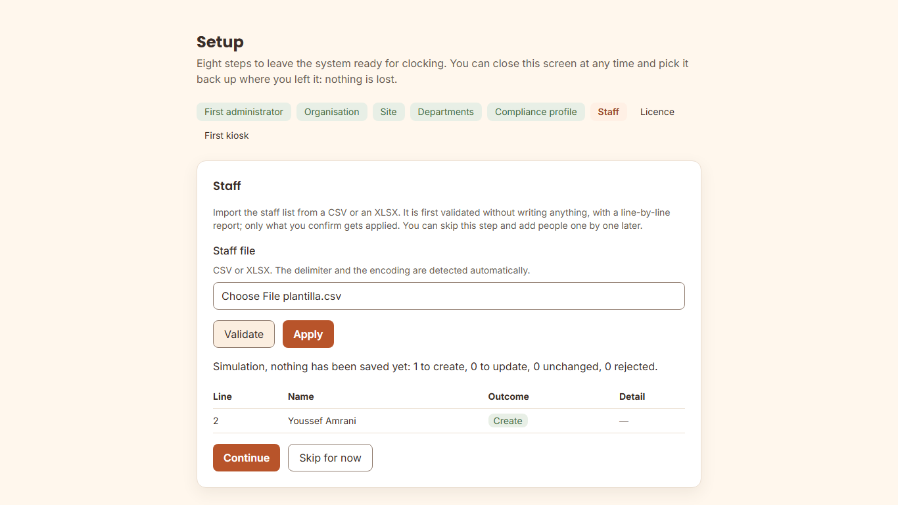

#### Step 7 — the licence can be skipped, and on purpose

Without a licence the system **clocks in and out, stores, calculates and
exports for the Labour Inspectorate (Inspección de Trabajo) exactly the
same**. What you will not have are the reports by period and some accessory
features, with a notice that says which.

A wizard that required the key to finish would turn the licence into a
requirement for complying with the law, and that cannot be. Activate it when
you have it, from Settings › Licence.

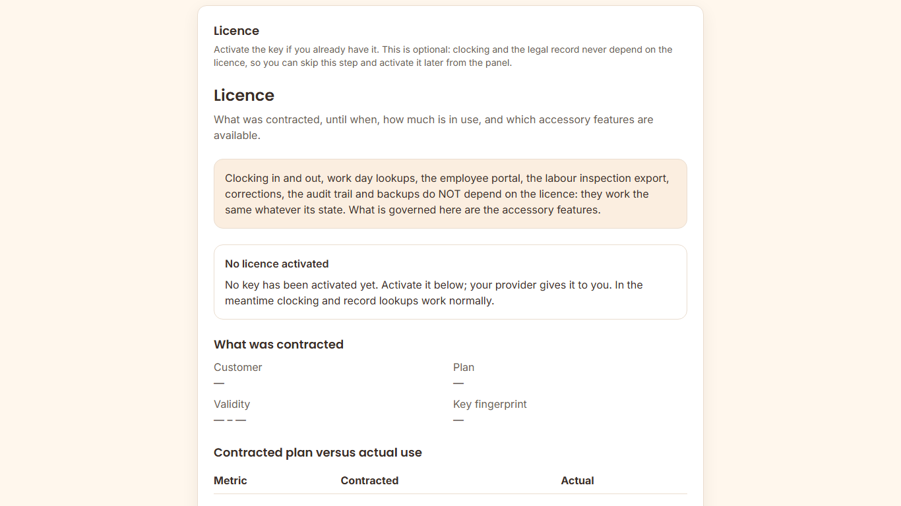

#### Step 8 — the first kiosk

The tablet shows a code and you type it in the panel. If it has not arrived
yet, **skip the step**: the full procedure for linking a tablet is in the
runbook [`alta-nuevo-quiosco.md`](../../runbooks/alta-nuevo-quiosco.md), which
ships in the package.

On the tablet, when opening `https://fichaje.tuhotel.local/kiosk/` without
ever having linked it, this is what you see:

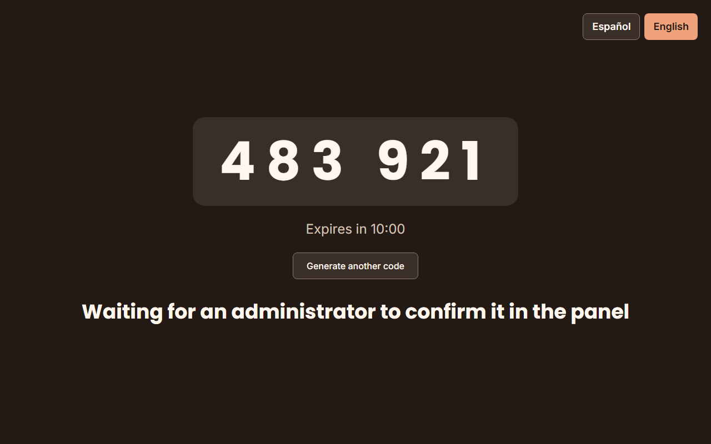

In the panel you type that code and the name you want to see the kiosk under:

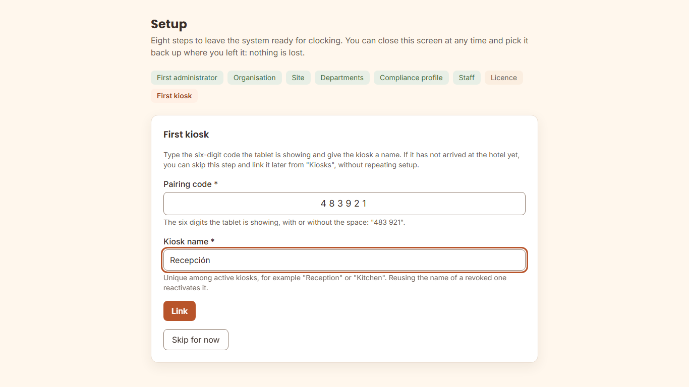

On linking, the wizard shows the version and the time of the request so you
can check them against the tablet, and the tablet moves to the clocking screen
on its own:

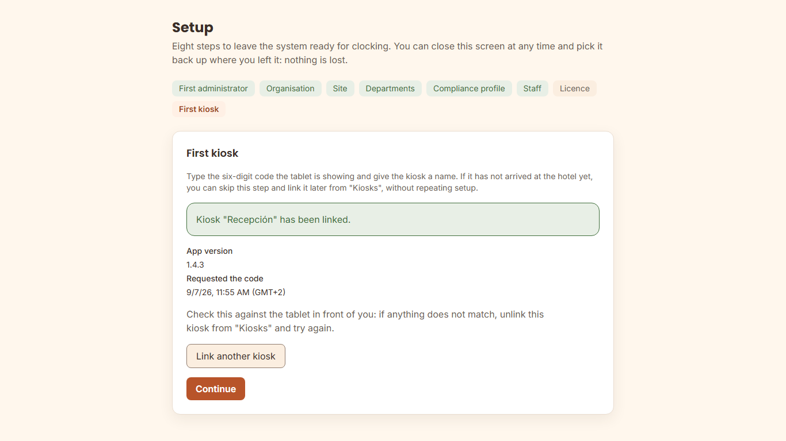

#### And when you finish: the cards

Before closing, the wizard shows the eight steps with their state — done,
skipped or pending — so you can go over what you left undone:

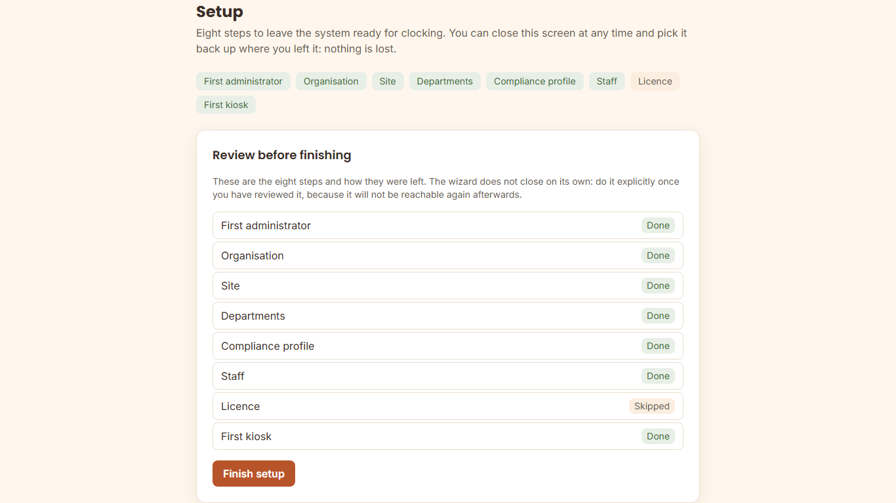

The last screen is a summary of **what is left to do**. The figure that
matters is the **cards to issue and print**.

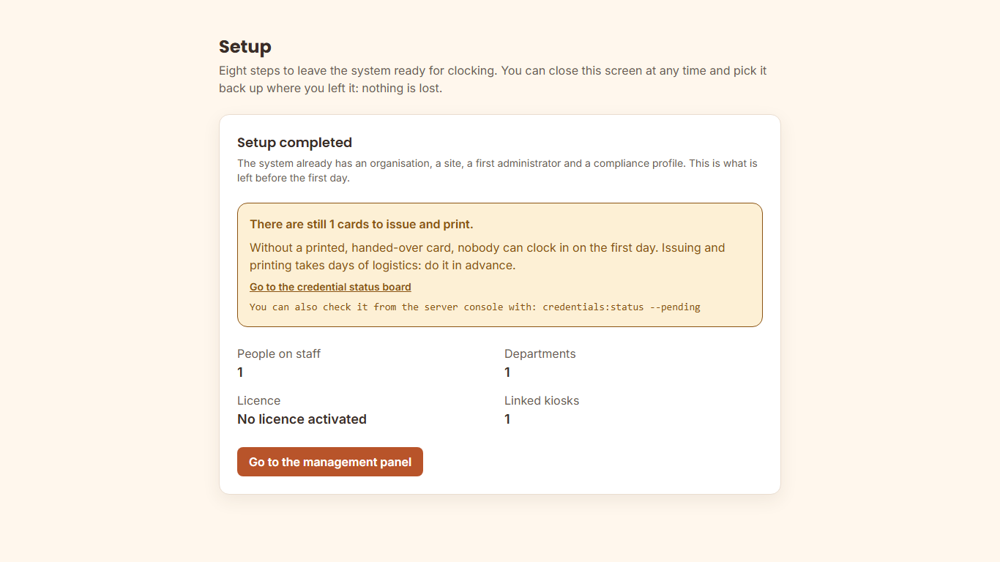

**Without a printed, handed-over card, that person cannot clock in.** Issuing,
printing and handing them out takes days, so start as soon as you finish the
wizard:

```bash
docker compose exec app php artisan credentials:status --pending
```

> The wizard **does not appear again**: it is single-use. Everything it
> configured is changed later from the panel, and there every change is
> recorded with its author and its date.

### 1.8 Optional: the hotel's logo

It is not needed for any of the above and can wait. Without a logo, the
applications and the documents show the name as text.

The logo is a **file on your server**, not an upload through the web: KronoQR
does not accept files over HTTP on purpose. It lives in the **brand
directory**, which the `docker-compose` mounts **read-only** inside the
container.

```bash
# 1. The folder on the server. Any path of yours will do; this is the suggested one.
sudo mkdir -p /opt/kronoqr/branding
sudo cp logo.png /opt/kronoqr/branding/logo.png
sudo chmod 0644 /opt/kronoqr/branding/logo.png

# 2. Tell docker-compose where it is. Empty = ./branding, next to
#    docker-compose.yml.
#    In the .env:  BRANDING_PATH=/opt/kronoqr/branding
sudo docker compose up -d app

# 3. Check that the container sees it. If this comes out empty, do not go on:
#    what is failing is the mount, not the configuration.
sudo docker compose exec app ls -l /var/kronoqr/branding
```

And afterwards, in the panel, **Settings › Brand**, type the path **as seen
from inside the container**: `/var/kronoqr/branding/logo.png`. It is checked
on saving, so if something does not add up it tells you on the spot and what
to do.

**Formats and limits**: PNG or SVG (the content is inspected, not the
extension), 512 KiB and 2048 pixels on a side at most.

> **Changing the logo later does not require restarting anything**: replace
> the file in the server folder and the next request already serves it. Step 2
> is only repeated if you move the folder.

All of this is optional in another sense too: custom branding is a plan
feature. If your licence does not include it, what you configure is kept and
applied only once the licence covers it — in the meantime the KronoQR brand is
shown. Detail in [`configuration.md`](configuration.md) §2.2.

---

## 2. Installer exit codes: what to do with each one

The five operation scripts (`install.sh`, `update.sh`, `doctor.sh`,
`backup.sh`, `restore.sh`) use **the same table**. It lets you write a cron
job or a runbook without reading every script.

| Code | Meaning | What to do |
| --- | --- | --- |
| `0` | Correct. | Nothing. Carry on at step 1.5. |
| `1` | **Incorrect usage.** An argument that does not exist. Nothing touched. | `./install.sh --help`. |
| `2` | **Requirements not met. NOTHING written.** The server is exactly as it was. | Read the "What to do" line of each `[FAIL]`, fix it and run again. |
| `3` | **There is a previous installation. NOTHING written.** | The installer **does not reinstall on top**: it would destroy the working-time record. To update, `./update.sh` (see [`../../runbooks/actualizacion-cliente.md`](../../runbooks/actualizacion-cliente.md), in Spanish). To see how it is, `./doctor.sh`. |
| `4` | **Failed and undid everything it had done.** The server is back as it was. | The message says the cause. Fix it and run the installer again: it is safe. |
| `5` | **Failed and could NOT undo everything.** Requires intervention. | The message lists **exactly what is left** and which command removes it. Do it and run again. It is the only code that needs someone in front of it. |
| `6` | **Installed, but the final verification did not pass.** The services are up and **nothing has been undone**. | Almost always the certificate or the server name. Check `docker compose logs nginx app` and the "does not respond" item in §5. The data is safe. |

---

## 3. What the installer generates, and what happens if you lose it

Every secret is generated **on your server** with `openssl` and **is not
transmitted to anyone**. The vendor does not know them and cannot recover
them.

| Secret | What for | If you lose it |
| --- | --- | --- |
| `APP_KEY` | Encrypts sessions and encrypted data | Sessions and that data can no longer be read |
| `QR_SIGNING_KEY_CURRENT` (+ its `_ID`) | Signs the QR codes on the cards | **Every card has to be reprinted** |
| `DB_PASSWORD` | The application's role in PostgreSQL | Rotated; see `../../runbooks/rotacion-secretos.md` (in Spanish) |
| `DB_MIGRATION_PASSWORD` | Migration and backup role | Same |
| `REVERB_APP_ID` / `_KEY` / `_SECRET` | Live presence in the panel | Rotated; only affects real time |
| `BACKUP_ENCRYPTION_KEY` | Encrypts the backups | **The backups can no longer be restored.** Keep it outside the server |
| `IDENTITY_PIN_SEALING_SECRET_KEY` | Opens the PINs the kiosk seals without network | PIN clock-ins queued without network could not be opened |
| `GRAFANA_ADMIN_PASSWORD` | Access to the dashboard | Rotated in Grafana |

The `.env` file is left with `0600` permissions. **No secret is printed on
screen or left in the installer log**, and that is checked on every release.

**One database role receives NO password**: `fichaje_maintenance`, the only
one that can drop expired partitions of the audit log. It is born without a
credential on purpose, and is given one **at the moment** of the annual purge.
The procedure is in [`operation.md`](operation.md).

**The licence key is not a secret** and is not in that table: it is a signed
statement of what you have contracted, it opens nothing, and losing it has no
consequence. You ask your provider for another one.

---

## 4. The licence, at install time

Paste the key your provider gave you into `LICENSE_KEY` in the `.env`
**before** running the installer, or activate it afterwards with:

```bash
docker compose exec app php artisan license:activate "KQL1...."
```

> **If you do not have it at hand, install anyway.** Without an activated
> licence the system installs, starts and **records working time normally**:
> the only things that will not be available are accessory features — reports
> by period and real-time presence updates. You activate it when you have it
> and they appear on their own, without restarting anything.
>
> **And an expired licence never blocks clocking in or access to the record
> either.** That would leave you in breach of the law because of something we
> did.

Check how it stands at any time with
`docker compose exec app php artisan license:show`. Everything else about the
licence is in [`configuration.md`](configuration.md), section 3 bis.

---

## 5. What to do if…

### …it says Docker is missing or too old

It exits with code `2` and **has written nothing**: the server is as it was.

KronoQR needs **Docker Engine 24 or newer** and the **Compose v2** plugin (the
one invoked as `docker compose`, without a hyphen). Check what you have:

```bash
docker version --format '{{.Server.Version}}'
docker compose version --short
```

- If the first **prints nothing**, Docker is not installed or its service is
  not running (`sudo systemctl status docker`).
- If it prints a version **lower than 24**, the engine has to be upgraded.
- If the second prints nothing, you have Docker but **not the Compose
  plugin**. The old `docker-compose`, with a hyphen, **is no use**.

Install or upgrade it following your distribution's official instructions, at
<https://docs.docker.com/engine/install/>, and run the installer again. We
deliberately do not give the commands for a specific distribution here: they
change, and an outdated recipe in a guide does more harm than a link.

### …it says there is not enough disk

It exits with code `2` and **has written nothing**.

The installer requires **40 GiB free**, and not in the directory you run it
from: in **the directory where Docker keeps images and volumes**, which is the
one that fills up. The message tells you which one it is and how much there
is. To see it yourself:

```bash
docker info --format '{{.DockerRootDir}}'
df -h "$(docker info --format '{{.DockerRootDir}}')"
```

If you are tight, look at what takes up space before buying disk:

```bash
docker system df
sudo du -xh --max-depth=1 /var/lib/docker | sort -h | tail -10
```

Images and containers from other projects you no longer use are removed with
`docker image prune -a`. **Do it only if you know what is there**: on a shared
server, that command deletes other applications' images.

Two more things worth knowing now and not in a year's time:

- **Backups do not go on that disk**, but to `BACKUP_PATH` (§6), and they
  need their own space: they grow with the staff and are kept for 30 days by
  default.
- The working-time record **is kept for four years by law**. The storage has
  to last that long, not the first month.

### …`install.sh` says "Permission to talk to Docker: FAIL"

Run it with `sudo`, or add your user to the `docker` group and log in again:

```bash
sudo usermod -aG docker "$USER"
# log out and log in again
```

### …it says port 80 or 443 is busy

Something else is listening there (almost always a system Apache or Nginx):

```bash
sudo ss -lptn 'sport = :443'
sudo systemctl stop nginx      # o lo que aparezca
```

If you need to keep that service, publish KronoQR on other ports with
`HTTP_PORT` and `HTTPS_PORT` in the `.env`, and put it behind your proxy.
First, read [`hardening.md`](hardening.md) §1.6: behind a reverse proxy the
server sees the proxy's IP and not the kiosk's, and `KIOSK_VLAN_CIDR`,
`PORTAL_INTERNAL_CIDR` and `METRICS_ALLOW_CIDR` stop telling origins apart.

### …it says "could not download the images"

The server cannot reach the vendor's registry, or you have not logged in:

```bash
docker login ghcr.io/kronoqr
```

If this installation has no internet access, go to §7.

### …it says "A previous KronoQR installation was found" and exits with `3`

It is correct and it is deliberate: the installer does not install on top of a
working-time record. If you meant to **update**, use `./update.sh`. If you
really want to start from scratch, remove the previous installation
thoroughly — **with a backup first** — and run again.

### …it says "The edge (uid 101) CANNOT read tls.key"

The web server runs **unprivileged** inside its container and cannot open a
`root`-owned file. It is what happens if you copied the key as `root`:
`openssl` writes them `0600` and `cp` keeps the mode.

```bash
sudo chown 101:101 certs/tls.crt certs/tls.key
sudo chmod 0444 certs/tls.crt
sudo chmod 0400 certs/tls.key
```

**If that directory is shared with another service of the hotel**, do not
change its owner: copy the certificate to a directory of its own, point
`TLS_CERT_DIR` there and apply the commands there.

The installer detects it in **phase 1**, before writing anything, so there is
nothing to clean up: fix it and run again.

### …nginx restarts over and over with "Permission denied"

It is the same problem as the previous item in an installation that already
exists — for example, after renewing the certificate with `certbot`, which
rewrites it with its own owner. Check it and fix it:

```bash
ls -l certs/                       # tls.key tiene que ser legible por el uid 101
docker compose logs --tail 20 nginx
sudo chown 101:101 certs/tls.crt certs/tls.key
sudo chmod 0400 certs/tls.key
docker compose up -d nginx
```

### …the tablet's browser does not accept the certificate

The certificate name has to be **the same** as the one in `APP_URL`, and the
full chain (certificate + intermediates) has to be in `certs/tls.crt`. A
self-signed one makes the tablets warn every morning until someone turns the
check off, and on that day the kiosk stops being trustworthy.

### …the tablet cannot access the camera, cannot find the server or the code does not work

The three clocking-point failures are explained **in one place**, with their
causes in order of frequency and how each one is checked: the runbook
[`../../runbooks/alta-nuevo-quiosco.md`](../../runbooks/alta-nuevo-quiosco.md),
section §6 "Qué hacer si…" ("What to do if…"). We do not repeat them here so
they do not end up diverging.

There you will also find what to do if the pairing code has expired (the
tablet generates another one on its own), if the PWA does not start on its
own after a reboot and if the kiosk is slow at the shift change.

### …I installed fine but `/api/v1/ready` returns 503

`ready` says "I can serve traffic", and for that it checks PostgreSQL and
Redis:

```bash
docker compose ps
docker compose logs --tail 50 postgres redis
```

`health`, on the other hand, only says "the process is alive" and touches
nothing: if `health` responds and `ready` does not, the problem is a
dependency, not the application.

### …the employee portal returns 403 from my computer

**It is correct** if your computer is outside `PORTAL_INTERNAL_CIDR`. The
portal is opened with an employee code and a 6-digit PIN, and one of the
protections is that it is not reachable from any IP. See §6.

### …I cannot find where to sign in: there is no user

It is expected. **The installer creates no users.** Open
`https://your-server/admin/` and the setup wizard creates the first
administrator, with its creation recorded in the audit log (section 1.7).

### …I closed the QR code screen before scanning it

**You have not lost the account.** It is created, it only lacks the second
factor. Sign in through the normal sign-in screen with your email and your
password: since you do not have it enabled yet, the response will offer to set
it up and show you the code again.

What does **not** work is creating the first administrator again: that door
closes as soon as a management account exists, and it does not reopen even if
you deactivate that account. It is deliberate — if it reopened, removing a
person would be a way of creating a new administrator without credentials.

If you have also lost the password:

```bash
# Create another management account (asks for the password on the console, without echo)
docker compose exec app php artisan identity:create-user --role=admin

# Or remove the second factor from the account that already exists, to set it up again
docker compose exec app php artisan identity:2fa-reset
```

### …the wizard does not appear and the panel asks me for credentials

Setup has already been completed. It is single-use and does not reopen:
everything it configured — the site, the departments, the compliance profile,
the licence — is changed later from the panel, and there every change is
recorded with its author and its date, which is exactly what a reopenable
wizard could not guarantee.

To check it without signing in:

```bash
curl -sS https://TU-SERVIDOR/api/v1/setup/status
# {"available":false}
```

This query **needs no credentials and that is why it says nothing more**: only
whether the wizard is still open. Neither when it closed nor which steps were
left pending: that is in the panel, signed in.

### …the panel says a management account already exists and I have not created one

**Stop and treat it as a security incident.** It is not an installation
failure.

The "First administrator" screen writes without asking for credentials — it
has to: at that moment no account exists — and closes on its own as soon as
there is one. If you did not create it, **someone else did**, and that account
is today the administrator of the installation.

What to do, in this order:

1. **Cut off access to the panel from outside** (firewall rule or inbound
   proxy rule). Kiosk clocking does not depend on the panel and keeps working.
2. **Look at when and from where.** The creation of the account and the
   enabling of its second factor are recorded in the audit log, which is
   append-only and cannot be rewritten:

   ```bash
   cd /opt/kronoqr-2.1.0
   sudo docker compose --env-file .env -f docker-compose.yml \
     exec -T postgres psql -U fichaje_migrator -d fichaje -c \
     "SELECT occurred_at, action, ip, payload
        FROM audit_log
       WHERE action IN ('role_assignment.changed','auth.two_factor_enabled')
       ORDER BY occurred_at
       LIMIT 10"
   ```

   The first entry comes out **without an actor**: that is correct and it is
   the signature of this screen — there was no session behind it. What you
   are interested in is the **time** and the **IP**: if they are not yours,
   that is the confirmation.

3. **Notify the hotel's responsible person** and support, with that output.
4. **Reinstall from scratch** if the installation is new and there is no data
   to keep (see the next section), this time **with the panel closed to the
   outside** until step 1 is finished.

Preventing it is the warning in section 1.7: step 1 is done immediately after
installing, and the panel is not published before.

### …the wizard will not let me finish

It says what is missing, with the step's name. **Mandatory** steps have to be
completed; **skippable** ones — departments, staff, licence and kiosk — only
need to be skipped explicitly, and that decision is saved.

The one that gets stuck most often is the **compliance profile**: it cannot be
skipped, it has to be confirmed even if you leave it as it comes. The reason is
in section 1.7.

### …I want to start the installation again from scratch

Only if you are sure that **there is no data to keep**:

```bash
cd /opt/kronoqr-2.1.0
sudo docker compose --env-file .env -f docker-compose.yml down -v --remove-orphans
sudo rm -f .env
sudo rm -rf /var/backups/fichaje
cp .env.example .env    # y vuelve a rellenar lo marcado [CLIENTE]
```

`down -v` **deletes the volumes, and with them the working-time record.** The
installer does not do this for you, and it is on purpose.

---

## 6. The network parameters, in detail

### `KIOSK_VLAN_CIDR` — the kiosk VLAN range

```dotenv
KIOSK_VLAN_CIDR=10.0.20.0/24
```

**What it does.** The web server limits the number of clock-ins per minute and
per IP. For traffic arriving from this range, the limit is **600 per minute
with a burst of 50**. For any other origin, **30 per minute with a burst of
10**.

**Why two limits and not one.** The 30 r/m per IP is a control designed for
the internet. **Every kiosk in a hotel leaves through the same IP**, so
applied without telling origins apart it would throttle clocking far below
what the product needs at the shift change.

**What happens if it is misconfigured.** If the kiosks are left outside this
range, they fall under the limit designed for the internet. **No error
appears**: the symptom is *"the kiosk is slow at 06:00"*, right when 500
people clock in at once. If someone describes that symptom, this variable is
the first thing to check.

**How to check it.** From an already installed kiosk:

```bash
# The IP the kiosk presents to the server must fall inside KIOSK_VLAN_CIDR
ip -4 addr show | grep inet
```

**The internal limit is raised, not removed.** The product also limits by IP
inside the VLAN: a compromised device plugged into that network cannot be left
without a ceiling.

### `METRICS_ALLOW_CIDR` — who can read the metrics

```dotenv
METRICS_ALLOW_CIDR=172.29.0.20/32
```

`/metrics` exposes the system's internal state and **is only served to this
origin**, which is the one of the service that collects the metrics. Anyone
else receives `403`, the server itself included. It is not exposed to the
internet, and neither is the dashboard (Grafana): it listens only on
`127.0.0.1`.

It should be a specific address and not a whole network: if the whole
container network is authorised, requests made from the server itself fall
inside that range and `/metrics` becomes reachable without anything warning
about it.

### `PORTAL_INTERNAL_CIDR` — from where the employee portal can be entered

```dotenv
PORTAL_INTERNAL_CIDR=172.28.0.0/16
```

**What it does.** The employee portal (employee code + 6-digit PIN) only
responds to requests arriving from this range. Any other origin receives
`403` at the web server itself, before reaching the application.

**Why it exists.** A 6-digit PIN is a small space. Restricting the portal to
the internal network is one of the four controls that compensate for it,
together with lockout after failed attempts, the per-IP request limit and the
fact that the portal session can only read the employee's own data.

**The example value is for development**, not production: it covers Docker
Compose's internal network. Before deploying, replace it with the hotel's real
LAN or with the range of the corporate VPN the staff use to come in from
outside.

**Exposing the portal to the internet is an explicit decision**, never a
default. It is taken by setting `PORTAL_INTERNAL_CIDR=0.0.0.0/0` and must be
noted in the installation's handover record: it is what answers the day
someone asks why the portal is reachable from outside the hotel.

### TLS certificate

```dotenv
TLS_ALLOW_SELF_SIGNED=false
TLS_CERT_DIR=./certs
```

Put the customer's certificate — or Let's Encrypt's — as `tls.crt` and
`tls.key` inside `TLS_CERT_DIR`. **If it is missing, the web server does not
start and says what to do.** It is intentional: a self-signed certificate
would make the kiosks warn about an unsafe site every morning, and someone
would end up turning the check off.

`TLS_ALLOW_SELF_SIGNED=true` is exclusively for test environments. In
production the installer **refuses to continue** if it finds it set to `true`.

**And the owner matters as much as the content.** The HTTP edge runs
unprivileged, as uid `101`, and has to be able to **read** both files:

```bash
sudo chown 101:101 "$TLS_CERT_DIR"/tls.crt "$TLS_CERT_DIR"/tls.key
sudo chmod 0444 "$TLS_CERT_DIR"/tls.crt
sudo chmod 0400 "$TLS_CERT_DIR"/tls.key
```

Phase 1 of the installer checks it and writes nothing if it fails. If
`TLS_CERT_DIR` points to a directory shared with another service (Let's
Encrypt's, for example), **do not change its owner**: copy the certificate to
a directory of its own and point `TLS_CERT_DIR` there. That also stops an
automatic renewal from leaving it with the previous owner again.

**When renewing the certificate**, repeat those commands: `certbot` and its
equivalents rewrite the files with their own owner, and the edge can no longer
read them at the next restart.

### `BACKUP_PATH` — where backups are stored

```dotenv
BACKUP_PATH=/var/backups/fichaje
BACKUP_RETENTION_DAYS=30
BACKUP_WAL_RETENTION_DAYS=8
```

**What it does.** It is the destination of the encrypted backups, the archived
WAL and the restore reports. **It is mounted at the same path inside the
containers**, so the value works inside and outside.

**Backups do not leave here.** They live in the customer's infrastructure; the
vendor neither receives them nor holds them (RL-14). If the destination is a
network share (NAS, storage array), **it has to be mounted before bringing the
services up**: if it is not, PostgreSQL cannot archive the WAL and ends up
filling its own disk.

**Permissions that have to stay in place** (the installer sets them; worth
checking after moving the destination):

```bash
# The backup tree is written by the application, which runs as uid 1000
sudo install -d -o 1000 -g 1000 -m 0750 /var/backups/fichaje
# The WAL archive is written by PostgreSQL, which runs as its own user
sudo install -d -o 70 -g 70 -m 0750 /var/backups/fichaje/wal
```

**How much it takes up.** Roughly: the compressed size of the database, times
`BACKUP_RETENTION_DAYS`, plus a weekly physical copy, plus the WAL of
`BACKUP_WAL_RETENTION_DAYS` days. The working-time record is kept for **4
years** by legal obligation: the storage has to last that long.

**`BACKUP_WAL_RETENTION_DAYS` must be greater than the interval between
physical copies** (weekly by default). Without the previous physical copy, the
archived WAL rebuilds nothing and the maximum loss stops being 15 minutes.

**How to check that it works:**

```bash
docker compose exec app php artisan backup:run    # crea y verifica una copia
docker compose exec app php artisan backup:verify # verifica la última
bash ./restore-drill.sh                            # simulacro trimestral
```

The full recovery procedure — and the drill that has to be run every
quarter — is in
[`docs/runbooks/restaurar-backup.md`](../../runbooks/restaurar-backup.md) (in
Spanish).

---

## 7. Installing without internet access

The system works entirely without internet. The only thing to sort out is how
the images get to the server. From a machine that does have access:

```bash
version="$(cat VERSION)"
for imagen in php nginx postgres; do
  docker pull "ghcr.io/kronoqr/${imagen}:${version}"
done
docker pull redis:7-alpine

docker save -o "imagenes-${version}.tar" \
  "ghcr.io/kronoqr/php:${version}" \
  "ghcr.io/kronoqr/nginx:${version}" \
  "ghcr.io/kronoqr/postgres:${version}" \
  redis:7-alpine
```

Copy that file to the hotel's server (USB, internal share) and there:

```bash
docker load -i imagenes-2.1.0.tar
sudo ./install.sh
```

**The installer only downloads what is missing**, image by image: if they are
already loaded, it does not try to talk to any registry and does not sit
waiting.

If you are also going to use observability (on by default), add to the
`docker save` the seven public images of the profile: `prom/prometheus`,
`prom/node-exporter`, `prom/alertmanager`, `grafana/grafana`, `grafana/loki`,
`grafana/tempo` and `prom/blackbox-exporter`. Their exact versions are in
`docker-compose.yml`. If you would rather not, switch the profile off by
leaving `COMPOSE_PROFILES=` empty in the `.env` and read in
[`operation.md`](operation.md) which alerts you lose.

---

## 8. Observability: on by default, and why it is worth leaving on

The `.env` ships with `COMPOSE_PROFILES=observability`, which brings up seven
more services (Prometheus, node-exporter, Alertmanager, Grafana, Loki, Tempo
and blackbox-exporter) and takes about 850 MiB of RAM. What Tempo (traces) and
blackbox-exporter (a real uptime probe, not just "the process is alive") add
is explained in [`operation.md`](operation.md) §10.2.

**What they do is warn about the two things that turn a healthy installation
into data loss without anyone noticing by looking at the screen:** that last
night's backup failed and that write-ahead log (WAL) archiving has stopped and
the disk is filling up.

You can switch it off by leaving the variable empty — it is a supported
configuration — but then **verifying the backup becomes a manual task of
yours**, weekly. It is written down in [`operation.md`](operation.md).

Grafana listens **only on `127.0.0.1:3000`**: you reach it through an SSH
tunnel or from the server itself, never from the internet.

---

## 9. And after installing

- **[`operation.md`](operation.md)** — the calendar of what happens on its
  own, what you have to attend to, backups, custody of secrets and the exit
  codes of the five scripts.
- **[`hardening.md`](hardening.md)** — the annex to this guide: what must
  arrive from where, TLS, the host, the secrets, the tablets, email and the
  accounts, with a quarterly checklist. Read it before declaring the system
  published.
- **[`configuration.md`](configuration.md)** — every parameter and what it
  does.
- **[`legal-obligations.md`](legal-obligations.md)** — what falls to the hotel
  as data controller, and what the vendor cannot do for you.
- **[`../../runbooks/alta-nuevo-quiosco.md`](../../runbooks/alta-nuevo-quiosco.md)** —
  how a tablet is pinned in kiosk mode. **It is not a feature of the
  product**: it is device configuration and you carry it out. Without it, an
  accidental swipe leaves the tablet outside the application and the next
  employee cannot find where to clock in.
