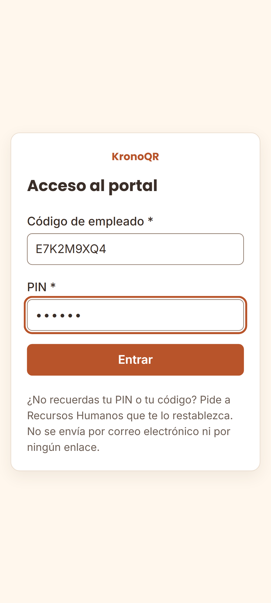
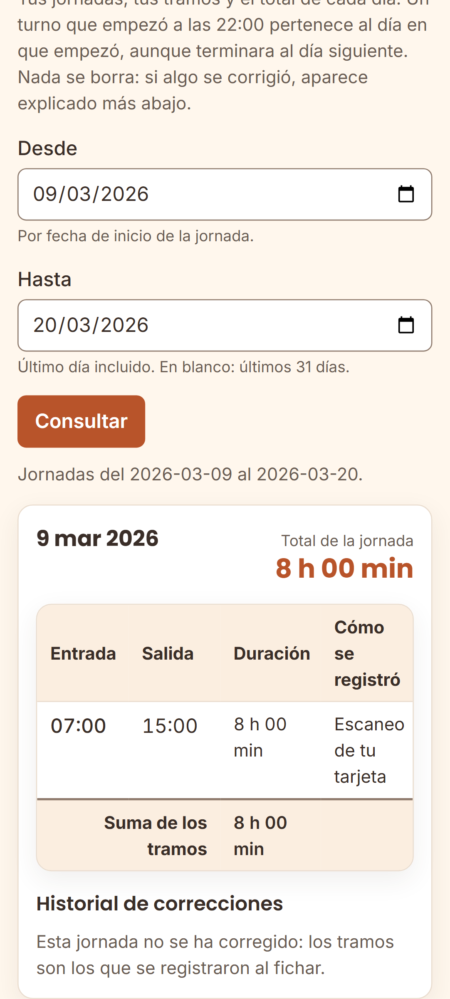
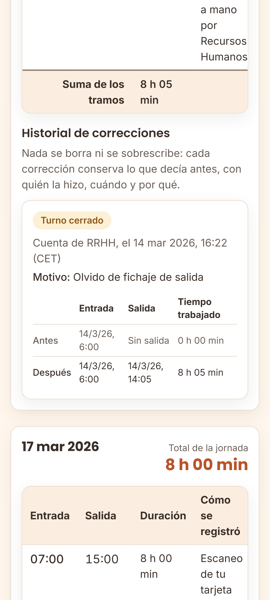
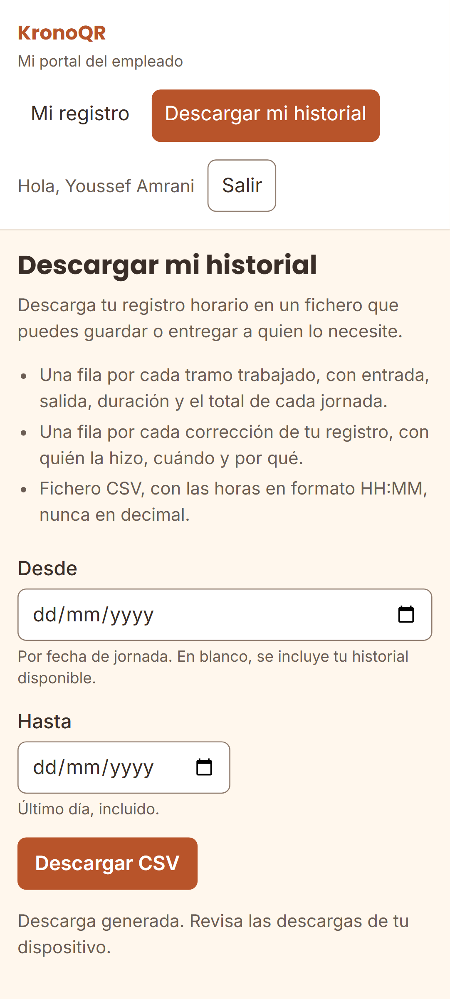

# El portal del empleado — consulta y descarga tu registro horario

Esta guía es **para entregar o publicar internamente**: explica a cada persona
de la plantilla cómo ver sus jornadas y cómo descargarse su propio registro
horario, sin pedírselo a nadie.

> **Para RRHH:** el portal es la vía ordinaria con la que se cumple el derecho de
> la persona trabajadora a acceder a su registro. Publícalo donde se lea —tablón,
> intranet— o entrégalo impreso junto con la hoja de instrucciones de la tarjeta.
> Los recorridos de gestión están en [`guia-rrhh.md`](guia-rrhh.md).

---

## 1. Cómo entrar

### La dirección

El portal está en la dirección de vuestro sistema, seguida de `/portal/`. Por
ejemplo: `https://fichaje.tuhotel.local/portal/`. **La dirección exacta la da
RRHH**, y es la misma que aparece impresa en la hoja que se entrega con la
tarjeta.

Se abre con cualquier navegador, desde un ordenador o desde un móvil, y no hay
que instalar nada. Lo que sí importa es desde qué red se entra, y es lo que
explica el apartado siguiente.

### Desde dónde

**Desde la red del hotel.** El portal solo responde a los equipos de la red
interna (o de la VPN, si vuestra empresa tiene una): desde una conexión de casa
o desde datos móviles, la página no carga.

No es un fallo, es una decisión de seguridad: el registro horario de la
plantilla no se publica en internet. Quien administra el sistema decide ese
rango con el parámetro `PORTAL_INTERNAL_CIDR`, explicado en
[`configuracion.md`](configuracion.md) §6.15. Si vuestro hotel necesita el
acceso desde fuera, es una decisión que se toma ahí, con conocimiento de lo que
implica.

### El código y el PIN

Se entra con **el código de empleado y el PIN de seis dígitos** que se
entregaron en mano junto con la tarjeta. Son los mismos que sirven para fichar
en la tablet cuando no se lleva la tarjeta encima.

**No hay usuario ni contraseña, ni hace falta tener correo electrónico.** El
producto no depende del correo de nadie: por eso el acceso es un código y un
PIN, y por eso el PIN se entrega en persona.

### Si el PIN no funciona o el acceso se ha bloqueado

- **Si el código o el PIN no son correctos**, la pantalla lo dice sin más
  detalle. Revísalos y vuelve a intentarlo.
- **Tras varios intentos fallidos el acceso se bloquea unos minutos**, y sigue
  bloqueado aunque después escribas el PIN correcto. Espera y prueba otra vez;
  cada intento fallido alarga la espera.
- **Si has olvidado el PIN, pídele a RRHH que te lo restablezca.** Te darán uno
  nuevo **en mano**, y el anterior deja de funcionar en el acto. Restablecerlo
  también libera el bloqueo.

**No hay recuperación automática, y es deliberado.** Un PIN que se recupera con
un mensaje o un enlace es un PIN que puede usar quien tenga acceso a ese buzón
—y con él, fichar en tu nombre y leer tu registro horario. La credencial de este
sistema es física y se entrega en persona: reponerla también.

> **El bloqueo del portal no te impide fichar.** Los contadores del portal y los
> de la tablet son distintos a propósito, para que probar el PIN en una puerta
> no deje a nadie sin poder fichar por la otra.

---

## 2. Qué se ve

El portal tiene **dos pantallas y nada más**: tu registro y la descarga de tu
historial.

En «Mi registro» aparecen tus jornadas del periodo elegido —los últimos 31 días
si no eliges nada—, y dentro de cada una:

| Qué ves | Qué significa |
| --- | --- |
| **Jornada** | Un día de trabajo. **Un turno que empezó a las 22:00 pertenece al día en que empezó**, aunque terminara al día siguiente: no se parte en dos |
| **Tramo** | Cada par entrada/salida de ese día, con su duración |
| **Total de la jornada** | La suma de los tramos de ese día |
| **Cómo se registró** | Escaneo de tu tarjeta, PIN en el quiosco, o registrado a mano por RRHH |
| **«Turno abierto»** | Todavía no has fichado la salida de ese turno: el total va a subir |
| **«Revisión pendiente»** | Ese día quedó marcado para que alguien lo revise. **No es un error tuyo** |
| **«Se registró X después de fichar»** | La tablet estaba sin red y el fichaje llegó al servidor más tarde. **Lo que cuenta es la hora a la que fichaste** |

### Si tu registro se ha corregido

Debajo de la jornada aparece el **historial de correcciones**: qué decía antes,
qué dice ahora, quién lo cambió, cuándo y por qué.

**Nada se borra ni se sobrescribe.** Si RRHH corrigió un olvido de fichaje, tú
ves la corrección y ves también lo que decía el registro antes. Esa
transparencia es el motivo por el que el sistema funciona así.

---

## 3. Descargar tu registro

En «Descargar mi historial» eliges el periodo y pulsas **«Descargar CSV»**.

El fichero lleva:

- una fila por cada **tramo** trabajado, con entrada, salida, duración y el
  total de cada jornada;
- una fila por cada **corrección** de tu registro, con quién la hizo, cuándo y
  por qué;
- las horas en formato HH:MM, **nunca en decimal**.

Se abre con cualquier hoja de cálculo.

**Para qué sirve.** El acceso al propio registro horario es un **derecho**, no
un favor: la empresa está obligada a que puedas consultarlo y a conservarlo
cuatro años. Ese fichero es tu copia, y la puedes guardar o entregar a quien la
necesite —tu representación legal, un asesor, un juzgado— sin pedir permiso a
nadie y sin que quede constancia de para qué la querías.

---

## 4. Si algo no cuadra

**Avisa a RRHH.** Diles el día concreto y qué falta o qué sobra: «el jueves 12
no aparece mi salida», «el martes salen dos entradas seguidas».

**Tú no editas tu registro, y eso es a tu favor.** Un registro horario que la
persona interesada puede cambiar no prueba nada ante nadie: ni ante una
inspección, ni en una reclamación de horas. Precisamente porque no lo puedes
tocar, lo que dice tiene valor.

Lo que sí ocurre cuando avisas:

1. RRHH revisa el día y lo corrige **con su nombre, la fecha y un motivo**.
2. **Tu dato anterior se conserva**: la corrección no borra nada.
3. Tú lo ves en el portal, con el antes y el después (§2).

Si crees que la corrección tampoco es correcta, vuelve a decirlo: se corrige otra
vez y quedan las dos versiones. El historial no se agota.

### Otras situaciones

| Situación | Qué hacer |
| --- | --- |
| **Has perdido la tarjeta** | Díselo a tu responsable **ese mismo día**. Se anula y se te da otra. Mientras tanto, fichas con tu código y tu PIN en la tablet |
| **La tablet dice «Pendiente de validar»** | Tu fichaje **está registrado**. La tablet estaba sin red y lo enviará sola. **No lo repitas** |
| **La tablet dice «Código no válido»** | Ficha con tu código y tu PIN, y avisa a tu responsable |
| **No recuerdas tu código de empleado** | Está impreso en tu tarjeta. Si no la tienes, pídeselo a RRHH |
| **La página no carga** | Comprueba que estás en la red del hotel (§1). Si lo estás, avisa a RRHH |
