# Guía de uso para RRHH — el registro horario, día a día

Esta guía es para quien **opera el producto a diario**: dar de alta a una
persona, entregarle su tarjeta, mirar la bandeja de incidencias, corregir un
olvido de fichaje y responder a un requerimiento de la Inspección. **No hace
falta saber nada de sistemas.**

> **Lo que NO está aquí, a propósito.** Instalar, copias de seguridad,
> actualizaciones y diagnóstico son del personal de IT y viven en
> [`operacion.md`](operacion.md). Los parámetros y sus consecuencias, en
> [`configuracion.md`](configuracion.md). Lo que la ley obliga al hotel, en
> [`obligaciones-legales.md`](obligaciones-legales.md). Cada cosa se explica en
> un solo sitio; aquí se enlaza.

Los ocho apartados de esta guía, por si buscas uno concreto:

1. [El vocabulario, primero](#1-el-vocabulario-primero)
2. [Alta de una persona, de principio a fin](#2-alta-de-una-persona-de-principio-a-fin)
3. [Presencia en vivo y registro horario](#3-presencia-en-vivo-y-registro-horario)
4. [La bandeja de incidencias](#4-la-bandeja-de-incidencias)
5. [Correcciones: cambiar una hora sin romper el registro](#5-correcciones-cambiar-una-hora-sin-romper-el-registro)
6. [Informes, exportaciones y la entrega a la Inspección](#6-informes-exportaciones-y-la-entrega-a-la-inspección)
7. [El perfil de cumplimiento](#7-el-perfil-de-cumplimiento)
8. [Qué hacer si…](#8-qué-hacer-si)

---

## 1. El vocabulario, primero

Son nueve palabras. Sin ellas, el resto de la guía se lee dos veces.

| Palabra | Qué es | Dónde la ves |
| --- | --- | --- |
| **Fichaje** | El gesto de acercar la tarjeta a la tablet. Queda registrado siempre, se acepte o no | Quiosco |
| **Tramo** | Un par entrada/salida. Es la unidad mínima del registro: lo que se corrige, se anula o se añade es un tramo | Registro horario |
| **Jornada** | El conjunto de tramos de un día. **Un turno de noche que entra a las 22:00 y sale a las 06:00 es un solo tramo y pertenece al día en que empezó**, no se parte en dos | Registro horario |
| **Total del día** | La suma de los tramos de una jornada. Se recalcula solo; no hay que tocarlo nunca | Registro horario |
| **Incidencia** | Algo del registro que **una persona tiene que mirar**. No es un error del sistema | Bandeja de incidencias |
| **Corrección** | El cambio de un tramo hecho por una persona autorizada, con motivo y con firma. Nunca borra lo anterior | Registro horario |
| **Credencial (tarjeta)** | El vínculo entre una persona y su tarjeta física con código QR. Se emite, se imprime, se entrega y se puede revocar | Credenciales |
| **Quiosco** | La tablet fijada en la pared donde se ficha | — |
| **Portal del empleado** | La web donde cada persona consulta y descarga **su propio** registro. Es una obligación legal, no una cortesía | [`guia-portal-empleado.md`](guia-portal-empleado.md) |

**Dos ideas que explican casi todo el comportamiento del producto:**

- **Nada se borra y nada se sobrescribe.** Corregir crea una versión nueva y
  conserva la anterior, con quién, cuándo y por qué. Es lo que hace que el
  registro valga ante una inspección.
- **El sistema nunca decide por una persona.** No cierra turnos, no inventa
  horas de salida y no resuelve incidencias solo. Cuando algo no cuadra, lo
  pone encima de la mesa y espera.

---

## 2. Alta de una persona, de principio a fin

El recorrido entero, en el orden en que se hace. Al final, la persona puede
fichar y consultar su registro.

> **Empieza con días de margen.** Entre emitir la tarjeta y tenerla impresa y
> en la mano pasa tiempo real: hay que imprimirla y plastificarla. Quien empieza
> a trabajar sin tarjeta ficha igual —con su código y su PIN— pero eso son
> tramos que alguien tendrá que revisar después.

### 2.1 La ficha

**Plantilla → «Dar de alta».**

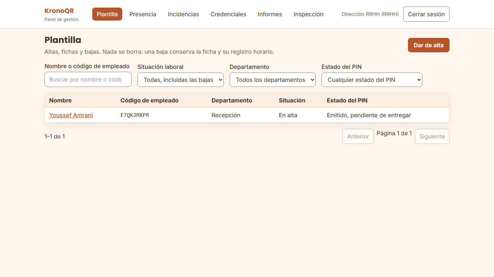

Se rellenan nombre, apellidos y fecha de alta. Lo demás es opcional y conviene
saber por qué:

| Campo | Obligatorio | Qué conviene saber |
| --- | --- | --- |
| Nombre y apellidos | Sí | — |
| Fecha de alta | Sí | Desde ella cuenta la conservación legal de su registro. Cambiarla después es a conciencia, no de pasada |
| Departamento | No | Sirve para filtrar la bandeja y los informes, y para el alcance de los responsables de departamento |
| Correo electrónico | **No** | **Ninguna función del producto lo necesita.** No se envía nada por correo: ni la tarjeta, ni el PIN, ni el acceso al portal |
| Documento de identidad | No | **No se guarda tal cual**: el sistema conserva solo una marca calculada a partir de él, que sirve para no dar de alta dos veces a la misma persona y no para leerlo |
| Idioma | No | El idioma en el que verá el portal y en el que se le imprime la hoja de instrucciones |

**El código de empleado lo genera el sistema**, y es opaco a propósito: va
impreso en la tarjeta, así que no puede ser el número de nómina ni nada que
tenga significado. No se puede elegir.

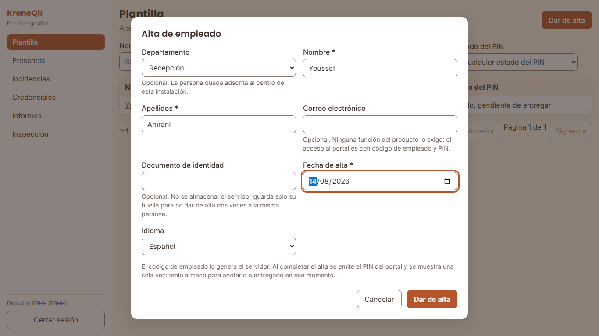

### 2.2 El PIN: se ve una sola vez

Al completar el alta, el sistema emite el **PIN de seis dígitos** del portal y
**lo muestra una sola vez, en ese momento**. No se puede volver a consultar
después: si se pierde, la única salida es restablecerlo, que genera otro
distinto y anula el anterior en el acto.

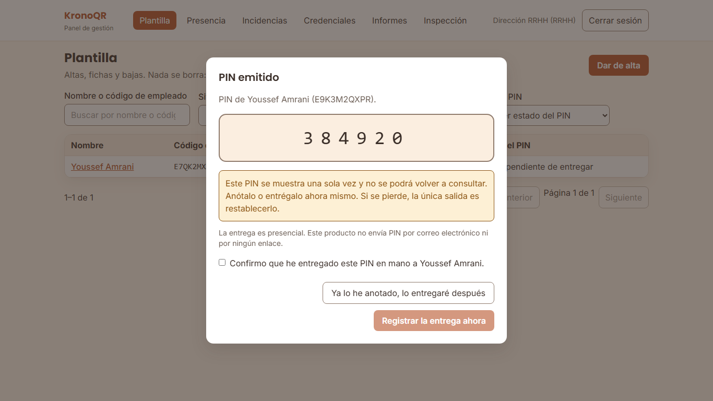

Ten a mano dónde anotarlo **antes** de pulsar «Dar de alta». El PIN sirve para
dos cosas: entrar al portal y fichar en la tablet cuando no se tiene la tarjeta
encima.

**El PIN se entrega en mano, en persona.** No hay ningún envío electrónico: ni
mensaje, ni enlace de recuperación. No es un descuido: una clave que viaja por
un buzón acaba fichando por su titular sin que nadie se entere.

### 2.3 Las horas contratadas

El informe de horas por periodo compara lo trabajado con **lo que estaba
pactado ese día**, y para eso necesita el contrato de la persona. Hoy el
**panel no tiene pantalla de contratos**: quien administra el sistema puede
registrarlos, pero desde el panel no se hace. Mientras no haya contrato
registrado, el informe del periodo lo dice con claridad —«hay X días-persona
sin contrato registrado»— y esas filas salen con la desviación incompleta. Las
horas trabajadas y el registro legal **no se ven afectados**.

### 2.4 Emitir, imprimir y entregar la tarjeta

**Credenciales.** Es el tablero donde se ve quién puede fichar y quién todavía
no.

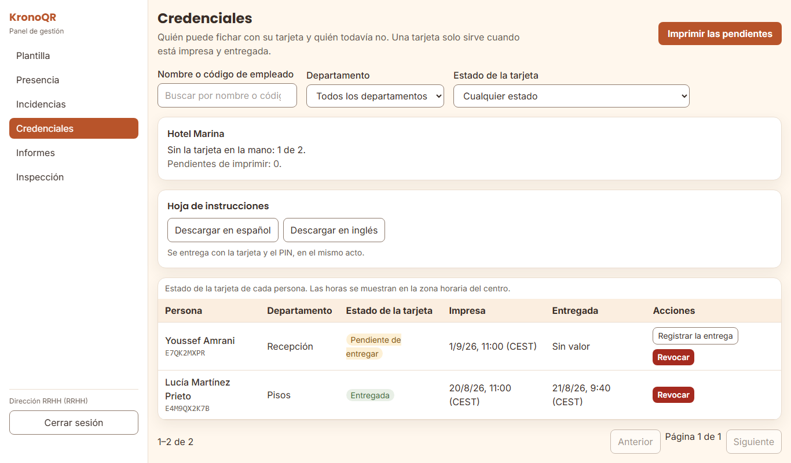

Son tres actos, en este orden, y cada uno cambia el estado:

| Acto | Botón | Estado al terminar | ¿Puede fichar? |
| --- | --- | --- | --- |
| **Emitir** | «Emitir credencial» | Pendiente de imprimir | **No** |
| **Imprimir** | «Imprimir la tarjeta» | Pendiente de entregar | **Sí, en cuanto la reciba** |
| **Entregar** | «Registrar la entrega» | Entregada | Sí |

> **Imprimir es lo que activa la tarjeta, y no hay reimpresión.** El código QR
> no existe hasta que se pulsa «Generar el PDF»: se acuña en ese momento, dentro
> del PDF, y **no se guarda en ningún sitio del que se pueda volver a sacar**.
> Por eso el botón avisa antes: *«Al imprimir se acuña el QR y no hay vuelta
> atrás: no existe la reimpresión.»* Si el PDF se pierde —se cierra la ventana,
> falla la impresora, se descarga a un equipo que no es el tuyo—, la única
> salida es **revocar esa credencial y emitir otra**:
> [`../runbooks/tarjeta-perdida-o-rota.md`](../runbooks/tarjeta-perdida-o-rota.md).
> **Imprime solo con la impresora lista.**

**El PDF de la tarjeta es un documento al portador**: quien lo tenga puede
fabricar la tarjeta de otra persona. No se guarda en el servidor, no se envía
por correo y conviene borrarlo del equipo en cuanto esté impreso.

Para un alta de temporada, el botón **«Imprimir las pendientes»** genera en una
sola hoja A4 todas las tarjetas pendientes de imprimir. Vale el mismo aviso,
multiplicado por el número de tarjetas.

### 2.5 La hoja de instrucciones

En el mismo tablero de credenciales está **«Hoja de instrucciones»**, con un
botón **«Descargar en …» por cada idioma activo** de la instalación. Es un PDF
de una cara, igual para toda la plantilla, con la marca del hotel y la dirección
de **este** portal. Se imprime y se entrega con la tarjeta.

Qué dice exactamente, y por qué conviene leerla una vez antes de repartirla:
[`hoja-empleado.md`](hoja-empleado.md).

### 2.6 La entrega: un solo acto

**La tarjeta, el PIN y la hoja se entregan juntos, en persona, en el mismo
momento.** El diálogo de entrega lo recuerda en pantalla. Después se registran
las dos entregas —«Registrar la entrega» de la tarjeta y «Registrar la entrega
del PIN»—, que quedan anotadas con la fecha y contigo como responsable.

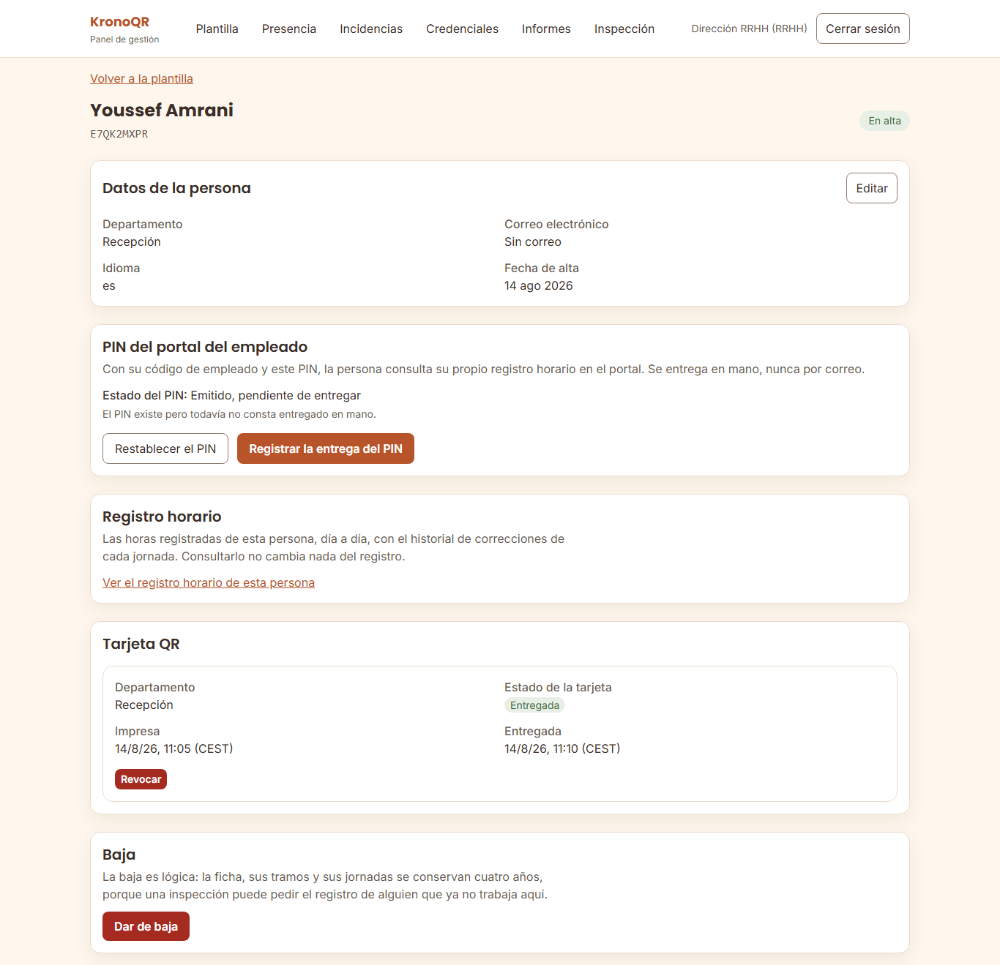

**No es burocracia.** Ese apunte es lo que distingue «la tarjeta se perdió antes
de dársela» de «la perdió el empleado», y es lo que responde meses después a por
qué una persona no pudo fichar un martes. No se puede repetir ni deshacer:
márcalo solo cuando la entrega ya haya ocurrido.

### 2.7 Qué verá esa persona al fichar

Conviene haberlo visto una vez para poder explicarlo sin la tablet delante.

Fichaje correcto: la pantalla dice «Entrada» o «Salida» con la hora.

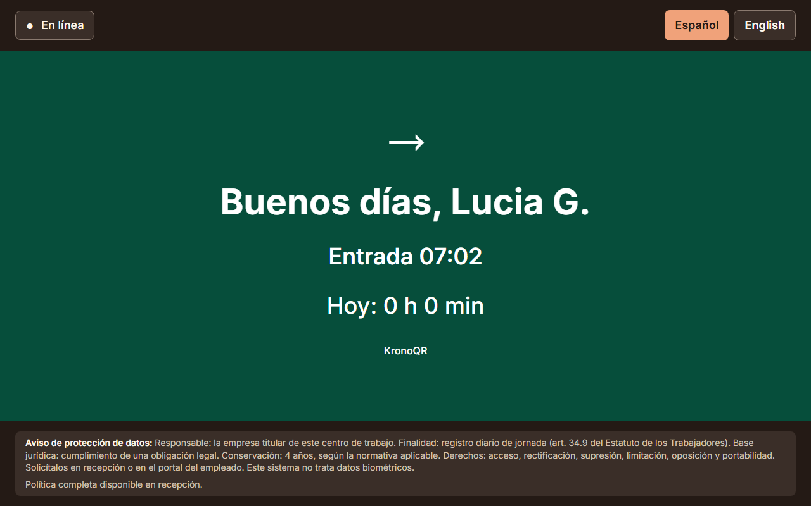

La tablet estaba sin red: dice «Pendiente de validar». **El fichaje está
guardado y se enviará solo.** No hay que repetirlo, y el registro legal usa la
hora real del fichaje, no la de la llegada al servidor.

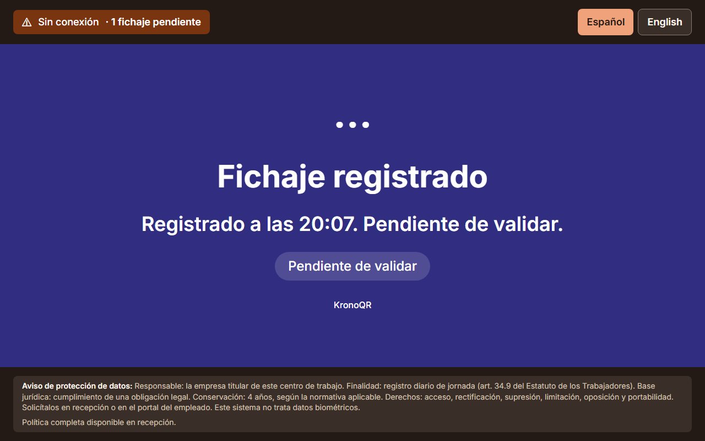

Sin tarjeta encima: «Ficha con tu código y PIN» en la propia tablet.

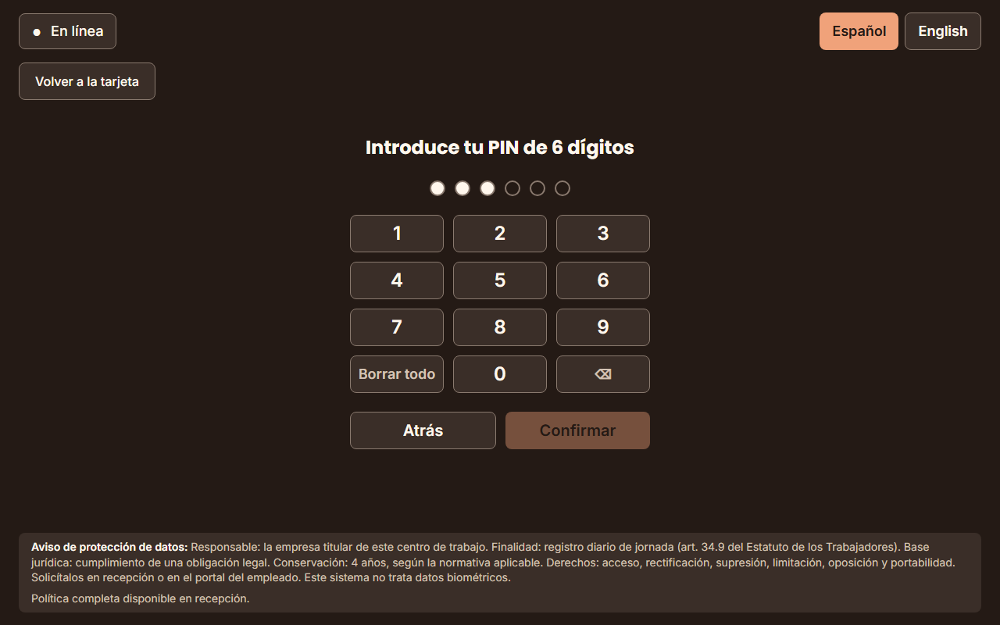

---

## 3. Presencia en vivo y registro horario

### 3.1 Presencia: quién está dentro ahora

**Presencia** muestra quién tiene un turno abierto en este momento, desde qué
hora y por qué quiosco fichó. Se actualiza sola.

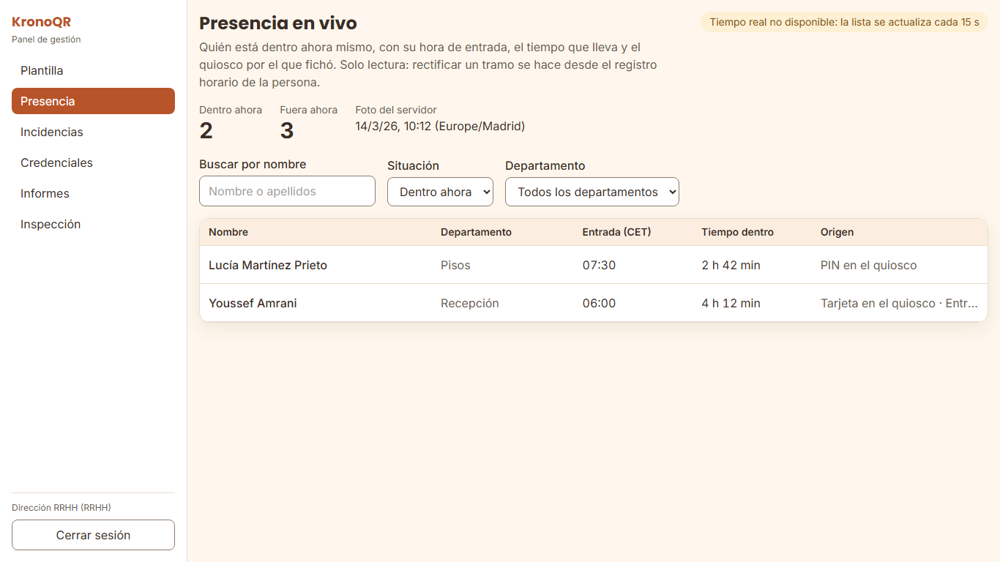

**Qué significa «Dentro ahora»:** que esa persona fichó una entrada y todavía no
ha fichado la salida.

**Qué NO significa:**

- No significa que esté físicamente en el hotel. Significa que su último fichaje
  fue una entrada. Alguien que se fue sin fichar la salida sigue apareciendo
  dentro hasta que alguien lo corrija.
- No significa que las horas ya cuenten. Un turno abierto sigue creciendo: su
  total **no sirve para una nómina** hasta que se cierre.
- **No es la pantalla para arreglar nada.** Presencia es solo lectura. Rectificar
  un tramo se hace desde el registro horario de la persona.

### 3.2 El registro horario de una persona

Desde su ficha, **«Ver el registro horario de esta persona»**. Es la pantalla
donde se ve —y se corrige— la verdad de cada día.

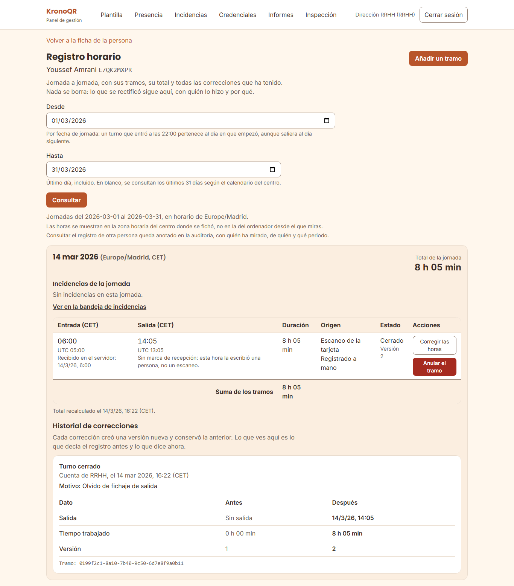

Qué mirar:

- **Las horas están en la zona horaria del centro**, no en la del ordenador
  desde el que miras.
- Cada tramo trae su **origen**: escaneo de la tarjeta, PIN en el quiosco o
  registrado a mano. Un tramo escrito a mano vale exactamente igual que uno
  escaneado; lo que cambia es que lleva una corrección detrás que lo explica.
- **«Turno abierto»**: falta la salida. El total del día va a subir.
- **«Incidencia»**: algún tramo quedó marcado para revisión. No es un error del
  sistema: es que alguien tiene que mirarlo.
- **Consultar el registro de otra persona queda anotado** en el registro de
  auditoría, con quién ha mirado, de quién y qué periodo. Es normal y es
  intencionado.

---

## 4. La bandeja de incidencias

**Incidencias** es la lista de lo que el sistema ha encontrado y no puede
resolver solo. Se llena sola cada madrugada, al revisar el registro.

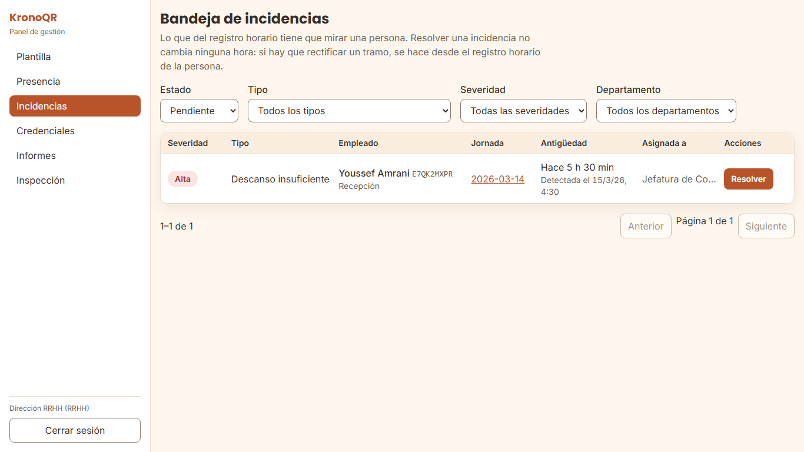

### 4.1 Qué genera cada tipo, y cuál corre prisa

| Tipo | Severidad | Qué lo genera | Qué suele significar |
| --- | --- | --- | --- |
| **Descanso insuficiente** | **Alta** | Entre el fin de un turno y el inicio del siguiente median menos horas que el mínimo del perfil (12 h de serie) | Un cierre y una apertura seguidos, o un olvido de fichaje que junta dos jornadas. **Tiene consecuencia sancionadora: mírala el mismo día** |
| **Turno abierto sin cerrar** | Media | Un turno lleva abierto más del máximo (12 h de serie) | Casi siempre, un olvido de fichar la salida |
| **Jornada demasiado larga** | Media | La suma del día, o un solo tramo, supera la jornada máxima del perfil | Horas de más reales, o dos tramos que en realidad eran uno |
| **Jornada demasiado corta** | Baja | Un tramo por debajo de la duración mínima computable | Un doble escaneo, o una entrada y una salida seguidas por error |
| **Desfase de reloj** | Baja | La tablet tenía la hora desviada al fichar | **El fichaje se registró igual.** Es un aviso para IT sobre esa tablet, no un problema de la persona |
| **Salida sin fichar** | Media | Describe un olvido de salida **ya cerrado a mano** | **No la abre nadie automáticamente.** Mientras el turno sigue abierto, lo que hay es «Turno abierto sin cerrar» |
| **Sin pausa registrada** | Media | Un tramo continuo por encima del umbral del convenio | **Hoy no se abre ninguna**: mientras el quiosco no registre la pausa como tal, el sistema no puede distinguir «no descansó» de «descansó y no lo fichó» |
| **Patrón anómalo de uso de la credencial** | Alta | — | **Hoy no se abre ninguna.** El detector llega en una versión posterior |

> **El filtro «Tipo» enseña los ocho, y hoy solo cinco se abren solos**:
> descanso insuficiente, turno abierto, jornada demasiado larga, jornada
> demasiado corta y desfase de reloj. Los otros tres están en la lista porque el
> sistema tiene que poder registrarlos sin cambiar nada cuando llegue su
> momento. No es un fallo de la instalación.

### 4.2 El sistema nunca cierra un turno por su cuenta

Es la pregunta que siempre aparece: *«si lleva 14 horas abierto, ¿por qué no lo
cierra el sistema?»*.

**Porque cerrarlo sería inventarse una hora de salida.** Si el sistema cerrara el
turno a las 12 h, el registro diría que esa persona trabajó 12 horas cuando
probablemente trabajó 8 y se olvidó de fichar. Un registro horario que se
inventa horas no es defendible ante la Inspección, y además paga de más o de
menos en la nómina.

Lo que el sistema hace es abrir la incidencia y esperar a que **una persona
firme** la hora correcta. Es una garantía, no una carencia: cada hora del
registro, o la fichó alguien, o la escribió alguien con su nombre al lado.

Mientras tanto, **nadie se queda sin poder fichar**: quien tiene el turno
abierto sigue pasando su tarjeta con normalidad, y su siguiente escaneo cerrará
ese turno.

### 4.3 Cómo se resuelve una

Una incidencia se cierra en dos pasos, y el orden importa:

1. **Primero se arregla el registro**, si hay algo que arreglar: se corrige el
   tramo desde el registro horario de la persona (§5).
2. **Después se cierra la incidencia**: botón «Resolver», y se elige qué ha
   pasado.

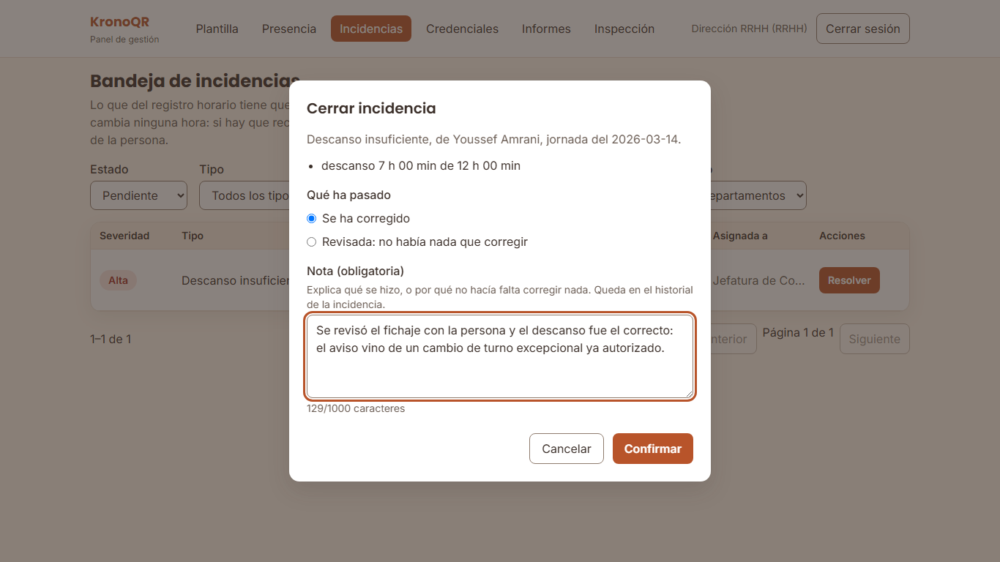

Hay dos desenlaces y son distintos:

- **«Se ha corregido»** — había algo mal y se ha rectificado.
- **«Revisada: no había nada que corregir»** — el dato era raro pero cierto. Un
  turno de 11 horas puede ser verdad.

**La nota es obligatoria** y queda en el historial de la incidencia. Escribe qué
se hizo o por qué no hacía falta hacer nada: dentro de seis meses, «revisado» no
explica nada y «cambió el turno con la compañera de tarde, confirmado con el
jefe de sala» sí.

> **Resolver una incidencia no cambia ninguna hora.** Son dos acciones
> distintas a propósito: cerrar la bandeja sin corregir el registro deja la
> bandeja limpia y el registro mal.

Si dos personas la resuelven a la vez, el sistema avisa de quién la cerró antes
y con qué desenlace, en lugar de pisar el trabajo de nadie.

---

## 5. Correcciones: cambiar una hora sin romper el registro

### 5.1 Cuándo se corrige

Se corrige cuando el registro **no dice lo que pasó**: un olvido de fichaje, un
doble escaneo, un día trabajado antes de tener la tarjeta. No se corrige para
«cuadrar» un total ni para ajustar una nómina: eso tiene otro nombre y otra
consecuencia.

Desde el registro horario de la persona hay tres acciones:

| Acción | Cuándo |
| --- | --- |
| **«Añadir un tramo»** | La persona trabajó y no hay ningún fichaje: no fichó la entrada, no tenía tarjeta, o la jornada es anterior a la puesta en marcha |
| **«Corregir las horas»** | El tramo existe pero la entrada o la salida no son las reales |
| **«Anular el tramo»** | El tramo no debería existir: un doble escaneo, un fichaje de otra persona |

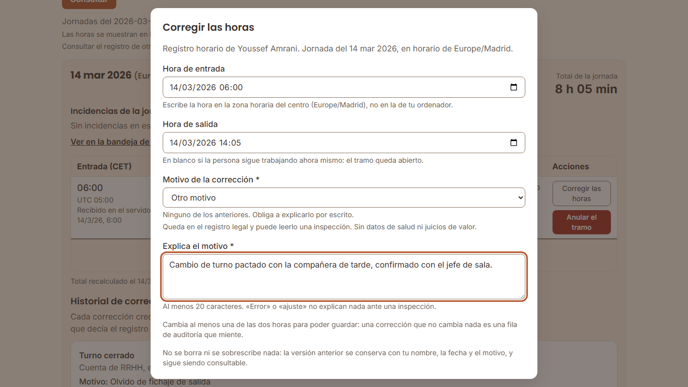

### 5.2 Los nueve motivos, con un ejemplo de cada uno

El motivo es obligatorio, **queda en el registro legal y puede leerlo una
inspección**. Sin datos de salud y sin juicios de valor sobre la persona.

| Motivo (tal cual aparece en el panel) | Ejemplo real |
| --- | --- |
| **Olvido de fichaje de entrada** | Entró a las 07:00 en cocina, no pasó la tarjeta y su primer fichaje es la salida de las 15:00 |
| **Olvido de fichaje de salida** | Terminó a las 22:00 y se fue sin fichar; el turno aparece abierto a la mañana siguiente |
| **Fallo técnico del quiosco** | La tablet de la entrada de personal estuvo sin corriente toda la mañana y ese turno se anota a mano |
| **Tarjeta no disponible** | Se dejó la tarjeta en la taquilla y no pudo fichar la entrada |
| **Tarjeta todavía no entregada** | Primer día de trabajo: la tarjeta estaba impresa pero se le entregó al final del turno |
| **Escaneo duplicado** | Pasó la tarjeta dos veces seguidas y salieron dos tramos donde solo hubo uno; se anula el sobrante |
| **Ajuste acordado con RRHH** | Rectificación pactada con la persona tras revisar el cuadrante: no es un error del sistema |
| **Alta retroactiva** | Jornadas de la semana anterior a la puesta en marcha del sistema, que se cargan a mano |
| **Otro motivo** | Ninguno de los anteriores. **Obliga a escribir al menos 20 caracteres**: «error» y «ajuste» no explican nada ante una inspección |

### 5.3 Lo que pasa por debajo, y que hay que saber explicar

**El valor anterior se conserva siempre.** La corrección no reescribe el tramo:
crea una versión nueva y deja la anterior visible, con quién la hizo, cuándo y
por qué. En el «Historial de correcciones» de la jornada se ve el **antes** y el
**después**, uno al lado del otro.

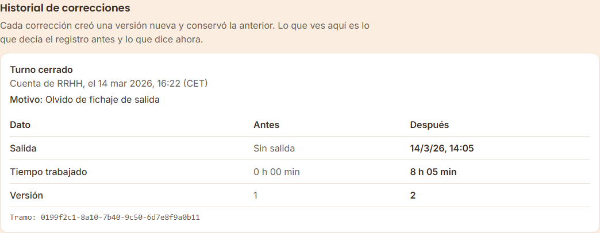

Ante una inspección, la frase es esta: *«el registro conserva todas las
versiones; esta hora se corrigió el día tal, por esta persona, por este
motivo, y aquí está lo que decía antes»*. Un registro sin ese historial es un
registro que se puede haber cambiado la víspera de la visita, y así lo lee quien
lo revisa.

Dos avisos que verás y qué significan:

- **«Este tramo ya no es la versión vigente»** — otra persona lo corrigió o lo
  anuló mientras tenías la pantalla abierta. Vuelve a cargar la jornada y mira
  cómo está ahora.
- **«Esa hora de entrada llevaría la jornada a otro día»** — mover horas de un
  día a otro son **dos acciones**: anular el tramo en el día en que está y darlo
  de alta en el día que corresponde, cada una con su motivo. El sistema no lo
  hace en un solo paso porque cambiar de día una jornada cambia qué se paga en
  qué mes.

**El empleado no corrige su propio registro**, y por eso el portal es solo de
consulta. Un registro que la persona interesada puede editar no prueba nada. Lo
que sí puede hacer es avisar, y RRHH corrige con su firma.

---

## 6. Informes, exportaciones y la entrega a la Inspección

Son dos cosas distintas y se confunden con facilidad:

| | **Informe de horas por periodo** | **Exportación para la Inspección** |
| --- | --- | --- |
| Para qué | Gestión: cuánto se ha trabajado, por quién, con qué desviación | Cumplir un requerimiento del art. 34.9 del Estatuto de los Trabajadores |
| Dónde | Informes | Inspección |
| Qué lleva | Totales agregados por persona, departamento o centro | **Todos los tramos, uno a uno, y todas las correcciones con su autor y su motivo** |
| Formato | CSV, Excel o PDF | CSV normalizado, con sus criterios y su base legal declarados dentro |

### 6.1 El informe de horas por periodo

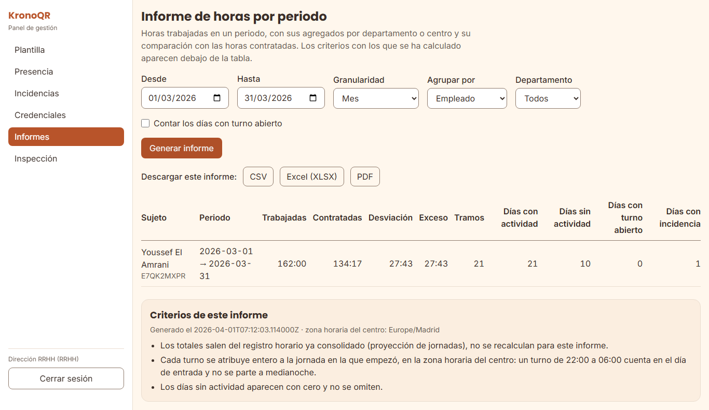

Se elige el periodo, la granularidad (día, semana, mes o todo el periodo) y la
agrupación (empleado, departamento o centro). Debajo de la tabla, el propio
informe declara **con qué criterios se ha calculado**: es lo que permite
defender un número seis meses después.

Dos avisos que conviene leer:

- **«Contar los días con turno abierto»**: si lo activas, entran días cuyo total
  todavía va a cambiar. Para una nómina, ciérralos antes.
- **«Días-persona sin contrato registrado»**: esas filas tienen las horas
  trabajadas bien y la desviación incompleta (§2.3).

### 6.2 La exportación para la Inspección

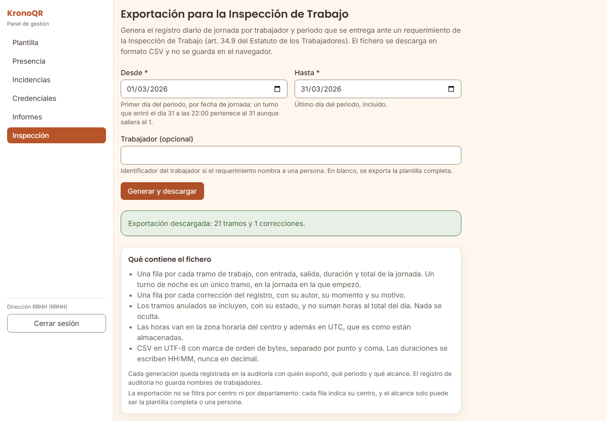

Se eligen las fechas y, si el requerimiento nombra a una persona, esa persona.
En blanco, sale la plantilla completa. Qué contiene el fichero:

- Una fila por cada **tramo**, con entrada, salida, duración y total de la
  jornada. Un turno de noche es un único tramo, en la jornada en la que empezó.
- Una fila por cada **corrección**, con su autor, su momento y su motivo.
- **Los tramos anulados se incluyen**, marcados como tales, y no suman horas.
  Nada se oculta: ocultarlos sería exactamente lo que la Inspección busca.
- Las horas van en la zona horaria del centro **y además** en UTC, que es como
  están almacenadas.
- Las duraciones se escriben HH:MM, nunca en decimal.

**Cada generación queda registrada** con quién exportó, qué periodo y qué
alcance.

> **El procedimiento completo, con los plazos y qué hacer con el fichero
> después de entregarlo, está en
> [`../runbooks/requerimiento-inspeccion.md`](../runbooks/requerimiento-inspeccion.md).**
> Léelo **antes** de que llegue el requerimiento, no cuando llegue: son cinco
> minutos que ahorran la hora.

---

## 7. El perfil de cumplimiento

**Cumplimiento** son los umbrales legales con los que se revisa el registro:
descanso mínimo entre jornadas, jornada diaria y semanal ordinaria, tramo máximo
sin pausa, día de inicio de semana, festivos y años de conservación.

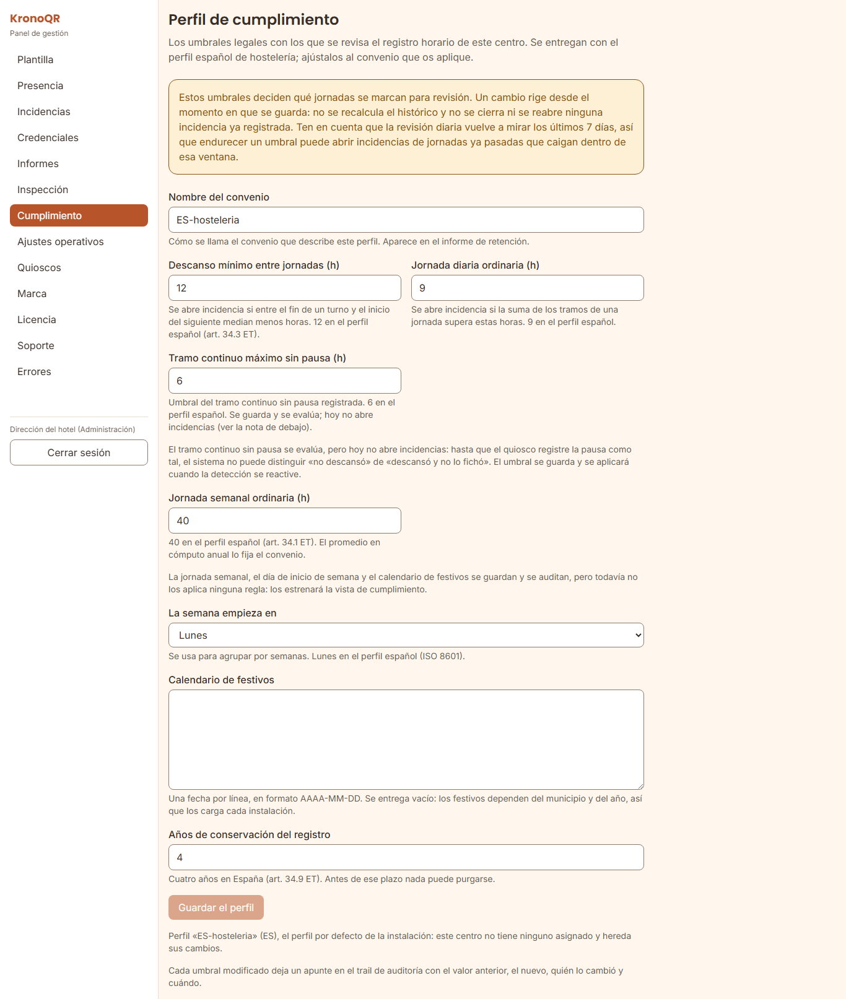

**Cambiar un umbral cambia qué se considera incidencia.** Bajar el descanso
mínimo de 12 h a 10 h no cambia ninguna hora del registro: cambia **qué
jornadas se marcan para revisión**. Es un cambio con efecto legal, y por eso:

- Rige **desde el momento en que se guarda**. No se recalcula el histórico ni se
  cierra ni se reabre ninguna incidencia ya registrada.
- La revisión diaria vuelve a mirar los últimos días, así que **endurecer** un
  umbral puede abrir incidencias de jornadas recientes ya pasadas.
- Queda anotado en el registro de auditoría con el valor anterior, el nuevo,
  quién lo cambió y cuándo. Sin eso no se puede explicar por qué una jornada de
  hace tres meses no generó ninguna alerta.

El producto se entrega con el perfil español de hostelería. **Ajustarlo al
convenio que os aplique es responsabilidad del hotel**, no del fabricante: lo
explica [`obligaciones-legales.md`](obligaciones-legales.md) §7. El detalle de
cada umbral, valor a valor, está en [`configuracion.md`](configuracion.md) §2.4.

> **Los años de conservación son el único umbral que puede destruir datos.**
> Bajarlos amplía lo que la purga considera vencido, sobre datos que hay
> obligación legal de conservar cuatro años. Ninguna purga se ejecuta sola —se
> propone primero y hay que confirmarla—, pero no toques ese número sin leer
> [`obligaciones-legales.md`](obligaciones-legales.md) §4.

---

## 8. Qué hacer si…

### …una persona dice que su registro está mal

1. Abre **su registro horario** y mira el día concreto. Comprueba primero el
   **origen** de los tramos: un tramo «Registrado a mano» ya tiene una
   corrección detrás que explica de dónde salió.
2. Si falta o sobra algo, corrígelo con el motivo que corresponda (§5) y
   explícale que su versión anterior se conserva.
3. Dile que puede comprobarlo él mismo en el portal: verá el cambio y el
   historial de la corrección, con el motivo.

**Nunca corrijas «por si acaso».** Si no está claro qué pasó, pregunta al
responsable del turno antes de firmar una hora.

### …alguien olvidó fichar la salida

Aparecerá como incidencia **«Turno abierto sin cerrar»**. El sistema no lo cierra
solo (§4.2).

1. Averigua la hora real de salida: pregunta al responsable del turno; no la
   deduzcas del cuadrante.
2. En el registro horario de esa persona, **«Corregir las horas»** y escribe la
   salida, con el motivo **«Olvido de fichaje de salida»**.
3. Cierra la incidencia como **«Se ha corregido»**, con la nota de quién
   confirmó la hora.

Si el olvido es de hace semanas, el procedimiento es el mismo: los turnos
abiertos se revisan siempre, sin límite de antigüedad, y no desaparecen solos.

### …se pierde o se rompe una tarjeta

Es el mismo procedimiento en los dos casos, y también cuando el PDF de la
impresión se pierde antes de imprimirla:
**[`../runbooks/tarjeta-perdida-o-rota.md`](../runbooks/tarjeta-perdida-o-rota.md)**.

En resumen: **revocar con motivo → emitir otra → imprimir → entregar con su
hoja**. Y avisa a la persona de que **mientras tanto puede fichar con su código
y su PIN** en la propia tablet: nadie se queda sin poder fichar por haber
perdido una tarjeta.

### …una persona pide su registro horario

La vía ordinaria es **el portal**: entra con su código y su PIN y se descarga su
historial cuando quiera, sin pedírselo a nadie. Es lo que exige la ley y lo que
evita convertir cada consulta en una gestión.
Entrégale [`guia-portal-empleado.md`](guia-portal-empleado.md).

Si la petición llega **por escrito como ejercicio de un derecho** —acceso,
rectificación, portabilidad, supresión—, tiene plazos y forma:
[`../runbooks/solicitud-derechos-rgpd.md`](../runbooks/solicitud-derechos-rgpd.md).
Ojo con una en concreto: **la supresión no procede** mientras dure el deber de
conservación de cuatro años, y el runbook explica cómo se responde eso sin
negarle el derecho.

### …llega un requerimiento de la Inspección de Trabajo

No improvises: hay un procedimiento escrito y probado, pensado para resolverse
en menos de una hora:
**[`../runbooks/requerimiento-inspeccion.md`](../runbooks/requerimiento-inspeccion.md)**.

Lo esencial: la exportación se genera desde **Inspección** (§6.2), incluye
tramos, correcciones y anulados, y declara sus propios criterios. Antes de
entregar el fichero, el runbook dice qué comprobar y qué hacer con él después.

### …una persona causa baja

Desde su ficha, apartado **«Baja»** (no se hace cambiando el campo de situación:
tiene su propio apartado porque lleva fecha de cese y consecuencias). Se elige
la fecha de cese y el motivo, que queda en el registro de auditoría —sin datos
de salud y sin juicios de valor.

Qué ocurre al confirmarla:

- **Su tarjeta queda revocada** y deja de servir en el quiosco.
- **Desde la fecha de cese no puede fichar.**
- **No se borra nada.** Su ficha, sus tramos y sus jornadas se conservan cuatro
  años, porque una inspección puede pedir el registro de alguien que ya no
  trabaja aquí, y seguirán apareciendo en los informes del periodo en que
  trabajó.

Recoge la tarjeta física si puedes; si no aparece, revócala igualmente —ya lo
está por la baja— y anótalo.

### …alguien no puede fichar

Antes de mover nada, mira su fila en **Credenciales**:

| Estado de la tarjeta | Qué significa | Qué hacer |
| --- | --- | --- |
| Sin credencial | No se le ha emitido | Emitir, imprimir y entregar (§2.4) |
| Pendiente de imprimir | Existe el derecho, no la tarjeta | Imprimirla |
| Pendiente de entregar | Está impresa y no la tiene en la mano | Entregársela y registrar la entrega |
| Entregada | Debería poder fichar | Ver abajo |
| Revocada | Se revocó, por pérdida o por baja | Emitir otra (§2.4) o comprobar si la baja es correcta |

Si consta **Entregada** y aun así no ficha, **puede fichar con su código y su
PIN en la tablet** mientras se averigua qué pasa: eso no espera. Si le ocurre a
varias personas a la vez, o el tablero avisa de que hay tarjetas firmadas con
una clave que el servidor ya no reconoce, **es cosa de IT**:
[`operacion.md`](operacion.md).

### …la bandeja se llena de incidencias iguales

Suele ser una de dos cosas, y ninguna se arregla resolviéndolas una a una:

- **Un umbral que no encaja con vuestro convenio.** Si toda la plantilla genera
  «Jornada demasiado larga», el umbral está mal ajustado, no la plantilla (§7).
- **Una tablet con la hora desviada** genera «Desfase de reloj» en cadena. Los
  fichajes están registrados; lo que hay que arreglar es la tablet, y eso es de
  IT ([`operacion.md`](operacion.md)).

### …hay un aviso de licencia en el panel

**Sigue fichando todo y sigues teniendo acceso a todo el registro.** Una licencia
caducada nunca detiene el fichaje, ni la consulta, ni la corrección, ni la
exportación para la Inspección: lo que se degrada son funcionalidades accesorias
—por ejemplo, la marca propia vuelve a la del producto—. Dejarte sin registro
horario por una cuestión comercial te dejaría incumpliendo la ley, y eso no lo
hace este producto. Avisa a quien lleve la relación con el proveedor; el detalle
está en [`configuracion.md`](configuracion.md) §3 bis.3.
