# Instalación de KronoQR

Guía para el personal de IT del hotel. **No hace falta saber Laravel, PHP ni
Vue.** Hace falta un servidor Linux con Docker y treinta minutos.

> **Estado.** El procedimiento de esta guía es el real y está probado en cada
> publicación de versión (etapa de instalación limpia de la integración
> continua del fabricante). Las capturas son de la versión 2.2 y se regeneran
> en cada versión menor. Cuando el sistema esté instalado, sigue con
> [`endurecimiento.md`](endurecimiento.md): el servidor, la red y las tablets.
> This guide is also available in English: [`en/installation.md`](en/installation.md).

---

## 0. Antes de empezar: los cinco minutos que ahorran la tarde

### El servidor

| Recurso | Mínimo (≤ 100 empleados) | Recomendado (≤ 500) |
| --- | --- | --- |
| CPU | 2 núcleos | 4 núcleos |
| RAM | 4 GB | 8 GB |
| Disco | 40 GB SSD | 100 GB SSD |
| Sistema | **Linux** con **Docker 24 o superior** y **Compose v2**, y `setpriv` (paquete `util-linux`, de serie en Debian, Ubuntu y RHEL 7 o posterior; lo usa `update.sh`) | Íd. |
| Red | Alcanzable desde la red interna. Salida a internet **opcional** | Íd. |

**¿Da la talla este servidor para mi cambio de turno?** El mínimo está
dimensionado para una plantilla de hasta 100 personas con la configuración de
serie; el recomendado, hasta 500. Son objetivos de diseño, todavía sin una
medición en hardware de referencia que podamos entregarte: para una cifra de tu
servidor hay una prueba de carga que lo dice requisito a requisito, y un solo
mando que tocar —`PHP_FPM_MAX_CHILDREN`— cuando sobra CPU y falta pool:
[`operacion.md`](operacion.md) **§17**. Se ejecuta **en un entorno de pruebas,
nunca en producción**.

**Linux con Docker, sin ambigüedad.** No existe instalador de Windows y no está
previsto que exista. Si tu infraestructura es solo Windows, la instalación va
sobre una **máquina virtual Linux** (Hyper-V, VMware, Proxmox: cualquiera).
Te lo decimos ahora y no a mitad del proceso.

**Sin salida a internet el sistema funciona entero.** La verificación de la
licencia es local por diseño: el producto no llama a ningún servidor del
fabricante, nunca. Sin internet solo pierdes los certificados automáticos de
Let's Encrypt (usas el tuyo) y el correo si tu SMTP es externo. Para instalar
sin internet, ver §7.

> **Sobre la memoria.** El instalador exige **3700 MiB** y no 4096, y no es una
> rebaja: una máquina virtual de 4 GB declara entre 3800 y 3950 MiB porque el
> propio núcleo se reserva una parte. Exigir 4096 haría fallar a toda máquina
> que cumple el mínimo publicado.

### El punto de fichaje

Un punto de fichaje es **una tablet fijada a la pared o a un mostrador**:
Android 10 o superior, cámara trasera con autoenfoque, corriente permanente,
wifi estable dentro de la VLAN de quioscos (§6) y modo quiosco. La tabla
completa de lo que hay que comprar —y conviene leerla antes de comprar veinte—
está en el runbook [`../runbooks/alta-nuevo-quiosco.md`](../runbooks/alta-nuevo-quiosco.md)
§1, que es donde se compra y se monta; aquí no se repite para que no haya dos
versiones.

**El modo quiosco lo configuras tú y no es una funcionalidad del producto.**
Ninguna aplicación web puede impedir que alguien deslice y salga al escritorio:
fijar la tablet a una sola aplicación es configuración del dispositivo —*device
owner* de Android Enterprise, tu MDM o el modo de aplicación fijada del
fabricante—. Sin ella, un roce accidental deja la tablet fuera de la aplicación
y el siguiente empleado no encuentra dónde fichar.

El procedimiento completo —modo quiosco, arranque automático tras un corte de
luz, brillo, ventana de actualizaciones de Android y red— está en el runbook
[`../runbooks/alta-nuevo-quiosco.md`](../runbooks/alta-nuevo-quiosco.md) §2,
que también cubre el emparejamiento de la primera tablet.

### Lo que tienes que traer decidido

1. **La URL** por la que los quioscos y el panel llegarán al servidor
   (`https://fichaje.tuhotel.local`, por ejemplo).
2. **El certificado TLS** para ese nombre, con su clave privada.
3. **El rango de red de las tablets** (`KIOSK_VLAN_CIDR`) y el de la red desde
   la que se podrá abrir el portal del empleado (`PORTAL_INTERNAL_CIDR`). Los
   dos están explicados en §6. Opcional, pero recomendable: la red desde la que
   se abrirá el panel de gestión (`ADMIN_INTERNAL_CIDR`; vacía, no filtra).
4. **Dónde se guardan las copias de seguridad** (`BACKUP_PATH`): en un
   destino **que no sea el disco del propio servidor** y **alojado en la Unión
   Europea** (§6, «`BACKUP_PATH`»). Si es un recurso de red, **montado antes de
   instalar**.
5. **La clave de licencia**, si ya la tienes. Si no, instala igualmente: se
   activa después y el sistema **ficha con normalidad sin ella**.

### Lo que el instalador hace por ti, y lo que no

| Hace | No hace |
| --- | --- |
| Comprueba los requisitos antes de tocar nada | **No crea usuarios**: la primera cuenta la creas tú en el asistente |
| Genera todos los secretos **en tu servidor** | **No siembra datos de demostración**: ni un empleado, ni un fichaje |
| Levanta los servicios y aplica el esquema | **No pide licencia** para completarse |
| Verifica que el sistema responde | **No toca una instalación previa**: si la encuentra, se aparta |
| Deshace lo que haya hecho si algo falla | No configura tus tablets (eso es el runbook `alta-nuevo-quiosco.md`) |

---

## 1. El procedimiento, de principio a fin

### 1.1 Descarga, comprueba y descomprime el paquete

**El paquete se descarga, público, de la página de versiones:**
<https://github.com/BorjaPeonSaiz/KronoQR/releases>. No hace falta cuenta ni
contraseña. **La licencia no está ahí**: te la envía tu proveedor aparte (§4).

**Qué versión elegir.** La más reciente de la serie `v2.2.x` (en esta guía, los
ejemplos usan la `2.2.0`; escribe la que hayas elegido). **Nunca** una cuyo
título o notas digan «no usar», ni una marcada como *Pre-release*: no son para
instalaciones de cliente.

De cada versión necesitas dos ficheros, que están en su apartado *Assets*:

| Fichero | Qué es |
| --- | --- |
| `kronoqr-<versión>.tar.gz` | El paquete de instalación |
| `SHA256SUMS` | Las sumas para comprobar que llegó entero |

El tercero, `kronoqr-<versión>.cdx.json`, es la lista de componentes del
producto (SBOM): no hace falta para instalar.

Desde el servidor, en una carpeta de trabajo:

```bash
curl -fLO https://github.com/BorjaPeonSaiz/KronoQR/releases/download/v2.2.0/kronoqr-2.2.0.tar.gz
curl -fLO https://github.com/BorjaPeonSaiz/KronoQR/releases/download/v2.2.0/SHA256SUMS
```

> **Si el servidor no tiene salida a internet**, descarga los dos ficheros
> desde otro equipo con el navegador y cópialos a la misma carpeta del servidor
> (`scp`, WinSCP o un USB). Basta con eso: la instalación no necesita GitHub.

Con los dos en la misma carpeta, comprueba que el paquete llegó entero:

```bash
sha256sum -c --ignore-missing SHA256SUMS
```

Tiene que decir `kronoqr-2.2.0.tar.gz: OK`. Si dice `FAILED`, no lo
descomprimas: bórralo y vuelve a descargarlo; si vuelve a fallar, avisa a tu
proveedor. Si dice `no properly formatted checksum lines found`, lo que
descargaste como `SHA256SUMS` es una página web y no el fichero: descárgalo de
nuevo desde *Assets*. `--ignore-missing` está para que no se queje del SBOM si
no lo has descargado.

> Esta suma prueba que el paquete no se corrompió por el camino. Las sumas
> viajan en la misma página que el paquete, así que no prueban por sí solas
> quién lo publicó: descárgalo siempre de la dirección de arriba, nunca de una
> copia reenviada.

```bash
tar xzf kronoqr-2.2.0.tar.gz
cd kronoqr-2.2.0
ls -A
```

Deberías ver esto:

```
docker-compose.yml       Definición de los servicios. No se toca.
.env.example             Plantilla de configuración. La copias en el paso 1.2.
install.sh               El instalador.
update.sh                El actualizador: a una versión posterior, con vuelta atrás.
doctor.sh                Diagnóstico en un comando, sin entrar al contenedor.
backup.sh restore.sh     Copias de seguridad y restauración.
restore-drill.sh         Simulacro trimestral de restauración.
lib/                     Bibliotecas de los scripts. No se tocan.
observability/           Alertas y cuadros de mando (operacion.md §10.4).
certs/                   Aquí colocas tu certificado (paso 1.2).
VERSION                  La versión que se va a instalar.
versions.txt             Versiones publicadas y desde cuáles se actualiza. No se toca.
images.lock              La huella (digest) de cada imagen de esta versión. No se toca.
docs/cliente/            Esta guía y las demás del cliente, en español y en inglés (en/).
docs/runbooks/           Procedimientos: restaurar, rotar secretos, alta de
                         quiosco, requerimiento de Inspección, RGPD…
docs/CHANGELOG.md        Qué cambia en cada versión.
```

> **`./doctor.sh`, para cuando algo no va bien.** Localiza la instalación solo
> (igual que `update.sh`; `--current RUTA` la fija a mano si hace falta) y:
>
> - **Si la aplicación está en marcha**, delega en el diagnóstico real del
>   producto (`php artisan product:doctor`) y muestra su informe completo:
>   base de datos, colas, correo, certificado, permisos, disco, licencia, la
>   última copia de seguridad y las redes del borde, cada comprobación con qué
>   hacer si está en rojo. Después mira desde fuera lo que la aplicación no ve:
>   que los procesos de fondo `scheduler` y `horizon` están en marcha (sin ellos
>   no hay copias ni tareas nocturnas, y es un fallo) y `reverb` (un aviso), y
>   que lo ejecutas desde el directorio **vigente** de la instalación.
> - **Si la aplicación está parada** —el caso para el que este script existe:
>   sin ella, `docker compose exec` no sirve de nada—, comprueba desde fuera
>   lo que se puede: que Docker responde, el estado de cada servicio, que el
>   `.env` está y con permisos `0600`, el espacio libre, el certificado y su
>   caducidad, y si algo escucha en los puertos configurados. Y dice cómo
>   arrancarla.
> - **En los dos casos** revisa las redes del `.env` (`KIOSK_VLAN_CIDR`,
>   `PORTAL_INTERNAL_CIDR`, `METRICS_ALLOW_CIDR` y `TRUSTED_PROXY_CIDR`, §6) y
>   detecta si **Redis se reinicia en bucle**, lo típico tras un corte de luz:
>   si la causa es su fichero de persistencia dañado, te da las tres órdenes
>   que lo reparan ([`operacion.md`](operacion.md) §18).
>
> Nunca imprime un secreto: del `.env` solo lee rutas, puertos y nombres de
> fichero. Sus códigos de salida están en la sección 2, más abajo.

### 1.2 Coloca el certificado y rellena la configuración

```bash
cp /ruta/de/tu/certificado.crt certs/tls.crt
cp /ruta/de/tu/clave.key       certs/tls.key

# IMPRESCINDIBLE: el servidor web corre SIN PRIVILEGIOS, con el uid 101,
# y no puede abrir un fichero de root.
sudo chown 101:101 certs/tls.crt certs/tls.key
sudo chmod 0444 certs/tls.crt
sudo chmod 0400 certs/tls.key

cp .env.example .env
```

> **Por qué esas tres órdenes, y qué pasa si te las saltas.** `cp` conserva los
> permisos del original, y las claves privadas se escriben `0600` para el
> usuario que las creó —normalmente `root`—. El borde HTTP de KronoQR corre
> dentro de su contenedor **sin privilegios**, como el uid `101`, así que no
> puede abrir esa clave: nginx entra en **bucle de reinicio** con
> `cannot load certificate key ... Permission denied` y no se sirve nada.
>
> **El instalador lo comprueba en la fase 1 y no instala si no puede leerlos**,
> así que no vas a descubrirlo con el sistema a medias.
>
> **Si `TLS_CERT_DIR` apunta a un directorio compartido con otro servicio** —el
> de Let's Encrypt, por ejemplo—, **no le cambies el propietario**: romperías
> ese otro servicio. Copia el certificado a un directorio propio, apunta ahí
> `TLS_CERT_DIR` y aplica allí esas órdenes.
>
> Si `tls.key` queda legible por todo el servidor (`0444`, `0644`), el sistema
> **funciona** y el instalador solo avisa: es tu clave privada y la decisión es
> tuya, pero cualquiera con una sesión en esa máquina puede copiarla.

Abre `.env` con tu editor. **Cada variable lleva una marca. Solo tienes que
tocar las marcadas `[CLIENTE]`:**

| Marca | Qué significa |
| --- | --- |
| `[CLIENTE]` | Lo rellenas tú. El instalador comprueba que están y no instala si falta alguna. |
| `[INSTALADOR]` | **Déjalo vacío.** Lo genera el instalador en tu servidor. Si escribes algo, lo sustituye. |
| `[FIJO]` | No se toca. Cambiarlo rompe algo que no se parece a este fichero. |
| Sin marca | Tiene un valor por defecto pensado. Si dudas, déjalo como está. |

Lo mínimo que hay que rellenar:

```dotenv
APP_ENV=production
APP_URL=https://fichaje.tuhotel.local
KIOSK_VLAN_CIDR=10.0.30.0/24
PORTAL_INTERNAL_CIDR=10.0.10.0/24
METRICS_ALLOW_CIDR=172.29.0.20/32
TLS_ALLOW_SELF_SIGNED=false
BACKUP_PATH=/var/backups/fichaje
IMAGE_REGISTRY=ghcr.io/kronoqr
```

**Los tres valores de red y `APP_URL` no pueden quedarse como vienen.** El
instalador **compara con la plantilla** y se niega a instalar si `APP_URL`,
`KIOSK_VLAN_CIDR` o `PORTAL_INTERNAL_CIDR` siguen con el valor de ejemplo. El
motivo es concreto: con `APP_URL=https://localhost` el sistema arranca, todas
las comprobaciones pasan —la verificación final sondea `127.0.0.1`— y **ningún
quiosco puede llegar a él**. Nada posterior detecta eso.

**`METRICS_ALLOW_CIDR=172.29.0.20/32` se deja tal cual.** Es la dirección fija
de Prometheus, el recolector de métricas del propio producto, y es el valor
correcto: el instalador lo acepta y solo comprueba que sea un rango válido y
que cubra a Prometheus (§6).

**Además de la forma, el instalador comprueba qué hace cada valor**, y avisa
—sin impedir la instalación— si algo no cuadra: un `PORTAL_INTERNAL_CIDR` que
no contiene ninguna red de este servidor ni la de los quioscos (el portal daría
`403` a todo el mundo), un rango abierto a todo internet, un `MAIL_HOST` que
sigue en `mailpit` (el buzón de pruebas del fabricante: no saldría ningún
correo), la licencia vacía o ningún destinatario de alertas. `update.sh` y
`./doctor.sh` repiten las comprobaciones de redes en cada ejecución.

**`IMAGE_REGISTRY=ghcr.io/kronoqr` es el valor de la plantilla y hoy no
descarga nada: pon el que te da el fabricante.** Las imágenes se publican en el
registro de contenedores de GitHub (GHCR) bajo la cuenta del fabricante, con la
forma `ghcr.io/<cuenta-del-fabricante>/kronoqr`, y el valor exacto te llega por
escrito junto con la licencia. Escríbelo sin barra final y sin versión: el
instalador añade él solo `/php:<versión>`, `/nginx:<versión>` y
`/postgres:<versión>`.

**Antes de instalar, comprueba que tu servidor puede descargarlas.** Copia estas
dos órdenes tal cual, después de guardar el `.env`:

```bash
registro="$(sed -n 's/^IMAGE_REGISTRY=\([^ #]*\).*/\1/p' .env)"
docker pull "${registro}/php:$(cat VERSION)"
```

Si termina con `Status: Downloaded newer image` (o `Image is up to date`), está
bien y no hace falta nada más. **Las imágenes del fabricante son de acceso
público: no hace falta `docker login` ni ningún token para descargarlas.** Si
responde `denied`, `unauthorized` o `manifest unknown`, el valor que tienes
escrito no es el correcto —GHCR contesta `denied` también cuando la ruta no
existe—: revísalo letra a letra (§5, «…dice "no se han podido descargar las
imagenes"»). Es la única variable de este bloque que no puedes deducir tú: si
no la tienes por escrito, pídela antes de seguir.

**`TLS_ALLOW_SELF_SIGNED=false` en producción, y el instalador lo exige.** Con
`true`, el servidor web se genera un certificado autofirmado: las tablets
avisarían de sitio no seguro cada mañana y alguien acabaría desactivando la
comprobación de certificado en ellas. Desde ese día, el canal por el que viajan
los fichajes no lo protege nadie.

**Desde la tarea 3.8, `APP_URL` y `TLS_ALLOW_SELF_SIGNED` también llegan a
Prometheus** (si el perfil `observability` está encendido): son las dos
variables que gobiernan la alerta `CertificadoTlsNoVerificable` (sondea
contra `APP_URL` con verificación de identidad activa; se omite por completo
si declaraste `TLS_ALLOW_SELF_SIGNED=true`). No hace falta ninguna variable
nueva ni ningún paso adicional — las dos ya las rellenaste arriba, y llegan
solas hasta ahí. Detalle en
[`operacion.md`](operacion.md) §10.4 y
[`../runbooks/renovacion-certificado-tls.md`](../runbooks/renovacion-certificado-tls.md) §3.4.

**`APP_TIMEZONE=UTC` no se toca nunca.** Las horas se guardan siempre en UTC y
se muestran en la zona horaria de cada centro, que se configura después, en el
panel. Cambiar esta variable invalida el cálculo de la jornada.

**`APP_DEBUG=false` no se toca nunca.** Con `true`, cualquier error muestra las
contraseñas de la instalación a quien lo provoque. La aplicación **se niega a
arrancar** con `APP_ENV=production` y `APP_DEBUG=true`, y dice cómo corregirlo.

### 1.3 Comprueba los requisitos sin tocar nada

```bash
sudo ./install.sh --check-only
```

Esto **no escribe absolutamente nada**. Sirve para reservar la ventana de
mantenimiento sabiendo que va a salir bien.

> **Con `sudo`, y no es un detalle.** El instalador tiene que asignar el
> propietario del directorio donde PostgreSQL archiva su registro de escritura
> (`BACKUP_PATH/wal`), y eso exige root. **Pertenecer al grupo `docker` no
> basta**: sirve para hablar con Docker, no para asignar propietarios. La
> fase 1 lo comprueba y te lo dice antes de escribir nada.

Salida esperada:

```
Fase 1 de 5 — comprobando requisitos. Todavia no se escribe nada.
  [ok]    Fichero de compose /opt/kronoqr-2.2.0/docker-compose.yml
  [ok]    Version que se instala: 2.2.0
  [ok]    Plantilla de configuracion /opt/kronoqr-2.2.0/.env
  [ok]    Permiso para hablar con Docker
  [ok]    Docker 27.3.1 (se exige 24 o superior)
  [ok]    Docker Compose v2 (2.29.7)
  [ok]    openssl disponible para generar los secretos
  [ok]    curl disponible para verificar la instalacion
  [ok]    CPU: 4 nucleos (minimo publicado: 2)
  [ok]    Memoria: 7936 MiB (minimo publicado: 3700 MiB)
  [ok]    Disco libre en /var/lib/docker: 92 GiB (minimo publicado: 40 GiB)
  [ok]    APP_URL relleno en la plantilla
  [ok]    KIOSK_VLAN_CIDR relleno en la plantilla
  [ok]    PORTAL_INTERNAL_CIDR relleno en la plantilla
  [ok]    BACKUP_PATH relleno en la plantilla
  [ok]    TLS_CERT_DIR relleno en la plantilla
  [ok]    METRICS_ALLOW_CIDR relleno en la plantilla
  [ok]    APP_ENV=production
  [ok]    APP_DEBUG=false
  [ok]    KIOSK_VLAN_CIDR es un CIDR IPv4 valido (10.0.30.0/24)
  [ok]    PORTAL_INTERNAL_CIDR es un CIDR IPv4 valido (10.0.10.0/24)
  [ok]    METRICS_ALLOW_CIDR es un CIDR IPv4 valido (172.29.0.20/32)
  [ok]    PORTAL_INTERNAL_CIDR=10.0.10.0/24 cubre una red de este servidor o la de los quioscos
  [ok]    METRICS_ALLOW_CIDR=172.29.0.20/32 cubre a Prometheus (172.29.0.20)
  [ok]    COMPLIANCE_PROFILE relleno en la plantilla
  [ok]    LICENSE_KEY tiene el formato esperado
  [ok]    MAIL_HOST apunta a un servidor de correo propio
  [ok]    ALERT_EMAIL_*: hay al menos un destinatario de alertas
  [ok]    APP_URL: https://fichaje.tuhotel.local
  [ok]    El nombre fichaje.tuhotel.local resuelve desde este servidor
  [ok]    Certificado TLS en /opt/kronoqr-2.2.0/certs
  [ok]    El borde (uid 101) puede leer tls.crt
  [ok]    El borde (uid 101) puede leer tls.key
  [ok]    Puerto 80 libre
  [ok]    Puerto 443 libre
  [ok]    Se puede escribir en /var/backups/fichaje
  [ok]    Se puede escribir en /opt/kronoqr-2.2.0
  [ok]    Privilegios para asignar el propietario del archivo de WAL

Requisitos cumplidos: 38 comprobaciones, 0 avisos.

Solo comprobacion (--check-only): no se ha tocado nada. Vuelve a ejecutar sin la opcion para instalar.
```

Si algo sale en `[FALLA]`, debajo tienes una línea **«Que hacer»** con la orden
concreta. Los avisos (`[aviso]`) no impiden instalar.

**En inglés**, con `--lang en` o con la configuración regional del servidor.
Todos los mensajes del instalador están en los dos idiomas.

### 1.4 Instala

**Si entras al servidor por SSH, lánzalo dentro de `tmux`** (o de `screen`).
Así, si se corta la conexión, la instalación sigue y puedes volver a verla al
reconectar con `tmux attach -t kronoqr`. Si no lo tienes,
`sudo apt install tmux` en Debian o Ubuntu.

```bash
tmux new -s kronoqr
sudo ./install.sh
```

Si aun así se interrumpe a mitad —se corta la conexión sin `tmux`, alguien
pulsa Ctrl+C o se detiene el proceso—, el instalador **deshace lo que había
hecho** y sale con `4`: vuelve a ejecutarlo. Lo explican la tabla de §2 y
«…se cortó la conexión a mitad de la instalación» en §5.

Tarda entre tres y quince minutos, según lo que tarde en descargar las
imágenes. Verás las cinco fases. Al terminar:

```
KronoQR 2.2.0 instalado y verificado.

  Panel de gestion:    https://fichaje.tuhotel.local/admin/
  Quiosco (tablet):    https://fichaje.tuhotel.local/kiosk/
  Portal del empleado: https://fichaje.tuhotel.local/portal/  (solo desde PORTAL_INTERNAL_CIDR)

SIGUIENTE PASO: abre el panel de gestion. La primera vez te guia un asistente
que crea la organizacion, el centro, el primer administrador y el primer
quiosco. Hasta que lo termines no hay ninguna cuenta: el instalador no crea
usuarios.

DOCUMENTACION, en /opt/kronoqr-2.2.0/docs
  ...

ANTES DE CERRAR LA SESION: custodia BACKUP_ENCRYPTION_KEY fuera de este
servidor (docs/cliente/operacion.md, «Custodia de secretos»).
```

### 1.5 Comprueba tú mismo que responde

```bash
curl -fsS https://fichaje.tuhotel.local/api/v1/health
curl -fsS https://fichaje.tuhotel.local/api/v1/ready
```

Las dos tienen que devolver `200`. **Hazlo desde un quiosco, no solo desde el
servidor**: es la única forma de comprobar que el nombre del certificado
resuelve donde tiene que resolver.

### 1.6 Custodia la clave de las copias

**Ahora, antes de cerrar la sesión.** Procedimiento en
[`operacion.md`](operacion.md), sección «Custodia de secretos». Si pierdes esa
clave y pierdes el servidor, has perdido el registro horario, y el registro
horario hay que conservarlo cuatro años por ley.

**Es una sola clave.** En el `.env` verás también `BACKUP_WAL_KEY`: es la clave
del WAL archivado, el instalador la **calcula a partir de
`BACKUP_ENCRYPTION_KEY`** y se puede volver a calcular siempre desde ella. No
hace falta guardarla aparte.

### 1.7 Abre el panel y termina el asistente

`https://fichaje.tuhotel.local/admin/`.

Si la instalación está recién hecha, el panel te lleva solo al **asistente de
puesta en marcha**. No hay nada que buscar en ningún menú.

> **No hay ningún usuario y es lo correcto.** El instalador **no crea cuentas**:
> una contraseña generada por un script acaba en el historial del shell o en un
> fichero de despliegue, y ahí se queda. La primera cuenta la creas tú, aquí, y
> es la única vez que el sistema deja crear una sin estar dentro.
>
> ---
>
> ⚠️ **Haz el paso 1 ahora, antes que nada, y no publiques el panel hasta
> haberlo hecho.**
>
> La pantalla de «primer administrador» es la **única página de todo el producto
> que escribe sin pedir credenciales**, y tiene que serlo: en ese momento no
> existe ninguna cuenta con la que autenticarse. Se cierra **sola y para
> siempre** en cuanto hay una cuenta de gestión — pero **la crea quien llegue
> primero**, no quien tenga derecho.
>
> En la práctica eso significa dos cosas:
>
> 1. **No abras el puerto al exterior ni le pongas nombre DNS** hasta que el paso
>    1 esté terminado. Entra desde la red interna del hotel o por túnel SSH. Si
>    la instalación tiene que ser accesible desde fuera, hazlo **después**.
> 2. **Termina el paso 1 en la misma sesión** en la que instalas. No es un paso
>    que se deje para mañana: entre hoy y mañana la puerta sigue abierta.
>
> **Si al abrir el panel te encuentras un error 409 que dice que ya existe una
> cuenta de gestión y tú no has creado ninguna, para.** No es un fallo de la
> instalación: alguien se te ha adelantado. Trátalo como incidente de seguridad,
> avisa a quien corresponda y reinstala con el panel cerrado al exterior; el
> apartado «qué hacer si…» de esta guía lo explica paso a paso.

**Ten a mano antes de empezar**, porque el asistente te lo va a pedir:

- El **nombre del hotel** y su **zona horaria**.
- Los **departamentos** que quieras usar (recepción, pisos, cocina, sala…).
- Un **teléfono con una aplicación de autenticación** (Google Authenticator,
  Microsoft Authenticator, Aegis, 1Password… cualquiera que lea códigos TOTP).
- La **clave de licencia**, si ya la tienes. Si no, se omite: **no hace falta
  para fichar**.
- El **fichero de plantilla**, si vas a cargarla desde CSV o Excel.

#### Los ocho pasos

| # | Paso | ¿Obligatorio? | Qué hace |
| --- | --- | --- | --- |
| 1 | **Primer administrador** | Sí | Crea tu cuenta y activa su segundo factor. |
| 2 | **Datos de la organización** | Sí | Nombre visible del sistema e idiomas. |
| 3 | **Centro y zona horaria** | Sí | El hotel. **La zona horaria decide a qué día va cada turno.** |
| 4 | **Departamentos** | Se puede omitir | Los que uses. Se pueden crear después. |
| 5 | **Perfil de convenio** | Sí | Los umbrales legales, a la vista, para que los contrastes. |
| 6 | **Carga de plantilla** | Se puede omitir | Desde CSV o Excel, con comprobación previa. |
| 7 | **Licencia** | Se puede omitir | Activa la clave si la tienes. |
| 8 | **Primer quiosco** | Se puede omitir | Vincula la primera tablet con un código. |

**Se puede abandonar y retomar.** Lo hecho queda guardado: si te falta un dato o
la tablet llega mañana, cierras el navegador y vuelves cuando puedas. Ningún paso
deja el sistema en un estado del que solo se salga con una consola.

#### Paso 1 — tu cuenta, con segundo factor

Es el primer paso y no el último a propósito: **todo lo que configures después
queda registrado con tu nombre**, y sin una cuenta detrás esos registros dirían
«el sistema», que no responde a nada.

1. Escribe tu nombre, tu correo y una contraseña. La contraseña necesita **al
   menos 12 caracteres, con mayúsculas, minúsculas, números y símbolos**.

   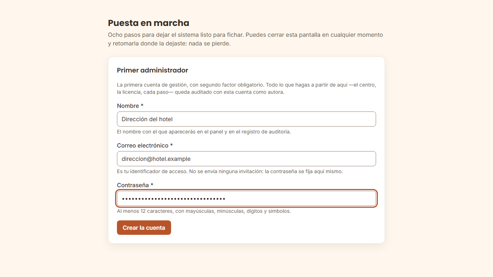

2. La pantalla siguiente enseña un **código QR y un texto**. Escanéalo con tu
   aplicación de autenticación.
3. Escribe el código de seis dígitos que te muestre el teléfono.

   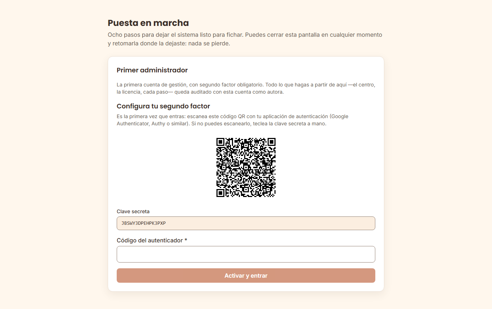

> **El código QR se enseña una sola vez.** No hay forma de volver a verlo, y es a
> propósito. Si cierras la pantalla antes de escanearlo, **no has perdido la
> cuenta**: entra por la pantalla de acceso normal con tu correo y tu contraseña
> y te lo volverá a ofrecer. Si además pierdes la contraseña, hay salida por
> consola — está en «qué hacer si…».
>
> **El segundo factor es obligatorio y no se puede desactivar** para las cuentas
> con acceso a toda la plantilla. Es la única credencial que protege el registro
> horario de todo el hotel.

#### Paso 2 — el nombre que verá todo el mundo

El nombre del establecimiento aparece en el panel, en el portal del empleado y
en la tablet. Se cambia después desde Configuración › Marca, junto con el
logotipo y el color (ver [`configuracion.md`](configuracion.md) §2.2).

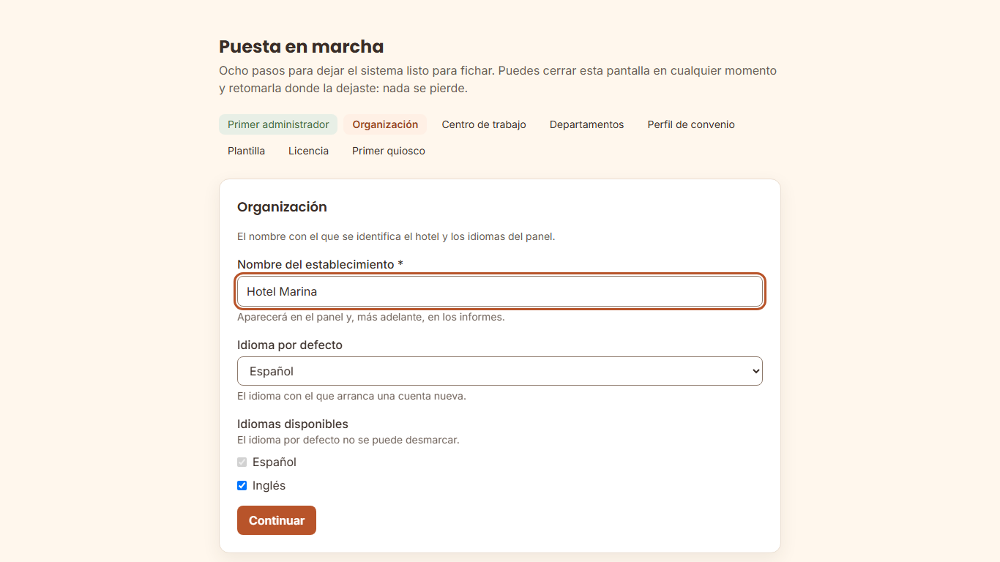

#### Paso 3 — la zona horaria no es un detalle de presentación

Es el dato con el que el sistema decide **a qué día pertenece cada turno**. Un
turno de 22:00 a 06:00 cuenta entero en el día en que empezó, y «el día» se mide
en la zona del centro.

Ponla bien a la primera. Se puede cambiar después —queda registrado— pero
**cambiarla no reescribe las jornadas ya calculadas**: a partir de ese momento se
calculan con la nueva y antes se calcularon con la anterior, mientras que el
panel, el portal y los informes pasan a enseñar todo el histórico en la zona
nueva. Con fichajes ya hechos, no la cambies sin consultarlo antes con soporte
([`configuracion.md`](configuracion.md) §6.1, `APP_TIMEZONE`).

Si el hotel está en Canarias, es `Atlantic/Canary`, no `Europe/Madrid`.

**La hora que enseña la pantalla de la tablet es la de la propia tablet**, en
la zona horaria que tenga configurada el aparato, no la del centro. Pon cada
tablet en la zona del centro, con fecha y hora automáticas. Si no, el empleado
verá una hora distinta de la de su registro; **el registro legal no se ve
afectado**: guarda el instante exacto y lo presenta siempre en la zona del
centro.

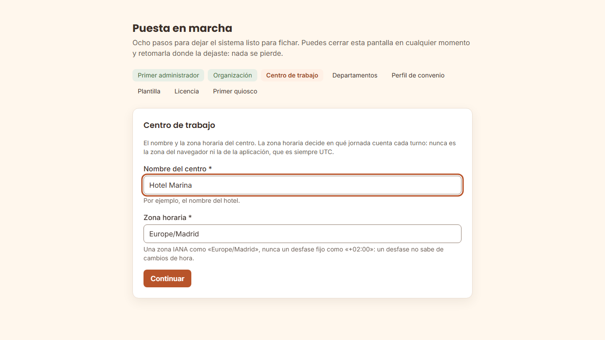

#### Paso 4 — departamentos, los que uses

Sirven para que un responsable vea solo a su gente. Añade los que tengas claros
y omite el resto: se crean después desde el panel, sin ningún coste.

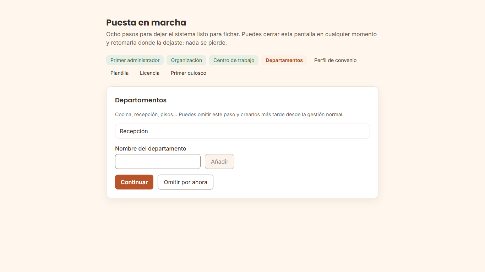

#### Paso 5 — el perfil de convenio: léelo, no lo pases

El asistente propone el perfil **`ES-hosteleria`** con estos valores, tomados del
Estatuto de los Trabajadores:

| Umbral | De serie |
| --- | --- |
| Descanso mínimo entre jornadas | 12 h |
| Jornada diaria ordinaria máxima | 9 h |
| Jornada semanal máxima | 40 h |
| Tramo continuo antes de exigir pausa | 6 h |
| Años de conservación del registro | 4 |

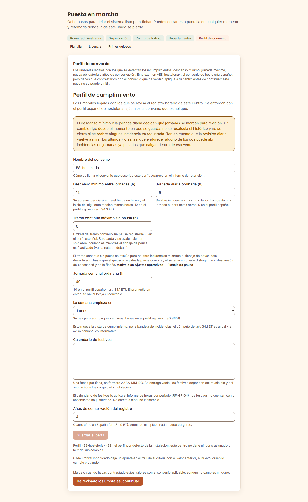

**Este paso no se puede omitir**, y es el único obligatorio que no crea nada. La
razón: **tu convenio colectivo puede ser más estricto que la ley**, y estos son
los números con los que el sistema va a avisar de incumplimientos. Contrástalos
con el convenio que os aplica y confírmalos, aunque los dejes tal cual.

Se cambian después en Configuración › Cumplimiento, y cada cambio queda
registrado.

#### Paso 6 — la plantilla, si la traes en un fichero

Dos botones y un orden: **Validar** primero, que no escribe nada y te enseña
línea a línea qué haría; **Aplicar** después, solo si el informe cuadra. Si la
plantilla la vas a dar de alta a mano, omite el paso. El formato del fichero y
las columnas están en [`configuracion.md`](configuracion.md) §3 ter.

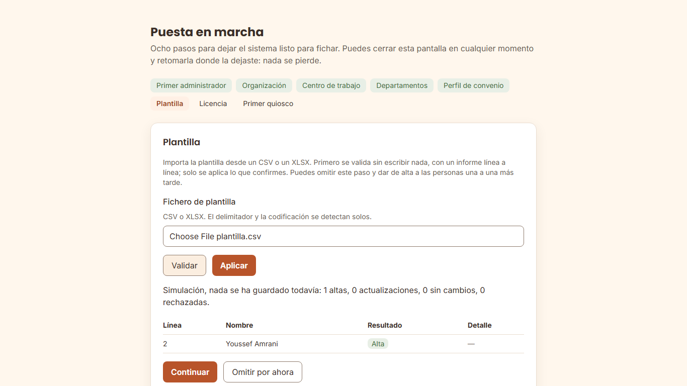

#### Paso 7 — la licencia se puede omitir, y a propósito

Sin licencia el sistema **ficha, guarda, calcula y exporta para la Inspección de
Trabajo exactamente igual**. Lo que no tendrás son los informes por periodo y
algunas funciones accesorias, con un aviso que dice cuáles.

Un asistente que exigiera la clave para terminar convertiría la licencia en un
requisito para cumplir la ley, y eso no puede ser. Actívala cuando la tengas,
desde Configuración › Licencia.

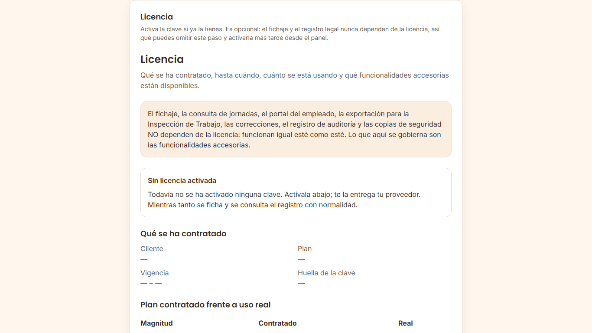

#### Paso 8 — el primer quiosco

La tablet muestra un código y tú lo escribes en el panel. Si aún no ha llegado,
**omite el paso**: el procedimiento completo para vincular una tablet está en el
runbook [`alta-nuevo-quiosco.md`](../runbooks/alta-nuevo-quiosco.md), que viene
en el paquete.

En la tablet, al abrir `https://fichaje.tuhotel.local/kiosk/` sin haberla
vinculado nunca, se ve esto:

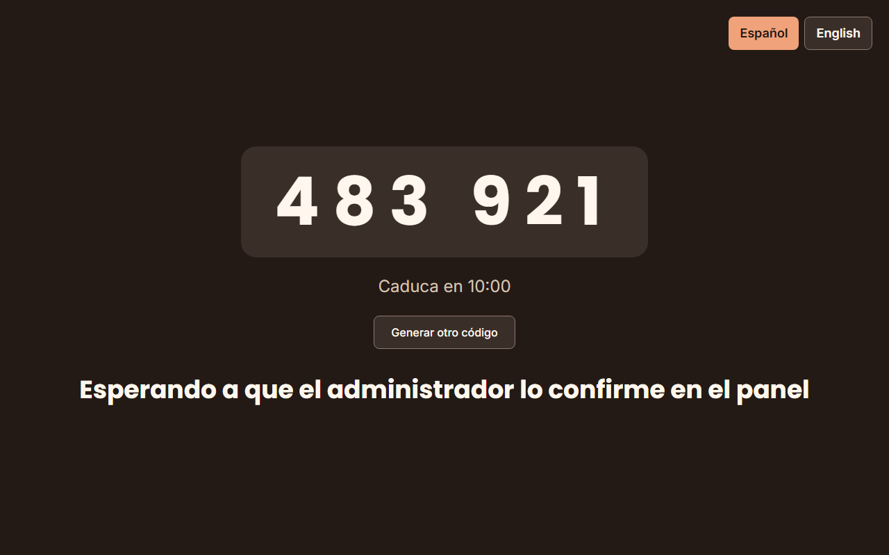

En el panel escribes ese código y el nombre con el que quieres ver el quiosco:

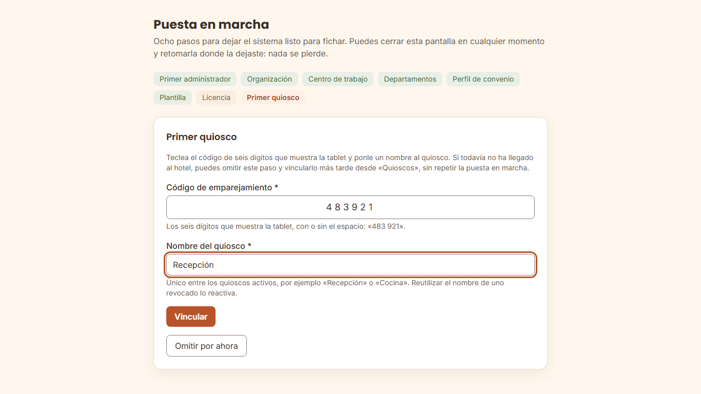

Al vincular, el asistente enseña la versión y la hora de la solicitud para que
las contrastes con la tablet, y la tablet pasa sola a la pantalla de fichaje:

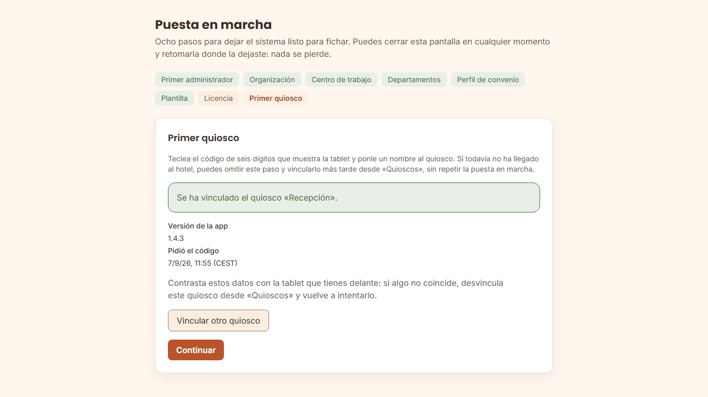

#### Y al terminar: las tarjetas

Antes de cerrar, el asistente enseña los ocho pasos con su estado —hecho,
omitido o pendiente— para que repases lo que dejaste sin hacer:

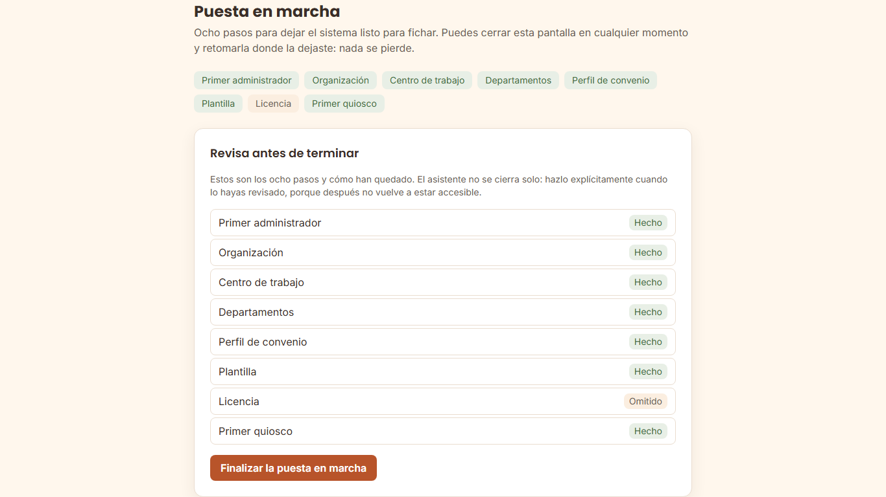

La última pantalla es un resumen con **lo que queda por hacer**. La cifra que
importa es **«tarjetas pendientes»**.

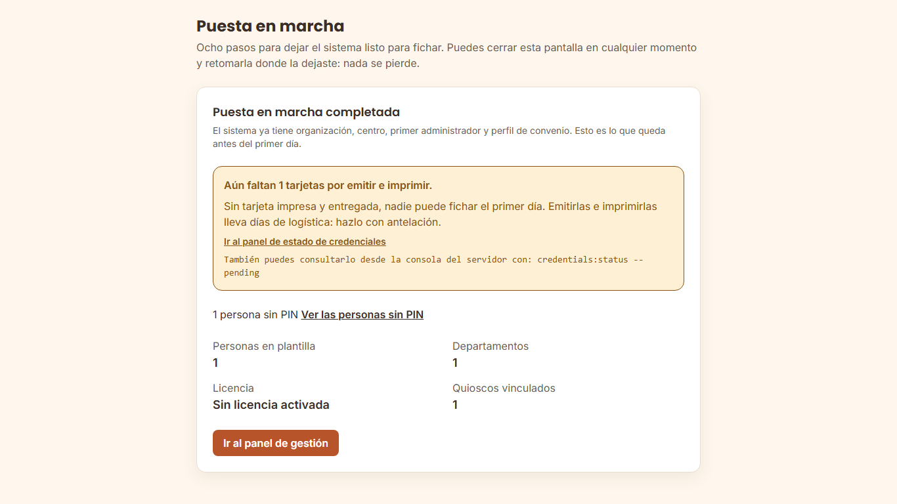

**Sin tarjeta impresa y entregada, esa persona no puede fichar.** Emitirlas,
imprimirlas y repartirlas lleva días, así que empieza en cuanto termines el
asistente:

```bash
docker compose exec app php artisan credentials:status --pending
```

> El asistente **no vuelve a aparecer**: es de un solo uso. Todo lo que configuró
> se cambia después desde el panel, y allí cada cambio queda registrado con su
> autor y su fecha.

### 1.8 Opcional: el logotipo del hotel

No hace falta para nada de lo anterior y puede esperar. Sin logotipo, las
aplicaciones y los documentos enseñan el nombre en texto.

El logotipo es un **fichero de tu servidor**, no una subida por la web: KronoQR
no acepta ficheros por HTTP a propósito. Vive en el **directorio de marca**, que
el `docker-compose` monta **de solo lectura** dentro del contenedor.

```bash
# 1. La carpeta del servidor. Cualquier ruta tuya sirve; esta es la sugerida.
sudo mkdir -p /opt/kronoqr/branding
sudo cp logo.png /opt/kronoqr/branding/logo.png
sudo chmod 0644 /opt/kronoqr/branding/logo.png

# 2. Decirle al docker-compose dónde está. Vacío = ./branding, junto al
#    docker-compose.yml.
#    En el .env:  BRANDING_PATH=/opt/kronoqr/branding
#    Se recrean los tres que la montan: app, horizon (PDF en diferido) y
#    scheduler. Con solo app, los PDF en diferido saldrían sin logotipo.
sudo docker compose up -d app horizon scheduler

# 3. Comprobar que el contenedor lo ve. Si esto sale vacío, no sigas:
#    lo que falla es el montaje, no la configuración.
sudo docker compose exec app ls -l /var/kronoqr/branding
```

Y después, en el panel, **Configuración › Marca**, escribe la ruta **de dentro
del contenedor**: `/var/kronoqr/branding/logo.png`. Se comprueba al guardar, así
que si algo no cuadra te lo dice en el momento y con qué hacer.

**Formatos y límites**: PNG o SVG (se mira el contenido, no la extensión),
512 KiB y 2048 píxeles de lado como máximo.

> **Cambiar el logotipo después no exige reiniciar nada**: sustituye el fichero
> en la carpeta del servidor y la petición siguiente ya lo sirve. El paso 2 solo
> se repite si mueves la carpeta.

Todo esto es opcional también en otro sentido: la marca propia es una
funcionalidad del plan. Si tu licencia no la incluye, lo que configures se guarda
y se aplica solo cuando la licencia lo cubra — mientras tanto se ve la marca de
KronoQR. Detalle en [`configuracion.md`](configuracion.md) §2.2.

---

## 2. Códigos de salida del instalador: qué hacer con cada uno

Los scripts de operación (`install.sh`, `update.sh`, `doctor.sh`,
`backup.sh`, `restore.sh`, `restore-drill.sh`) usan **la misma tabla**
([`operacion.md`](operacion.md) §8). Sirve para escribir un cron
o un runbook sin leerse cada script.

| Código | Significa | Qué hacer |
| --- | --- | --- |
| `0` | Correcto. | Nada. Sigue en el paso 1.5. |
| `1` | **Uso incorrecto.** Un argumento que no existe. Nada tocado. | `./install.sh --help`. |
| `2` | **Requisitos no cumplidos. NADA escrito.** El servidor está exactamente como estaba. | Lee la línea «Que hacer» de cada `[FALLA]`, corrígelo y vuelve a ejecutar. |
| `3` | **Hay una instalación previa. NADA escrito.** | El instalador **no reinstala encima**: destruiría el registro horario. Para actualizar, `./update.sh` (ver [`../runbooks/actualizacion-cliente.md`](../runbooks/actualizacion-cliente.md)). Para ver cómo está, `./doctor.sh`. |
| `4` | **Falló y deshizo todo lo que había hecho.** El servidor vuelve a estar como antes. | El mensaje dice la causa. Corrígela y vuelve a ejecutar el instalador: es seguro. |
| `5` | **Falló y NO pudo deshacerlo todo.** Requiere intervención. | El mensaje enumera **exactamente qué ha quedado** y qué orden lo retira. Hazlo y vuelve a ejecutar. Es el único código que exige a alguien delante. |
| `129`, `130`, `143` | **Interrumpido antes de escribir nada** (fases 1 y 2): `129` es un corte de la sesión SSH, `130` un Ctrl+C y `143` un `kill`. NADA escrito. | Vuelve a ejecutarlo, mejor dentro de `tmux` (§1.4). Desde la fase 3 una interrupción **no** sale con estos códigos: se trata como un fallo, deshace lo hecho y sale con `4` (o `5` si algo no se pudo deshacer). |
| `6` | **Instalado, pero la verificación final no pasó.** Los servicios están en pie y **no se ha deshecho nada**. | Casi siempre es el certificado o el nombre del servidor. Revisa `docker compose logs nginx app` y el punto «no responde» de §5. Los datos están a salvo. |

---

## 3. Qué genera el instalador, y qué pasa si lo pierdes

Todos los secretos se generan **en tu servidor** con `openssl` y **no se
transmiten a nadie**. El fabricante no los conoce y no puede recuperarlos.

| Secreto | Para qué | Si lo pierdes |
| --- | --- | --- |
| `APP_KEY` | Cifra sesiones y datos cifrados | Las sesiones y esos datos dejan de poder leerse |
| `QR_SIGNING_KEY_CURRENT` (+ su `_ID`) | Firma los códigos QR de las tarjetas | **Hay que reimprimir todas las tarjetas** |
| `DB_PASSWORD` | Rol de la aplicación en PostgreSQL | Se rota; ver `../runbooks/rotacion-secretos.md` |
| `DB_MIGRATION_PASSWORD` | Rol de migración, propietario de la base. Solo lo reciben los servicios de un solo uso `migrate` y `restore` | Íd. |
| `BACKUP_DB_PASSWORD` | Rol de copias `fichaje_backup`, de **solo lectura**. Solo lo recibe el `scheduler` | Íd. La copia diaria falla hasta que se rota |
| `REVERB_APP_ID` / `_KEY` / `_SECRET` | Presencia en vivo del panel | Se rotan; solo afecta al tiempo real |
| `BACKUP_ENCRYPTION_KEY` | Cifra y autentica las copias de seguridad | **Las copias dejan de poder restaurarse.** Custódiala fuera del servidor |
| `BACKUP_WAL_KEY` | Cifra y autentica el WAL archivado (desde la 2.2.0). **No es un secreto nuevo**: se **deriva** de `BACKUP_ENCRYPTION_KEY` y solo la recibe PostgreSQL | Nada que custodiar aparte: se recalcula desde `BACKUP_ENCRYPTION_KEY` (§6, «`BACKUP_PATH`») |
| `IDENTITY_PIN_SEALING_SECRET_KEY` | Abre los PIN que el quiosco sella sin red | Los fichajes por PIN encolados sin red no se podrían abrir |
| `GRAFANA_ADMIN_PASSWORD` | Acceso al cuadro de mandos | Se rota en Grafana |

El fichero `.env` queda con permisos `0600`. **Ningún secreto se imprime por
pantalla ni queda en el log del instalador**, y eso se comprueba en cada
publicación de versión.

**Un rol de base de datos NO recibe contraseña**: `fichaje_maintenance`, el
único que puede soltar particiones vencidas del registro de auditoría. Nace sin
credencial a propósito, y se le asigna una **en el momento** de la purga anual.
El procedimiento está en [`operacion.md`](operacion.md).

**La clave de licencia no es un secreto** y no está en esa tabla: es una
afirmación firmada sobre lo que has contratado, no abre nada, y perderla no
tiene consecuencia. Se pide otra al proveedor.

---

## 4. La licencia, al instalar

Pega la clave que te entregó tu proveedor en `LICENSE_KEY` del `.env` **antes**
de ejecutar el instalador, o actívala después con:

```bash
docker compose exec app php artisan license:activate "KQL1...."
```

> **Si no la tienes a mano, instala igualmente.** Sin licencia activada el
> sistema se instala, arranca y **registra jornada con normalidad**: lo único
> que no estará disponible son funcionalidades accesorias —informes por periodo
> y actualización en tiempo real de la presencia—. La activas cuando la tengas y
> aparecen solas, sin reiniciar nada.
>
> **Y una licencia caducada tampoco bloquea nunca el fichaje ni el acceso al
> registro.** Eso te dejaría incumpliendo la ley por una acción nuestra.

Comprueba en cualquier momento cómo está con
`docker compose exec app php artisan license:show`. Todo lo demás sobre la
licencia está en [`configuracion.md`](configuracion.md), sección 3 bis.

---

## 5. Qué hacer si…

### …dice que Docker no está o es demasiado antiguo

Sale con código `2` y **no ha escrito nada**: el servidor está como estaba.

KronoQR necesita **Docker Engine 24 o superior** y el plugin **Compose v2** (el
que se invoca como `docker compose`, sin guion). Comprueba qué tienes:

```bash
docker version --format '{{.Server.Version}}'
docker compose version --short
```

- Si el primero **no imprime nada**, Docker no está instalado o su servicio no
  está en marcha (`sudo systemctl status docker`).
- Si imprime una versión **menor que 24**, hay que actualizar el motor.
- Si el segundo no imprime nada, tienes Docker pero **no el plugin de Compose**.
  El `docker-compose` antiguo, con guion, **no sirve**.

Instálalo o actualízalo siguiendo las instrucciones oficiales de tu
distribución, en <https://docs.docker.com/engine/install/>, y vuelve a ejecutar
el instalador. No damos aquí los comandos de una distribución concreta a
propósito: cambian, y una receta desactualizada en una guía hace más daño que
un enlace.

### …dice que no hay disco suficiente

Sale con código `2` y **no ha escrito nada**.

El instalador exige **40 GiB libres**, y no en el directorio desde el que lo
ejecutas: en **el directorio donde Docker guarda imágenes y volúmenes**, que es
el que se llena. El mensaje te dice cuál es y cuánto hay. Para verlo tú:

```bash
docker info --format '{{.DockerRootDir}}'
df -h "$(docker info --format '{{.DockerRootDir}}')"
```

Si vas justo, mira qué ocupa antes de comprar disco:

```bash
docker system df
sudo du -xh --max-depth=1 /var/lib/docker | sort -h | tail -10
```

Imágenes y contenedores de otros proyectos que ya no uses se retiran con
`docker image prune -a`. **Hazlo solo si sabes qué hay ahí**: en un servidor
compartido, ese comando borra imágenes de otras aplicaciones.

Dos cosas más que conviene saber ahora y no dentro de un año:

- **Las copias de seguridad no van a ese disco**, sino a `BACKUP_PATH` (§6), y
  necesitan su propio espacio: crecen con la plantilla y se conservan 30 días
  de serie.
- El registro horario **se conserva cuatro años por ley**. El almacenamiento
  tiene que dar para eso, no para el primer mes.

### …`install.sh` dice «Permiso para hablar con Docker: FALLA»

Ejecútalo con `sudo`, o añade tu usuario al grupo `docker` y vuelve a entrar en
la sesión:

```bash
sudo usermod -aG docker "$USER"
# cierra la sesión y vuelve a entrar
```

### …dice que el puerto 80 o el 443 están ocupados

Algo más escucha ahí (casi siempre un Apache o un Nginx del sistema):

```bash
sudo ss -lptn 'sport = :443'
sudo systemctl stop nginx      # o lo que aparezca
```

Si necesitas conservar ese servicio, publica KronoQR en otros puertos con
`HTTP_PORT` y `HTTPS_PORT` en el `.env`, y ponlo detrás de tu proxy. Antes,
lee [`endurecimiento.md`](endurecimiento.md) §1.6: detrás de un proxy inverso
el servidor ve la IP del proxy y no la del quiosco, y `KIOSK_VLAN_CIDR` y
`PORTAL_INTERNAL_CIDR` dejan de distinguir orígenes hasta que declares ese
proxy en `TRUSTED_PROXY_CIDR` (§6).

### …dice «no se han podido descargar las imagenes»

Hay tres causas posibles, y se distinguen con una sola descarga de prueba:

```bash
registro="$(sed -n 's/^IMAGE_REGISTRY=\([^ #]*\).*/\1/p' .env)"
echo "${registro}"
docker pull "${registro}/php:$(cat VERSION)"
```

| Lo que responde | Qué pasa | Qué hacer |
| --- | --- | --- |
| `echo` imprime `ghcr.io/kronoqr` | Sigue el valor de la plantilla | Pon en `IMAGE_REGISTRY` el valor que te dio el fabricante con la licencia (§1.2) y repite |
| `denied`, `unauthorized` o `manifest unknown` | Registro mal escrito o versión que no existe en ese registro. Las imágenes del fabricante son públicas: **no es un problema de credenciales** | Revisa letra a letra el valor (sin barra final, sin versión) contra el que te dio el fabricante y repite. **No inicies sesión** para arreglarlo. Si el valor es exactamente el que te dieron y sigue fallando, envía al fabricante la salida de las tres órdenes |
| `dial tcp`, `timeout` o `no such host` | El servidor no sale a internet, o un proxy lo impide | Si esta instalación no tiene salida a internet, ve a §7. Si debería tenerla, revisa el proxy de Docker con tu equipo de redes |

**Si usas un registro interno propio** (un espejo de tu empresa en lugar de
GHCR), las credenciales son las de ese registro: inicia sesión con
`docker login <tu-registro>` antes de instalar. El token no queda en el
historial de la consola si lo pegas cuando lo pide.

### …dice «Se ha encontrado una instalacion previa» y sale con `3`

Es correcto y es deliberado: el instalador no se instala encima de un registro
horario. Si querías **actualizar**, usa `./update.sh`. Si de verdad quieres
empezar de cero, retira la instalación anterior a conciencia —**con copia de
seguridad primero**— y vuelve a ejecutar.

### …dice «El borde (uid 101) NO puede leer tls.key»

El servidor web corre **sin privilegios** dentro de su contenedor y no puede
abrir un fichero de `root`. Es lo que pasa si copiaste la clave como `root`:
`openssl` las escribe `0600` y `cp` conserva el modo.

```bash
sudo chown 101:101 certs/tls.crt certs/tls.key
sudo chmod 0444 certs/tls.crt
sudo chmod 0400 certs/tls.key
```

**Si ese directorio lo comparte otro servicio del hotel**, no le cambies el
propietario: copia el certificado a un directorio propio, apunta ahí
`TLS_CERT_DIR` y aplica allí las órdenes.

El instalador lo detecta en la **fase 1**, antes de escribir nada, así que no
hay nada que limpiar: corrígelo y vuelve a ejecutar.

### …nginx reinicia una y otra vez con «Permission denied»

Es el mismo problema del punto anterior en una instalación que ya existe —por
ejemplo, después de renovar el certificado con `certbot`, que lo reescribe con
su propio propietario—. Compruébalo y corrígelo:

```bash
ls -l certs/                       # tls.key tiene que ser legible por el uid 101
docker compose logs --tail 20 nginx
sudo chown 101:101 certs/tls.crt certs/tls.key
sudo chmod 0400 certs/tls.key
docker compose up -d nginx
```

### …el certificado no lo acepta el navegador de la tablet

El nombre del certificado tiene que ser **el mismo** que el de `APP_URL`, y la
cadena completa (certificado + intermedios) tiene que estar en `certs/tls.crt`.
Un autofirmado hace que las tablets avisen cada mañana hasta que alguien
desactive la comprobación, y ese día el quiosco deja de ser fiable.

### …la tablet no accede a la cámara, no encuentra el servidor o el código no funciona

Los tres fallos del punto de fichaje están explicados **en un solo sitio**, con
sus causas por orden de frecuencia y cómo se comprueba cada una: el runbook
[`../runbooks/alta-nuevo-quiosco.md`](../runbooks/alta-nuevo-quiosco.md),
apartado §6 «Qué hacer si…». No los repetimos aquí para que no acaben
divergiendo.

Ahí está también qué hacer si el código de emparejamiento ha caducado (la
tablet genera otro sola), si la PWA no arranca sola tras un reinicio y si el
quiosco va lento en el cambio de turno.

### …instalé bien pero `/api/v1/ready` devuelve 503

`ready` dice «puedo atender tráfico», y para eso comprueba PostgreSQL y Redis:

```bash
docker compose ps
docker compose logs --tail 50 postgres redis
```

`health`, en cambio, solo dice «el proceso vive» y no toca nada: si `health`
responde y `ready` no, el problema es una dependencia, no la aplicación.

### …el portal del empleado devuelve 403 desde mi ordenador

**Es lo correcto** si tu ordenador está fuera de `PORTAL_INTERNAL_CIDR`. El
portal se abre con código de empleado y PIN, y una de las
protecciones es que no sea alcanzable desde cualquier IP. Ver §6.

Tres casos en los que el `403` sorprende y sigue siendo lo esperado:

- **Pruebas desde el propio servidor** (`https://localhost/portal/` o su IP de
  la LAN): el servidor web ve la puerta de enlace de la red de contenedores
  —algo como `172.18.0.1`—, no tu LAN. Prueba desde un ordenador de la LAN.
- **El `.env` sigue con `172.28.0.0/16`**, el valor de la plantilla: no cubre a
  nadie en producción.
- **Docker Desktop** (Windows o macOS): todas las conexiones llegan desde una
  dirección interna de Docker y el rango no puede distinguir la LAN de internet.
  No es plataforma de producción (§0).

Cómo averiguar la IP que ve el servidor web, qué hacer en cada caso y cómo abrir
el portal a internet si el hotel lo decide:
[`../runbooks/portal-403.md`](../runbooks/portal-403.md).

### …no encuentro dónde iniciar sesión: no hay ningún usuario

Es lo esperado. **El instalador no crea usuarios.** Abre
`https://tu-servidor/admin/` y el asistente de puesta en marcha crea el primer
administrador, con su alta registrada en la auditoría (sección 1.7).

### …cerré la pantalla del código QR antes de escanearlo

**No has perdido la cuenta.** Está creada, solo le falta el segundo factor. Entra
por la pantalla de acceso normal con tu correo y tu contraseña: como todavía no
lo tienes activado, la respuesta te ofrecerá darlo de alta y te enseñará el
código otra vez.

Lo que **no** funciona es volver a crear el primer administrador: esa puerta se
cierra en cuanto existe una cuenta de gestión, y no se reabre ni siquiera si
desactivas esa cuenta. Es deliberado — si se reabriera, dar de baja a una persona
sería una forma de crear un administrador nuevo sin credenciales.

Si además has perdido la contraseña:

```bash
# Genera una contraseña TEMPORAL nueva para la cuenta que ya existe. Se enseña UNA vez:
# anótala antes de cerrar la consola, porque no se puede volver a consultar
docker compose exec app php artisan identity:reset-password direccion@tuhotel.example --reason="Contraseña olvidada / Forgotten password"
```

Entra con ella antes de que caduque (72 horas de serie,
`IDENTITY_TEMPORARY_PASSWORD_TTL_HOURS`): el panel te pedirá primero dar de alta
el segundo factor y después fijar una contraseña tuya. Es la consola porque
todavía no hay otra cuenta de administración que pueda hacerlo desde el panel;
en cuanto la haya, la vía normal es Panel → **Cuentas**
([`operacion.md`](operacion.md) §9).

Crear otra cuenta **no** es la salida recomendada: dos cuentas para la misma
persona parten en dos la respuesta a «¿quién corrigió esta jornada?». Si aun así
hace falta una más:

```bash
docker compose exec app php artisan identity:create-user --role=admin
```

### …el asistente no aparece y el panel me pide credenciales

La puesta en marcha ya se completó. Es de un solo uso y no se reabre: todo lo que
configuró —el centro, los departamentos, el perfil de convenio, la licencia— se
cambia después desde el panel, y allí cada cambio queda registrado con su autor y
su fecha, que es justo lo que un asistente reabrible no podría garantizar.

Para comprobarlo sin entrar:

```bash
curl -sS https://TU-SERVIDOR/api/v1/setup/status
# {"available":false}
```

Esta consulta **no necesita credenciales y por eso no dice nada más**: solo si el
asistente sigue abierto. Ni cuándo se cerró ni qué pasos quedaron pendientes: eso
está en el panel, con sesión iniciada.

### …el panel dice que ya hay una cuenta de gestión y yo no he creado ninguna

**Para y trátalo como incidente de seguridad.** No es un fallo de la instalación.

La pantalla de «primer administrador» escribe sin pedir credenciales —tiene que
hacerlo: en ese momento no existe ninguna cuenta— y se cierra sola en cuanto hay
una. Si tú no la has creado, **la ha creado otro**, y esa cuenta es hoy la
administradora de la instalación.

Qué hacer, en este orden:

1. **Corta el acceso al panel desde fuera** (regla de cortafuegos o del proxy
   de entrada). El fichaje del quiosco no depende del panel y sigue funcionando.
2. **Mira cuándo y desde dónde.** El alta de la cuenta y la activación de su
   segundo factor quedan registradas en la auditoría, que es solo-añadir y no se
   puede reescribir:

   ```bash
   cd /opt/kronoqr-2.2.0
   sudo docker compose --env-file .env -f docker-compose.yml \
     exec -T postgres psql -U fichaje_migrator -d fichaje -c \
     "SELECT occurred_at, action, ip, payload
        FROM audit_log
       WHERE action IN ('role_assignment.changed','auth.two_factor_enabled')
       ORDER BY occurred_at
       LIMIT 10"
   ```

   El primer asiento sale **sin actor**: es correcto y es la firma de esta
   pantalla —no había ninguna sesión detrás—. Lo que te interesa es la **hora** y
   la **IP**: si no son las tuyas, es la confirmación.

3. **Avisa al responsable** del hotel y a soporte, con esa salida.
4. **Reinstala desde cero** si la instalación es nueva y no hay datos que
   conservar (ver el apartado siguiente), esta vez **con el panel cerrado al
   exterior** hasta terminar el paso 1.

Prevenirlo es la advertencia de la sección 1.7: el paso 1 se hace
inmediatamente después de instalar, y el panel no se publica antes.

### …el asistente no me deja terminar

Dice qué falta, con el nombre del paso. Los pasos **obligatorios** hay que
completarlos; los **omitibles** —departamentos, plantilla, licencia y quiosco—
basta con omitirlos explícitamente, y esa decisión queda guardada.

El que más se atasca es el **perfil de convenio**: no se puede omitir, hay que
confirmarlo aunque lo dejes como viene. La razón está en la sección 1.7.

### …los servicios no arrancan: «bind source path does not exist» en `BACKUP_PATH`

Falta un subdirectorio de `BACKUP_PATH` (`daily`, `base`, `metrics`,
`reports`, `reports/retention` o `wal`), casi siempre porque el destino se ha
cambiado a un recurso de red nuevo o no está montado. Nada se ha estropeado:
Docker se niega a crearlo como `root`. Comprueba que el destino está montado,
crea el que nombra el error con las órdenes de §6, «`BACKUP_PATH`», y repite.

### …`doctor.sh` dice que `BACKUP_WAL_KEY` no es la derivada

PostgreSQL no está archivando el WAL (nunca archiva sin cifrar). Recalcula la
clave y recrea `postgres`, como dice §6, «`BACKUP_PATH`». Si además dice que el
último segmento se cifró con **otra** clave, es que se rotó
`BACKUP_ENCRYPTION_KEY`: sigue
[`rotacion-secretos.md`](../runbooks/rotacion-secretos.md) §5.

### …se cortó la conexión a mitad de la instalación

Vuelve a entrar en el servidor. Si lo lanzaste dentro de `tmux`, la
instalación ha seguido sola: `tmux attach -t kronoqr` y la verás donde va.

Si no, el corte la interrumpió. Desde la fase 3 el instalador deshace lo que
había hecho antes de terminar, aunque ya no veas su mensaje. Vuelve a lanzarlo,
esta vez dentro de `tmux` (§1.4):

- **Arranca y llega a la fase 3**: la vuelta atrás se completó y la instalación
  sigue con normalidad. No tienes que hacer nada más.
- **Sale con `3` («Se ha encontrado una instalacion previa»)** y no tienes
  ninguna instalación de KronoQR en marcha: la vuelta atrás no pudo terminar,
  por ejemplo porque el servidor se apagó en ese momento. La lista que imprime
  dice qué ha quedado. Como en esa instalación todavía no hay datos de nadie,
  retíralo con el procedimiento de «…quiero volver a empezar la instalación
  desde cero», justo debajo, y vuelve a ejecutar.

### …quiero volver a empezar la instalación desde cero

Solo si estás seguro de que **no hay datos que conservar**:

```bash
cd /opt/kronoqr-2.2.0
sudo docker compose --env-file .env -f docker-compose.yml down -v --remove-orphans
sudo rm -f .env
sudo rm -rf /var/backups/fichaje
cp .env.example .env    # y vuelve a rellenar lo marcado [CLIENTE]
```

`down -v` **borra los volúmenes, y con ellos el registro horario.** El
instalador no hace esto por ti, y es a propósito.

---

## 6. Los parámetros de red, en detalle

### `KIOSK_VLAN_CIDR` — rango de la VLAN de quioscos

```dotenv
KIOSK_VLAN_CIDR=10.0.30.0/24
```

**Qué hace.** El servidor web limita el número de fichajes por minuto y por IP.
Para el tráfico que llega desde este rango, el límite es **600 por minuto con
ráfaga de 50**. Para cualquier otro origen, **30 por minuto con ráfaga de 10**.

**Por qué son dos límites y no uno.** Los 30 r/m por IP son un control pensado
para internet. **Todos los quioscos de un hotel salen por la misma IP**, así
que aplicado sin distinguir el origen frenaría el fichaje muy por debajo de lo
que el producto necesita en el cambio de turno.

**Qué pasa si se configura mal.** Si los quioscos quedan fuera de este rango,
caen bajo el límite pensado para internet. **No aparece ningún error**: el
síntoma es *«el quiosco va lento a las 06:00»*, justo en el momento en que 500
personas fichan a la vez. Si alguien describe ese síntoma, esta variable es lo
primero que hay que comprobar.

**Cómo comprobarlo.** Desde un quiosco ya instalado:

```bash
# La IP que el quiosco presenta al servidor debe caer dentro de KIOSK_VLAN_CIDR
ip -4 addr show | grep inet
```

**El límite interno se eleva, no se elimina.** El producto limita también por
IP dentro de la VLAN: un equipo comprometido enchufado a esa red no puede
quedar sin techo.

### `METRICS_ALLOW_CIDR` — quién puede leer las métricas

```dotenv
METRICS_ALLOW_CIDR=172.29.0.20/32
```

`/metrics` expone el estado interno del sistema y **solo se sirve a este
origen**, que es el del servicio que recoge las métricas. Cualquier otro
recibe `403`, incluido el propio servidor. No se expone a internet, y el cuadro
de mandos (Grafana) tampoco: escucha únicamente en `127.0.0.1`.

Conviene que sea una dirección concreta y no una red entera: si se autoriza la
red completa de contenedores, las peticiones hechas desde el propio servidor
entran dentro de ese rango y `/metrics` queda accesible sin que nada lo avise.

**El valor de la plantilla es el correcto y se deja tal cual.** `172.29.0.20`
es la dirección fija que el producto da a Prometheus. Cámbialo solo si lee
`/metrics` otro recolector tuyo. Con la observabilidad encendida, el
instalador, `update.sh` y `./doctor.sh` avisan si el valor no cubre a
Prometheus: sería perder las métricas y las alertas que dependen de ellas.

### `PORTAL_INTERNAL_CIDR` — desde dónde se puede entrar al portal del empleado

```dotenv
PORTAL_INTERNAL_CIDR=10.0.10.0/24
```

**Qué hace.** El portal del empleado (código de empleado + PIN de 6 cifras de
serie, u 8 si lo configuras) solo responde a las peticiones que llegan desde
este rango. Cualquier otro origen recibe `403` en el propio servidor web, antes
de llegar a la aplicación. Las tablets no pasan por aquí: este rango no afecta
al fichaje.

**Por qué existe.** Un PIN de 6 cifras es un espacio pequeño. Restringir el
portal a la red interna es uno de los controles que lo compensan, junto con el
bloqueo por intentos de cada empleado, el bloqueo por conexión (20 fallos en
15 minutos desde una misma dirección la cierran una hora), el límite de
peticiones por IP y que la sesión del portal solo pueda leer los datos del
propio empleado.

**Qué poner.** La LAN desde la que la plantilla abrirá el portal (la de los
ordenadores de la oficina y del wifi de personal, por ejemplo `10.0.10.0/24`)
o el rango de la VPN corporativa si se entra desde fuera. **Admite un solo
rango**: si necesitas dos redes, escribe uno que cubra las dos (`10.0.10.0/23`
cubre `10.0.10.x` y `10.0.11.x`).

**El valor de la plantilla, `172.28.0.0/16`, no sirve en producción.** Es la
red del entorno de desarrollo del fabricante; en tu servidor la red de
contenedores no tiene esa subred fija, así que ese valor no admite a nadie y
todo el mundo recibiría `403`.

**Lo que el servidor web ve no siempre es la IP del ordenador.** Tres casos
que conviene conocer antes de probar:

- **Desde el propio servidor** —`https://localhost/portal/` o la IP de la LAN
  del propio servidor—, la petición entra por la puerta de enlace de la red de
  contenedores (algo como `172.18.0.1`). Es lo esperado: prueba desde un
  ordenador de la LAN y **no autorices esa dirección** para poder probar.
- **Con Docker Desktop** (Windows o macOS) **o con Docker sin root**, todas las
  conexiones llegan desde una dirección interna de Docker. El rango no puede
  distinguir la LAN de internet, y por eso la producción va sobre Linux con
  Docker Engine (§0).
- **Detrás de un proxy inverso o una CDN**, el servidor web ve la IP del proxy.
  No la autorices en el rango: declara el proxy en `TRUSTED_PROXY_CIDR`
  (apartado siguiente).

Para averiguar la IP exacta que ve el servidor web y qué hacer con ella:
[`../runbooks/portal-403.md`](../runbooks/portal-403.md).

**Exponer el portal a internet es una decisión explícita**, nunca un valor por
defecto. Se toma poniendo `PORTAL_INTERNAL_CIDR=0.0.0.0/0` y debe quedar
anotada en el acta de entrega de la instalación: es lo que responde el día que
alguien pregunte por qué el portal es alcanzable desde fuera del hotel. Qué se
asume al hacerlo, y cuándo no conviene, está en el mismo runbook, §4.

**Si lo abres a internet, haz además estas tres cosas** (el instalador y
`product:doctor` te las recuerdan con un aviso, sin impedir nada):

1. **PIN de 8 cifras.** Con 6, quien prueba desde muchas conexiones distintas
   acaba acertando un PIN en cuestión de meses; con 8, en decenas de años. Se
   cambia en el panel, con la cuenta de administración: **Ajustes operativos →
   Acceso → Longitud del PIN**. Los PIN ya entregados siguen valiendo hasta que
   RRHH los restablece; la comprobación `access.short_pins` de
   `product:doctor` dice cuántos quedan (solo el número).
2. **`ADMIN_INTERNAL_CIDR`.** El portal y el panel comparten dirección y puerto:
   con el portal abierto, el panel de gestión también lo está salvo que lo
   cierres a tu red con esta variable (explicada en
   [`configuracion.md`](configuracion.md) §6). Dejarla vacía es una decisión
   válida y la de serie; `product:doctor` la recuerda con un aviso
   (`network.admin`).
3. **`TRUSTED_PROXY_CIDR`** si hay un proxy delante (apartado siguiente): sin
   ella, toda la plantilla llega con la IP del proxy y un solo bloqueo por
   conexión la deja fuera entera.

**Formato de las tres redes.** Cada variable (`KIOSK_VLAN_CIDR`,
`PORTAL_INTERNAL_CIDR`, `METRICS_ALLOW_CIDR`) lleva **un solo** CIDR IPv4 con
prefijo, por ejemplo `10.20.0.0/24`; una dirección suelta se escribe con `/32`.
IPv6 no se admite (el borde solo escucha en IPv4). Si el valor no es válido, el
borde no arranca y el registro dice qué variable y qué valor; con
`PORTAL_INTERNAL_CIDR=0.0.0.0/0` arranca, pero deja un aviso visible en el
registro.

### `TRUSTED_PROXY_CIDR` — si hay un proxy, un balanceador o una CDN delante

```dotenv
TRUSTED_PROXY_CIDR=
```

**Vacía es lo normal**, y es lo correcto si las tablets y el personal llegan
directamente al servidor. Solo se rellena si pones **delante** del servidor web
de KronoQR un proxy inverso, un balanceador o una CDN.

**Por qué hace falta entonces.** Con un proxy delante, el servidor web ve
**siempre la IP del proxy**, y eso rompe tres cosas a la vez: todos los
quioscos caen fuera de `KIOSK_VLAN_CIDR` (y en el límite de peticiones pensado
para internet), el portal deja de distinguir la red interna, y el límite de
peticiones por IP trata a todo el mundo como una sola persona.

**Qué poner.** La dirección o direcciones del proxy, en formato CIDR y
separadas por comas; una dirección suelta con `/32`:

```dotenv
TRUSTED_PROXY_CIDR=10.0.0.5/32,10.0.1.0/24
```

Con eso, el servidor web toma la IP real del visitante de la cabecera
`X-Forwarded-For`, **pero solo si la petición llega de uno de esos proxies**:
de cualquier otro origen la cabecera se ignora y nadie puede falsificar su IP.
El proxy tiene que añadir esa cabecera; casi todos lo hacen de serie.

**Tres reglas:**

- **Nunca `0.0.0.0/0`.** Confiaría en cualquiera: bastaría con escribir la
  cabecera para hacerse pasar por un quiosco o por la red interna. El servidor
  web no arranca con ese valor, y el instalador, `update.sh` y `./doctor.sh` lo
  rechazan.
- **Deja `TRUSTED_PROXIES` vacía.** Es la variable equivalente de la
  aplicación. Con `TRUSTED_PROXY_CIDR` puesta, el servidor web ya le entrega la
  IP real del visitante; si rellenaras también `TRUSTED_PROXIES`, la aplicación
  volvería a leer la cabecera sobre una IP que ya es la buena.
- **Lee antes [`endurecimiento.md`](endurecimiento.md) §1.6**: el proxy no puede
  quitar ni reescribir las cabeceras de seguridad, o la cámara de las tablets
  deja de funcionar.

Se aplica recreando el servidor web (`docker compose up -d nginx`). Para
comprobar que funciona, sigue
[`../runbooks/portal-403.md`](../runbooks/portal-403.md) §2.2: la IP que
aparece en el registro tiene que ser la del visitante, no la del proxy.

### Certificado TLS

```dotenv
TLS_ALLOW_SELF_SIGNED=false
TLS_CERT_DIR=./certs
```

Coloca el certificado del cliente —o el de Let's Encrypt— como `tls.crt` y
`tls.key` dentro de `TLS_CERT_DIR`. **Si falta, el servidor web no arranca y
dice qué hacer.** Es intencionado: un certificado autofirmado haría que los
quioscos avisaran de sitio no seguro cada mañana, y alguien acabaría
desactivando la comprobación.

`TLS_ALLOW_SELF_SIGNED=true` es exclusivo de entornos de prueba. En producción
el instalador **se niega a continuar** si lo encuentra a `true`.

**Y el propietario importa tanto como el contenido.** El borde HTTP corre sin
privilegios, con el uid `101`, y tiene que poder **leer** los dos ficheros:

```bash
sudo chown 101:101 "$TLS_CERT_DIR"/tls.crt "$TLS_CERT_DIR"/tls.key
sudo chmod 0444 "$TLS_CERT_DIR"/tls.crt
sudo chmod 0400 "$TLS_CERT_DIR"/tls.key
```

La fase 1 del instalador lo comprueba y no escribe nada si falla. Si
`TLS_CERT_DIR` apunta a un directorio compartido con otro servicio (el de
Let's Encrypt, por ejemplo), **no le cambies el propietario**: copia el
certificado a un directorio propio y apunta ahí `TLS_CERT_DIR`. Eso también
evita que una renovación automática vuelva a dejarlo con el propietario de
antes.

**Al renovar el certificado**, repite esas órdenes: `certbot` y equivalentes
reescriben los ficheros con su propio propietario, y el borde deja de poder
leerlos en el siguiente reinicio.

### `BACKUP_PATH` — dónde se guardan las copias

```dotenv
BACKUP_PATH=/var/backups/fichaje
BACKUP_RETENTION_DAYS=30
BACKUP_WAL_RETENTION_DAYS=8
```

**Qué hace.** Es el destino de las copias cifradas, del WAL archivado y de los
informes de restauración. **Se monta en la misma ruta dentro de los
contenedores**, así que el valor sirve dentro y fuera.

**Las copias no salen de aquí.** Viven en la infraestructura del cliente; el
fabricante no las recibe ni las custodia (RL-14). Si el destino es un recurso de
red (NAS, cabina), **tiene que estar montado antes de levantar los servicios**:
si no lo está, PostgreSQL no puede archivar el WAL y acaba llenando su propio
disco.

**Elige el destino con dos condiciones, que el producto no puede comprobar por
ti** (el instalador no sabe dónde está físicamente un recurso de red):

1. **Dentro de la Unión Europea, y el servidor también.** Los datos del
   registro horario tienen que estar alojados en la UE, en la infraestructura
   del propio cliente (RL-14). Eso incluye el servidor, el NAS o cabina de las
   copias y, si usas la nube, la región del proveedor. Una copia en un servicio
   cuyo centro de datos está fuera de la UE incumple lo mismo que un servidor
   fuera de ella.
2. **No solo en el disco del servidor.** Una copia que vive en el mismo disco,
   o en la misma máquina, que la base de datos se pierde con ella en un
   incendio, un robo o un fallo del disco, y el registro horario hay que
   conservarlo cuatro años. Pon `BACKUP_PATH` en otro equipo, o mantén ahí
   una réplica en otro equipo y en otro edificio. Si el servidor se pierde por
   completo, el procedimiento es
   [`../runbooks/perdida-total-del-servidor.md`](../runbooks/perdida-total-del-servidor.md):
   necesita estas copias y la clave de §1.6 (`BACKUP_ENCRYPTION_KEY`), también
   **fuera del servidor**.

**Todo lo que se guarda aquí va cifrado y autenticado** (desde la 2.2.0): el
volcado diario, la copia física semanal y también el **WAL archivado**
(`wal/<segmento>.gz.enc`), que hasta la 2.1.0 se guardaba solo comprimido.
«Autenticado» quiere decir que un fichero alterado, renombrado o sustituido
por otro se detecta al restaurar, y la restauración se niega a usarlo. Lo que
no impide es que alguien con acceso al destino **borre** ficheros: proteger el
destino sigue siendo cosa tuya.

**Qué hay dentro y quién escribe en cada sitio.** El instalador crea este
árbol; la aplicación **ya no puede escribir en la raíz de `BACKUP_PATH`**, que
monta en solo lectura, y cada contenedor solo escribe en lo suyo:

| Directorio | Dueño y permisos | Quién escribe |
| --- | --- | --- |
| `BACKUP_PATH` (la raíz) | uid 1000, `0750` | Nadie desde los contenedores: la leen `app`, `horizon`, `scheduler` y `restore` |
| `daily/` y `base/` | uid 1000, `0750` | Solo `scheduler` (volcado diario y copia física) |
| `metrics/` | uid 1000, `0750` | `app`, `horizon`, `scheduler` y `restore` (métricas que lee la observabilidad) |
| `reports/` | uid 1000, `0750` | `restore` (informes de restauración) y `update.sh` desde el servidor |
| `reports/retention/` | uid 1000, `0750` | `app` y `scheduler` (informes de retención) |
| `wal/` | uid 70 (PostgreSQL), `0750` | Solo `postgres` (WAL archivado) |

**Si los creas tú a mano** —por ejemplo, tras cambiar el destino a un recurso
de red—, usa exactamente estas órdenes (cambia la ruta por tu `BACKUP_PATH`).
Dentro de `BACKUP_PATH` **no uses `install -d`**: seguiría un enlace simbólico
que alguien hubiera dejado ahí. Los subdirectorios se crean como el usuario
1000 con `sudo -u '#1000' mkdir`:

```bash
sudo install -d -o 1000 -g 1000 -m 0750 /var/backups/fichaje
sudo -u '#1000' mkdir -m 0750 -- /var/backups/fichaje/daily
sudo -u '#1000' mkdir -m 0750 -- /var/backups/fichaje/base
sudo -u '#1000' mkdir -m 0750 -- /var/backups/fichaje/metrics
sudo -u '#1000' mkdir -m 0750 -- /var/backups/fichaje/reports
sudo -u '#1000' mkdir -m 0750 -- /var/backups/fichaje/reports/retention
sudo install -d -o 70 -g 70 -m 0750 /var/backups/fichaje/wal
```

**Si falta uno, los servicios no arrancan, y es a propósito.** `docker compose
up` se para con un error que nombra la ruta que falta (`bind source path does
not exist: …/daily`, por ejemplo) en vez de crear un directorio de `root` donde
la aplicación luego no podría escribir. Créalo con la orden de arriba y repite.
`install.sh` y `update.sh` los crean si faltan.

**Si el destino es un recurso de red (NAS, cabina), compruébalo antes de
instalar:** tiene que estar montado, dejar que el uid 1000 sea dueño de la raíz
y de esos cinco subdirectorios y que el uid 70 lo sea de `wal/`. Un recurso que
asigna a todo un mismo usuario (`all_squash` en NFS, `uid=` fijo en CIFS) no
sirve tal cual: pide a quien lo administra que respete los propietarios o que
los fije así.

**La clave del WAL: `BACKUP_WAL_KEY`.** PostgreSQL cifra el WAL con una clave
propia, que el instalador escribe en el `.env` **calculándola a partir de
`BACKUP_ENCRYPTION_KEY`**. No es una segunda clave que custodiar: se puede
recalcular siempre desde la maestra, y la restauración la recalcula así. Solo la
recibe el contenedor `postgres`, y con ella no se abren ni los volcados ni las
copias físicas.

- **Cómo comprobarla:** `./doctor.sh`. La línea «La clave del WAL deriva de
  BACKUP_ENCRYPTION_KEY y es la del archivo» tiene que salir en `[ok]`.
- **Si `doctor.sh` dice que no coincide**, o falta: recalcúlala y recrea
  PostgreSQL. Hasta que lo hagas, PostgreSQL **no archiva** (nunca archiva sin
  cifrar) y va reteniendo WAL en su disco, así que arréglalo el mismo día:

  ```bash
  # el directorio VIGENTE de la instalación
  cd /opt/kronoqr-<version>
  sudo bash ./backup.sh derive-wal-key --write-env .env
  sudo docker compose up -d postgres
  ```

  Es el directorio desde el que instalaste o, si has actualizado lado a lado,
  el de la última versión: `update.sh` lo dice al terminar («DIRECTORIO
  VIGENTE») y `doctor.sh` imprime esta misma orden con la ruta de tu servidor.
  `backup.sh` está en la raíz del paquete, no en `scripts/` (esa ruta solo
  existe dentro del contenedor).
- **Nunca la inventes ni la copies de otro servidor.** Una clave que no es la
  derivada cifra segmentos que la restauración no sabría abrir.
- **Si has rotado `BACKUP_ENCRYPTION_KEY`**, la del WAL también cambia: sigue
  [`rotacion-secretos.md`](../runbooks/rotacion-secretos.md) §5, que dice cómo
  conservar la anterior mientras queden copias hechas con ella.

**Si actualizas desde la 2.1.0: destruye las copias del WAL que hayas sacado
del servidor.** Hasta la 2.1.0 el WAL archivado **no iba cifrado**, y contiene
todos los datos de la base: fichajes, personas y registro de auditoría.
`update.sh` cifra en sitio los segmentos que quedan en `BACKUP_PATH/wal`, pero
no puede alcanzar las copias que hicieras de esa carpeta en otro disco, otra
carpeta de red u otra copia de seguridad del servidor. **Destrúyelas.** Si
estuvieron al alcance de personas que no debían verlas, valora con tu delegado
de protección de datos (DPO) si es una brecha: esa decisión es vuestra, no del
producto ([`obligaciones-legales.md`](obligaciones-legales.md) §4 y §6).

**Cuánto ocupa.** Aproximadamente: el tamaño de la base comprimido, por
`BACKUP_RETENTION_DAYS`, más una copia física semanal, más el WAL de
`BACKUP_WAL_RETENTION_DAYS` días. El registro horario se conserva **4 años** por
obligación legal: el almacenamiento tiene que dar para eso.

**`BACKUP_WAL_RETENTION_DAYS` debe ser mayor que el intervalo entre copias
físicas** (semanal por defecto). Sin la copia física anterior, el WAL archivado
no reconstruye nada y la pérdida máxima deja de ser de 15 minutos.

**Cómo comprobar que funciona:**

```bash
docker compose exec scheduler php artisan backup:run    # crea y verifica una copia
docker compose exec scheduler php artisan backup:verify # verifica la última
sudo bash ./restore-drill.sh           # simulacro trimestral
```

Las dos primeras van por el contenedor **`scheduler`**, no por `app`: es el que
hace la copia programada y el único de los que están en marcha que recibe la
clave de cifrado y el rol de copias. Si el `scheduler` estuviera parado, cambia
`exec` por `run --rm --no-deps`.

El procedimiento completo de recuperación —y el simulacro que hay que ejecutar
cada trimestre— está en
[`docs/runbooks/restaurar-backup.md`](../runbooks/restaurar-backup.md).

---

## 7. Instalar sin salida a internet

El sistema funciona íntegramente sin internet. Lo único que hay que resolver es
cómo llegan las imágenes al servidor. Desde una máquina que sí tenga acceso.

En la primera línea, **cambia `ghcr.io/kronoqr` por tu `IMAGE_REGISTRY` real**
(te lo entrega el fabricante con la licencia; ver §1.2): el de la plantilla no
descarga nada. Las imágenes son públicas: esa máquina no necesita
`docker login`.

```bash
registro="ghcr.io/kronoqr"
version="$(cat VERSION)"
# images.lock (en el paquete) fija el digest de cada imagen: se descarga ESA
# imagen exacta y se le pone la etiqueta de la versión para guardarla.
while read -r imagen digest; do
  docker pull "${registro}/${imagen}@${digest}"
  docker tag "${registro}/${imagen}@${digest}" "${registro}/${imagen}:${version}"
done <images.lock
docker pull redis:7-alpine

docker save -o "imagenes-${version}.tar" \
  "${registro}/php:${version}" \
  "${registro}/nginx:${version}" \
  "${registro}/postgres:${version}" \
  redis:7-alpine
```

Copia ese fichero al servidor del hotel (USB, recurso interno). Allí, el `.env`
tiene que llevar **el mismo** `IMAGE_REGISTRY` que usaste arriba: las imágenes
cargadas se buscan por su nombre completo y, con otro registro, el instalador
intentaría descargarlas.

**Las imágenes del paquete se fijan por digest** (`images.lock`): el
`docker-compose.yml` pide `php:<versión>@sha256:…`, y una imagen cargada con
`docker load` conserva la etiqueta pero no siempre el digest, así que el
instalador no la reconocería e intentaría descargarla. En un servidor sin
internet, **añade al final del `.env`, antes de instalar**, estas tres líneas
(vacías a propósito: vuelven a la etiqueta de la versión):

```dotenv
IMAGE_DIGEST_PHP=
IMAGE_DIGEST_NGINX=
IMAGE_DIGEST_POSTGRES=
```

La integridad de las imágenes la dio entonces la descarga por digest de la
máquina con internet. Con internet en el servidor **no hagas esto**: el digest
es lo que garantiza que corres los mismos bytes que el resto de clientes de esa
versión. Mientras esas tres líneas sigan en el `.env`, `install.sh`, `update.sh` y
`doctor.sh` te lo recordarán con un aviso; cuando el servidor tenga internet, bórralas. Después:

```bash
docker load -i "imagenes-$(cat VERSION).tar"
sudo ./install.sh
```

**El instalador solo descarga lo que falta**, imagen por imagen: si ya están
cargadas, no intenta hablar con ningún registro y no se queda esperando.

Si además vas a usar la observabilidad (encendida de serie), añade al `docker
save` las siete imágenes públicas del perfil: `prom/prometheus`,
`prom/node-exporter`, `prom/alertmanager`, `grafana/grafana`, `grafana/loki`,
`grafana/tempo` y `prom/blackbox-exporter`. Sus versiones exactas están en
`docker-compose.yml`. Si prefieres no hacerlo, apaga el perfil dejando
`COMPOSE_PROFILES=` vacío en el `.env` y lee en [`operacion.md`](operacion.md)
qué avisos pierdes.

---

## 8. La observabilidad: encendida de serie, y por qué conviene dejarla

El `.env` trae `COMPOSE_PROFILES=observability`, que levanta siete servicios
más (Prometheus, node-exporter, Alertmanager, Grafana, Loki, Tempo y
blackbox-exporter) y ocupa unos 850 MiB de RAM. Qué añaden Tempo (trazas) y
blackbox-exporter (sonda de disponibilidad real, no solo «el proceso vive»)
está explicado en [`operacion.md`](operacion.md) §10.2.

**Lo que hacen es avisar de las dos cosas que convierten una instalación sana
en una pérdida de datos sin que nadie lo note mirando la pantalla:** que la
copia de anoche falló y que el archivado del registro de escritura (WAL) se ha
parado y el disco se está llenando.

Puedes apagarla dejando la variable vacía —es una configuración soportada—,
pero entonces **verificar la copia pasa a ser una tarea manual tuya**, semanal.
Está escrito en [`operacion.md`](operacion.md).

Grafana escucha **solo en `127.0.0.1:3000`**: se llega por túnel SSH o desde el
propio servidor, nunca desde internet.

---

## 9. Y después de instalar

- **[`operacion.md`](operacion.md)** — el calendario de lo que ocurre solo, lo
  que tienes que atender, las copias, la custodia de secretos y los códigos de
  salida de los cinco scripts.
- **[`endurecimiento.md`](endurecimiento.md)** — el anexo de esta guía: qué
  debe llegar desde dónde, TLS, el anfitrión, los secretos, las tablets, el
  correo y las cuentas, con una lista de comprobación trimestral. Léelo antes
  de dar el sistema por publicado.
- **[`configuracion.md`](configuracion.md)** — cada parámetro y qué hace.
- **[`obligaciones-legales.md`](obligaciones-legales.md)** — lo que le
  corresponde al hotel como responsable del tratamiento, y lo que no puede
  hacer el fabricante por ti.
- **[`../runbooks/alta-nuevo-quiosco.md`](../runbooks/alta-nuevo-quiosco.md)** —
  cómo se fija una tablet en modo quiosco. **No es una funcionalidad del
  producto**: es configuración del dispositivo y la ejecutas tú. Sin ella, un
  deslizamiento accidental deja la tablet fuera de la aplicación y el siguiente
  empleado no encuentra dónde fichar.
