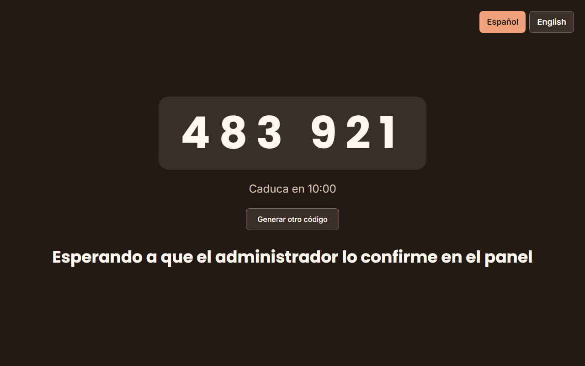
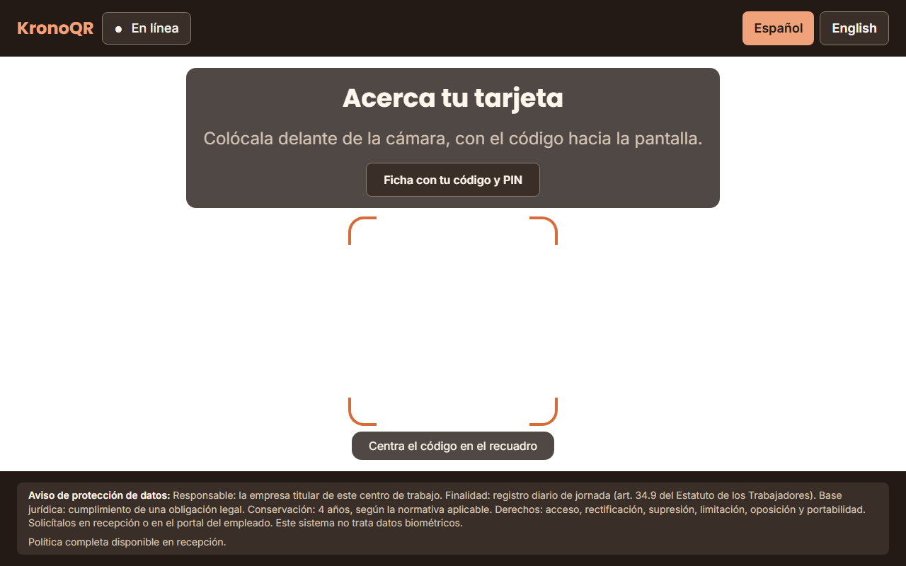

# Runbook — alta de un quiosco nuevo

**Cómo se pone una tablet a fichar**, de la caja a la pared: la parte que es
tuya —fijar el dispositivo en modo quiosco— y la parte que es del producto —el
emparejamiento por código— (RF-PD-06, doc 02 §11.6.2).

**Esto no es una avería.** Es un procedimiento planificado de unos 20 minutos
por tablet, y el destinatario es **el IT del cliente**. La mitad del trabajo no
la hace KronoQR y no puede hacerla: fijar una tablet a una sola aplicación es
configuración del dispositivo, y se explica en la
[§2](#2-la-parte-que-es-tuya-preparar-el-dispositivo).

**Impacto en el fichaje, que es lo primero que hay que saber: ninguno sobre lo
que ya funciona.** Emparejar una tablet nueva no toca a los quioscos existentes,
no reinicia nada y no exige parar el sistema. Lo único que hay que prever es la
ventana en la que un punto de fichaje **todavía no existe** o **está siendo
sustituido**: durante ese rato la gente ficha en otro quiosco, y si no hay otro,
las entradas y salidas de esas horas se corrigen después desde el panel con el
motivo `FALLO_TECNICO_QUIOSCO`, que queda trazado (RN-13). No inventes horas:
pregúntalas.

> **Estado.** Procedimiento real, entregado junto con el emparejamiento por
> código. **Las capturas de pantalla las añade la tarea 5.11**; los recuadros de
> texto de este documento reproducen lo que debe verse mientras tanto.

Todos los comandos se ejecutan **en el servidor**, desde el directorio de la
instalación, igual que en
[`../cliente/instalacion.md`](../cliente/instalacion.md):

```bash
cd /opt/kronoqr-2.0.0
docker compose exec app php artisan <comando>
```

---

## 1. Qué es un quiosco, en 30 segundos

| Pieza | Qué hace | Quién la pone |
| --- | --- | --- |
| La tablet **fijada en modo quiosco** | Impide salir de la aplicación: sin escritorio, sin ajustes, sin navegador | **Tú** (§2) |
| La PWA del quiosco | `https://fichaje.tuhotel.local/kiosk/` — pantalla completa, cámara y *wake lock* | El producto |
| La fila `devices` | **El puesto de fichaje**, con su nombre («Recepción»). No es «la tablet»: si cambias de aparato, el puesto sigue siendo el mismo | El producto, al confirmar el código |
| El token de dispositivo | Lo que permite a esa tablet enviar fichajes. Tres permisos mínimos (`scan:write`, `roster:read`, `heartbeat:write`), 90 días, se renueva solo | El producto |
| El código de emparejamiento | 6 dígitos, **10 minutos de vida**, **un solo uso** | El producto |
| La cola local del quiosco | Guarda los fichajes cuando no hay red y los envía al recuperarla (regla dura 19) | El producto |
| El latido | Cada 60 s. Es lo que actualiza «último contacto» en el panel | El producto |
| `kiosk:health` | Estado de todos los quioscos desde la consola | El producto |

### Qué tablet vale

| Requisito | Mínimo |
| --- | --- |
| Sistema | **Android 10 o superior** |
| Cámara | **Trasera, con autoenfoque.** Sin autoenfoque, una tarjeta plastificada a 20 cm no enfoca y el escaneo falla de forma intermitente |
| Montaje | Soporte de pared o de mesa, a la altura del pecho, sin contraluz directo sobre la cámara |
| Alimentación | **Corriente permanente.** Un quiosco a batería es un quiosco apagado a las 06:00 |
| Red | Cobertura wifi estable en ese punto, dentro de la VLAN de quioscos (§2.5) |
| Gestión | **Modo quiosco** por *device owner*, MDM o app fijada (§2) |

Los requisitos del **servidor** están en
[`../cliente/instalacion.md`](../cliente/instalacion.md) §0.


### Cuatro cosas que hay que saber antes de empezar

1. **El nombre identifica al puesto, no al aparato.** «Recepción» es un quiosco
   aunque la tablet se haya cambiado tres veces. Por eso al sustituir una tablet
   averiada se vuelve a vincular **con el mismo nombre** (§5).
2. **El código no lleva nada personal** y en el servidor solo se guarda su huella
   (regla dura 10). Que alguien lo lea de lejos no le sirve para robar el
   emparejamiento: el secreto que recoge el token lo tiene únicamente la tablet
   que pidió ese código.
3. **Vincular un quiosco nunca se bloquea por la licencia** (ADR-028, regla dura
   15). Si superas los dispositivos de tu plan, el sistema **vincula igualmente**
   y deja un aviso en el panel. Un producto que impide sustituir el quiosco
   averiado deja al hotel sin registro horario, y eso no puede ocurrir por una
   cifra de contrato.
4. **La tablet no se queda atrapada.** Si el código caduca o el servidor se
   reinicia a mitad, la PWA pide otro código ella sola. No hay ningún estado del
   que haya que sacarla a mano.

---

## 2. La parte que es tuya: preparar el dispositivo

**Esto no es una funcionalidad de KronoQR y no lo será.** El producto se ejecuta
*dentro* de la ventana que tú fijas; no puede fijarla, porque ninguna aplicación
web puede impedir que alguien deslice hacia arriba y salga al escritorio. Sin
esta parte, basta un roce accidental para dejar la tablet fuera de la aplicación
y que el siguiente empleado no encuentre dónde fichar.

Hazlo **antes** de emparejar: emparejar una tablet que luego vas a restablecer
de fábrica te obliga a repetirlo.

### 2.1 Fijar la tablet a una sola aplicación

Tres vías, de más a menos robusta. Cualquiera vale si cumple lo de la lista de
debajo:

| Vía | Cuándo tiene sentido | Nota |
| --- | --- | --- |
| **Device owner de Android Enterprise** | Parque de tablets nuevas o restablecidas de fábrica. Es la vía sólida | Se aplica en el primer arranque, antes de añadir ninguna cuenta. Si la tablet ya está en uso, hay que restablecerla |
| **MDM** (el que ya uses en el hotel) | Ya tienes gestión de dispositivos | Configura un perfil de quiosco con la PWA como única aplicación permitida |
| **Modo de aplicación fijada del fabricante** | Una o dos tablets, sin MDM | Depende del fabricante y a veces se sale con una combinación de botones. Acéptalo solo si proteges la salida con PIN |

Lo que la configuración tiene que garantizar, sea cual sea la vía:

- [ ] La PWA del quiosco es **la única aplicación** accesible.
- [ ] **No hay acceso a Ajustes**, ni a la barra de notificaciones, ni al
      navegador fuera de la PWA.
- [ ] **Salir del modo quiosco exige un PIN** que solo conoce el IT.
- [ ] Los botones de inicio y de recientes **no sacan de la aplicación**.

### 2.2 Arranque automático tras un reinicio o un corte de luz

Un hotel tiene cortes de luz, y la tablet no se enciende sola dentro de la
aplicación salvo que se lo digas. Configura el arranque automático de la PWA en
el perfil de quiosco y **compruébalo de verdad**:

```
Desenchufa la tablet · espera a que se apague · vuelve a enchufarla
→ debe aparecer sola la pantalla de fichaje, sin tocar nada
```

Si al reiniciar aparece el escritorio, no está bien configurado. Es el fallo que
más veces acaba en «el quiosco no funcionaba esta mañana».

### 2.3 Brillo y suspensión

- **Pantalla siempre encendida mientras haya corriente.** La PWA pide *wake
  lock*, pero el ajuste del sistema manda: si el sistema suspende, la pantalla se
  apaga igual.
- **Brillo fijo y alto.** El brillo automático oscurece la pantalla en un pasillo
  en penumbra y quien llega a fichar cree que la tablet está apagada.
- **Sin salvapantallas ni «modo ambiente».**
- **Rotación bloqueada** en la orientación del soporte.

### 2.4 Ventana de actualizaciones del sistema

Una actualización de Android reinicia la tablet y puede tardar diez minutos.
**Nunca en el cambio de turno.** Fija la ventana en la franja de menos fichaje
—mira tus propios turnos: en muchos hoteles es la madrugada tardía— y desactiva
las actualizaciones automáticas sin ventana.

Que la tablet se reinicie con fichajes en la cola no pierde nada: la cola vive en
el almacenamiento del dispositivo y se envía al volver. Lo que se pierde son los
**minutos sin punto de fichaje**.

### 2.5 Red

- **VLAN de quioscos**, separada de la red de invitados y de la ofimática.
- El rango de esa VLAN tiene que estar en **`KIOSK_VLAN_CIDR`** del `.env`. Si
  la tablet queda fuera de ese rango no verás ningún error: verás *«el quiosco va
  lento a las 06:00»*. Explicado en
  [`../cliente/instalacion.md`](../cliente/instalacion.md) §6.
- **Reconexión automática al wifi**, sin portal cautivo y sin pantallas de
  aceptación.
- **El certificado del servidor tiene que ser válido para la tablet.** Si es de
  una CA interna, instálala en el almacén de confianza del dispositivo. Un
  certificado que la tablet no acepta obliga a pulsar un aviso cada mañana, y el
  día que alguien no lo pulse el quiosco no ficha.

### Antes de emparejar, comprueba

```
[ ] La tablet arranca sola en la PWA despues de un reinicio
[ ] No se puede salir de la aplicacion sin PIN
[ ] La pantalla no se apaga con la tablet enchufada
[ ] La IP de la tablet cae dentro de KIOSK_VLAN_CIDR
[ ] El navegador de la tablet abre https://<tu-URL>/kiosk/ sin avisos de certificado
```

---

## 3. Emparejamiento por código, paso a paso

Tres pasos: la tablet pide, tú confirmas, la tablet entra. **No hace falta SSH**
(RF-PD-06); la consola es una alternativa, no el camino.

### 3.1 En la tablet

Abre la URL del quiosco e instala la PWA («Añadir a pantalla de inicio»):

```
https://fichaje.tuhotel.local/kiosk/
```

Al no tener token, la aplicación va sola a la pantalla de emparejamiento:



- El código se lee **desde lejos**: no hace falta descolgar la tablet del
  soporte.
- **Caduca a los 10 minutos** y la cuenta atrás lo dice. Al llegar a cero la
  tablet pide otro **sola**: no toques nada.
- La tablet pregunta al servidor cada pocos segundos. En cuanto confirmes, pasa a
  la pantalla de fichaje **por su cuenta**, sin recargar ni volver a tocarla.

Así queda la tablet en cuanto el panel confirma: la cámara activa y «Acerca tu
tarjeta». Si ves esto, el emparejamiento ha terminado.



### 3.2 En el panel de gestión

Con una cuenta de **administrador** (ningún otro rol puede hacerlo):

1. **Quioscos** › **Vincular quiosco**.
2. Escribe el **código** que muestra la tablet: `483921`.
3. Escribe el **nombre del quiosco**.
4. **Vincular**.

Sobre el nombre, que es lo único que va a dar guerra dentro de seis meses:

- Describe **el sitio**, no el aparato: `Recepción`, `Entrada de personal`,
  `Cocina`, `Office de pisos`. Nunca `Tablet 3` ni un número de serie.
- **Único entre los quioscos activos.** Si el nombre está libre porque el
  anterior se desvinculó, el sistema **reactiva ese mismo quiosco** y conserva su
  historia (§5).
- De 1 a 120 caracteres. Es lo que verá RRHH en los informes y en las
  incidencias: un nombre malo se paga todos los días.

La tablet cambia de pantalla en unos segundos:

```
  +--------------------------------------------+
  |  Recepcion                     * En linea  |
  |                                            |
  |        Acerca tu tarjeta a la camara       |
  +--------------------------------------------+
```

Si estás haciendo la puesta en marcha inicial, este mismo formulario es el
**paso 8 del asistente**. Es omitible: si la tablet aún no ha llegado, sáltalo y
vuelve aquí cuando la tengas.

### 3.3 Vía alternativa: desde la consola del servidor

Solo si el panel no está accesible —por ejemplo, durante una incidencia de red en
la ofimática—. Hace exactamente lo mismo: **confirma un código que la tablet ya
está mostrando**. No genera nada que puedas teclear tú en la tablet.

```bash
docker compose exec app php artisan kiosk:pairing-code 483921 --name="Recepción"
```

Salida esperada:

```
Quiosco vinculado: Recepcion
Estado: activo. La tablet entrara en la pantalla de fichaje en unos segundos.
```

El centro no se pide: hay uno por instalación (ADR-040). La acción queda auditada
con actor `system`, porque nadie ha iniciado sesión: si necesitas saber **quién**
vinculó un quiosco, usa el panel.

### 3.4 Qué acaba de pasar

- Existe una fila en `devices` con ese nombre, activa.
- La tablet ha recibido **su** token, con los tres permisos mínimos y 90 días de
  vida. Se renueva sola; no hay nada que apuntar en el calendario.
- El código ha quedado **consumido**: no vale una segunda vez, ni siquiera dentro
  de sus 10 minutos.

---

## 4. Verificación: tres comprobaciones y ya

### 4.1 Un fichaje real

Lo mejor es que la primera prueba sea **el primer fichaje real** de alguien que
entra a trabajar, con su tarjeta, mientras tú miras la pantalla. Debe verse la
confirmación en verde en menos de dos segundos.

**No pases la tarjeta de otra persona para probar.** Cada escaneo es registro
horario con valor legal: fabricar una entrada obliga después a corregirla y deja
en el registro una jornada que no ocurrió.

### 4.2 Desde la consola

```bash
docker compose exec app php artisan kiosk:health
```

Lo que hay que mirar, por orden: que el quiosco nuevo **aparece**, que su último
contacto es de hace menos de dos minutos y que su cola pendiente es **0**.

La tabla trae, por quiosco: nombre, estado, versión de la aplicación, último
contacto (relativo y en la zona del centro), cola pendiente y un **veredicto**:
`ok` (latido de hace menos de 2 min y cola 0), `aviso` (entre 2 y 10 min sin
latido, cola pendiente, o recién emparejado sin primer latido) o `FALLO` (más de
10 min sin latido: el mismo umbral con el que la observabilidad avisará). Debajo,
«Qué hay que mirar» dice qué hacer con cada aviso. Sale con `0` si todo está al
día, `1` con avisos y `2` con algún fallo; `--json` devuelve lo mismo para
scripts. Los dos umbrales son `KIOSK_HEALTH_FRESH_WITHIN_SECONDS` (120) y
`KIOSK_HEALTH_SILENT_AFTER_SECONDS` (600) en el `.env`.

### 4.3 En el panel

**Quioscos** muestra, de cada uno: nombre, estado, versión de la aplicación,
**último contacto** y **cola pendiente**. El latido llega **cada 60 segundos**:
si «último contacto» pasa de dos o tres minutos, la tablet no está hablando con
el servidor y lo primero que hay que mirar es la red.

> **Duda anotada.** La **alerta** automática de latido perdido —y su runbook
> `quiosco-no-responde.md`— llega con una versión posterior. Hasta entonces esta
> pantalla se mira a mano; conviene incluirla en la ronda de la mañana.

---

## 5. Sustituir un quiosco averiado

Una tablet se rompe, se moja o desaparece. **El quiosco no desaparece con ella**:
lo vuelves a levantar con otro aparato y el mismo nombre.

### 5.1 Si la tablet averiada todavía enciende, vacía su cola primero

```bash
docker compose exec app php artisan kiosk:health
```

Espera a que la cola pendiente de ese quiosco sea **0** antes de desvincular.
**Los fichajes que no se hayan enviado se pierden al revocar el token**, y son
registro horario de personas reales. Si la tablet no enciende no hay nada que
esperar: pasa al punto siguiente y recupera esas horas por corrección en el
panel, con el motivo `FALLO_TECNICO_QUIOSCO`.

### 5.2 Desvincular

En el panel: **Quioscos** › el quiosco averiado › **Desvincular** (pide
confirmación). Efecto inmediato:

- Su token queda **revocado**: esa tablet ya no puede enviar fichajes.
- Si la tablet sigue viva, al siguiente intento vuelve sola a la pantalla de
  emparejamiento y **borra el padrón que tenía guardado**, que es justamente lo
  que quieres si el aparato se ha perdido.

**Si la tablet se ha extraviado o robado, desvincula ya**, sin esperar a la cola.
Un token de quiosco no da acceso al panel ni a la plantilla completa, pero sí
permite enviar fichajes en nombre de ese puesto.

### 5.3 Vincular la tablet nueva con el mismo nombre

Prepárala (§2), muestra su código y confírmalo **con el nombre exacto del quiosco
anterior**: `Recepción`.

El producto **reactiva el mismo quiosco**: la misma ficha, el mismo
identificador. Los fichajes de hace tres meses siguen atribuidos a «Recepción»,
los informes no se parten en dos y el cambio de aparato queda escrito en
`audit_log` (§7). Es exactamente el escenario para el que existe ADR-028.

**Y el plan no te bloquea.** Si el panel avisa de que superas los dispositivos
contratados, la vinculación se hace igual: ese aviso es para hablar con el
fabricante, no para dejar un centro sin punto de fichaje.

> **Limitación conocida.** Hoy no hay pantalla para **renombrar** un quiosco
> activo: el nombre se fija al vincular. Si te has equivocado, desvincula y
> vuelve a vincular con el nombre correcto —cuesta dos minutos y queda auditado,
> pero hay que hacerlo con la tablet delante—. Anotado como mejora.

---

## 6. Qué hacer si…

### …el código ha caducado

**No pasa nada y no hay que hacer nada.** La tablet genera otro sola cuando la
cuenta atrás llega a cero. Si tienes prisa, pulsa **«Generar otro código»**.

El panel te dirá que el código no es válido con un mensaje único para las tres
causas posibles —no existe, ha caducado o ya se usó— y es deliberado: distinguir
esos tres casos convertiría el formulario en una forma de tantear códigos ajenos.
Mira la tablet: la cuenta atrás te dice cuál de los tres es.

### …el panel dice «ese nombre ya está en uso»

Hay **un quiosco activo** con ese nombre. Dos salidas, según lo que esté pasando:

- **Estás sustituyendo esa tablet** y no desvinculaste la anterior: ve a
  Quioscos, **desvincula** la vieja y repite (§5). El nombre queda libre al
  instante y el quiosco se reactiva con su historia.
- **Es un puesto nuevo de verdad**: elige otro nombre. `Recepción` y `Recepción
  noche` son quioscos distintos; `Recepción` y `Recepcion` también, y eso último
  es fuente segura de confusión — sé consistente con los acentos.

### …la tablet vuelve sola a la pantalla de emparejamiento

Significa que **su token ha sido revocado**: alguien la desvinculó desde el
panel, o se revocó su token en una rotación. No es un fallo de red — un corte de
red **no** desvincula: la tablet sigue fichando contra su cola local (regla dura
19).

- **Los fichajes encolados no se pierden** por volver a la pantalla de
  emparejamiento: siguen en la tablet y se envían cuando vuelva a estar
  vinculada. Vuelve a vincularla con el mismo nombre y comprueba que la cola baja
  a 0.
- Lo que **sí** se borra al desvincular es el padrón guardado en la tablet, y es
  lo correcto.
- Si nadie de tu equipo la desvinculó, trátalo como incidente: mira
  [`rotacion-secretos.md`](rotacion-secretos.md) §4 y revisa quién tiene cuenta
  de administrador.

### …no hay red durante el emparejamiento

**El emparejamiento sí necesita servidor**; el fichaje del día a día, no. Si la
tablet no puede pedir el código, en vez de números verás un aviso de que no hay
conexión.

```bash
docker compose ps
docker compose exec app php artisan kiosk:health
```

Por orden de frecuencia: wifi del punto de montaje, tablet fuera de la VLAN,
certificado que la tablet no acepta y URL mal escrita en la tablet. La pantalla
de fichaje de un quiosco **ya vinculado** aguanta el corte sin inmutarse: encola
y envía luego.

### …la tablet dice que no puede acceder a la cámara

**Mira primero cuál de los dos mensajes es**, porque son ramas distintas:

| En la pantalla | Qué ha pasado |
| --- | --- |
| **«Sin acceso a la cámara»** | El navegador **denegó el permiso** para este sitio |
| **«Cámara no disponible»** | El navegador **ni siquiera ofrece cámara**, o no pudo abrirla |

**Si dice «Sin acceso a la cámara»** — permiso denegado para el sitio:

1. Abre los permisos del sitio en la tablet: `chrome://settings/content/camera`,
   o el candado junto a la dirección → «Permisos». Busca la URL del quiosco.
2. Si está en «Bloqueados», quítalo de ahí y recarga la PWA. Volverá a pedir el
   permiso; concédelo.
3. Si la tablet va con MDM, comprueba que el perfil **concede la cámara** a esa
   URL. Un perfil que bloquea la cámara «por seguridad» deja el quiosco inútil,
   y es una causa frecuente en parques nuevos.
4. Borrar los datos del sitio **también borra el permiso** — y la cola de
   fichajes pendientes. Antes de hacerlo, comprueba que la cola está a 0
   (§4.2).

**Si dice «Cámara no disponible»** — por orden de frecuencia:

1. **La PWA está abierta por `http://` y no por `https://`.** Los navegadores
   **solo ofrecen la cámara en un origen seguro**: sobre `http://` la interfaz
   de cámara no existe y no hay permiso que conceder. Mira la barra de
   direcciones de la tablet: tiene que empezar por `https://`. Si el acceso por
   HTTP redirige mal o alguien guardó el acceso directo con `http://`, ese es
   el fallo entero.
2. **Otra aplicación tiene la cámara tomada** (la de fotos, una de
   videollamada). Ciérrala, o reinicia la tablet.
3. **La tablet no tiene cámara trasera utilizable** (§1, «Qué tablet vale»).

**Y hay una causa que puede dar cualquiera de los dos mensajes, que no está en
la tablet y que se diagnostica mal y cuesta horas.** El servidor envía con cada
página la cabecera:

```
Permissions-Policy: camera=(self), microphone=(), geolocation=(), payment=()
```

`camera=(self)` concede la cámara **al propio origen desde el que se sirvió la
página**, y es imprescindible: sin ella, la PWA no puede abrir el vídeo. Si
entre la tablet y el servidor hay **un proxy inverso, un balanceador o un
aparato de filtrado** que quita o reescribe esa cabecera, o que sirve la PWA
desde un origen distinto del que sirve la API, la cámara deja de concederse
**sin que nada lo explique en pantalla**.

Compruébalo desde una máquina de la misma red que las tablets:

```bash
curl -sI https://fichaje.tuhotel.local/kiosk/ | grep -i 'permissions-policy'
```

Tiene que salir la línea de arriba, con `camera=(self)`. Si no sale, o sale
distinta, el problema está en lo que hayas puesto delante del servidor, no en
la tablet ni en el producto.

### …la tablet no encuentra el servidor

La prueba que separa «no hay red» de «hay red y algo no cuadra» se hace **desde
el navegador de la tablet**, escribiendo a mano:

```
https://fichaje.tuhotel.local/api/v1/health
```

Debe responder un texto corto con el estado y la versión, algo como
`{"status":"ok","version":"2.1.0","license":"valid"}`. Según lo que salga:

| Lo que ves en la tablet | Dónde está el problema |
| --- | --- |
| Responde el JSON | La red está bien: el fallo es de la PWA o del emparejamiento, no de red |
| «No se puede acceder a este sitio» / no resuelve el nombre | **DNS**: la tablet no resuelve el nombre interno |
| Tarda y agota el tiempo de espera | **Ruta o cortafuegos**: la VLAN de quioscos no llega al servidor |
| Aviso de certificado, y al aceptarlo responde | **Certificado**: la tablet no confía en él |

Y qué hacer en cada caso:

- **DNS.** La tablet tiene que recibir por DHCP el **servidor DNS interno**, no
  uno público. Un DNS público nunca resolverá `fichaje.tuhotel.local`. Si no
  puedes tocar el DHCP de esa VLAN, publica el nombre en el DNS que sí usan las
  tablets.
- **Ruta.** Comprueba desde el servidor si las peticiones de esa tablet llegan
  siquiera:

  ```bash
  docker compose logs --tail 100 nginx | grep '/api/v1/'
  ```

  Si no aparece ninguna con la IP de la tablet, el tráfico se está quedando en
  el camino: VLAN sin ruta al servidor, o cortafuegos.
- **Certificado.** Si es de una CA interna, instálala en el almacén de
  confianza de la tablet (§2.5). **No enseñes al personal a aceptar el aviso**:
  el día que alguien no lo acepte, ese quiosco no ficha.
- **URL mal escrita.** Es más frecuente de lo que parece cuando se configuran
  varias tablets seguidas. Compárala carácter a carácter con la de otra tablet
  que sí funcione.

### …la PWA no arranca sola tras un reinicio

No es del producto: revisa el §2.2. La comprobación es siempre la misma —
desenchufar, enchufar y mirar.

### …el quiosco va lento en el cambio de turno

Primer sospechoso: **`KIOSK_VLAN_CIDR`**. Si la IP de las tablets cae fuera de
ese rango, el servidor les aplica el límite pensado para internet —30 peticiones
por minuto en vez de 600— y a las 06:00 eso se nota. Está en
[`../cliente/instalacion.md`](../cliente/instalacion.md) §6.

### …alguien se sale de la aplicación deslizando

El modo quiosco no está bien fijado (§2.1). Mientras lo arreglas, deja indicado
al personal cómo volver a la aplicación, pero **no lo dejes así**: es cuestión de
días que alguien no encuentre dónde fichar.

### …el panel avisa de que superas los dispositivos del plan

**No bloquea nada y no hay nada técnico que hacer** (ADR-028). El aviso es
persistente a propósito —no se descarta— y desaparece cuando desvinculas los
quioscos que ya no existen o cuando se amplía la licencia. Si el exceso viene de
tablets sustituidas que nadie desvinculó, desvincúlalas: además de quitar el
aviso, dejas de contar puntos de fichaje que no existen.

---

## 7. Qué queda registrado

El alta y la baja de un quiosco son auditables sin depender de la memoria de
nadie (regla dura 6):

| Asiento | Cuándo | Qué lleva |
| --- | --- | --- |
| `device.provisioned` | Al confirmar el código | **Quién lo autorizó** —la cuenta que confirmó, o `system` si fue por consola—, el nombre del quiosco, y si fue una **reactivación** y en qué estado estaba antes |
| `device.paired` | Al recoger la tablet su token, segundos después | El dispositivo y el momento. Actor `system`: la tablet no es una persona |
| `device.revoked` | Al desvincular | Quién desvinculó y el motivo (`unpaired`) |

Consultarlos, con el rol de solo lectura de la aplicación:

```bash
docker compose exec -T postgres psql -U fichaje_app -d fichaje -c "
  SELECT occurred_at, action, actor_type, actor_id, payload
    FROM audit_log
   WHERE action IN ('device.provisioned','device.paired','device.revoked')
   ORDER BY occurred_at DESC
   LIMIT 20;"
```

**Ningún asiento lleva el código, el secreto ni el token**, y ninguno lleva
nombres de empleados (reglas duras 10 y 21). Se pueden pegar tal cual en un parte
de incidencia o adjuntar a un paquete de diagnóstico.

> **Duda anotada.** La caducidad del código —10 minutos— y la cadencia con la que
> la tablet pregunta al servidor son parámetros internos del producto, **no del
> `.env`**: no hay ninguna variable que tengas que tocar, y por eso no aparecen
> en `configuracion.md`. Si alguna vez se publicaran como variables, se
> documentarían allí y se enlazarían desde aquí.

---

## 8. A quién se escala

| Situación | A quién | En cuánto |
| --- | --- | --- |
| Un punto de fichaje lleva más de un turno sin quiosco | IT del cliente, y avisa a RRHH: habrá correcciones que firmar | El mismo día |
| La tablet vuelve a la pantalla de emparejamiento y **nadie la desvinculó** | Responsable de seguridad del cliente | Inmediato |
| Tablet perdida o robada | IT del cliente: desvincular **ya** (§5.2) | Inmediato |
| El emparejamiento falla con la red y el certificado correctos | Soporte del fabricante, con el paquete de diagnóstico | 1 día hábil |
| Aviso de exceso de dispositivos del plan | Comercial del fabricante. **No es una avería** | Sin urgencia |

**Relacionados:** [`../cliente/instalacion.md`](../cliente/instalacion.md) ·
[`rotacion-secretos.md`](rotacion-secretos.md) ·
[`turno-abierto-prolongado.md`](turno-abierto-prolongado.md)
